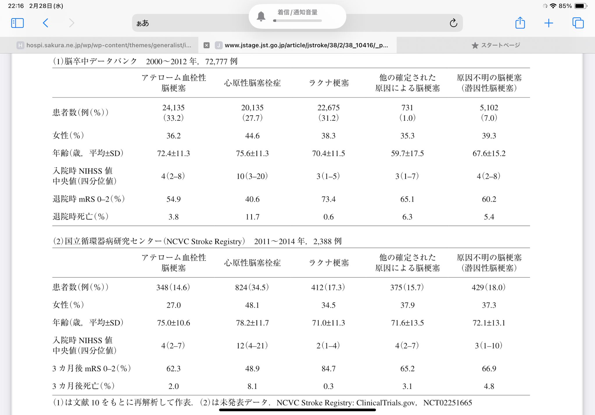
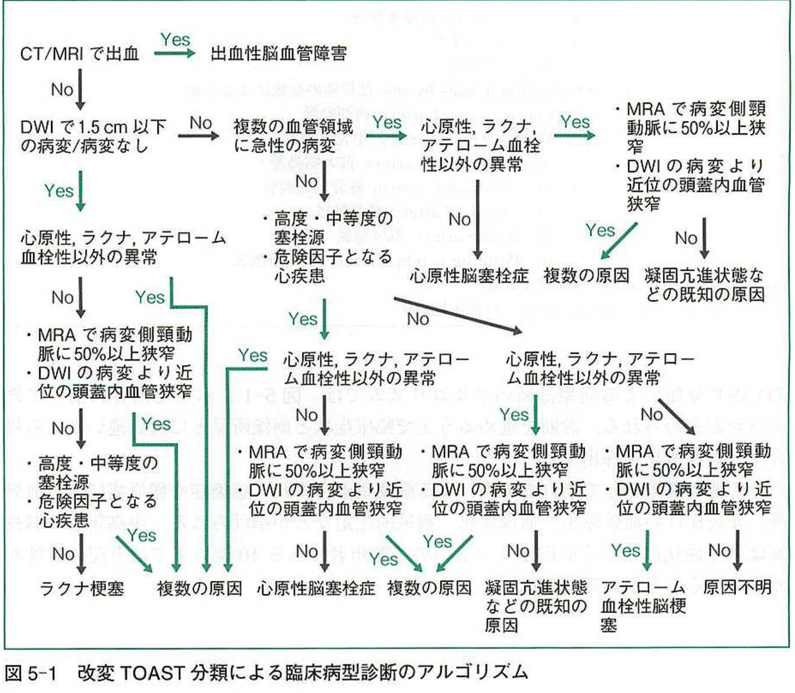
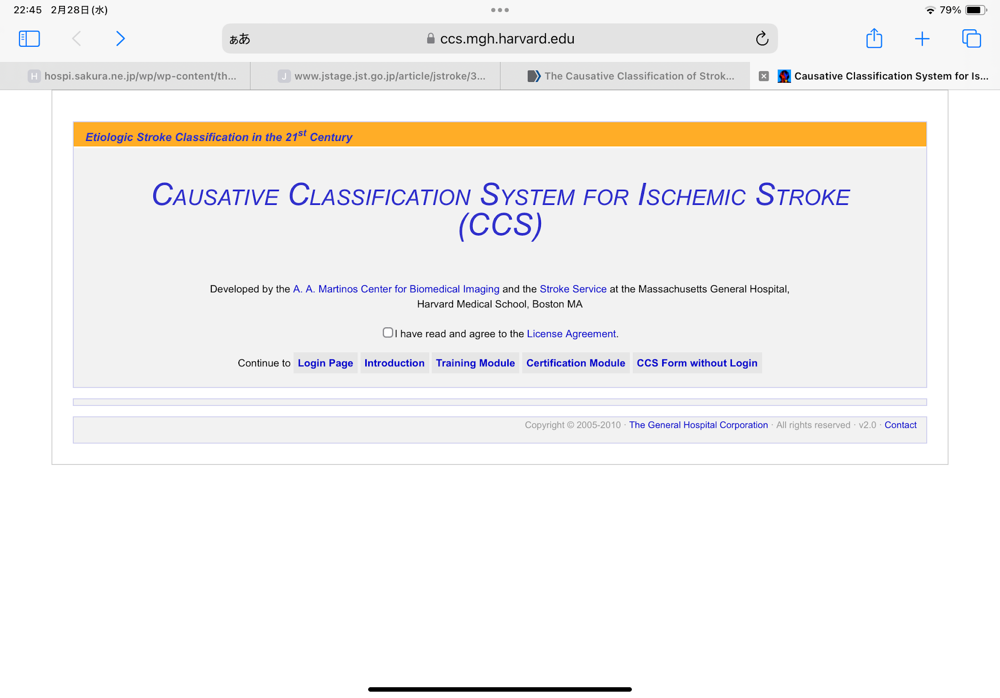
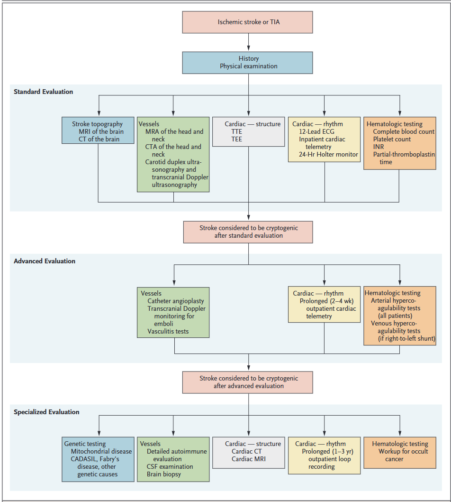
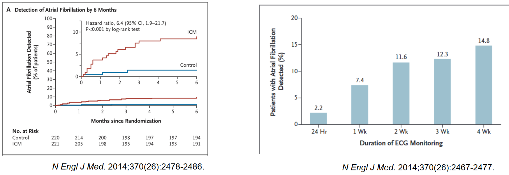
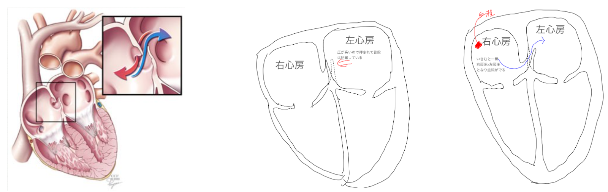
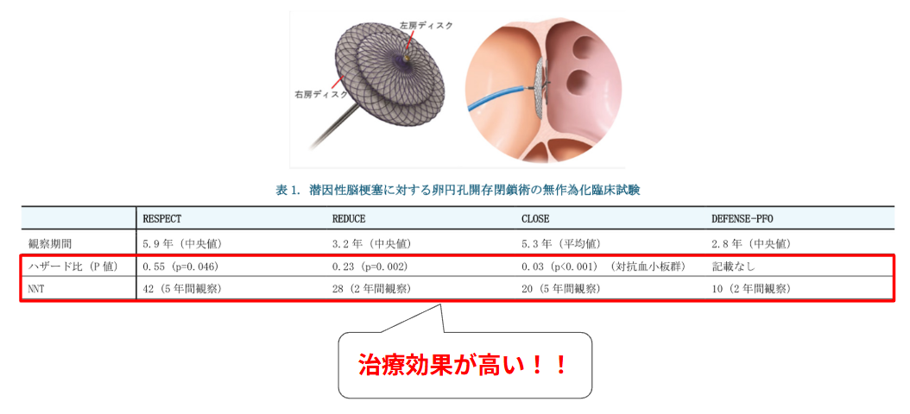
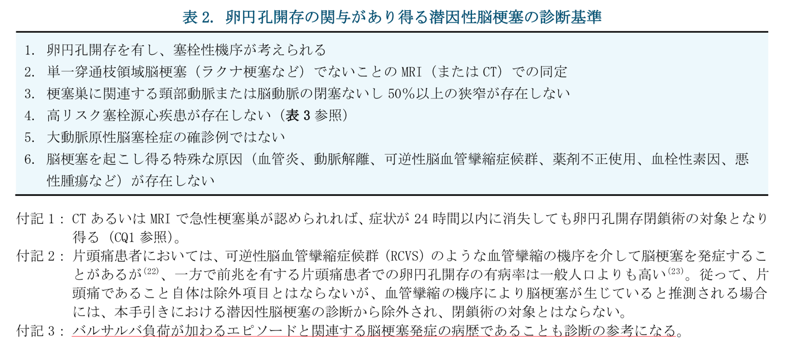
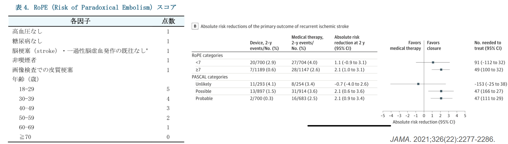

## Cryptogenic strokeとは？

```{=html}
<div style="display: flex; justify-content: center;">
<svg style="width: 80%; max-width: 720px;"
     viewBox="0 0 720 430"
     xmlns="http://www.w3.org/2000/svg">

  <rect x="5" y="5" width="710" height="420"
        fill="white" stroke="black" stroke-width="1"/>

  <ellipse cx="360" cy="190" rx="340" ry="170"
           fill="#eeeeee" stroke="black" stroke-width="1.2"/>

  <ellipse cx="360" cy="245" rx="220" ry="85"
           fill="#eeeeee" stroke="black" stroke-width="1.2"/>

  <text x="360" y="115"
        text-anchor="middle"
        font-size="28"
        font-family="Arial, sans-serif">
    Cryptogenic stroke
  </text>

  <text x="360" y="255"
        text-anchor="middle"
        font-size="28"
        font-family="Arial, sans-serif">
    ESUS
  </text>

</svg>
</div>
```

- Cryptogenic stroke（潜因性脳梗塞）とは、脳梗塞を包括的に精査したのに心原性・アテローム性・ラクナのいずれでもない時
- その中で近位の動脈の狭窄や心原性が見つからない時の塞栓性脳梗塞を ESUS（Embolic stroke of undetermined source: 原因不明の脳塞栓症）という

## Cryptogenic strokeの疫学

{fig-align="center"}

- 定義により異なるが 10-40% と言われている
  - 日本でも同じくらいの割合
- Cryptogenic stroke のうち ESUS は大体 80-90%
[@Toyoda2016-nv; @Hart2018-ld]

## Cryptogenic strokeの機序は？

- 単一ではなく複数の機序が提唱されている
- <span style="color: red;">_潜在性の pAF_</span>
- 大動脈の粥腫やその他の心原性
- <span style="color: red;">_PFO や ASD などによる奇異性塞栓_</span>
- 血栓傾向
- 脳血管疾患（血管奇形など）
- 年齢で多い原因は異なる
  - 18-30歳: 動脈解離や血栓傾向、先天性心疾患
  - 31-60歳: 若年性の動脈硬化、後天性の心疾患
  - 61歳以上: 潜在性 AF

## どうやって診断する？

{fig-align="center"}

- 検査の程度によるため、世界的に決まった基準はない
- 古典的な TOAST 分類が一つの基準だが、_Cryptogenic が増える_
- ASCOD、CCS systems を使うと**Cryptogenic が減る**とされるがデータはまだ少ない

## CCS systems

{fig-align="center"}

[@CCS_IschemicStroke_v2]

- Internet上でで診断可能
- `https://ccs.mgh.harvard.edu/ccs_title.php`

## Cryptogenic stroke患者への問診と身体所見

:::: {.columns}

::: {.column width="50%"}

- 頸部外傷やマッサージ: 椎骨脳底動脈の乖離
- 片頭痛: 片頭痛性脳梗塞 / CADASIL
- 違法薬物: IE、血管攣縮、HIV など
- <span style="color: red; font-weight: bold;">息こらえの後の発症: 奇異性塞栓</span>
- 若年の ASCVD の家族歴: 遺伝性疾患
- 妊娠: CVT、子癇
:::

::: {.column width="50%"}

- 左右の上肢の血圧差: AoD
- 皮膚の網状皮斑: APS
- 黄色腫: FH
- 心雑音: IE、先天性心疾患
- 脈拍の消失: 重度の動脈硬化、Coarctation、AoD、高安病
- DVT: 血栓傾向、奇異性塞栓

[@Saver2016-xj]

:::

::::


## 検査について

:::: {.columns}

::: {.column width="40%"}
- どこまでやるべきか、決まっていない
- 最低限の検査
  - 基本的な血算
  - 凝固系
  - 頭部 MRI
  - 発症 24 時間の心電図モニター
  - 頸動脈エコー
  - TTE
- NEJM では段階的なアプローチが推奨されている
- 特に重要なのは <span style="color: red; font-weight: bold;">潜在性の pAF 検索</span>
[@Saver2016-xj]

:::

::: {.column width="60%"}

{fig-align="center"}

:::

::::


## ESUSにおけるAFの検索

{fig-align="center"}


- ESUS 患者でループレコーダーを用いると、6ヶ月で 8.9% の新規 AF が見つかる
- ループレコーダーで見つかった小さな AF に意味があるかはまだ疑問がある[@Kirchhof2023-cl]
- UpToDate では、50歳以上、P波異常、心房拡大、BNP高値などで 30日間の monitoring を推奨
[@Gladstone2014-gd; @Sanna2014-lw]

## Cryptogenic strokeの治療

- 基本は原疾患により分けることが大事
- 原因が見つからない時は、基本は ASA
- ESUS で DOAC vs. ASA があるが、基本的に DOAC が負けている
  - 脳卒中再発率は差がなく(OR 0.90), 出血はDOACが多い(OR 1.6)[@Chi2025-zi]
- 特異的な治療がある疾患もある
  - APS だと DOAC でなく Wf を選択
  - <span style="color: red; font-weight: bold;">PFO による奇異性塞栓 → PFO 閉鎖</span>

## PFOってなんだ？

{fig-align="center"}

- 胎児循環の時は右房圧が高く、右房 → 左房に血流がある
- 出生とともに肺血管抵抗が低下して、左房圧が高くなり閉鎖する
- 卵円孔が開存していると、普段は閉じているが、いきんだ時に右房圧が上がり右房 → 左房の血流になる
- そこに DVT からの血栓が流れると右房 → 左房で脳梗塞になる

## PFOによる奇異性塞栓への閉鎖術

{fig-align="center"}

## じゃあ全例でPFOの検査を行う？

{fig-align="center"}

- 卵円孔開存は common
  - 通常人口で 25%, Cryptogenic stroke に限定すると **50%**
- PFO があっても、それが原因かは不明瞭 → 探せばいいってもんじゃない

## いつPFOの検査をする？

{fig-align="center"}


- 治療適応は原則 60歳以下
- RoPE score < 7 だと治療効果がないかもしれない
  - 治療を見据えて検査を行う [@Kent2021-iu]

## まとめ

- 通常診療で etiology が分からない脳梗塞を Cryptogenic stroke という
- その中で塞栓性のものを ESUS という
  - ESUS < Cryptogenic stroke
- ESUS を見つけた時に最も重要なのは AF 探し
- 治療適応があり、有効そうな患者では PFO 探しが意味あるかも
- 分からない時は ASA が良い
  - DOAC は使わない

## Thank you for listening

- ご清聴ありがとうございました

## Reference

::: {#refs}
:::