<!--
TODO: PEG.typ から Quarto reveal.js 用に変換した叩き台。
TODO: Typst/Touying 固有の theme, place, box, grid, columns, tall-slide などのレイアウト指定は省略。
TODO: 複雑な図・表・画像サイズは必要に応じて手動調整。
-->

# 代替栄養とは

## 代替栄養とは

- 代替栄養（Artificial Nutrition）は、経口摂取が困難な患者に対して、栄養を補給するための医療行為
- 主に、経管栄養（Enteral Nutrition）と静脈栄養（Parenteral Nutrition）の2つに分類される
- 経管栄養は、口から胃や腸に直接栄養を供給する方法で、PEGもその一つ
- 静脈栄養は、CVポートや中心静脈カテーテルを通じて行う
- 皮下点滴も一応入れたり入れなかったり

## 代替栄養の利点・欠点

| 方法 | メリット | デメリット |
|---|---|---|
| 経鼻胃管 | 簡単に入る 合併症はほぼない 十分に栄養が入る | 抑制が必要 長期使用は難しい |
| 胃瘻 | 十分に栄養が入る 長期に使える 抑制は不要な可能性が高い | 倫理的問題 作成時の合併症の発症 |
| CVポート | 比較的侵襲性は低い 十分な栄養が入る | 肝障害 感染症のリスク |

<!-- TODO: 手動調整: 元Typstの table レイアウトは簡略化 -->

## 代替栄養を考える時

- 嚥下機能低下
- 意識障害
- 消化管の機能不全
など

## 例えば

- 脳梗塞後で嚥下の回復が見込めるが時間がかかる時
  - 2-3週間以上、経鼻胃管が必要な時は胃瘻造設が考慮される
[@Powers2018-zy]
  - 咽頭部癌の術後、食道癌で経口摂取が困難な時など
  - 4週間を超える経管栄養で経鼻胃管よりPEGを推奨
[@Tae2024-nl]
- *認知機能低下や年齢により恒久的に嚥下機能が低下している時*

## 我々が思う悩む時

- 患者の思い
- 家族の思い
- 医学的適応
- 倫理的適応  などを確認する

## 家族の思いとは？～世界

- 2/3の認知症がある施設の居住者はCareの第一目標は安楽である
- 26%は非侵襲的な治療のみ希望している(抗菌薬、経静脈治療)
- わずか7%が寿命延伸を第一目標としている

[@Stall2025-uv]

## 日本においては？

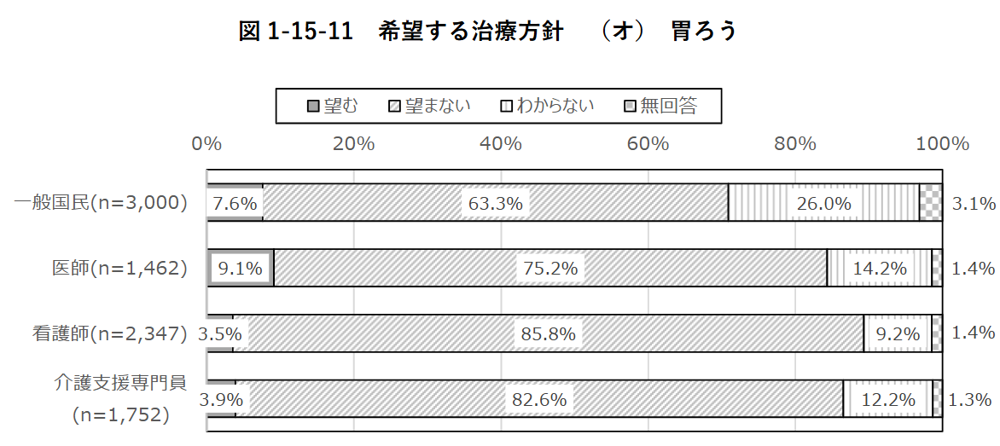
<!-- TODO: 手動調整: 元Typst画像高さ 50% -->

- 無回答の解釈が難しいが、医師も一般国民もほぼ同じ比率
  - 約10%が胃瘻を望み、約85%が望まない

[@mhlw2022endoflife]

## PEGの適応の決定方法

- 大きく分けて
  - 倫理的適応
  - 身体的適応    に分けられる

## PEGの倫理的適応

<!-- TODO: 手動調整: tall-slide レイアウトは通常スライドに変換 -->
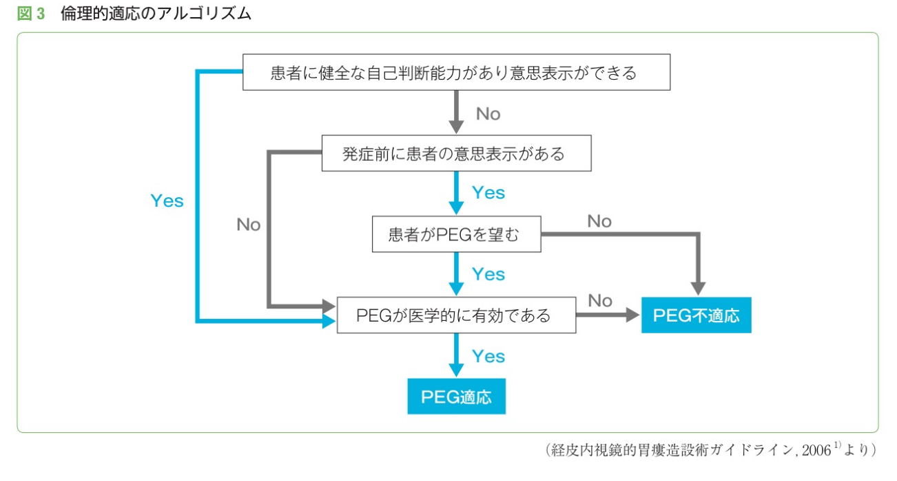
<!-- TODO: 手動調整: 元Typst画像高さ 70% -->

## PEGの身体的適応

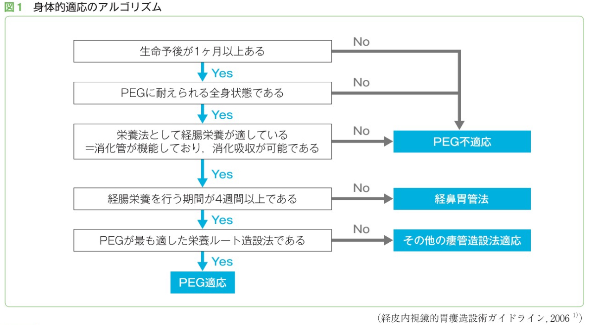
<!-- TODO: 手動調整: 元Typst画像高さ 100% -->

# PEGとは

## PEGとは

- PEG（Percutaneous Endoscopic Gastrostomy）は、内視鏡を   用いて胃瘻を作成する手法
- 1979年に米国で開発され、世界中に広まった
  - 1980年代には世界中の人工栄養の主流となった

[@jgs2012peg]

## PEGの構造

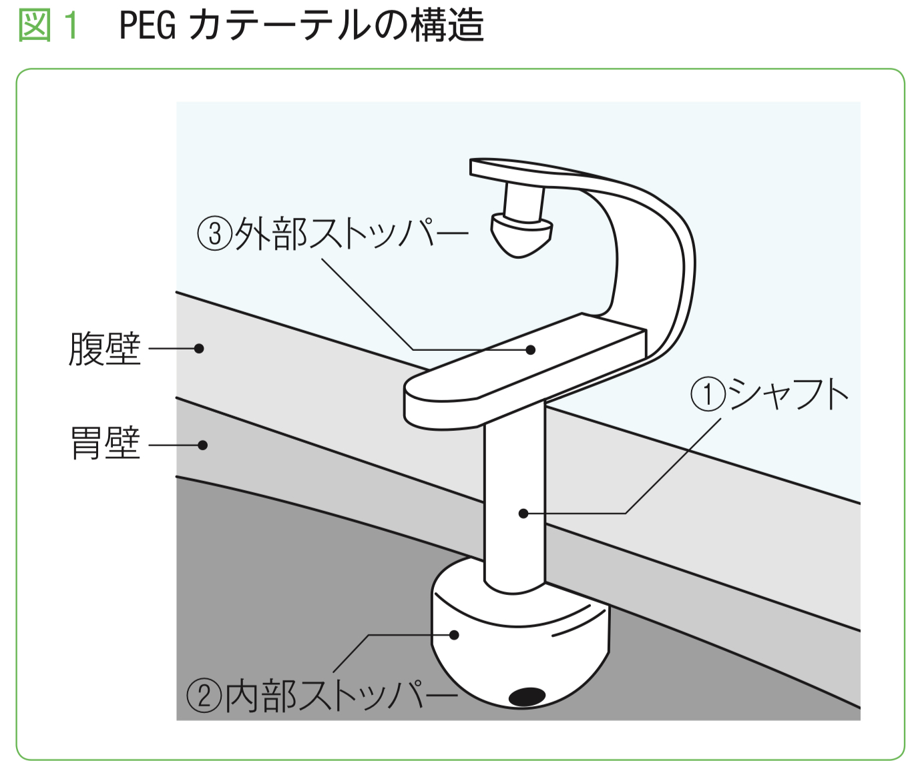
<!-- TODO: 手動調整: 元Typst画像高さ 60% -->

[@nihonshokakibyo2009peg]

## PEGの種類

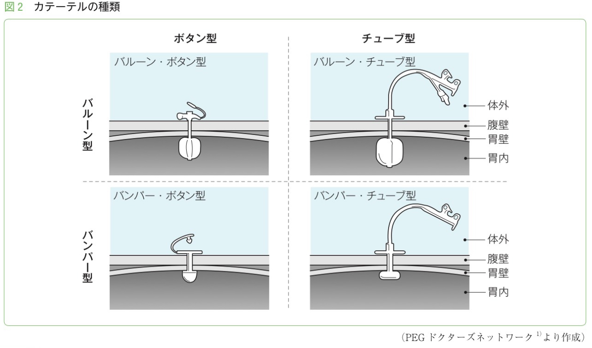
<!-- TODO: 手動調整: 元Typst画像高さ 60% -->

- 外部ストッパーと内部ストッパーで大別される
  - 外部ストッパー: ボタン型/チューブ型
  - 内部ストッパー: バルーン/バンパー型

## 外部ストッパーについて

| 外部ストッパー | メリット | デメリット |
|---|---|---|
| ボタン型 | 自己抜去のリスクが少ない カテーテル汚染が少ない | 栄養剤との接続が複雑 交換時までシャフト長を変更できない |
| チューブ型 | 栄養剤との接続が容易 | 自己抜去のリスクが高い |

<!-- TODO: 手動調整: 元Typstの table レイアウトは簡略化 -->

- ボタン型が良いのは
  - 若くて理解力がある元気な患者
  - 逆に自己抜去のRiskが非常に高い患者で良い適応
- チューブ型が良いのは
  - 理解力があるが麻痺などで細かい作業が困難な患者で良い適応

## PEGの入れ方

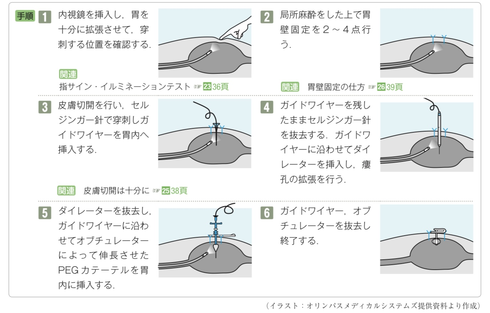
<!-- TODO: 手動調整: 元Typst画像高さ 50% -->

- 基本的には内視鏡を用いて皮膚から胃壁を通して胃にカテーテルを挿入する
  - 開腹でやる事もある
  - 入れ方でpush/pull法、Introducer法などがある
  - 当院では基本的にはIntroducer法/Introducer変法との事

## PEGの短期死亡率

- 日本の2007-2010年のDPCデータ(n = 64,219)
  - 30日死亡は6.2%, 院内死亡は11.9%
  - 特に、男性、高齢者などが高リスク

| subgroup | 粗の院内死亡率 |
|---|---|
| 70-89歳 vs. 90歳以上 | 12.0% vs. 14.6% |
| 男性 vs. 女性 | 12.4% vs. 9.6% |
| 認知症のみ vs. 認知症+肺炎 | 4.8% vs. 12.1% |
| 脳血管疾患のみ vs. 脳血管疾患+肺炎 | 5.6% vs. 14.7% |

<!-- TODO: 手動調整: 元Typstの table レイアウトは簡略化 -->

[@Sako2014-dw]

## PEGの周術期合併症

- 2週間以内の早期合併症と晩期合併症に別れる
  - 早期合併症の方が予後が悪い
- 大きく分けて、感染症、出血、消化管穿孔、その他に分けられる
  - 感染症は創部感染、腹膜炎、肺炎など
  - 出血は胃粘膜の損傷、血管損傷
  - 消化管穿孔は胃壁の損傷、腸管損傷
- PEG特有なのはバンパー埋没症候群やボールバルブ症候群

## PEGの周術期合併症の発症率

- 世界的には5-20%
[@Stein2021-nh]
[@Stenberg2022-zg]
- 合併症自身と死亡は相関しない
[@Anderloni2019-au]
- 日本でも同程度(上記、DPCデータだと約5%、単施設だと約20%)
  - 感染症が80%で最多(肺炎は約25%、創部感染が約8%)
  - 緊急手術が必要な状態はPEG施行のうち1.6%
[@Mawatari2020-rb]

## 合併症各論～バンパー埋没症候群とは

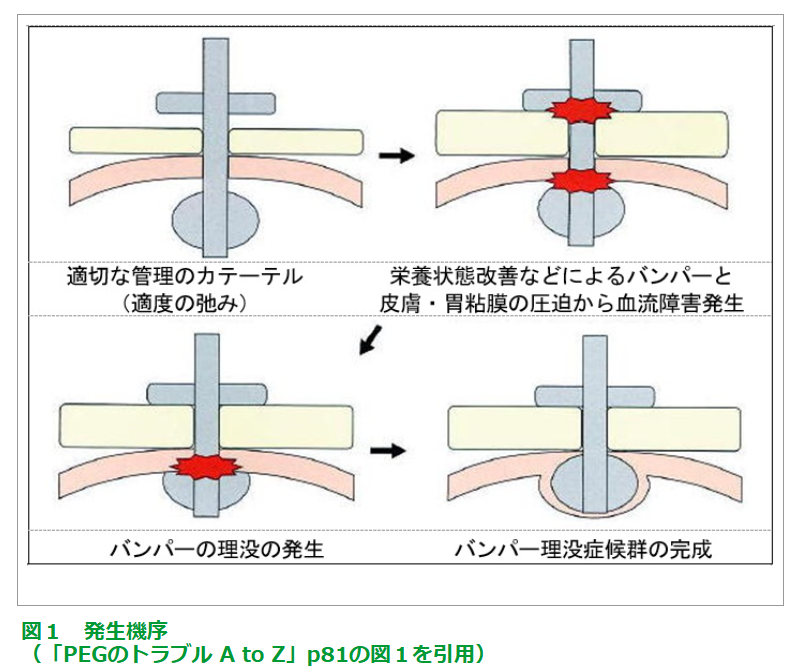
<!-- TODO: 手動調整: 元Typst画像高さ 45% -->

- PEGの内部のバンパーの締まりが強すぎて  胃粘膜の血流障害を起こすこと
  - 内部バンパーは徐々に胃壁に埋没してしまう
- 適切なタイミングでバンパーを緩める必要がある
  - 当院では24時間後

[@PDN_PEG_Lecture]

## 合併症各論～ボールバルブ症候群とは

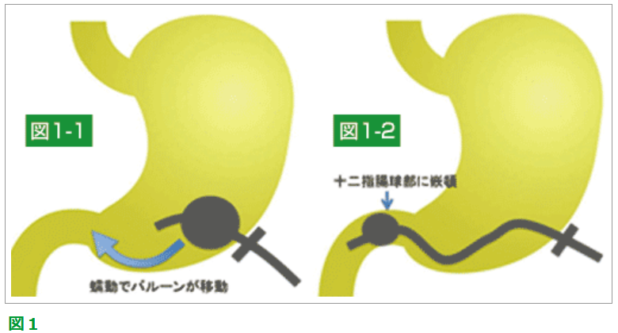
<!-- TODO: 手動調整: 元Typst画像高さ 55% -->

- バルーン型カテーテルの先端バルーンが十二指腸に嵌頓してしまう
- 嘔吐を繰り返すが胆汁や栄養剤が出てこないのが特徴
- バルーンを虚脱させ、胃内に戻す

[@PDN_PEG_Lecture]

## PEGの交換

- 日本では
  - バルーン型だと1-2ヶ月毎が多い
  - 日本ではバンパー型だと4-6ヶ月毎が多い
[@PDN_PEG_Lecture]
- 海外のガイドラインではバルーン型だと3-6ヶ月毎
[@Tae2023-ex]

## PEGの交換方法

- カテーテル非切断法とカテーテル切断法がある
  - カテーテル切断法は内部ストッパーを一旦切り離し、古いカテーテルを抜き去った後、新しいカテーテルを用手的に挿入した後、内視鏡で古い内部ストッパーを回収する方法
- いずれにせよ、PEG交換後の胃内の留置確認が必要

## PEG交換後の胃内留置確認法

| 確認法 | 内容 |
|---|---|
| 間接確認法 | 送気音による確認（非推奨） 胃内容物の吸引による確認（非推奨） 色素液注入による確認（スカイブルー法） レントゲン設備を利用した確認 |
| 直接確認法 | 経胃瘻カテーテル内視鏡による確認 経鼻/経口内視鏡による確認 |

<!-- TODO: 手動調整: 元Typstの table レイアウトは簡略化 -->

[@PDN_PEG_Lecture]

- 当院だと、非切断法でインジゴカルミン液を用いたスカイブルー法の併用が多い

# PEGの長期予後

## PEGの長期予後総論

- PEGの患者の観察研究の予後はかなり差がある
  - 傾向として日本だと長く、欧米だと短い
- これはPEGをやっている患者層の差が大きそう

## 重症認知症の場合

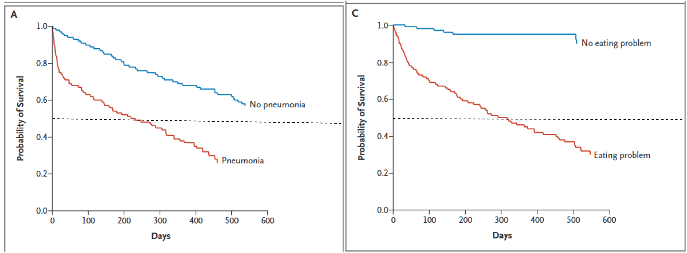
<!-- TODO: 手動調整: 元Typst画像高さ 60% -->

- 2009年のCASCADE trialにおいて、肺炎合併の重度認知症患者の中央値は6ヶ月

[@Mitchell2009-tw]

## 重症認知症のSystematic review

- 最低限抑えるべきSystematic review
- FAST 7C+以降の患者において、PEGは
  - 生命予後
  - 栄養状態
  - QOL  をいずれも改善しない

[@Davies2021-xk]

## 非重症認知症の場合は

- 2014-2018年のカナダの大規模データ
- 65歳以上の認知症のPEG患者(実際の平均年齢は約84歳、  n = 1,312)
- 1年生存率は約50%

[@Lennon2023-dq]

## 日本のデータ

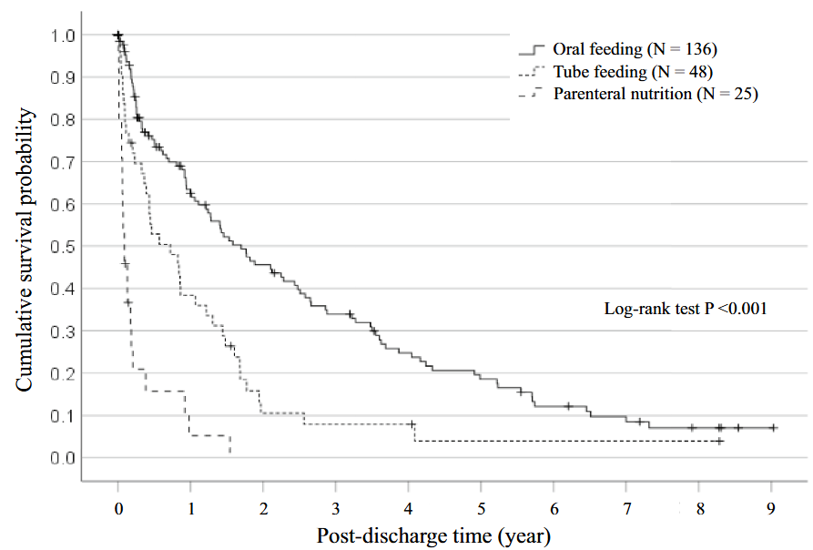
<!-- TODO: 手動調整: 元Typst画像高さ 55% -->

- 聖隷浜松病院のデータ
- 全体だと、誤嚥性肺炎患者のうち半数は1年以内に亡くなる
- 特に、経口摂取できないと誤嚥性肺炎の予後は極めて悪い

[@Honda2024-az]

## とは言え

- PEGの患者の研究の予後は研究によってめちゃくちゃ違う
  - 古い日本の研究だと、2年以上生きている人も半数超えるものもある
[@Suzuki2010-lo]
- やはり、手技というよりは患者背景による
- 特にRCTがないので、非PEG患者の予後との比較は不可能
- 一つ一つの症例で悩むくらいが良いのかも

## Take home message

- PEGの適応は倫理的適応と身体的適応を考慮する
- PEGの短期合併症はそこそこあるが、適切に管理すれば問題ない
- PEGの長期予後は患者背景によるが、一人ひとり迷うくらいがちょうど良い

## 最後に

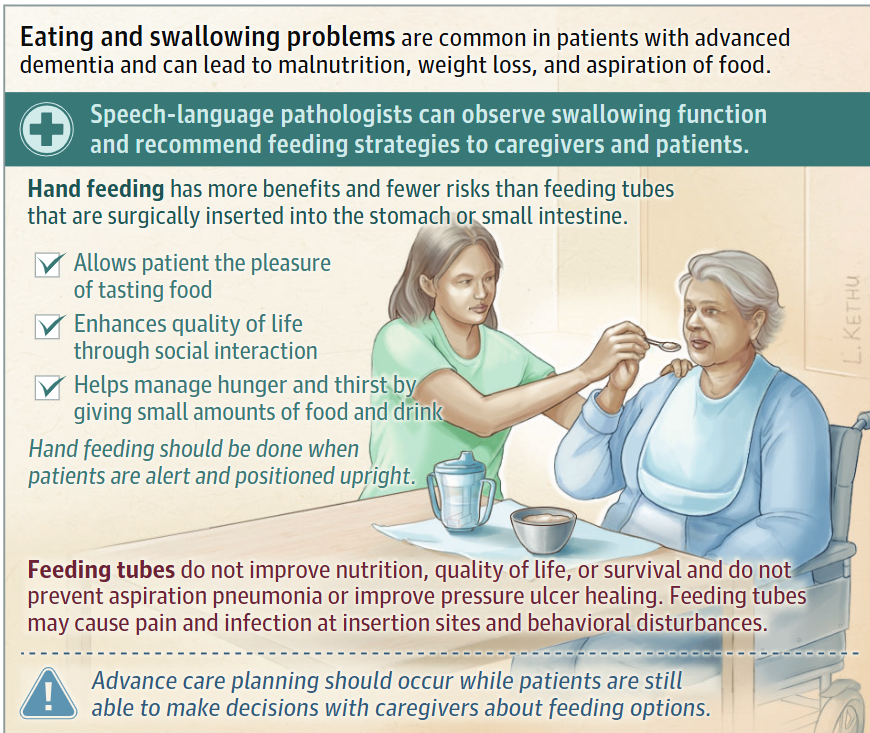
<!-- TODO: 手動調整: 元Typst画像高さ 60% -->

[@Estrada2025-xa]

- 最後まで手で食べることが重要なんだと思う

## References

::: {#refs}
:::