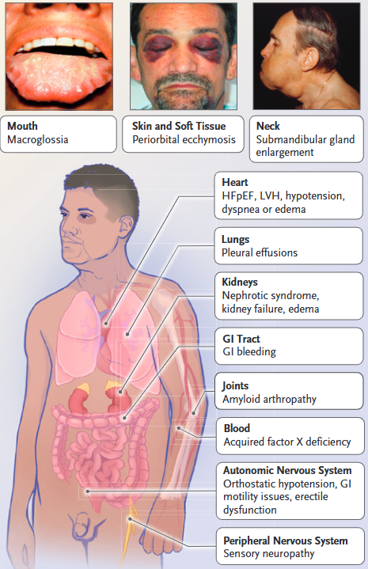
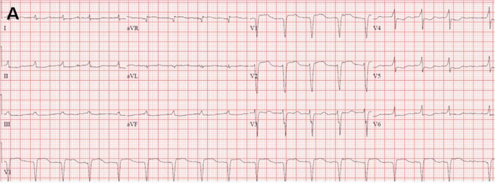
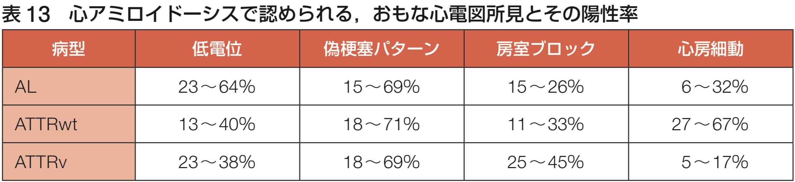
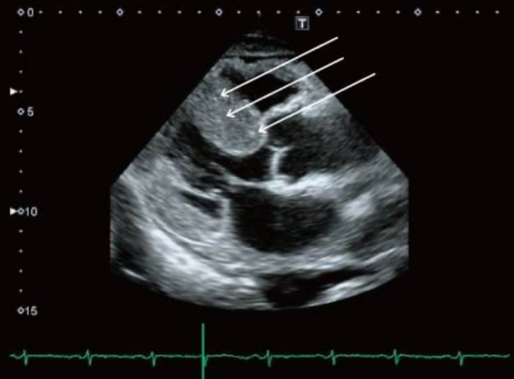
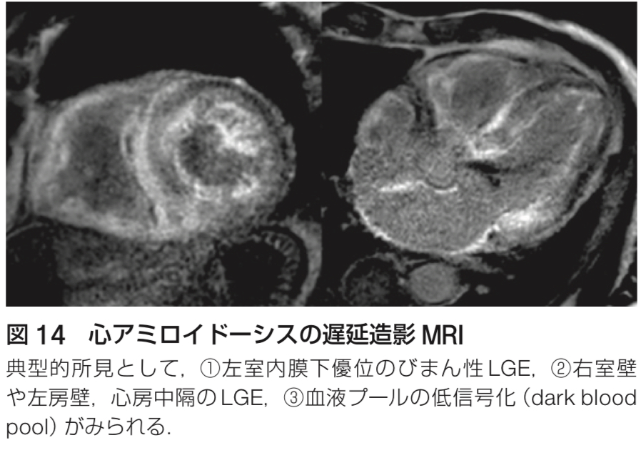
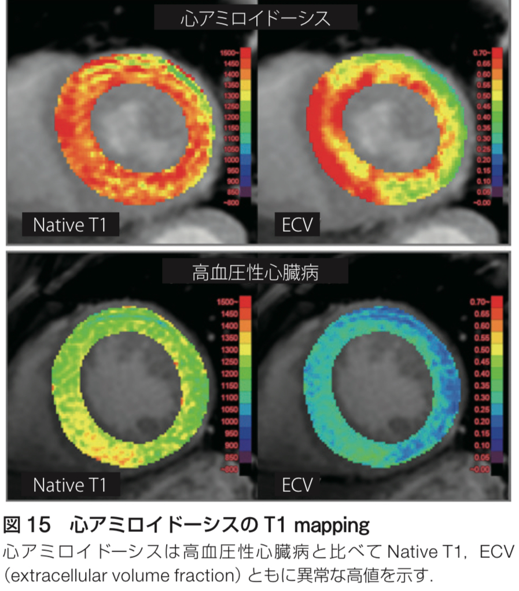
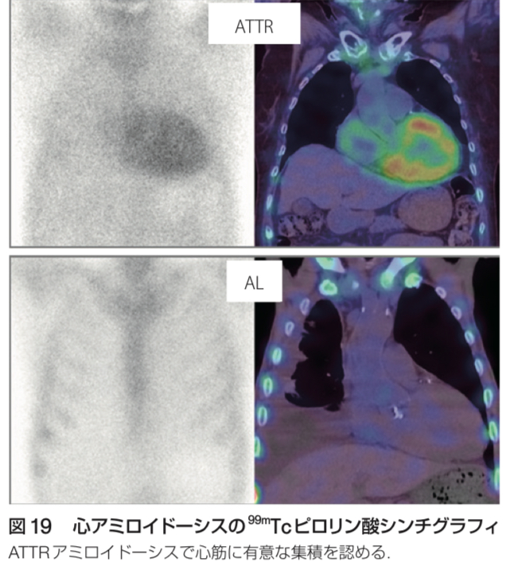
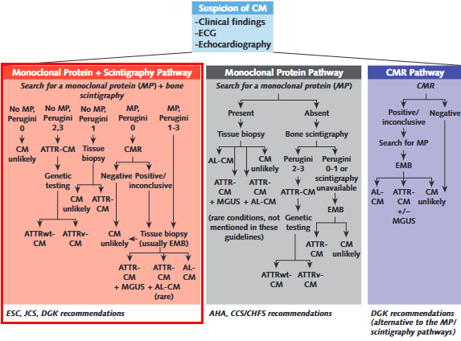

```{=html}
<style>
.reveal .reference {
  color: #666;
  font-size: 0.5em;
  margin-top: 0.7em;
  text-align: right;
}
.reveal table {
  font-size: 0.55em;
}
.reveal .small {
  font-size: 0.75em;
}
.reveal .columns {
  gap: 1rem;
}
</style>
```


## Amyloidとは？

- 1854年にVirchowが発見したミスフォールド前駆体<br>タンパク質に由来する線維状物質

::: {.reference}
[@amyloid2020_217; @dynamed2024_amyloidosis]
:::

- 全身の臓器に沈着し、多くの臓器障害を起こす
- 有病率はだいたい100万人あたり14人と推定されている
  - CMLとかと同じくらいの頻度

## Amyloidosisの分類

- 遺伝性 vs. 後天性 / 全身性 vs. 局所
  - 局所の代表例はCAAとか、Alzheimer型認知症とか<br>→ 今回は**全身性のアミロイドーシス**に焦点を当てる
- Amyloidの種類によっても分類可能
  - AA, AL, ATTR etcetc
- Amyloidの種類での分類が最もわかりやすい

## Amyloidの種類の重要性

- 全身性/局所性も遺伝性/後天性もAmyloidの種類で<br>ある程度わかる
- 障害される臓器PatternもAmyloidの種類でわかる事が多い
- 何よりも、[**治療法の有無**]{style="color: red;"}が決定される（後述）

## Amyloidの種類と特徴

::: {.center}
[**最重要スライド！！**]{style="color: red; font-size: 1.25em;"}
:::

| 種類 | 前駆物質 | 遺伝性/後天性 | 障害臓器 | 全身性/局所性 |
|---|---|---|---|---|
| AL | 免疫グロブリン軽鎖 | 両方 | 全臓器、中枢神経は稀 | 両方 |
| AA | 血清アミロイドA | 後天性 | 中枢神経以外全て、通常腎臓 | 全身性 |
| ATTR-wt | トランスサイレチン | 後天性 | 心臓、肺、腱 | 全身性 |
| ATTR-v | トランスサイレチン | 遺伝性 | 末梢/自律神経、心臓、目、髄膜 | 全身性 |

::: {.reference}
[@dynamed2024_amyloidosis]
:::

- 全部で30種類以上の前駆物質が判明しているが、上記の4種類でだいたい全部のうち80%くらいは占めている

## Amyloidosisの疫学

- Underdiagnosisされているので正確な疫学は不明
- イギリスのAmyloidosisセンターの1990-2014年までの疫学研究
- AL: 60%, AA: 10.5%, ATTR-wt: 8%, ATTR-v: 10%
- ATTRは今後増えるかもしれない

::: {.reference}
[@amyloid2017_epidemiology]
:::

## 全身性Amyloidosisの診断は難しい！

- 症状は非特異的な事が多い
- そのため、発症から診断までに時間がかかることが知られている
  - 診断までの中央値は7ヶ月
  - 4割の患者が1年以上、10%以上の患者が3年以上経過して診断される

::: {.reference}
[@actaHaematol2020_delay]
:::

## どうやって診断する？

- 代表的な症状は倦怠感、低栄養であり、そこから攻めるのは辛い
- どちらかというと、[**特定の臓器障害**]{style="color: red; font-size: 1.15em;"}を見て疑った後にRed flagを探すのが現実的

## Amyloidosisの診断

```{mermaid}
flowchart LR
  A["Amyloidosisを疑う"] --> B["Clueとなる追加情報を集める"]
  B --> C["AmyloidosisのTyping: 侵襲的検査"]
```

- Step by stepで考える
- 特徴的な臓器障害と違和感を見逃さない

## 特徴的な臓器障害

- Amyloidが沈着しやすい臓器が決まっており、以下の時にSystemic amyloidosisを疑う
  - 非糖尿病患者のネフローゼ症候群
  - HFpEF（特に、強いLVHを伴う）
  - 肝脾腫
  - Gloves and stockings patternのPolyneuropathy
  - MGUS患者の消耗性の症状

::: {.reference}
[@jama2020_systemic]
:::

## ゲシュタルトを覚えよう

- 出来れば、AA, AL, ATTR-wtの3つはゲシュタルトを<br>覚えておくと良い
- 疑った時に問診・身体所見を追加

## AA amyloidosisの疾患シナリオ

- 年齢の中央値は50-60歳
- 慢性炎症性疾患の背景がある患者の高度蛋白尿、全身浮腫
  - TB, RA, IBD, SLE, FMF, Sarcoidosis, HIVなど
  - 蛋白尿が95%でNephrosis rangeは50%にもなる
- 肝脾腫は10%程度
- 心不全や神経障害は非典型的

::: {.reference}
[@rheumDisClin2018_aa]
:::

## AL amyloidosisの疾患シナリオ①

<!-- TODO: 元スライドの side-by-side 比率と画像高さは簡略化。必要なら column 幅を調整する。 -->

:::: columns
::: {.column width="58%"}
- 診断時の年齢は50-70歳が殆ど
- 以下の症状の時に巨舌（10-17%）や眼窩周囲の紫斑（15%）を探す
  - 心不全入院: 特にLVHを伴うHFpEF（60-75%）
  - 腎機能低下: 著名な蛋白尿（50-70%）
  - 神経障害: 両手足のしびれ、<br>両側の手根管症候群、<br>起立性低血圧による失神・めまい（22%）
:::

::: {.column width="42%"}
{fig-alt="AL amyloidosis gestalt" width="72%"}
:::
::::

::: {.reference}
[@dynamed2024_amyloidosis; @nejm2024_al]
:::

## AL amyloidosisの疾患シナリオ②

- 元々MGUSなどの基礎疾患がわかっている患者が、倦怠感や<br>浮腫、体重減少などの非特異的な症状で来院
- 検査で心不全や腎機能低下、臓器腫大が判明

::: {.reference}
[@jama2020_systemic]
:::

## ATTR amyloidosisの疾患シナリオ

- 年齢の中央値は75歳, 90%は男性
- 高齢者のHFpEFでエコーをしたら特徴的な所見
  - 後壁の心室壁厚 &gt; 15mm, Granular sparkiling pattern、ECGで低電位など
- 神経: 手根管症候群が30-50%、脊柱管狭窄症、DSP
- 高齢者の上腕二頭筋腱断裂, 両側手根管症候群のような<br>やや違和感があるStory
- 腎疾患は稀

::: {.reference}
[@rheumDisClin2018_aa]
:::

## Amyloidosisの疾患シナリオ

- 腎臓のNephrosis → AA, AL amyloidosis
- 心Amyloidosis → AL, ATTR amyloidosis
- Polyneuropathy → AL, ATTR amyloidosis

::: {.center}
[**最も重要なのは心Amyloidosis**]{style="color: red; font-size: 1.35em;"}
:::

## 心Amyloidosisの重要性

- 心不全は[**最も重要な合併症かつ、予後規定因子**]{style="color: red; font-size: 1.15em;"}
- HFpEFの中でも隠れ心amyloidosisが多いとされる

::: {.reference}
[@escHeartFail2023_hfpef]
:::

- とはいえ、HFpEF全例で疑うのはやはり現実的ではない
  - 病歴で、Polyneuropathy、手根管症候群、Nephrosisの合併
- 心電図も疑うきっかけになる

## ECGの特徴

<!-- TODO: 元スライドの左右画像配置は Quarto columns に置換。画像サイズはレンダリング後に調整する。 -->

:::: columns
::: {.column width="50%"}
{fig-alt="Amyloidosis ECG" width="100%"}
:::

::: {.column width="50%"}
{fig-alt="ECG finding table" width="100%"}
:::
::::

- AF
- 壁肥厚があるにもかかわらず、心電図が低電位
- QS pattern（偽梗塞パターン）

## 心Amyloidosisの診断

- 侵襲性と値段の問題から、まずはTTEが使われる事が多い
- CMR（当院でややハードルは高いが）もかなり精度が良い
- TTE→CMR→更なる検査という順番が現実的
- CMRはCVICという会社でもやってくれる（飯田橋だがオススメ）

## TTEの特徴

<!-- TODO: 元スライドの side-by-side 比率（1.2fr:1fr）は簡略化。 -->

:::: columns
::: {.column width="55%"}
- 心筋壁/乳頭筋/弁/中隔の肥厚
- 中隔/後壁比が &lt; 1.3
- 肥厚心筋の "granular sparkling"
- 心室中隔/左室後壁の低収縮
- 心電図上の低電位と心室中隔肥厚<br>（&gt; 1.98 cm）の組み合わせで，<br>感度 72%，特異度 91%
:::

::: {.column width="45%"}
{fig-alt="TTE findings in amyloidosis" width="100%"}
:::
::::

## CMRの特徴

<!-- TODO: 元スライドの2画像配置は Quarto columns に置換。 -->

:::: columns
::: {.column width="50%"}
{fig-alt="CMR late gadolinium enhancement" width="100%"}
:::

::: {.column width="50%"}
{fig-alt="CMR T1 mapping" width="65%"}
:::
::::

- CMR: 基本は造影MRI
  - LGEは左心室内膜下優位に分布（感度85%, 特異度92%）
- 造影剤が使えない時もT1 mappingという手法で診断可能
  - 感度80-92%，特異度56-91%
  - 当院だとできないらしい・・・・・・

## 心Amyloidosisのタイピング

- AL, ATTR amyloidosisの診断をする（95％がこの2種類）
- AL: Monoclonal蛋白検出で非侵襲的に診断可能
  - 血液・尿中免疫電気泳動/固定法、Free Light Chain
  - これらが全て陰性の時の感度は約99%

::: {.reference}
[@jama2024_cardiac]
:::

- ATTR: **PyPシンチ（Tc99m）**を使う事で、非侵襲的に診断可能
  - Monoclonal蛋白陰性→PyPシンチ陽性 = ATTR amyloidosis確定診断

## PyPシンチ

<!-- TODO: 元スライドの side-by-side 比率（1.4fr:1fr）は簡略化。 -->

:::: columns
::: {.column width="58%"}
- 陽性の場合はATTR amyloidosisを示唆する
- ATTR-CAの診断能は<br>感度58-99%，特異度79-100%
- AL amyloidosisでも陽性になるので注意！
  - 採血・検尿でALを除外したら<br>一発診断可能
:::

::: {.column width="42%"}
{fig-alt="PyP scintigraphy" width="80%"}
:::
::::

## Cardiac amyloidosis(CA)診断のアルゴリズム

```{mermaid}
flowchart LR
  A["心アミロイドーシス疑い"] -->|検査| B["monoclonal蛋白検査"]
  B -->|陽性| C["血液内科コンサルト・生検"]
  B -->|陰性| D["PyPシンチ"]
  D -->|陽性| E["ATTR-CM"]
  D -->|陰性| F["心アミロイドーシスらしくない"]
```

- 採血・検尿が陰性→PyPシンチ陽性→ATTR amyloidosis確定
- 採血・検尿でM蛋白が陽性→Amyloidの組織生検は必須
  - MGUSは70歳以上で5%、ATTR-wtのCAのうち10-40%は<br>AL amyloidosisの検査で異常が出る為
  - 局所麻酔下での脂肪織の生検が非侵襲的でよい
    - 感度 ATTR-v: 65-85%, AL: 60-80%, ATTR-wt:14%

::: {.reference}
[@jama2024_cardiac]
:::

## Cardiac amyloidosis(CA)診断のまとめ

{fig-alt="Cardiac amyloidosis diagnostic pathway" width="70%"}

::: {.reference}
[@annInternMed2023_ca]
:::

## Amyloidosisの診断後

- 治療は専門科に任せる
- AL amyloidosisは血液内科
- ATTRは慶應の循環器内科に紹介
  - Tafosmideをやっている
- ATTRがwtかv（遺伝性か孤発性か）は家族歴を確認するが結局は遺伝子検査が必須
  - 熊本と長野に集積

## Take home message

- 特徴的な臓器障害パターンからAmyloidosisを引っ掛けよう
- 心アミロイドーシスが最も重要！探しに行く！
- ALは採血・検尿、ATTR-wtはPypシンチで非侵襲的に診断を！
- 最終的にはTissue is issue！ATTR-wtアミロイドーシス疑いの時は腹壁脂肪を生検する！

## References {.scrollable}

::: {#refs}
:::
