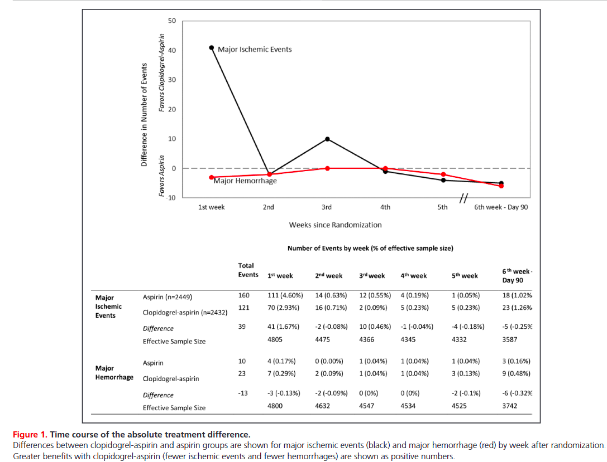
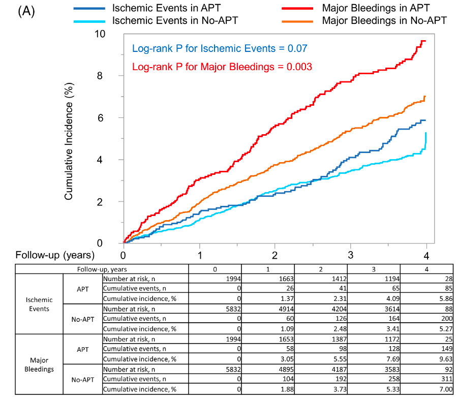
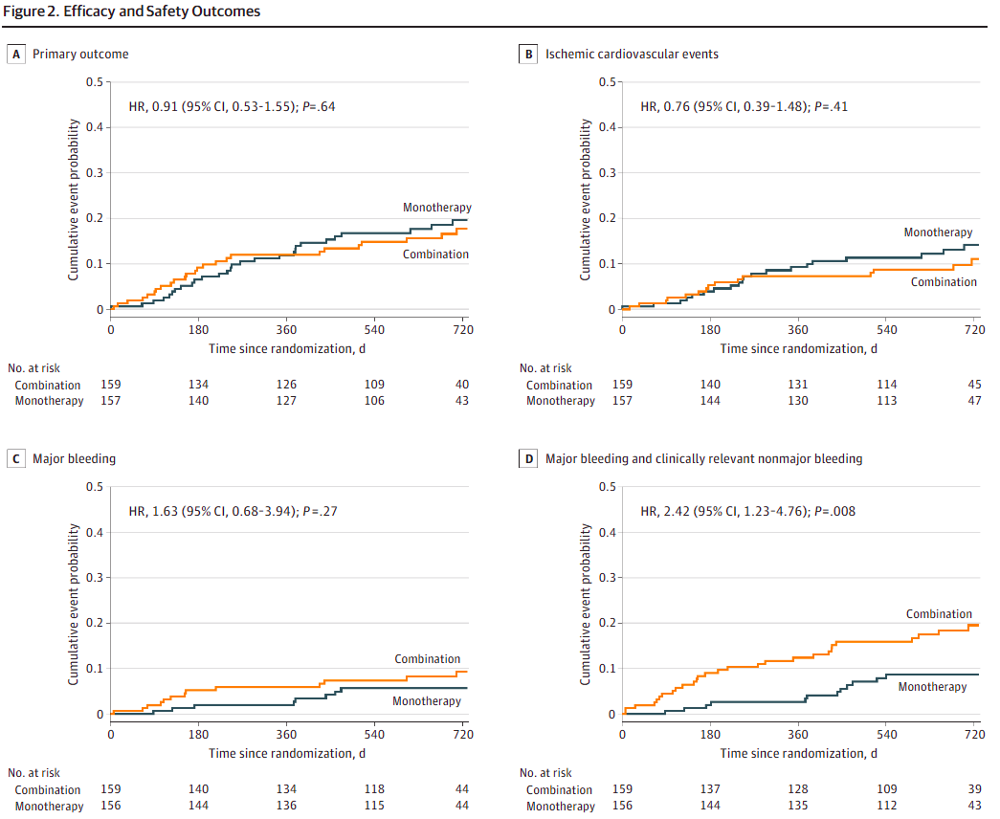
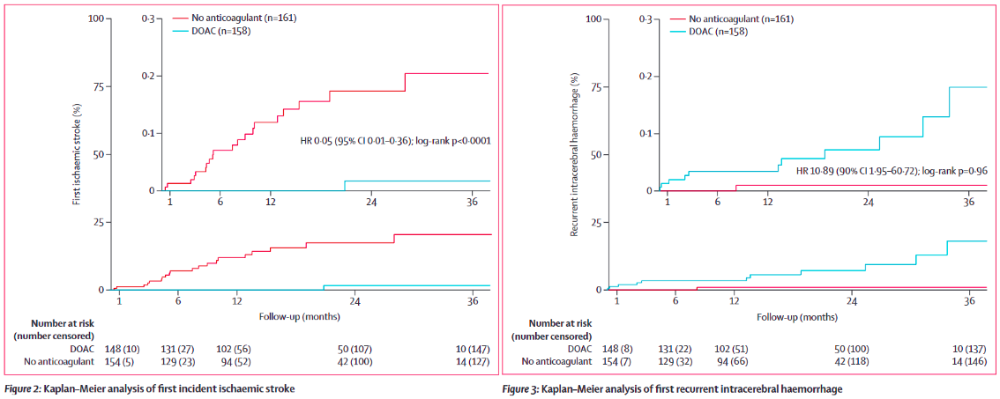

## 本スライドの目的

- (脳梗塞治療に関して)抗血血栓薬の実臨床の迷いどころを悩む
- 基本的にEvidenceがしっかりとある、"明らかな正解"は書きません
- 明らかな答えがないことに関して、「なぜ？その選択をする？」という事について考えることを目的とします

# 非心原性脳梗塞はいつ発症でもDAPT？

## 症例 {.case}

- 64歳男性、DM, HTN, Dlp背景
- 5日前発症のアテローム性脳梗塞を発症
- NIHSSは10点
- 初期治療は？

## いつ、だれにDAPTをするの？

- 基本は「発症早期」の「非心原性」のHigh risk TIAまたは軽症脳梗塞
  - TIAとしてはABCD2 4点以上で脳梗塞としてはNIHSS 5点以下
- 本来なら、3日以上前でNIHSS 10点はDAPTの適応外だが・・・・・・
- しかし、10点でも、脳梗塞の再発Riskは高いので、DAPTは十分検討
- 出血Riskで考える

| Trial名 | Inclusion | 発症からの時間 | 介入 | NNT |
|---------------|---------------|---------------|---------------|---------------|
| CHANCE | ABCD2≧4のTIAあるい はNIHSS≦3の脳梗塞 | 24hr | ASA+CLOを21日 | 28 |
| POINT | ABCD2≧4のTIAあるいは NIHSS≦3の脳梗塞 | 12hr | ASA+CLOを90日 | 67 |
| THALES | ABCD2≧6のTIAあるいは NIHSS≦5の脳梗塞 | 24hr | ASA+CLOを30日 | 91 |
| CHANCE2 | ABCD2≧4のTIAあるいは NIHSS≦3の脳梗塞かつ CYP2C19のloss-of-function allele | 24hr | ASA+Ticagrelorを21日 | 63 |
| INSPIRES | ABCD2≧4のTIAあるいはNIHSS≦5の脳梗塞かつアテローム性を疑う | 72hr | ASA+CLOを21日 | 53 |

[@Prabhakaran2026-dz]

## DAPTの出血RiskとBenefit

{.nostretch width="100%" style="height: auto; max-height: none; max-width: 100%;"}

[@Johnston2019-ca]

- DAPTのRCTのmeta analysisだと、出血に関しては大体最初の週に0.3%, その後は週に0.05%程度の出血Risk
  - 特に最初の1wkより前だと脳梗塞の予防効果のBenefitは大きそうに見えるが3wks後だと出血のRiskがBenefitを上回る
- 今回の場合は発症しばらく経過しているがDAPT導入は十分検討できる
- 裏を返すと、出血Riskが高い場合は行わないかも
  - 高齢者、CKD、貧血、NSAIDs使用など[@Urban2019-an]

# 心原性脳梗塞の適切なDOAC開始のタイミングは？

## 症例 {.case}

- 82歳女性、HTN, CKD背景
- 3日前発症の左MCA領域の脳塞栓症を発症、来院時のECGでAFを認める
- NIHSSは16点
- 初期治療は？いつ導入する？

## いつ抗凝固を開始するの？

- 心原性脳塞栓患者は、基本的に脳梗塞発症早期が最も再発Riskが高い
  - 古い研究では最初の48時間で4.8%が再発し、抗凝固されないと10日で13%が全身性の塞栓症を発症していた[@Kleindorfer2021-uv; @Hart1983-wi]
- 一方で、脳梗塞範囲が広いため、壊死部位からの出血のRiskも高い
- そのため、早期の抗凝固による予防 vs. 出血のRiskのせめぎあいがあった
- 心原性脳塞栓症患者ではHeparinの24時間以内の早期投与のSystematic reviewで
  - 予後改善なし
  - 出血のみ増加[@Wang2021-ty]
- 結局、**なんとなく弱めにHeparinを開始したりバイアスピリンを早期に導入していた**
  - 超急性期は脳塞栓症であってもバイアスピリンはわずかに予後改善(NNT 140程度)があった[@Chen2000-uo]

## DOAC時代

- DOACはWFに比べて明らかに脳出血を減らし、さらに調整が容易

- 脳塞栓に対して、DOACなら早期導入でよいのではないか？という推定あり

- 4つのRCTがあり、それをまとめると[@Dehbi2025-cu]

  - 早期導入により30日以内の脳梗塞の再発はわずかに減らす(1.68% vs. 2.55%)
  - 早期導入により症候性の脳出血のRiskは変わらない(0.37% vs. 0.36%)
  - ただし、早期導入は4日以内のようなやや曖昧な感じ

## 今回の場合

- NIHSS 16点で、脳梗塞範囲も広く、出血Riskは高い
- しかし、最近のRCTでは、早期導入でも出血Riskは変わらないことが示されている
- 即座のDOACか、24時間程度待って頭部CTを確認した後のDOAC導入が妥当かもしれない

# 心原性脳梗塞患者がhemorrhagic transformationしてしまったらどうする？

## 症例 {.case}

- 症例2の患者を24時間後の頭部CTで左MCAに出血性梗塞を認めた
- 元々脳委縮は大きく、脳ヘルニア兆候やMidline shiftはなし
- 抗凝固はどうする？

## 脳梗塞の出血転化について

- DOACの早期導入で有名なRCTのOPTIMAS trialだと軽度の出血性脳梗塞例も入っている[@Werring2024-jg]
  - 出血部位が脳梗塞部位全体の30%未満かつ、圧排がない(Heidelberg criteriaの2未満)
- 全体としてはEarly vs. Late (4日以内 vs. 7日以降)で安全性に差はなし
  - ただし、まだ出血性脳梗塞患者のPrespecifiedのサブ解析は現時点(2026/7/26)では存在しない
- 一方で、ELAN trialのサブ解析では、安全性の差はないが90日での機能予後が悪い可能性がある[@Rohner2024-ww]
- 個人的には出血が広がらないことを同日～翌日まで確認して早期導入がよい(できれば4日以内)
- 当然、神経学的に悪化がなく、脳ヘルニアなどがないことが大前提

# AF患者のBreakthrough ischemic strokeへの対応

## 症例 {.case}

- 78歳男性、元々CHADS2 3点で心房細動でEdoxaban 30mgを内服中
- 1日前発症の脳塞栓症あり、NIHSSは3点程度で軽症
- 頸動脈エコーでプラークはなし
- さて、どうする？

## DOAC内服中の脳梗塞

- AF患者へのDOACは脳梗塞Riskを約1/3に低下させる
- 裏を返すと1/3程度の脳梗塞Riskは残る(年率1-2%程度)[@Seiffge2024-yu]
- この時は何故再発したか？をカテゴライズする
  - AF非由来の脳梗塞(アテローム性脳梗塞、Lacunarなど)
  - 内服失敗(Adherence不良、薬剤相互作用、Underdoseなど)
  - 適切な治療にも関わらず再発をした
- 上記2つの場合は各々対応
  - ただし、抗血小板薬+抗凝固は基本行わず、DlpやHTNに対応する

## 適切なDOAC内服中の心原性脳塞栓症再発

- この時にどうすべきかは悩ましい
  - WFに変更
  - 同じDOACを継続
  - DOACの種類を変更
    - 特に、Dabigatran 150mg 2T2Xを考慮(RE-LYで唯一WFに予防効果で勝っている)[@Seiffge2024-yu]
  - ASAを併用　　　　など

## 今までわかっている事

- AFでDOAC内服中の脳梗塞再発患者へのRCTは存在しない
- 観察研究では、同じ種類のDOACを継続することがその後のRiskが最も低く出血合併症が低かった[@Ip2023-vw]
- 少なくともWFの切り替えやASAの併用は出血Riskが高く、推奨されない[@Romoli2025-ii]
- ただし、いずれにせよ観察研究なので絶対に正しいわけではない
- 個人的には元気な患者の場合は循環器内科に左心耳閉鎖術を相談することも検討する

# AF患者がアテローム性脳梗塞になった時の抗血栓薬の選択

## 症例 {.case}

- 82歳男性、元々HTN, DM, Dlpで10年前にアテローム性脳梗塞既往
- 動悸で初診外来を受診、新規の心房細動が判明
- どうする？

## 非心原性脳梗塞の抗血小板薬の治療効果

- WARSS trialではWFは非心原性脳梗塞患者に対してASAと同等の予防効果を認めた[@Mohr2001-ga; @Schachter2008-mp]
  - 死亡または脳梗塞はWFでやや多いが17.8% vs. 16%で有意差なし
  - 出血はMinorな出血で20.8% vs. 12.9%でWFで有意に多い

## 心原性脳梗塞の抗凝固の治療効果

- EAFT trialではAF+脳塞栓症の患者に対してPlaceboに比べて再発を1/3まで減らす(OR 0.34, 95% CI 0.20–0.56)[@Klijn2019-ex]

## 心原性脳梗塞への抗血小板薬の予防効果

- 複数のRCTのSystematic reviewだと約15%低下はしていたが統計学的に有意ではなかった[@Klijn2019-ex]

## 抗血小板と抗凝固の併用の出血Risk

{.nostretch width="100%" style="height: auto; max-height: none; max-width: 100%;"}

[@Morimoto2021-bu]

- Real worldの抗血小板薬 vs. 抗血小板薬+OACのデータ
  - 1年で3.1% vs. 1.9%
  - 4年で9.6% vs. 7.0%

## アテローム性脳梗塞+AFの唯一のRCT

{.nostretch width="100%" style="height: auto; max-height: none; max-width: 100%;"}

- 日本のRCT(ATIS-NVAF trial)
  - P: AF + ASCVD risk因子があり最近(発症 8-360日)TIA/Strokeを発症した患者(n = 316)
  - I: 抗凝固+抗血小板薬
  - C: 抗凝固単剤
  - O: Primary: 2年以内の虚血イベント(心血管死亡+脳梗塞+MI+全身性塞栓症+血行再建)+有意な出血

## 結果

| Outcome | 抗血小板薬 + 抗凝固 (発症率) | 抗凝固 単剤 (発症率) | HR (95% CI), p値 |
|:----------------|:-----------------:|:-----------------:|:----------------|
| 2年以内の虚血イベント(心血管死亡+脳梗塞+MI+全身性塞栓症+血行再建) + 有意な出血 | 17.8% (11.0–24.0%) | 19.6% (12.7–26.0%) | 0.91 (0.53–1.55), *p* = 0.64 |
| 虚血イベント | 11.1% | 14.2% | 0.76 (0.39–1.48), *p* = 0.41 |
| 有意な出血 | 9.4% | 5.6% | 1.63 (0.68–3.94), *p* = 0.27 |
| **全出血イベント** | **19.5%** | **8.6%** | **2.42 (1.23–4.76), *p* = 0.008** |

## ただし・・・・・・

- Inclusionは8日目以降なので、もっと急性期はなんとも言えない
- 7日以内くらいの抗凝固と抗血小板薬の併用についてはこのRCTは教えてくれない

# Secondary AFに対する抗凝固の適応は？

## 症例 {.case}

- 76歳女性、腎盂腎炎で入院
- 入院日にHR 120の心房細動発症
- 高血圧、糖尿病既往あり
- 抗凝固薬の適応は？

## Secondary (symptomatic) AFの治療は？

- 明らかに原因があるAFで原因が除去された後には不要とされることが多い
- 一方で、AFはなりやすさの素因(Substrate)があるので、"AFになりやすい患者"という考え方もできる
  - この後に永続的AFになるかも
- この時のAFに対して抗凝固を導入するかは決まっていない
  - ESC guidelineではIIaだがsepsisの時は利益は分からないと明言を避けている[@Van-Gelder2024-ud]
  - AHA guidelineではIIb[@Writing-Committee-Members2024-bn]

## 今わかっていること

- SepsisによるAFはcommonであり重症度が高いと発症しやすい
  - sepsisだけだと8-10%だが、Septic shockだと23-44%が発症[@Chyou2023-ur]
- 二次性AFの患者は1年間追うと1/3が再発し、5年追うと約1/2が再発する[@Writing-Committee-Members2024-bn]
- 二次性AF患者は、その後を追うと死亡率が高く、脳梗塞の発症率も高い
- ただし、二次性のAFは、一次性のAFに比べて脳梗塞Riskは低い
  - CHADS2-VAで1-4点だと1%程度、5-点で2%程度[@Abdel-Qadir2025-yv]
- 特にSepsisの場合はCHADS2-VAScは塞栓症のRiskとして使えず、観察研究ではあるが抗凝固と脳梗塞との関連は示されなかった [@Walkey2016-mg; @Quon2018-gc]

## どうするか？

- 当然、KとかAMI合併とか、甲状腺は確認
- CHADS2は3点と高いため、血栓症のRiskは高いかもしれない
- しかし、Sepsisであり抗凝固の治療効果は観察研究でも証明されていない
  - ある程度の時間(あまり決まっていないが48時間)は抗凝固なしで経過をみて、ずっと続いたら通常のAFとして対応
  - その間に収まったら、本人とShared decision makingをしつつ抗凝固を導入しない風にするかもしれない
- 本人には、AFが再発する可能性が高いことを伝えて動悸があったらすぐに近医受診を勧める

# AFに対してDOACが入っている患者が脳出血になった！抗凝固は再開する？

## 症例 {.case}

- 79歳女性、AF、CHADS2 3点でRivaroxabanを内服中
- 頭痛で来院し、被殻に1*1*0.5cm程度のわずかな出血
- 軽度の麻痺はあるが安定している
- 抗凝固薬は再開する？

## 抗血栓療法中の脳出血後の対応

- ASA内服中の脳出血の場合はRESTART trialがありある程度の結果が分かっている[@Al-Shahi-Salman2019-ei]
  - 2年間のf/uで症候性脳出血の発症に差はなし(なぜか4% vs. 9%、HR 0.51\[0.26-1.03\]と再開群の方がやや少ない傾向)
  - ASCVD eventも差はなし(15% vs. 14%)
- 一方で、抗凝固内服中の脳出血患者のEvidenceは複雑

## 抗凝固内服中の脳出血患者のDOAC再開について

| アウトカム | 経口抗凝固薬を開始 (n = 212) | 経口抗凝固薬を回避 (n = 200) |
|--------------------|-------------------------:|-------------------------:|
| **主要アウトカム** |  |  |
| 脳梗塞または心血管死 | 29 (14%) | 43 (22%) |
| **副次アウトカム** |  |  |
| 虚血性MACE(脳梗塞+全身性塞栓症+PE+MI) | 9 (4%) | 38 (19%) |
| └ 脳梗塞 | 9 (4%) | 31 (16%) |
| 出血イベント | 15 (7%) | 9 (5%) |
| └ 頭蓋内出血 | 12 (6%) | 5 (3%) |
| 全死亡 | 38 (18%) | 29 (15%) |
| 1年後の死亡+要介護（mRS 3–6） | 78 (53%) | 74 (51%) |

- 3RCT(APACHE-AF、NASPAF-ICH、SoSTART)のMeta analysis
  - 2-6年のfollow-up、約8割の患者が75歳以上
  - 40%以上がCHA2DS2-VASc 5点以上[@Al-Shahi-Salman2023-dv]
- 塞栓イベントを減らすことは可能だが、代わりに出血eventは増える
- 全死亡は変化なし

## 直近のRCTでは

[@Veltkamp2025-em]

- PRESTIGE-AF trial(n = 319)
  - follow upの中央値は1.4年、脳出血からRandom化は中央値で7週間
  - 平均年齢は49歳、CHA2DS2VASc　4[3-6]
- 結果は同じで出血は増えるが塞栓症は減る
  - 全死亡は6.67/100人年 vs. 8.60/100人年
  - 頭蓋内出血は6.25/100人年 vs. 0.82/100人年
  - stroke + 全身性塞栓は 5.83/100人年 vs. 11.06/100人年

## 結局のところ

- 出血のRiskと塞栓症の鬩ぎあいとなって、死亡は変わらない
- CHADS2やHASBLEDで相談
- 予後が長ければICの上で再開を推奨
- JACCのStatementでは4-8wks後での再開が推奨されてはいるが、大体入院中に再開している[@Kumbhani2026-oe]

## Thank you for listening

- ご清聴ありがとうございました

## Reference

::: {#refs}
:::