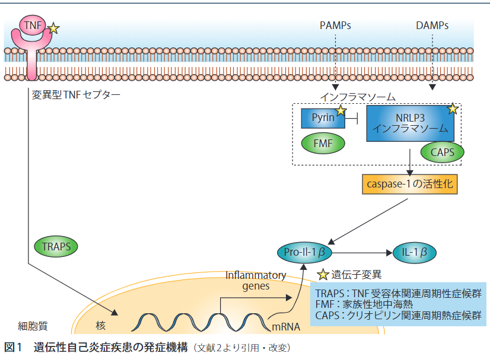
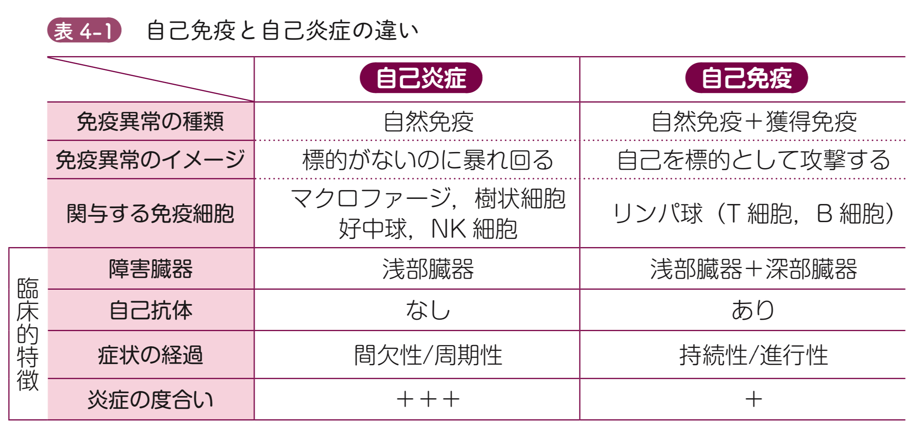
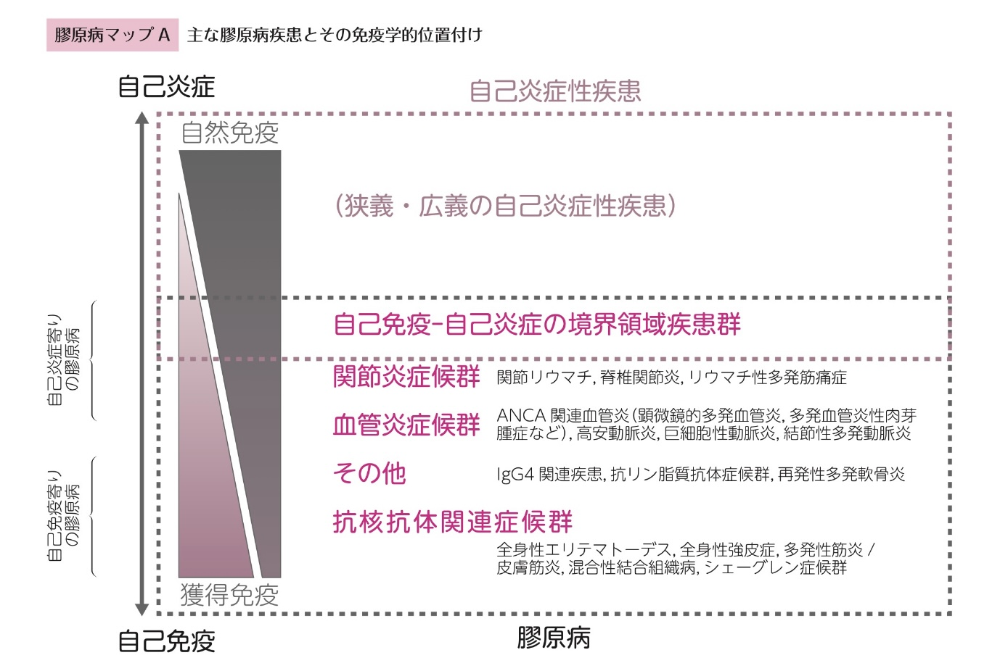
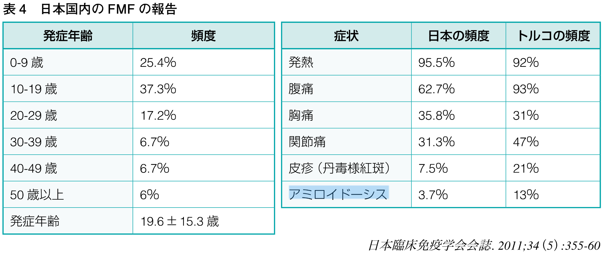
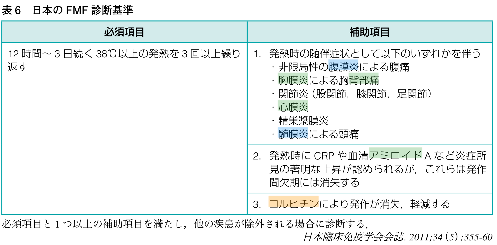

```{=html}
<style>
.reveal .reference {
  color: #666;
  font-size: 0.5em;
  margin-top: 0.7em;
  text-align: right;
}
.reveal .big-message {
  font-size: 1.35em;
  text-align: center;
}
.reveal .columns {
  gap: 1rem;
}
.reveal img {
  max-height: 68vh;
}
</style>
```

## 症例

- 26歳女性
- 当院で発熱・汎発性腹膜炎で入院
- その後1ヶ月半周期で2回同様の入院歴あり
- これはFMFでは？

## FMFとは

- 自然免疫による自己炎症性疾患の1つ
- 成人発症でも良い数少ない疾患（それ以外だとPPFAくらい）
- 家族性地中海熱は**常染色体劣性（潜性）遺伝形式**で遺伝
- **自己炎症性疾患** vs. ~~自己免疫疾患~~

## 自己炎症性疾患とは

{fig-alt="自己炎症と自己免疫の模式図" width="50%"}
[@Migita2019FMF]

- 好中球による炎症反応
  - 抗原暴露によるリンパ球による獲得免疫ではない
- PAMs, DAMPsの刺激から始まる
- 成人発症でも良い数少ない疾患（他にはAOSD, TRAPS, PPFA, VEXAS症候群）
[@takagishi2024_flowchart]
- 膠原病全体の捉え方での自己免疫と自己炎症の鑑別は重要

## 膠原病の考え方

{fig-alt="自己炎症と自己免疫の考え方"}

- 自己炎症 vs. 自己免疫で大きく分かれる[@Maejima2022DrKogenbyoron]
  - 自己免疫はリンパ球に、自己炎症は好中球によって生じる

## 自己免疫疾患と自己炎症性疾患

:::: columns
::: {.column width="50%"}
- 自己免疫も自己炎症もスペクトラム
- 境界領域の疾患が存在する
  - 簡単にいうとコルヒチンが効く疾患は全部自己炎症寄り
    - 再発性心外膜炎
    - 成人Still病
    - ベーチェット病
    - SpA
    - 壊疽性膿皮症
:::

::: {.column width="50%"}
{fig-alt="自己免疫疾患と自己炎症性疾患のスペクトラム" width="100%"}
[@Maejima2022DrKogenbyoron]
:::
::::

## FMFの疫学

- トルコ人に多い（シルクロード）
- 2009年の研究だと日本人で約500人で男女差はない
[@nanbyou_fmf]
- 潜在的にはもっとたくさんいると思われている

## FMFの症状

{fig-alt="FMFの症状"}

- 高熱が半日〜3日間持続
- ある程度決まった間隔（4週間が最多だが個人差あり）での発作
  - ストレスや感染症、月経などに影響される。期間の長さは個人差がある
- 発作間は[**基本的に症状がない**]{style="color: red;font-size: 1.5em;"}のが特徴
- 重要な症状としては**急性腹症**、胸膜炎などの漿膜炎や関節炎などが特徴的[@@padeh2016_fmf;@takagishi2024_flowchart]

## FMFを一言で言うなら

::: {.big-message}
[**定期的な発熱 + 繰り返す虫垂炎**]{style="color: red;font-size: 1.5em;"}
:::

## FMFの鑑別診断

- SLEなどの自己免疫性疾患
- IgA血管炎などの血管炎の発作
- IBDのような局所的な自己免疫性疾患
- Porphyriaなどの代謝性疾患
- 遺伝性血管神経性浮腫などの急性腹症の希少疾患

## FMFの診断

{fig-alt="FMFの診断基準"}

- Tel-Hashomer基準は特異度が高すぎると言われている
- 日本だと厚生労働省が別個に定めている
[@takagishi2024_flowchart]

## FMFの診断～日本の事情

- 日本人は海外症例と比べて患者背景が大きく異なる
  - 発症年齢が高い
  - 腹膜炎症状が少ない
  - アミロイドーシス合併が少ない
- 日本人のFMFのうち非典型例とされるのが4割ほどいるとされる
- 諸外国のガイドラインだけ見ていると見逃してしまう

## FMFの診断は簡単？

- 典型例は知識があれば診断は簡単
- 一方で、基準を満たさない、"FMF崩れ"みたいな症状が多いと言われている
- 大まかなゲシュタルトとして **若年者の「繰り返す発熱と腹痛（+高CRP）」** を忘れない

## FMFの診断

- 遺伝子検査は必須ではない
  - 遺伝子異常があっても発症しない事も多い（浸透率が高くない）
  - 逆に遺伝子異常がない人もFMFを発症することもある
- 常に[**臨床診断**]{style="color: red;font-size: 1.2em;"}
- 特に重要なのは**コルヒチンの反応性**

## FMFの診断～プラクティカルアプローチ

```{mermaid}
flowchart TD
  A["FMF疑い例"] --> B["典型例に当てはまらない症例"]
  A --> C["FMF典型例"]
  C --> Z["FMF"]
  B --> D["MEFV遺伝子解析"]
  D --> E["変異なし"]
  D --> F["Exon10以外の変異あり<br>E84K, E148Q, L110P-E148Q,<br>P369S-R408Q, R202Q,<br>G304R, S503C<br>※ヘテロの変異を含む"]
  D --> G["Exon10の変異あり<br>M694I, M680I,<br>M694V, V726A<br>※ヘテロの変異を含む"]
  E --> H["コルヒチン（診断的投与）"]
  F --> H
  H --> I["反応なし"]
  H --> J["反応あり"]
  I --> K["他疾患の検索<br>感染症・悪性疾患・<br>自己免疫疾患・<br>他の自己炎症性疾患等"]
  J --> L["FMF非典型例"]
  G --> Z
```
[@Migita2019FMF]

- ほとんどの場合、直接の診断あるいはコルヒチンの反応性の確認に落とし込まれる

## FMFの診断～遺伝子検査

- 16番染色体上の16p 13.3領域のMEFV遺伝子が関連遺伝子と知られている
- 関連がある遺伝子異常は300以上あると言われている
- 日本人のデータだと
- 非典型例だとMEFV遺伝子エクソン10の変異は少ない
  - エクソン1（E84K）
  - エクソン2（E148Q，L110P-E148Q）
  - エクソン3（P369S-R408Q）
  - エクソン5（S503C）
- その為、遺伝子検査の判定は難しい

## 遺伝子検査の方法

:::: columns
::: {.column width="50%"}
- 東京女子医大学に依頼
- 東北大学病院 血液内科・<br>リウマチ膠原病内科
- 筑波大学医学医療系小児科
- 東京医科歯科大学膠原病・リウマチ<br>先端治療センター
- 東京女子医科大学膠原病リウマチ<br>痛風センター
- 国立成育医療研究センター免疫科
:::

::: {.column width="50%"}
- 信州大学医学部附属病院脳神経内科／<br>リウマチ・膠原病内科
- 岐阜大学医学部附属病院小児科
- 藤田医科大学病院臨床遺伝科
- 兵庫医科大学病院アレルギー・<br>リウマチ内科
- 川崎医科大学附属病院リウマチ・<br>膠原病科
- 九州大学医学部 小児科
- 久留米大学医学部 小児科学教室
:::
::::

[@qlife_genetics_fmf]


## FMFの治療

- QOLの改善とAmyloidosis予防が目的
- コルヒチンは90%以上で有用
- コルヒチンが無効な場合はIL-1β阻害薬を使う
- 実際は、「診断が違う」のと「FMFだけどコルヒチン無効」の鑑別がつかない
  - ここは、診断前確率に合わせて動きを変えるしかない

## Take home message

- 若年女性の繰り返す発熱と腹痛はFMFを疑う
- 診断は臨床第一、コルヒチンの診断的治療をためらわない！
  - 家族歴がなくても良い！
  - 遺伝子異常がなくても良い！

## References {.scrollable}

::: {#refs}
:::
