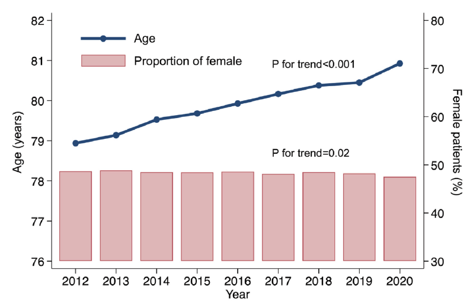

```{=html}
<style>
.reveal .big-message {
  font-size: 1.35em;
  text-align: center;
}
.reveal .columns {
  gap: 1rem;
}
.reveal img {
  max-height: 68vh;
}
</style>
```

# 高齢者と心不全の関係

 [@Kanaoka2024-yc]

- 加齢は心不全発症の大きなRisk
- 現代の日本は高齢社会であり心不全患者は著名に増えている
  - 心不全Pandemic[@Shimokawa2015-zw]
- 日本のDPCデータでは2016-2024年の新規心不全患者の平均年齢81±12歳[@Sato2026-wu]

## 心不全パンデミック

- 心不全の原因について確認

## 高齢と心不全の関係

- Frailは心不全全体で40-80%がある
  - HFpEFだと90%、HFrEFだと30-60%
  [@Talha2023-tl]

# 現代の心不全管理 at glance

## Phaseを意識した心不全管理

## HFrEF-1 \~GBMT


    Matsumoto S, McMurray JJV, Nasu T, et al. Relevant adverse events and drug discontinuation of Sacubitril/valsartan in a real-world Japanese cohort: REVIEW-HF registry. J Cardiol. Published online November 22, 2023. doi:10.1016/j.jjcc.2023.11.005
  


## HFrEF-2 \~Beyond GBMT

## HFpEF-1 \~ GBMT

## Mechanical intervention

# 高齢者における心不全の各フェーズの動き方

## 超急性期～NPPV+ニトロ, NSTEACS, DC

NPPVの代わりにHFNCは？

## 急性期心不全

Nohria stevenson 利尿薬はしっかり使うべき？ Baはどうする？

## 慢性心不全の管理

## 高齢者心不全のGBMTの是非？

- GBMTはAKI, 高K血症, 徐脈, 低血圧などの有害事象がある
- 実際にFrailな高齢者においては薬のAdverse eventsは多い印象がある

## GBMTの高齢者のEvidence

::: {.smaller}


| 薬剤クラス | 薬剤名 | 主要試験 | 若年者 vs 高齢者における有効性 |
|---------------|---------------|---------------|---------------|
| ACE阻害薬（ACEi） | Enalapril | SOLVD<br>CONSENSUS | **全死亡 / 心不全入院（HHF）**<br>\<60歳：HR 0.71（95% CI 0.59–0.86）<br>≥60歳：HR 0.79（95% CI 0.66–0.95） |
| β遮断薬（BB） | Carvedilol<br>Metoprolol<br>Bisoprolol | US Carvedilol<br>COPERNICUS<br>MERIT-HF<br>CIBIS | **心血管死 / 心不全入院（HHF）**<br>Q1（50歳）：HR 0.66（95% CI 0.56–0.77）<br>Q2（60歳）：HR 0.78（95% CI 0.68–0.89）<br>Q3（68歳）：HR 0.72（95% CI 0.62–0.82）<br>Q4（75歳）：HR 0.89（95% CI 0.78–1.02） |
| アンジオテンシン受容体–ネプリライシン阻害薬（ARNI） | Sacubitril/valsartan | PARADIGM-HF | **心血管死 / 心不全入院（HHF）**<br>\<55歳：HR 0.78（95% CI 0.64–0.96）<br>≥75歳：HR 0.86（95% CI 0.72–1.04） |
| ミネラルコルチコイド受容体拮抗薬（MRA） | Spironolactone<br>Eplerenone<br>Finerenone | RALES, TOPCAT<br>EMPHASIS-HF<br>FINEARTS | **心血管死 / 心不全入院（HHF）**<br>**RALES / EMPHASIS-HF**<br>\<75歳：HR 0.66（95% CI 0.58–0.74）<br>≥75歳：HR 0.66（95% CI 0.53–0.82）<br>**TOPCAT / FINEARTS**<br>\<75歳：HR 0.84（95% CI 0.75–0.95）<br>≥75歳：HR 0.89（95% CI 0.78–1.02） |
| SGLT2阻害薬（SGLT2i） | Dapagliflozin<br>Empagliflozin | DAPA-HF<br>DELIVER<br>EMPEROR-Reduced<br>EMPEROR-Preserved | **心血管死 / 心不全入院（HHF）**<br>\<65歳：HR 0.79（95% CI 0.70–0.87）<br>≥65歳：HR 0.77（95% CI 0.71–0.83） |

:::


[@de-Boer2026-jh]

## 薬の安全性

| 薬剤クラス | 薬剤名 | 主要試験 | 若年者 vs 高齢者における安全性 |
|---------------|---------------|---------------|---------------|
| ACE阻害薬（ACEi） | Enalapril | SOLVD<br>CONSENSUS | 年齢別の安全性は報告されていない |
| β遮断薬（BB） | Carvedilol<br>Metoprolol<br>Bisoprolol | US Carvedilol<br>COPERNICUS<br>MERIT-HF<br>CIBIS | **試験治療の中止率**<br>Q1（50歳）：Placebo 14.5%、BB 12.1%<br>Q2（60歳）：Placebo 14.6%、BB 12.7%<br>Q3（68歳）：Placebo 16.1%、BB 14.6%<br>Q4（75歳）：Placebo 15.6%、BB 14.4% |
| アンジオテンシン受容体–ネプリライシン阻害薬（ARNI）<br>ACE阻害薬 | Sacubitril/valsartan<br>Enalapril | PARADIGM-HF | **有害事象による試験薬中止**<br>\<55歳：Sacubitril/valsartan 14例（1.7%）、Enalapril 16例（2.0%）<br>≥75歳：Sacubitril/valsartan 22例（2.8%）、Enalapril 35例（4.5%） |
| ミネラルコルチコイド受容体拮抗薬（MRA） | Spironolactone<br>Eplerenone<br>Finerenone | RALES, TOPCAT<br>EMPHASIS-HF<br>FINEARTS | 年齢別の安全性は報告されていない |
| SGLT2阻害薬（SGLT2i） | Dapagliflozin<br>Empagliflozin | DAPA-HF<br>DELIVER<br>EMPEROR-Reduced<br>EMPEROR-Preserved | 年齢別の安全性は報告されていない |

[@de-Boer2026-jh]

## 高齢者HFrEFの管理

GBMTの効果 Underutilization

## 高齢者HFpEFの管理

Finerenoneの効果？ GLP1-RA？

## 食事について

malnutritionの問題

## 高齢心不全患者へのリハビリ

## ACPの確立

## References {.scrollable}

::: {#refs}
:::