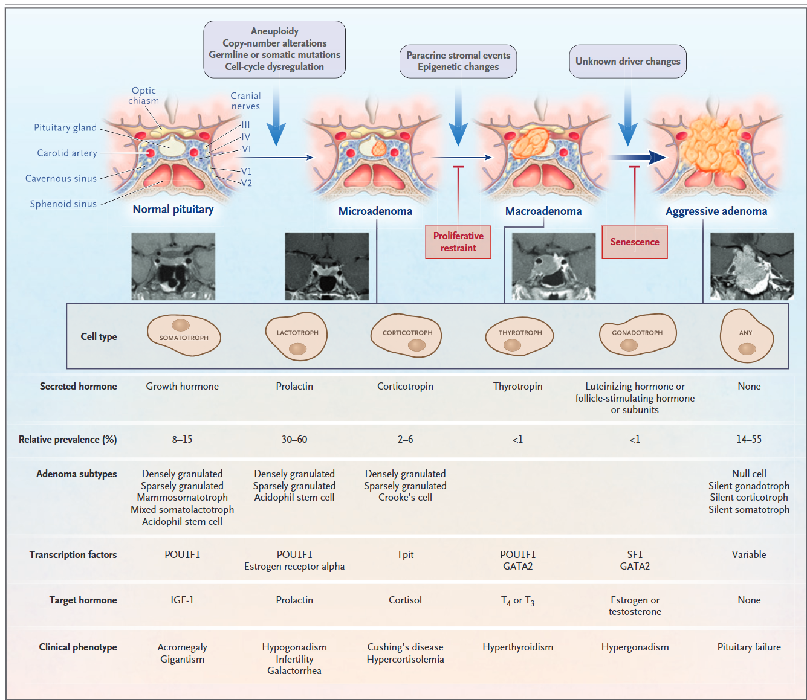
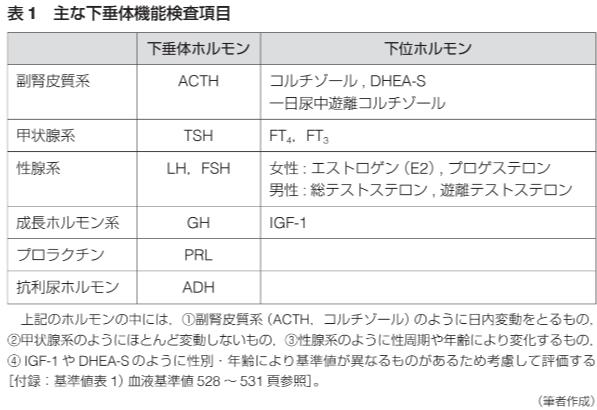
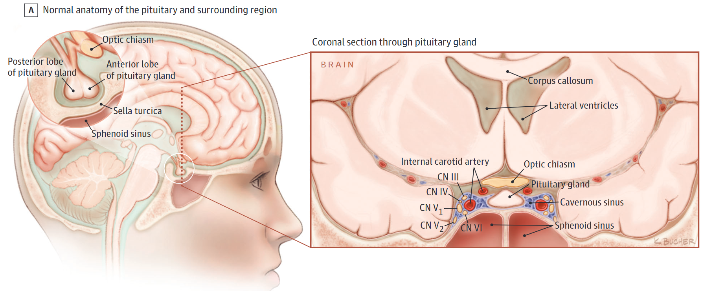
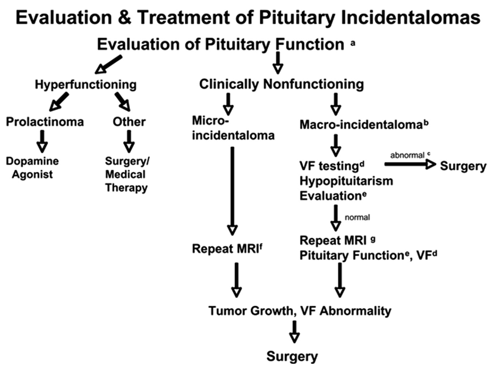
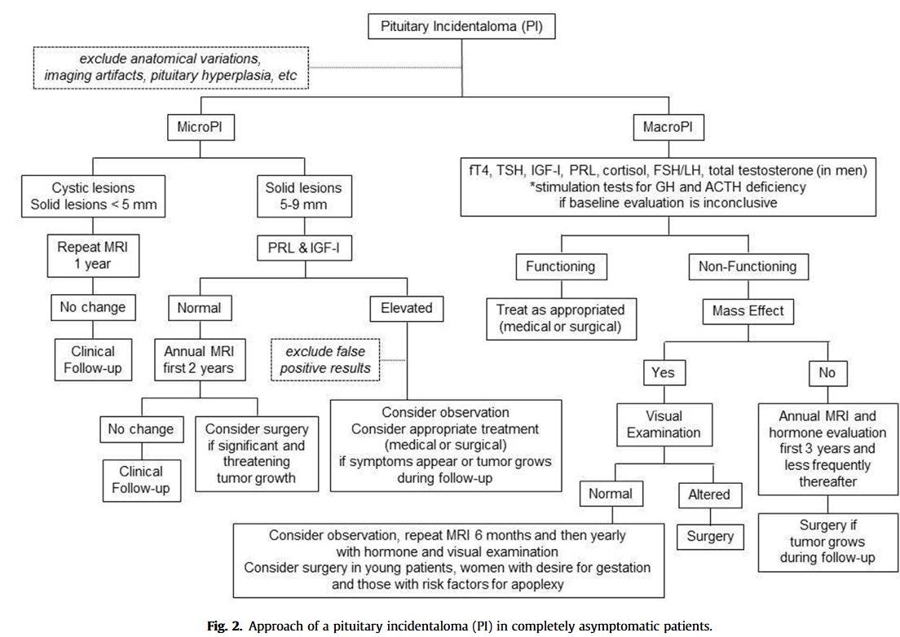

## 症例

- 79歳女性、自宅内転倒で救急搬送
- 頭部CTで下垂体腺腫を指摘される
- 依頼文にて、「偶発的に下垂体腺腫が指摘されておりそちらの精査もお願いします」と

## 下垂体偶発種とは

- 下垂体に偶発的に見つかった結節を”下垂体偶発種”と言う
- 微小の下垂体結節は結構Common
  - 無関係の理由でMRIを撮像したうち、microadenomaは10-38%
  - macroadenomaは0.2%
  - Autopsyだと日本人のうち18%程度の有病率と言われている
    - 日本での1000人の連続するAutopsy患者では178人にIncidentalomaがあり、そのうち34%が2mm以上

[@Teramoto1994-zv]

## 下垂体偶発種の疫学

| 原疾患 | 頻度 |
|---|---|
| 下垂体腺腫 | 80-90% |
| 頭蓋咽頭腫 | 3% |
| Rathke嚢胞 | 2% |
| 髄膜腫 | 1% |
| 下垂体炎 | 1%未満 |
| 脳動脈瘤 | 1-2% |

[@DynaMed_SellarMass_2026]

- 今回は最多の下垂体腺腫について話していきます

## 下垂体腺腫の分類

- 大きさで分けるのが最も重要
  - 10mm以上: macroadenoma
  - 10mm未満: microadenoma

## 下垂体腺腫の由来

- 実臨床的にはホルモン産生で分けるのが良い
  - Prolactinoma
  - GH産生腫瘍
  - ACTH産生腫瘍
  - TSH産生腫瘍
  - 非機能性腫瘍(non-functioning pituitary adenoma: NFPA)

## 下垂体腺腫 at glance

<!-- TODO: 手動調整: 元Typst画像高さ 90% -->

[@Melmed2020-dy]

## 下垂体偶発種を語る上で重要な視点

- 上記の通り、Incidentalomaは実は多い
- その為、悉皆調査は基本的には無理
- かつ、分類や下垂体腺腫の種類は本来はOpeしないと分からない
- ⇒ 下垂体腺腫の疫学はその臨床現場  (見つかった理由やOpeをしたかなど)に依存する

## 疫学

- Incidentalomaと通常のAdenomaで疫学が変わる
  - 通常のPituitary adenomaの場合
    - 53%がProlactinoma
    - 30%が非機能性腺腫
    - 12%がGH産生腫瘍(somatotropinoma)
    - 4%がACTH産生腫瘍(Corticotropinoma)
    - 1%がTSH産生腫瘍(thyrotropinoma)

  - Incidentalomaの場合(約90%がAdenoma)
    - 約50%が非機能性腺腫
    - 10%がGH産生腫瘍
    - 15%がGonadothropinoma
- Incidentalomaだと、非機能性腺腫が多い事は注目に値する

[@Freda2011-fv]

## Pituitary incidentalomaを見たら・・・・・・

- 3つの視点で考える
  1. 腫瘍によるホルモン過剰産生
  2. 腫瘍による圧排効果による下垂体機能不全
  3. 腫瘍による視交叉の圧排の有無
- 内科医としてはMEN 1も見逃さない

## ホルモン検査の原則

<!-- TODO: 手動調整: 元Typst画像高さ 40% -->
[@Takeuchi_ToranomonEndocrineClinicalPractice_2023]

- ホルモン検査は日内変動が大きい
- Positive/Negative feedbackにより代償されやすい
- ホルモン欠乏の検査: 最も分泌が多い時間帯の測定で判断
  - ホルモン分泌を促進する介入した後の検査もあるがRiskが高い
- ホルモン過剰の検査: ホルモンを抑制する介入をした上で測定

# ホルモン過剰産生

## 基本的な考え方

- Microincidetanlomaでは稀とされる
- Macroadenoma全体では以下の通り
  - Prolactinomaが53%
  - GH産生が12%
  - ACTH産生が4%
  - TSH産生が1%
- 頻度と治療可能性の観点で考える
  - PRLは内科的に治療可能
  - ACTH, GHは_予後不良で手術の治療適応_
- PRL, ACTH, GHは検索すべし！！

[@Tritos2023-tk]

## ホルモン過剰産生の各論

- [高PRL血症: ルーチンで検査](#hyperprl)

- [Cushing syndrome: ルーチンで検査(?)](#cushing)

- [先端巨大症(GH excess): ルーチンで検査](#hypergh)

- [中枢性甲状腺機能亢進症: ルーチンでは行わない](#hypertsh)

## 高PRL血症 {#hyperprl}

- PRL > 250 mcg/Lは特異度100％でProlactinoma
- 一方で中途半端な高値は色々な理由がある
  - 妊娠、薬剤(D2 blocker)や甲状腺機能を確認する
- 更に下垂体腺腫自身の茎部圧迫によるもの(Stalk effect)のもありうる
  - Stalk effectだけではPRL < 150 mcg/L程度である事が多い

[@Tritos2023-tk]

## Cushing syndrome {#cushing}

- 2011年のガイドラインだと実はルーチン検査ではない  (臨床的に疑った時のみ) [@Freda2011-fv]
- 個人的には、Macroadenomaならばルーチンで行うべきと考える
- 3種類の方法があるが、一番簡単なのはLDST
  - LDST(1mg Dex負荷試験)：感度98.6%, 特異度90.6%
  - 24時間蓄尿のFree cortisol:感度94%, 特異度93%
  - 夜間唾液中cortisol：感度95.8%, 特異度93.4%

## 先端巨大症(GH excess) {#hypergh}

- GHの値だけでは診断出来ない
- IGF-1：年齢調整されたCutoffで感度、特異度はほぼ100%  (12-18歳、妊婦以外)
- OGTT検査でGH $\geq$0.4 mcg/L(抑制されない)は  感度85-90%, 特異度は95%を超える

## 中枢性甲状腺機能亢進症 {#hypertsh}

- TSH過剰症の検査はルーチンでは行わない
  - ただし、ホルモン欠乏とか考えると結局検査している
- 血清FT4高値で、TSHが不適切に正常〜高値の感度は約100%

## いつ、どのように検査をする？

- ホルモン過剰について、Macroadenomaにおいても明らかなScreening方法は決まっていない
  - 2011年のガイドラインでは、PRLとGHはルーチンで測定を推奨。 ACTHは臨床所見をみての検査を推奨している。
    - Prolactinomaは経口での治療が可能なため
    - GH過剰産生は予後に強く影響する上に初期は無症候である事が多いため
    - ACTHも同じ理由でExpertによっては検査をするとの事
  - Review論文だと下垂体のホルモン過剰産生はProlactin, IGF-1の測定で  除外すべきとの記載あり
  - UptodateだとPRL、IGF-1、LH、FSH、ACTH、24時間尿中Cortisol推奨

[@Boguszewski2019-ne; @Snyder_PituitaryIncidentalomas_2026]

# 下垂体機能不全

## 下垂体機能不全総論

- Micro incidentalomaでの下垂体機能不全は7-66%でMacroincidentalomaでは19-46%とされる
  - Hypogonadismは〜30%
  - 副腎不全は〜18%
  - 甲状腺機能低下は〜28%
  - GH欠乏は〜8%
- 腫瘍圧迫による下垂体機能低下の一般論として
  - GH, FSH, LH↓ → TSH↓ → ACTH↓
    - 副腎不全がある時は汎下垂体機能低下症を疑う
- 2011年のガイドラインだとClass Iでホルモン欠乏の検査の推奨

[@Takeuchi_ToranomonEndocrineClinicalPractice_2023; @Freda2011-fv]

## 下垂体機能不全総論

- 生命予後を悪化させるホルモンを重点的にみる
  - 副腎不全
  - 甲状腺機能低下症
- 一方で、HypogonadismやGH欠乏は成人だと治療適応も難しい
=> 見るべきは、*副腎不全、甲状腺機能低下症*
- 中枢性副腎不全→TSH欠乏→中枢性Hypogonadismの検査
  - GH欠乏は下垂体腺腫の治療が終わり他のホルモン補充が終わったあとまでは検査しない事を推奨。
[@Higham2016-hs]

## 下垂体機能不全各論

- [中枢性副腎不全: ルーチンで検査](#adrenal_insuf)

- [中枢性甲状腺機能低下: ルーチンで検査](#hypothyroid)

- [GH欠乏: ルーチンで検査](#GH_def)

- [Hypogonadism: ルーチンで検査](#hypogonado)

- [Prolactin欠乏: ルーチンでは行わない](#prolactin_def)

- [中枢性尿崩症: ルーチンで検査](#central_di)

## 中枢性副腎不全 {#adrenal_insuf}

- Insulin tolerance test (ITT) が最も良い検査だが使いにくい
- 早朝Cortisolが第一
  - まずは、8-9時の血清Cortisolを測定する
    - cortisol < 80 nmol/L (3 mcg/dL)は副腎不全
    - cortisol < TODO nmol/L (18 mcg/dL)は副腎不全
- Cortisolが3mcg/dL-15mcg/dLの時 → ACTH負荷試験を行う
    - 250mcgのACTH投与後30/60分後のCortisolが <18mcgで副腎不全
    - 二次性副腎不全の場合通常ACTHは< 12 pmol/L (52 pg/mL)となる.

## 中枢性甲状腺機能低下 {#hypothyroid}

- 低T4にも関わらず不適切に低値〜正常範囲のTSHのときに疑う
- 特に深く考えないでも良い
- もしも、NTIと区別が難しいときは時間をあけて再検査が現実的

## GH欠乏 {#GH_def}

- GH欠乏は事前確率が高い状態でのみ疑う(高い事前確率とは以下の基準のうち1つ以上を満たす)
  - 若い男性で正常な下垂体だが低身長でGH欠乏の診断が幼少期にされている
  - 下垂体の障害が疑われる病歴(下垂体手術、放射線治療、下垂体の画像変化、頭部外傷、脳卒中)
- ITTがGH欠乏のGold standardだが使いにくい
  - その他としては、Glucagon刺激試験、Macimorelin test、arginine plus GH-releasing hormone (GHRH) test
  - Dynamedでは3つ以上の下垂体ホルモン欠乏があり、年齢調整された血清IGF-1が低い時はGH低値と診断して良い
  - 2011年のガイドラインでは、IGF-1低下のみでGH欠乏の診断は出来ない

[@DynaMed_SellarMass_2026; @Freda2011-fv]

## Hypogonadism総論 {#hypogonado}

- 男性、女性(閉経前/後)で方法が異なる。
- ゴナドトロピン放出ホルモン（GnRH）刺激検査は、基礎ホルモン検査の結果がはっきりしない場合に用いられてきたが、国際的な内分泌学会では*推奨されていない*

## Hypogonadism 各論

- 男性
  - 早朝(可能なら7-11時前で空腹)のTotal testosteroneを最初に行う
    - Total testosteroneが300ng/dL未満で、FSH, LHが2回とも低いか正常であれば、ゴナドトロピン欠乏症と診断可能
    - Total testosterone < 231 ng/dLはTestosterone欠乏
    - Total testosterone > 231 ng/dLかつ< 346 ng/dLでは追加の検査(free or bioavailable testosterone)を考慮する
    - Total testosterone level $\geq$ 346 ng/dLはTestosterone正常と考えて良い
- 閉経前女性: 無月経あるいは月経不順があり、E2低値および低値〜正常値のFSHとLHだと診断可能
- 閉経後女性: FSH, LHが高値でないだけでほぼ診断可能
  - 甲状腺異常やPRL高値について事前に除外する

## Prolactin欠乏 {#prolactin_def}

- 血清PRLが< 100 pmol/Lの時に欠乏を示唆する

## 中枢性尿崩症 {#central_di}

- 虎ノ門の教科書では中枢性尿崩症は術後でない限り下垂体腺腫では起きないとの事
- 診断のGold standardは存在しない
- 水制限試験がしばしば初期の検査で行われる
  - 多尿 (> 50 mL/kg in 24 hours or 3.5 L/day in a 70kg) の時に血清と尿中浸透圧を同時測定する
  - 尿糖なしの時に、血清浸透圧 >295 mOsm/kg、尿浸透圧が600 mOsm/kgの時(尿と血清浸透圧の比が2以上)が正常
  - 尿崩症は血清浸透圧 >295 mOsm/kgの時に尿浸透圧が600 mOsm/kg未満の時(尿と血清浸透圧の比が2未満)で診断される
- 水分制限試験の亜種として、3%食塩水刺激試験がある
[@Takeuchi_ToranomonEndocrineClinicalPractice_2023]

## いつ、どのように検査をする？

- ホルモン低下について、複数のScreening方法があり確定的なものはない。
  - 2011年のガイドラインでは意見を2つ載せている
    - Minimal: FT4, 朝のCortisolとTestosterone
    - 追加: FT4, 朝のCortisolとTestosteroneに加えてTSH、LH, FSH, IGF-1
    - ACTHとGH欠乏がBaselineの検査で確定できない時に負荷試験を考慮する。
  - Microadenomaだとより分かっていない。UptodateだとPRLだけ推奨だが2011年のEndocrine Society Guidelineとは異なる。

[@Freda2011-fv; @Snyder_PituitaryIncidentalomas_2026]

## 視野障害について

[@Molitch2017-zw]

- 下垂体の真上に視交叉があり押されると*両耳側半盲*が起こる
  - MRIで視交叉と腺腫が接している場合は自覚症状がなくても、 正式な視野障害の評価を行う
  - 海綿静脈洞内に伸展するとIII, IV, V1などが障害される事もある

[@Westall2023-rb]

# 治療法

## 治療法総論

- Cushing syndrome、末端肥大症は外科治療が必要
- 非機能性腫瘍で視野障害がある場合は外科治療が必要
- 2011年のガイドラインでは、incidentalomaでも  ホルモン分泌障害があるときは手術を考慮するとの記載あり
- Ope適応などは専門医にコンサルトが良い

## Hypopituitarismの治療

- 中枢性副腎不全: Hydrocortisoneを15-20mg/day
  - fludrocortisoneは不要
  - Sick dayの説明を忘れない
- 甲状腺機能低下症: Levothyroxinを1.6 mcg/kg/day
  - 目標としてTSHは使えない
    - FT4が正常範囲の上半分に入るようにする
- 副腎不全がある場合は先に副腎不全を治療する
- GHや性ホルモンの補充は適応が難しいので専門医にコンサルト

[@Fleseriu2016-pm]

## Follow up

- Mass effect: MRIでfollow up
  - Macro/Microadenoma: 6/12ヶ月後
- ホルモン分泌: hypopituitarismの有無を検査
  - Macro/Microadenoma: 半年後→1年毎に行う/ルーチンは不要

[@Freda2011-fv]

## 下垂体偶発種at glance

[@Boguszewski2019-ne]

## Reference

::: {#refs}
:::