```{=html}
<style>
:root {
  --rickettsia-navy: #183a58;
  --rickettsia-blue: #2f6f9f;
  --rickettsia-teal: #3e9a9a;
  --rickettsia-red: #b33a3a;
  --rickettsia-cream: #f7f4ed;
}

.reveal {
  font-family: "BIZ UDPGothic", "Yu Gothic", "Hiragino Kaku Gothic ProN", sans-serif;
  color: #18222b;
}

.reveal h1,
.reveal h2,
.reveal h3 {
  color: var(--rickettsia-navy);
  letter-spacing: 0.01em;
}

.reveal h2 {
  border-bottom: 0.12em solid var(--rickettsia-teal);
  padding-bottom: 0.16em;
}

.reveal strong {
  color: var(--rickettsia-red);
}

.reveal .callout {
  font-size: 0.88em;
}

.reveal table {
  font-size: 0.78em;
}

.reveal table th {
  background: var(--rickettsia-navy);
  color: white;
}

.reveal table tr:nth-child(even) {
  background: #eef5f7;
}

.reveal img {
  object-fit: contain;
}

.reveal .small {
  font-size: 0.68em;
}

.reveal .source-note {
  color: #56616a;
  font-size: 0.52em;
  margin-top: 0.35em;
}

.reveal .key-message {
  background: var(--rickettsia-cream);
  border-left: 0.3em solid var(--rickettsia-red);
  padding: 0.6em 0.8em;
}
</style>
```

## Take-home messages

::: {.key-message}
1. **発熱・皮疹・刺し口（痂皮）**を見たら、曝露地域・季節・野外活動を確認する。
2. 刺し口は本人が気づいていないことが多い。**全身を系統的に診察**する。
3. 疑えば検体を確保し、**検査結果を待たず治療を開始**する。
:::

::: {.notes}
この資料は元のOneNoteをスライド向けに再構成した教育用ドラフト。投与量・期間は患者背景、重症度、最新の国内指針、施設基準に照らして確認する。
:::

## 疑ったときの流れ

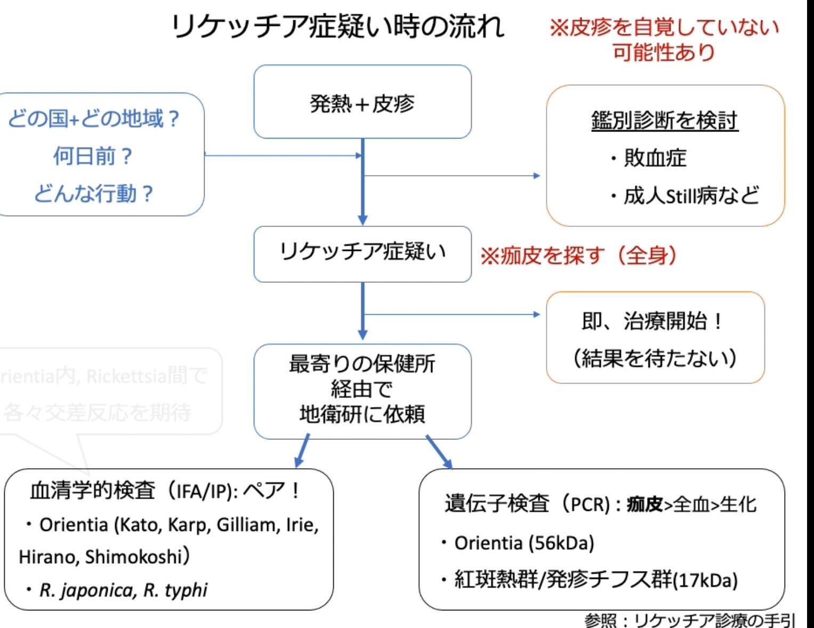{fig-alt="リケッチア症を疑った場合の診療フロー" height="690"}

::: {.notes}
発熱と皮疹だけでなく、皮疹を自覚していない患者がいる点を強調する。刺し口検索、検体採取、治療開始を並行して進める。
:::

## リケッチア症の位置づけ

::: columns
::: {.column width="45%"}
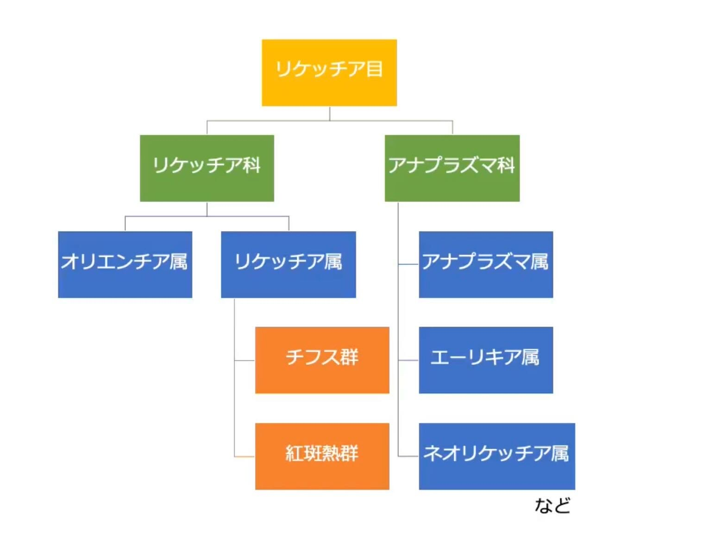{fig-alt="リケッチア目の分類" height="565"}
:::

::: {.column width="55%"}
### 日本で重要な2疾患

- **ツツガムシ病**  
  *Orientia tsutsugamushi*
- **日本紅斑熱**  
  *Rickettsia japonica*

いずれも節足動物媒介性で、急性発熱・皮疹・刺し口を手掛かりに診断する。
:::
:::

## まず比較する

|  | 日本紅斑熱 | ツツガムシ病 |
|---|---|---|
| 病原体 | *R. japonica* | *O. tsutsugamushi* |
| ベクター | マダニ | ツツガムシ幼虫 |
| 潜伏期間の目安 | 2–10日 | 5–14日 |
| 季節性 | 主に春〜秋 | 地域により春・秋〜初冬 |
| 皮疹の傾向 | 四肢、手掌・足底、紫斑化 | 体幹優位の斑状〜斑丘疹 |
| 刺し口 | 比較的小さく周囲発赤 | 黒色痂皮が目立つことがある |
| リンパ節 | 目立たないことが多い | 腫大することがある |

::: {.source-note}
傾向には個人差があり、単一所見だけでは区別できない。
:::

## 疫学：届出数の推移

::: columns
::: {.column width="50%"}
### 日本紅斑熱

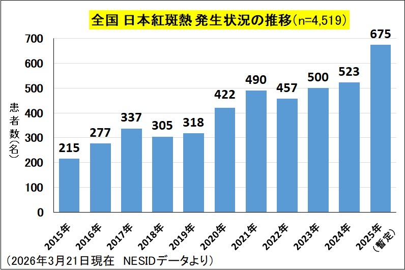{fig-alt="日本紅斑熱の全国発生状況 2015年から2025年" height="500"}
:::

::: {.column width="50%"}
### ツツガムシ病

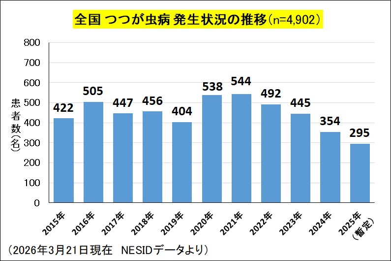{fig-alt="ツツガムシ病の全国発生状況 2015年から2025年" height="500"}
:::
:::

::: {.source-note}
画像は元ノートに埋め込まれた集計図（2026年3月21日現在の暫定データと記載）。発表前に最新値を確認する。
:::

## 地域と季節を聞く

::: columns
::: {.column width="54%"}
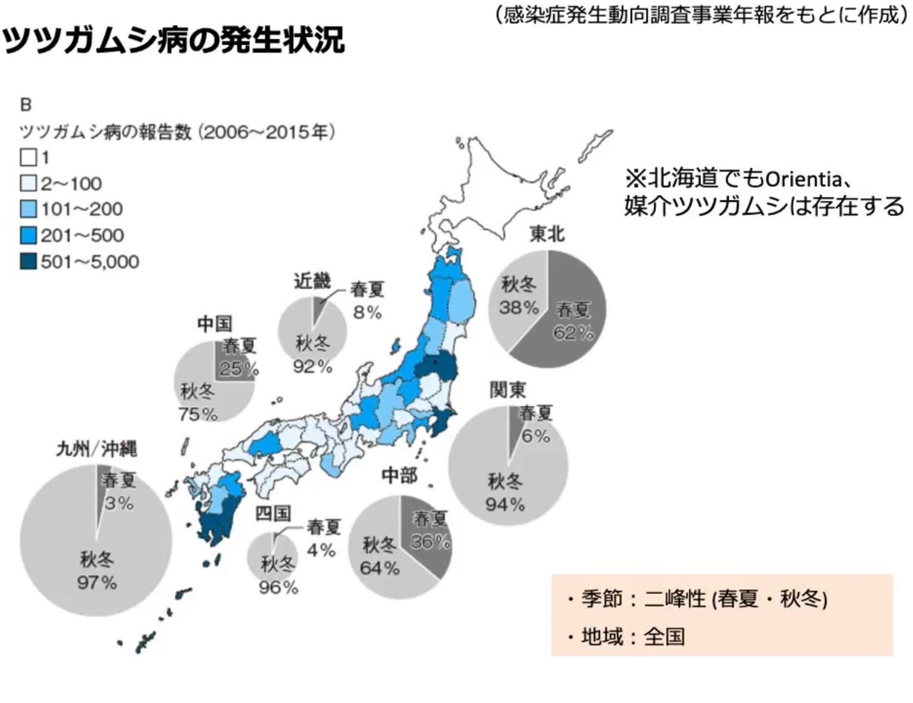{fig-alt="ツツガムシ病の地域別発生状況と季節性" height="610"}
:::

::: {.column width="46%"}
- 北海道以外からの報告が多い
- ツツガムシ病は全国でみられ、地域ごとに好発時期が異なる
- 春〜初夏：東北・北陸などで注意
- 秋〜初冬：関東〜九州を中心に注意
- 日本紅斑熱は主に春〜秋

::: {.callout-tip title="病歴で聞くこと"}
居住地だけでなく、**旅行先、農作業、草むら、山林、庭仕事**まで確認する。
:::
:::
:::

## 臨床像：三徴を軸に考える

::: columns
::: {.column width="42%"}
### 三徴

1. 発熱
2. 皮疹
3. 刺し口（痂皮）

### 共通する症状・所見

- 頭痛、倦怠感、筋痛
- 血小板減少
- 肝逸脱酵素上昇
- 低Na血症、炎症反応上昇
:::

::: {.column width="58%"}
::: {.callout-warning title="見逃しやすい理由"}
- 症状は非特異的
- 虫に刺された自覚がないことが多い
- 皮疹・刺し口を本人が認識していないことがある
- 刺し口が下着に隠れる柔らかい部位にあることが多い
:::

**診察者が探しにいく病気**と捉える。
:::
:::

## 皮疹：典型像だけを期待しない

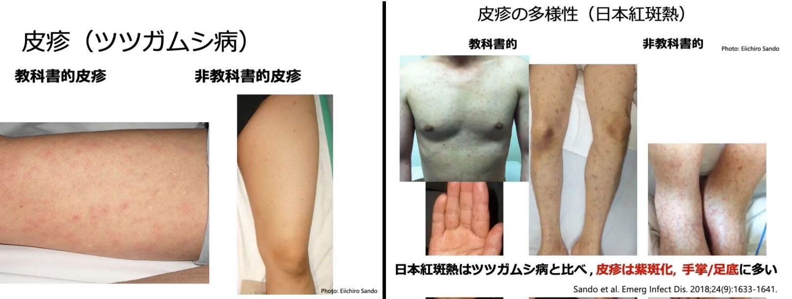{fig-alt="ツツガムシ病と日本紅斑熱の多様な皮疹" height="630"}

::: {.source-note}
元画像の出典表記：Sando et al. *Emerg Infect Dis.* 2018;24(9):1633–1641。臨床写真を含む。
:::

## 刺し口：全身を診る

::: columns
::: {.column width="58%"}
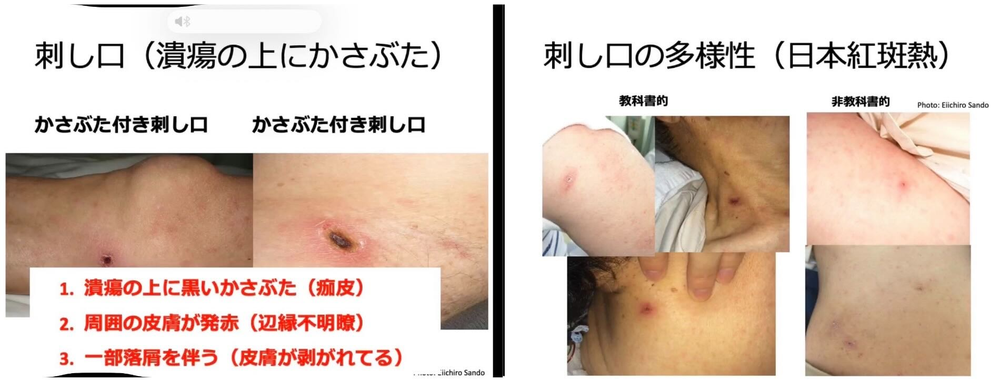{fig-alt="刺し口の所見と多様性" height="540"}
:::

::: {.column width="42%"}
### 観察のポイント

- 潰瘍上の黒色痂皮
- 周囲の発赤
- 落屑を伴うことがある
- 腋窩、鼠径、頸部、乳房下、陰部なども確認
- 痛み・痒みが乏しく見逃されることがある
:::
:::

## 検体：治療前に確保、治療は遅らせない

::: columns
::: {.column width="48%"}
### 依頼する検体

- **刺し口**：痂皮、スワブまたは生検（検査室の手順に従う）
- **全血**：PCR用
- **血清**：急性期＋回復期のペア血清

### 一般検査

- 血小板減少
- AST/ALT、LDH上昇
- 低Na血症
- CRP上昇
- 腎機能障害は重症度の手掛かり
:::

::: {.column width="52%"}
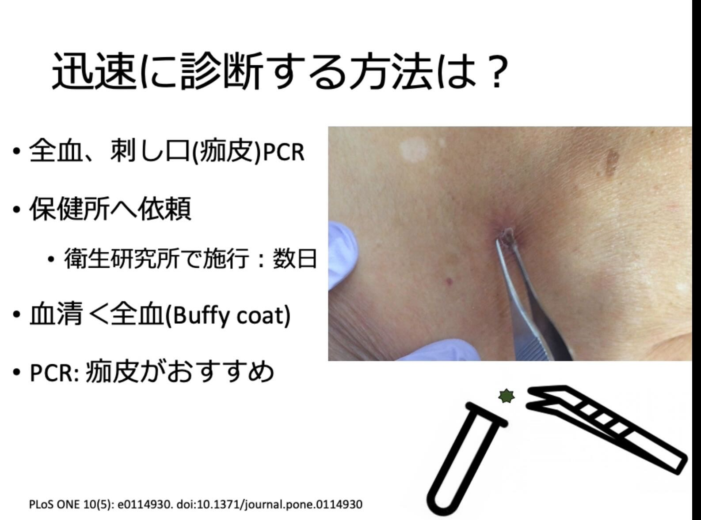{fig-alt="PCR検査用検体の考え方" height="560"}
:::
:::

::: {.source-note}
刺し口由来検体は早期診断に有用。採取方法と提出先は最寄りの保健所・地方衛生研究所へ確認する。
:::

## 血清学的検査の読み方

::: columns
::: {.column width="53%"}
- 急性期単回検体の陰性だけでは除外できない
- 急性期と回復期の**ペア血清**で評価する
- 一般に4倍以上の抗体価上昇が診断の根拠になる
- 血清型間の交差反応に注意する
- 標準的な検査対象外の血清型では感度に限界がある
:::

::: {.column width="47%"}
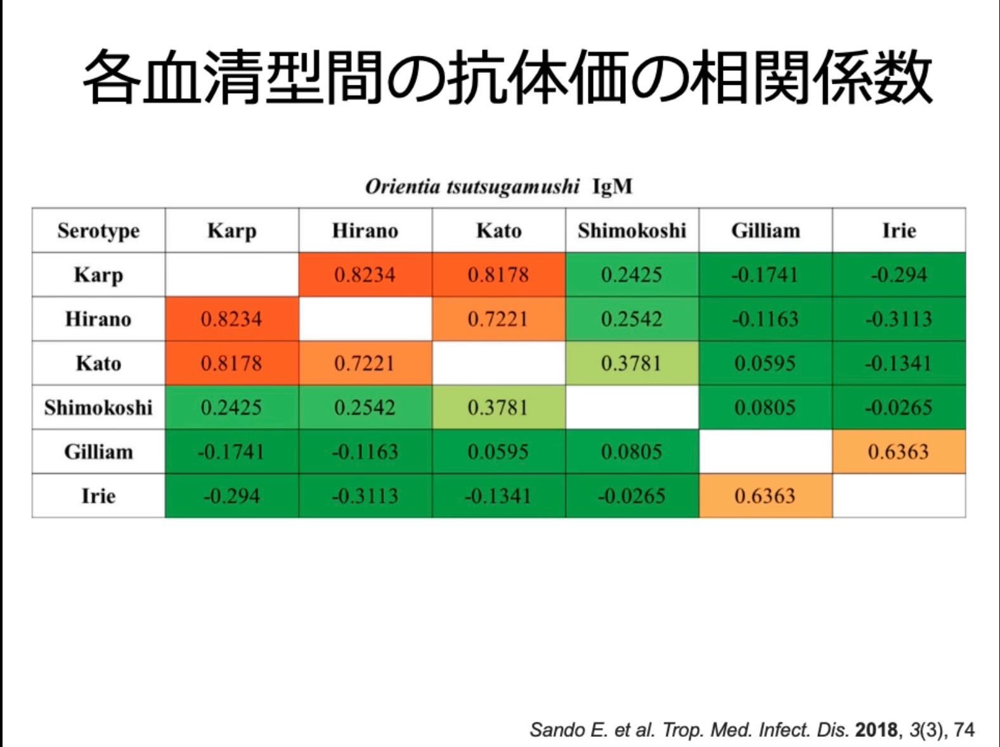{fig-alt="ツツガムシ病の血清型間におけるIgM抗体価の相関" height="560"}
:::
:::

## 治療：疑った時点で開始

::: columns
::: {.column width="54%"}
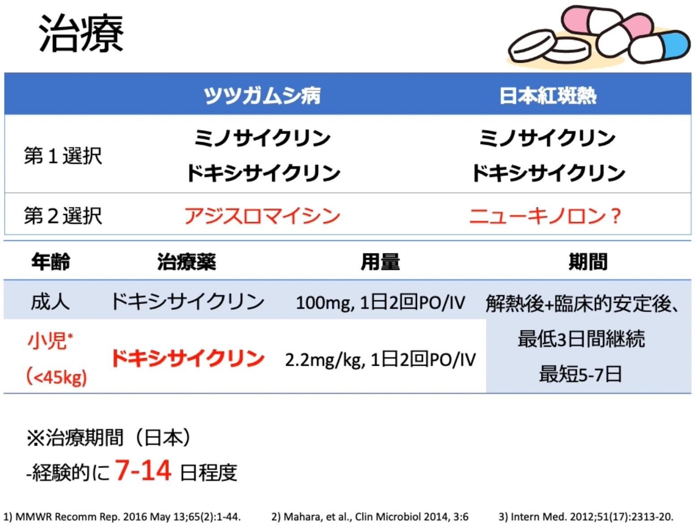{fig-alt="日本紅斑熱とツツガムシ病の治療概略" height="590"}
:::

::: {.column width="46%"}
::: {.callout-important title="原則"}
**検査結果を待って抗菌薬開始を遅らせない。**
:::

- ドキシサイクリンが中心
- 成人の代表例：100 mg、1日2回、経口または静注
- 解熱後かつ臨床的に安定してから少なくとも3日間継続し、総治療期間は患者背景・重症度・国内指針で調整
- 妊娠、小児、重症例、薬剤アレルギーでは専門家に相談

::: {.source-note}
元ノート本文にあった「IM」は、埋め込み画像および公的資料に合わせて「IV」に修正した。
:::
:::
:::

## 両疾患の違い：まとめ

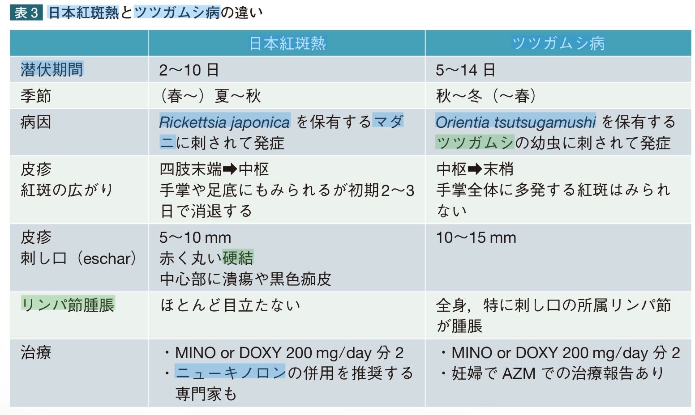{fig-alt="日本紅斑熱とツツガムシ病の比較表" height="665"}

::: {.notes}
この比較は典型像の傾向。重なりが大きいため、疫学・身体所見・PCR・ペア血清を組み合わせて判断する。
:::

## 検査所見からの比較

::: columns
::: {.column width="50%"}
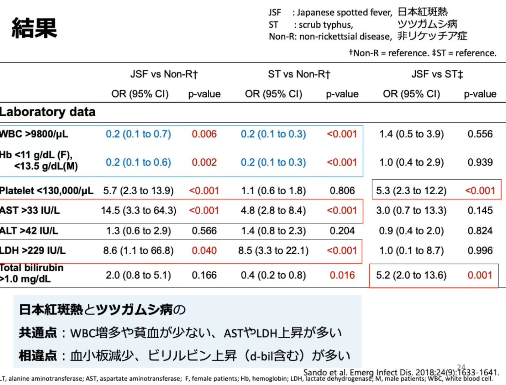{fig-alt="日本紅斑熱とツツガムシ病の血液検査比較1" height="575"}
:::

::: {.column width="50%"}
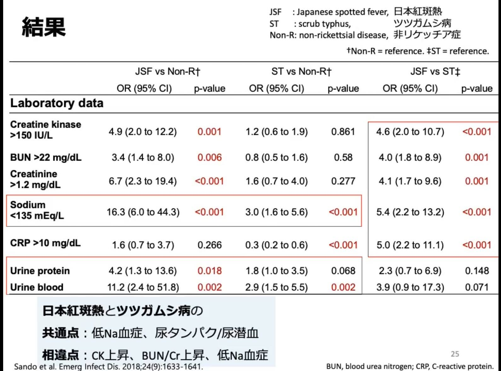{fig-alt="日本紅斑熱とツツガムシ病の血液検査比較2" height="575"}
:::
:::

::: {.source-note}
元画像の出典表記：Sando et al. *Emerg Infect Dis.* 2018;24(9):1633–1641。個々の所見は診断を確定するものではない。
:::

## 予防

::: columns
::: {.column width="56%"}
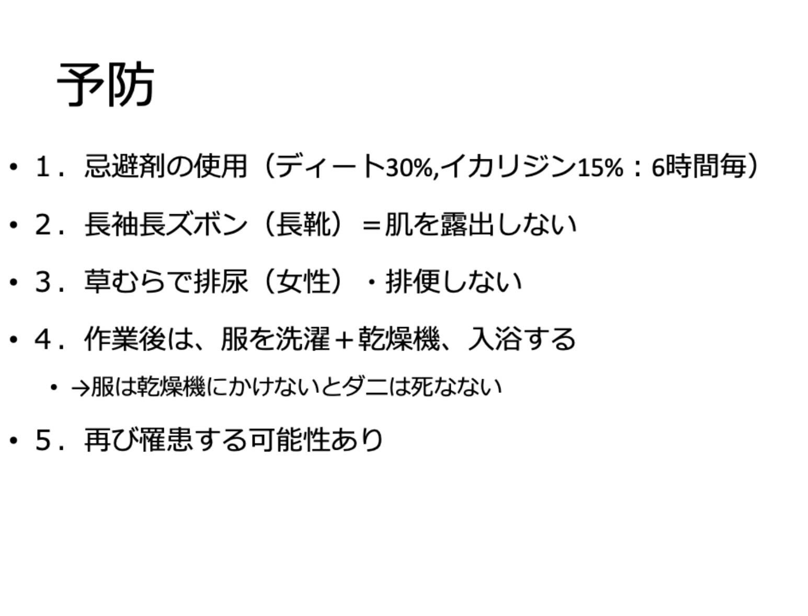{fig-alt="リケッチア症の予防策" height="610"}
:::

::: {.column width="44%"}
- 肌の露出を減らす
- 忌避剤を製品表示どおり使用する
- 草むらでの長時間の滞在や直接接触を避ける
- 帰宅後は衣類を処理し、入浴して全身を確認する
- 罹患後も再感染の可能性がある
:::
:::

## 参考資料

- [CDC: Clinical Overview of Scrub Typhus](https://www.cdc.gov/typhus/hcp/clinical-overview/clinical-overview-of-scrub-typhus.html)
- [CDC Yellow Book: Rickettsial Diseases](https://www.cdc.gov/yellow-book/hcp/travel-associated-infections-diseases/rickettsial-diseases.html)
- Sando E, Suzuki M, Katoh S, et al. Distinguishing Japanese spotted fever and scrub typhus, central Japan, 2004–2015. *Emerg Infect Dis.* 2018;24(9):1633–1641. [doi:10.3201/eid2409.171436](https://doi.org/10.3201/eid2409.171436)
- 元ノート記載：[国立感染症研究所／JIHS 日本紅斑熱資料](https://id-info.jihs.go.jp/niid/ja/jsf-m/jsf-iasrtpc/9809-486t.html)
- 元ノート記載：[国立感染症研究所／JIHS ツツガムシ病資料](https://id-info.jihs.go.jp/niid/ja/tsutsugamushi-m/tsutsugamushi-iasrtpc/11415-510t.html)

::: {.callout-note title="編集メモ"}
OneNoteから本文201項目・画像27点を抽出し、表記を整え、スライド単位に再構成した。医学的内容は発表・診療で使う前に、最新の国内指針と施設の検査・治療手順で最終確認する。
:::
