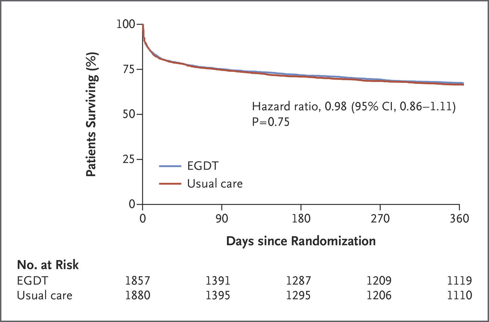
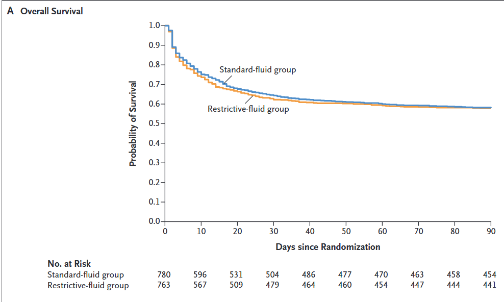
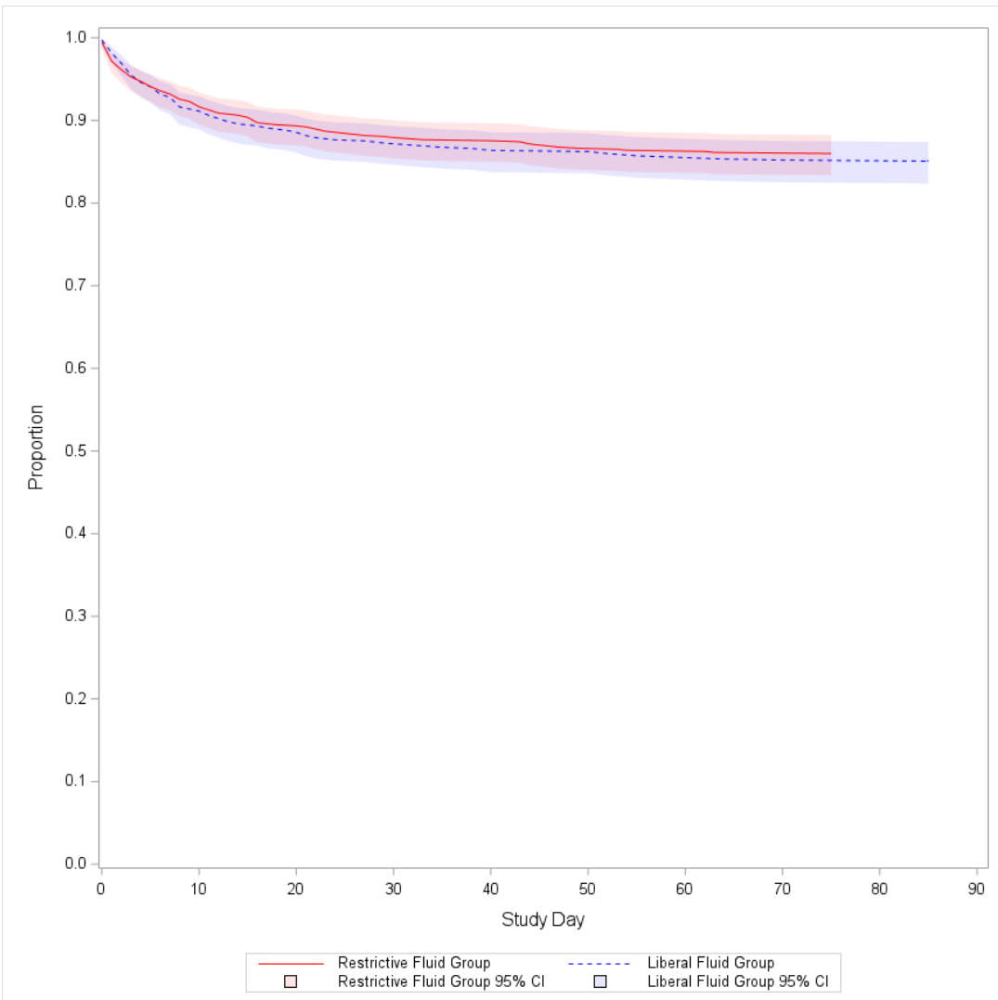
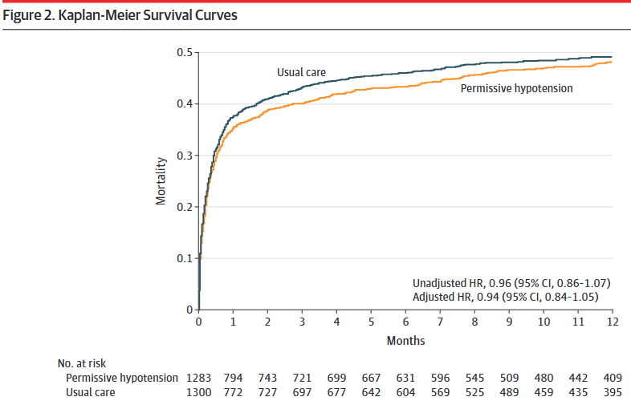
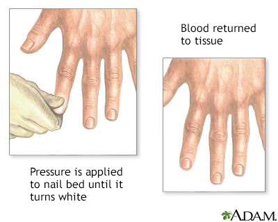
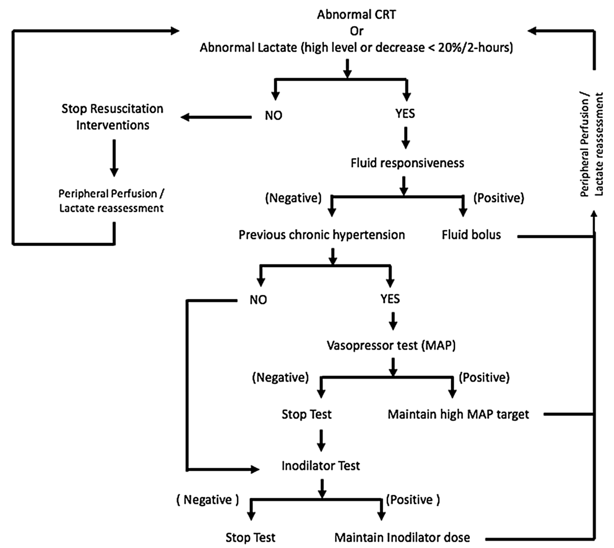
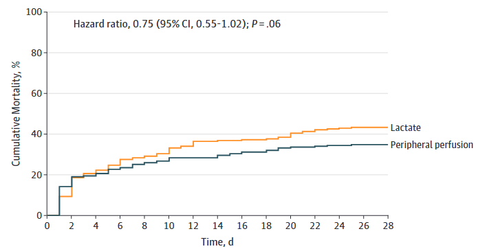

## 9月になりましたね

9月と言えば……

- 秋だ！
- 月見だ！
- 敗血症だ！！[^world-sepsis-day]

<!-- TODO: 元スライドの3分割レイアウトを必要に応じて再現する。 -->

[^world-sepsis-day]: 9月13日は世界敗血症デー。

## という事で

今日は敗血症における輸液療法について考えてみたい。

## EGDTについて

- EGDTは複数の介入（バンドル）で構成される。
- 主な介入の一つは、**大量輸液による早期の組織灌流改善**である。
- 組織灌流は平均血圧（MAP）で規定されていた。
- EGDTにより死亡率が **16%** 改善した（46.5% vs. 30.5%）[@Rivers2001-hh]。

## EGDT時代の終焉

{fig-alt="EGDTのメタ解析" height="45%"}

- 通常治療とEGDTを比較した3つのRCTでは、死亡率に差を認めなかった[@The_PRISM_Investigators2017-kw]。
- さらに、**輸液過剰の害**が指摘されるようになった。

## 輸液過剰の害

- 大量輸液（初日に5 L/day以上）により、以下が上昇することが示された[@Marik2017-km]。
  - 人工呼吸器装着期間
  - ICU入室期間
  - 死亡率

## Post EGDT時代のギモン

- 輸液はどのくらい入れればよいのか。どこまで絞ってもよいのか。
- 輸液量を抑える代わりの治療法は何か。
- 組織灌流を評価する別の方法は何か。

## 輸液はどれくらいいれる？（どれくらい絞っても大丈夫？）

- 現在、初期輸液後にどこまで輸液を行うべきかは明確でない。
- 輸液反応性をみて必要に応じて投与する、という実践になりがちである。
- 初期輸液以降の輸液量を評価したRCTとして、次の2つがある。
  - CLASSIC trial
  - CLOVERS trial

## CLASSIC trial

{fig-alt="CLASSIC trialのKaplan-Meier曲線" height="38%"}

- **P**: 24時間以内に1 L以上の補液下で敗血症性ショックが持続する患者（n = 1,554）
- **I**: 輸液制限群（ICUでのin balance 1,645 mL）[^classic-protocol]
- **C**: 通常治療群（ICUでのin balance 2,368 mL）
- **O**: 90日死亡に差なし（42.3% vs. 42.1%）[@Meyhoff2022-hi]

[^classic-protocol]: プロトコル違反が20%であった点には注意を要する。

## CLOVERS trial

{fig-alt="CLOVERS trialのKaplan-Meier曲線" height="38%"}

- **P**: 1--3 Lの輸液でも改善しない、敗血症による低灌流患者（n = 1,563）
- **I**: 輸液制限療法（24時間平均 1,267 mL、95% CI: 555--2,279 mL）
- **C**: 輸液自由療法（24時間平均 3,400 mL、95% CI: 2,500--4,495 mL）
- **O**: 90日死亡に差なし（14.0% vs. 14.9%）[@National_Heart_Lung_and_Blood_Institute_Prevention_and_Early_Treatment_of_Acute_Lung_Injury_Clinical_Trials_Network2023-cv]

## まとめると……

- 理論上、輸液制限は敗血症性ショック患者の予後を改善しうると考えられた。
- しかし実際には差はなく、輸液制限による明確なメリットは示されなかった。
  - 逆に言えば、明確なデメリットも示されていない。

**敗血症への輸液をどのように考えればいい？**

## 適切な輸液？

- 呼吸状態不良、心不全、腎不全など、輸液を絞りたい状況は多い。
- 輸液はMAPを65 mmHg以上に保ち、末梢循環を改善するための手段である。
- 輸液を絞るとMAP目標の達成は難しくなる。その場合の選択肢:
  - 早期の昇圧薬使用
  - 目標MAPの引き下げ
    - シンプルにMAP目標を下げる
    - MAP以外の指標を用いる

## CENSER trial

<!-- TODO: figures/censor_km.png は0バイトのため、元のKaplan-Meier図を復元してここへ配置する。 -->

- **P**: 敗血症による低血圧患者（n = 310）
- **I**: 早期ノルアドレナリン併用群（n = 155）
- **C**: 通常治療群（n = 155）
- **O**: 6時間後のショックコントロールは早期ノルアドレナリン群で良好（76.1% vs. 48.4%）[@Permpikul2019-om]

## シンプルに目標のMAPの値を下げる

- MAP 65 mmHg以上という目標は、少数のICU患者における乳酸値などから決められており、根拠は限定的である。
- SEPSISPAM trialでは、より高いMAP目標は必ずしも必要ではないとされた（65--70 mmHg vs. 75--80 mmHg）[@Asfar2014-zu]。
- 高齢者（65歳以上）では、MAP目標を下げてノルアドレナリン使用量を減らす方がよいかもしれない。
- 高齢者を対象とした65 trialがある。

## 65 trial

{fig-alt="65 trialのKaplan-Meier曲線" height="38%"}

- **P**: ICU入室後、輸液および昇圧薬使用初期の65歳以上の患者（n = 2,600）
- **I**: 低血圧許容群（MAP 60--65 mmHg、n = 1,291）
- **C**: 通常治療群（MAP >65 mmHg、n = 1,307）
- **O**: 90日死亡に差なし（41.0% vs. 43.8%）[@Lamontagne2020-os]

<!-- TODO: 元スライドの補足（median MAP 66.7 vs. 72.6 mmHg、MAP <65 mmHgの時間 12 vs. 6時間）を発表者ノート等に追加する。 -->

## MAP以外の指標を用いる

- MAPの目的は臓器灌流の改善である。
  - 臓器灌流を直接評価した方がよいかもしれない。
- ショック時の循環評価の代表的な指標:
  - 腎臓: 尿量 0.5 mL/kg/hr
  - 脳: 意識
  - 皮膚: **Capillary Refilling Time（CRT）**
  - 全身臓器: **乳酸値**
- SSCG 2021では乳酸値を用いた蘇生を弱く推奨している[@Evans2021-se]。
- MAPを65 mmHgと固定せず、上記の指標を参考に調整してもよいかもしれない。

## Capillary refilling time

{fig-alt="毛細血管再充満時間の測定方法" height="34%"}

- 中指の末節骨を5秒間圧迫し、離してから血管が再充満するまでの時間。
- 正常範囲: 成人男性は2秒以内、成人女性は3秒、高齢者は4秒。
- 脱水の指標としてLR 6.9と有用性が高い[@McGee1999-hypovolemia]。

## ANDROMEDA-SHOCK trial

{fig-alt="ANDROMEDA-SHOCK trialの治療プロトコル" height="28%"}

{fig-alt="ANDROMEDA-SHOCK trialのKaplan-Meier曲線" height="25%"}

- **P**: 20 mL/kg以上の初期輸液に反応しない敗血症性ショック患者（n = 424）
- **I**: CRT guided therapy（30分ごとにCRTを確認）
- **C**: Lactate guided therapy（2時間ごとに乳酸値を確認）
- **O**: 28日死亡に差なし（CRT群 34.9% vs. Lactate群 43.4%）[@Hernandez2018-ks; @Hernandez2019-rg]

<!-- TODO: 元スライドの横並びレイアウトが必要なら、Quarto columns を追加する。 -->

## 小括

- 輸液を大量に投与することは Harm から Neutral と考えられる。
- 輸液をやや絞るために、次を検討してもよいかもしれない。
  - 高齢者ではMAP目標を60--65 mmHgへ下げる。
  - 早期のノルアドレナリン併用。
  - MAPに加えて、ほかの灌流指標を用いる。

## 注意点！！

- 上記RCTの多くは、1--3 L（およそ30 mL/kg）の晶質液を投与した後の介入を評価している。
  - Optimization and stabilization phaseと呼ばれる[@Zampieri2023-gb]。
- まずは30 mL/kgの初期輸液を行う。
  - 心不全が背景にあっても、ショック時の大量初期輸液を支持する観察研究が多い[@Jones2021-hf-sepsis]。
- 初期輸液をためらわない。

## Take home message

- Sepsisの輸液は、まずはしっかり投与し、その後は絞る。
- 早期のノルアドレナリン併用を考慮する。
- 患者背景やほかの指標を考え、MAPの目標値を変更してもよいかもしれない。
