# PROとは

-   Patient reported outcomesの略 「 [PROとは、臨床家その他の誰の解釈も介さず、患者から直接得られた]{style="color:#333333"} [患者の健康状態に関するあらゆる報告である]{style="color:#333333"} 」
- 議論は複数あるが、HR-QOLを含む事が多い

# PROの代表例


- 循環器では以下のものが有名
    - SIHDで利用するSAQ
    - 心不全で利用するKCCQ
    - AFで利用するAFEQT
    - 循環器の研究におけるPRO

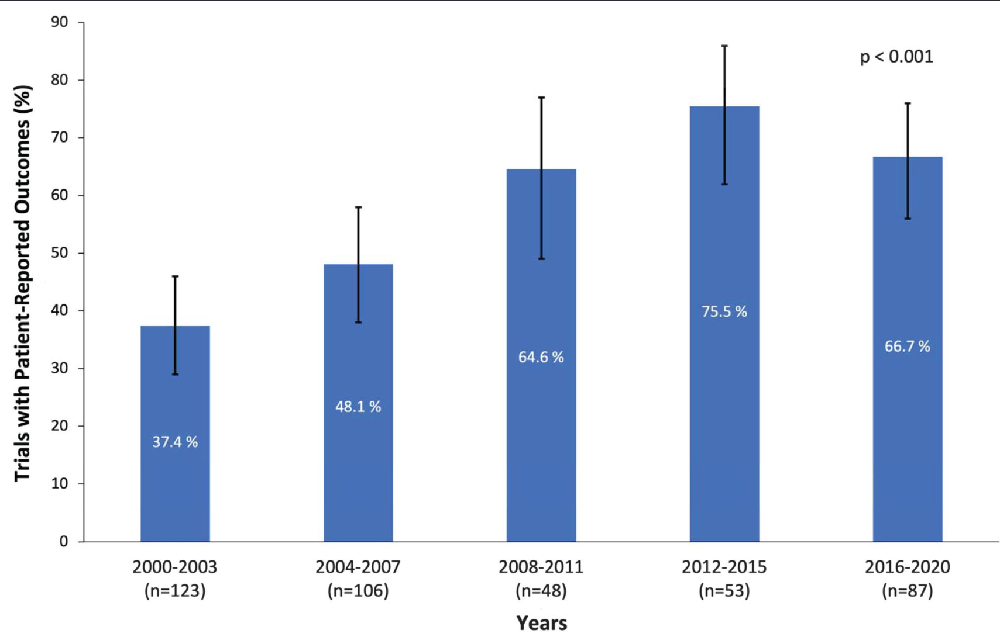{height=70%}

- High impact journalではPROを含む研究が増えている！！ [@Eliya2021-yf]

# PROの特徴 

-   値が高い(or 低い)ほうが良いが40点と80点で正確に2倍かどうかは分からない(通常のNumericじゃない)
-   順序尺度と間隔尺度の間
-   値の下限と上限が決まっている(通常加減は0点、上限は100点が多い)
-   分布が歪んでいる

# このPROはどうやって解析すればいい？

:::: {.columns}

::: {.column width="25%"}

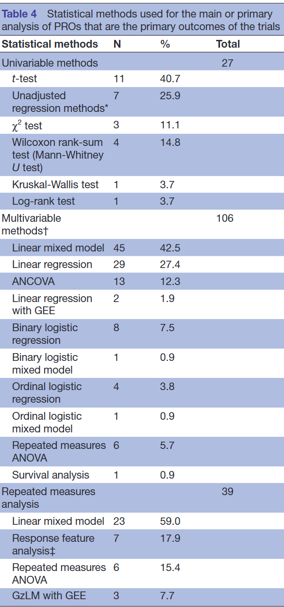

:::

::: {.column width="75%"}

-   統計学の論文では通常の多変量回帰、beta-binomial回帰、Tobit回帰、Ordinal回帰などなど言われている・・・・・・

-   結局どれがいいの？ [@Arostegui2012-cb]

:::

::::


# 先行研究では？

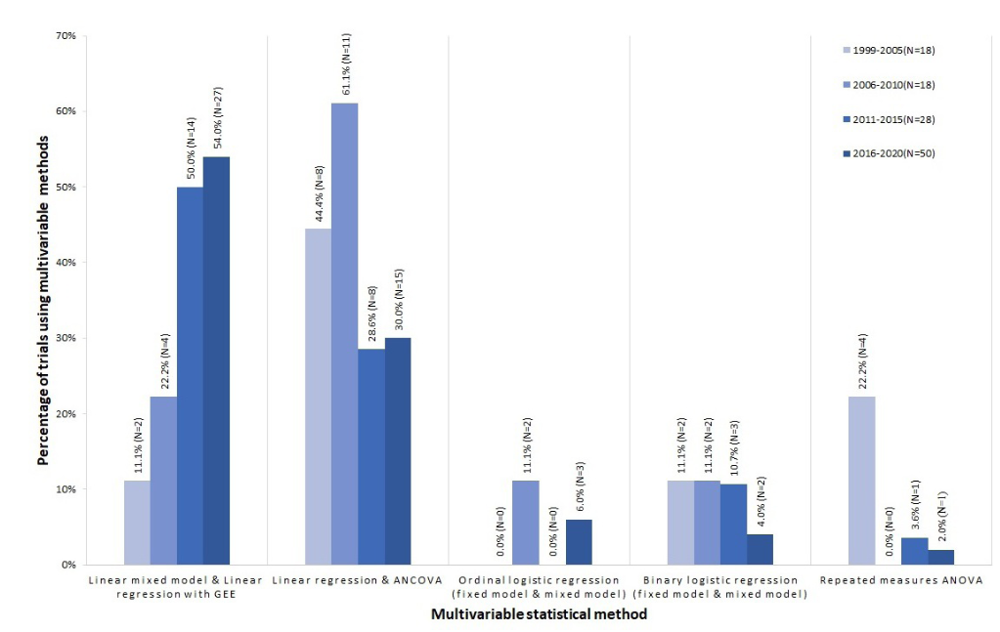{height=60%}

-   **多種多様な手法が使われており標準化されていない** [@Qian2021-rp]


# ガイドラインでは？

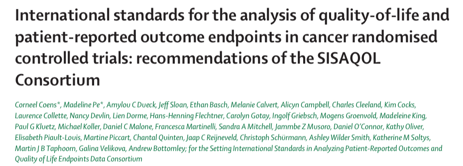

[@Coens2020-lz]

# PROの確定的な解析方法は！！

> Findings from systematic reviews showed that there was
> no consensus on appropriate statistical methods for PRO
> data analysis.

-  *ない！* ・・・・・・

それだけだと虚しいのでもう少し読み込みましょう

# PROの解析において必須の要素

-   明瞭なResearch question
-   適切な解析方法に必要な要素
-   欠損値について

について検討が必要

# Research object

-   [**PRO研究の目的を明確にする**]{style="color:#ff0000"}
    -   治療効果・臨床的効果の証明？
    -   記述統計・探索的研究？
    -   群の差を、同等性・非劣性か優越性かしっかり決める
-   患者個人間あるいは治療群間でのPROの解析を明確にする
    -   *個々の患者に焦点を当てる場合*
        -   “どの患者に”有効か？ = レスポンダーに興味がある
        -   イベント発生までの時間やレスポンダーの割合などがエンドポイント
    -   *群に焦点を当てる場合*
        -   “どちらの(治療)群がより有効か？ = 群間の平均的な差に興味がある
        -   PROの変化の大きさなどがエンドポイント

# PRO解析方法での考慮点

- 必須条件
    - 2群以上で比較可能な方法: RCTなどで治療法による影響をみたい
    - 定量化可能なparametricな手法: 臨床的に意味がある結果を提供できる
- あるとより良い条件
    - 多変量回帰: ベースラインのPROの影響を考慮したい
    - 個人差を考慮した解析(Cluster/Mixed model): 同じ人で時間をあけて何度も取り直す事も多い
- 欠損値をうまく扱える手法: 欠損値がMNARの可能性が高い

# 具体的な推奨される統計手法

:::: {.columns}

::: {.column width="50%"}

- 1回のみfollow-upするdesign: 線形回帰

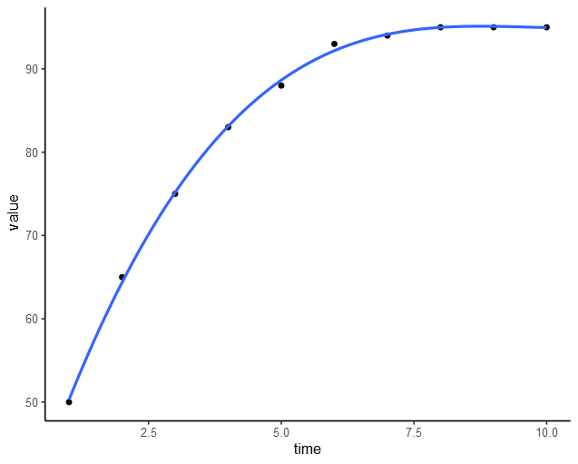{width=45%}


:::

::: {.column width="50%"}

-   2回以上のfollow-upをするdesign: Linear mixed model
    -   時間は離散変数とする
    -   Trajectoryの場合は時間X治療の相互作用項を入れる

- Time-to-event解析: Cox回帰

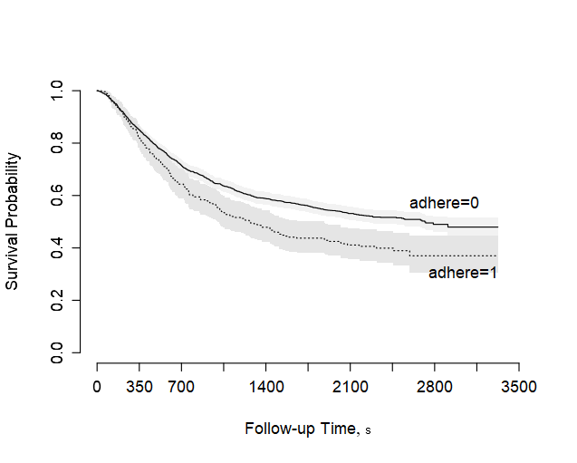{width=60%}

:::

::::


[**これらの解析ではMICを考慮する事が強く推奨！**]{style="color:#ff0000"}

[@Lapin2020-gz; @Calvert2013-sn]

# 線形回帰でいいの？

7種類以下のカテゴリカルの場合は(とても良い/やや良い/普通/やや悪い/とても悪い)などではOrdinal regressionが良いかもしれない

分布(残差)が偏っていても、通常のOLSはRobustであり問題ない

[@Arostegui2012-cb; @Piantadosi2022-wx]

# ただし・・・・・・

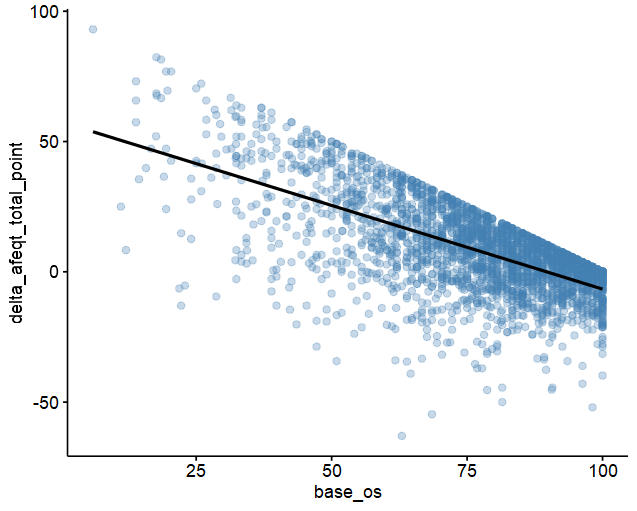

-   差をアウトカムに回帰はやらないほうが良い！
    -   Baselineが良い患者ほど予後不良になってしまう
-   BaselineのPROで補正をした上で＊年後のPROを予測するほうが良い [@Harrell_BBR_Change_2025]


# 欠損値について

-   PRO cohortと研究全体のcohortの違いを考える
    -   何を代表した母集団か考えて解析する
-   死亡した患者のPROは解析できない為、単なる欠損値としない
-   欠損率は複数の方法で報告
    -   variable denominator: その時点でPROを出せる患者を分母とする欠損率
    -   fixed denominator: 研究のコホート全体を分母とする欠損率
-   明示的なSingle imputation(平均値やLOCF)は避けよ
-   最低2種類の欠損値の対処方法を用いて感度分析とせよ

# 欠損値の対処法について

-   明示的なものは推奨されない→分散が減ってしまう
    -   平均値、LOCF、中央値代入など
-   現実的には多重代入でPattern mixture modelを使う事も
-   MAR：多重代入
-   MNAR：Pattern mixture modelを用いたMI

# Pattern mixture model

|              | Y0 | Y1 | Y2 | Y3 |
|--------------|----|----|----|----|
| パターンA    | ○  | ○  | ○  | ○  |
| パターンB    | ○  | ○  | ○  | ×  |
| パターンC    | ○  | ○  | ×  | ×  |
| パターンD    | ○  | ×  | ×  | ×  |

- MNARの時の感度分析で用いる手法
- 欠損パターンが似ている情報+制約(=仮定)をおく事によって、補完する
- イメージだとデータがある人とない人の結果の差Δを他のすべてのデータを用いて埋めるイメージ

# 死亡の扱いをどうする？

- 単なる欠損値にしてはいけない！
- PROをメインの解析において、複数の方法がある
    - 0/1のWorse outcomeを作って、その中に死亡を入れ込む
    - 複数回計測している場合はBayesian Joint modelを行う
    - Ordinal regressionの応用を行う(後述)
- 直感的かつ簡単なのは1だがPowerが減る。RCTやる人は2か3が良いかも

[@Arnold2013-ss; @Spertus2019-za]

# Visualizationについて

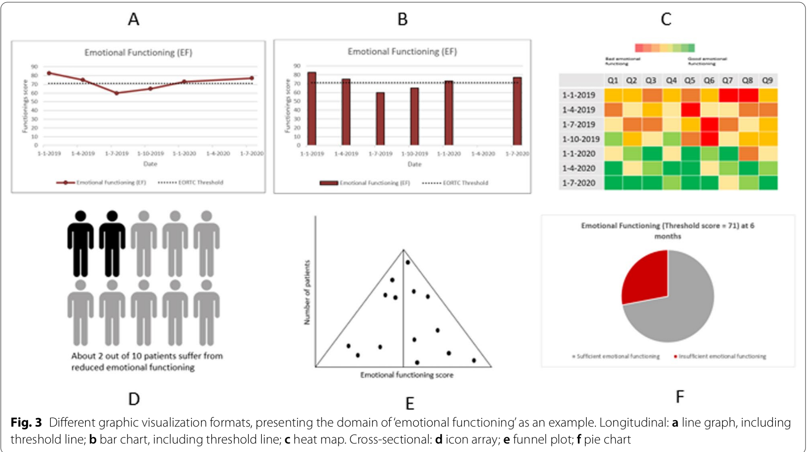{height=70%}

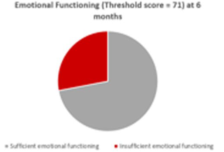{height=70%}

- **個々人のPROMデータ: bar or Line plotが良い**

- **治療群の平均のPROMデータ：Line plot, Pie chart \> bar chart**

[@Albers2022-wt]

# よりよい可視化のために

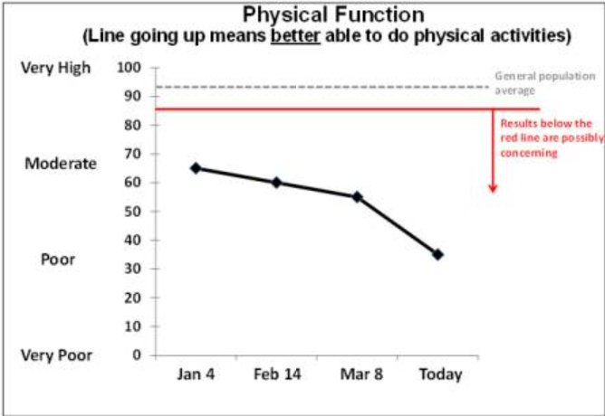

- **警告点を書く**
-  **悪い結果を赤にする**

[@Snyder2019-uw]


# 群レベルのVisualization

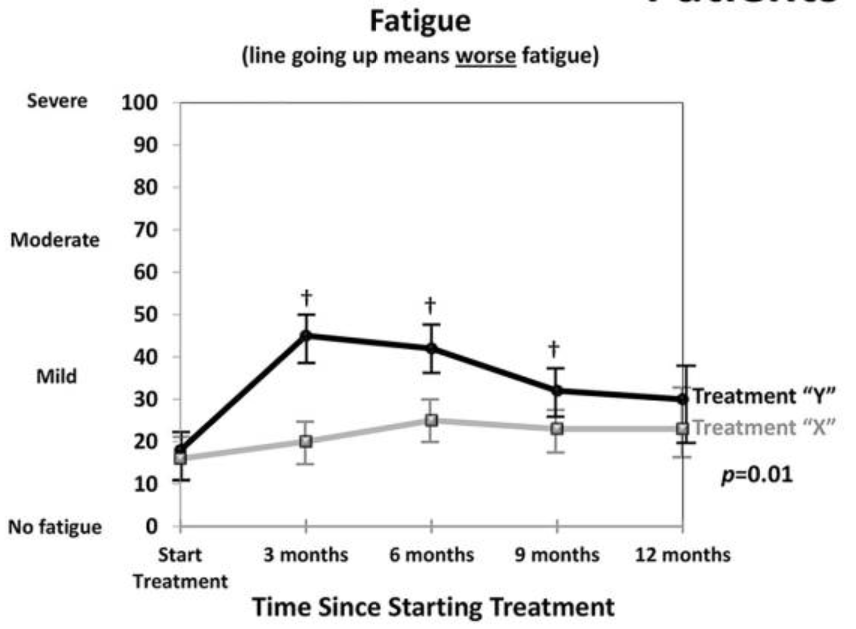{height=80%}

- 95%信頼区間を記述する

[@Snyder2019-uw]

# 一応、特殊な手法を2つほど・・・・・・・

- Ceiling/Floorがあるときに使えるCensored regression ( = tobit model)
- Ordered regression model


# Tobit modelとは

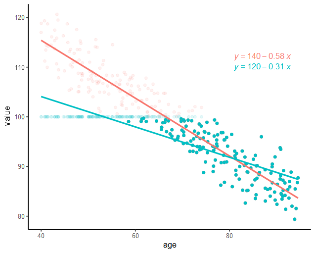

-   ある範囲外の値が丸め込まれる(打ち切られる)ときの回帰
    -   テストの点数(上限が100点)など
-   打ち切られた点が実はもっと高い値がありうると想定した上で回帰を行う
-   上限、下限ともに対応可能
-   実は生存分析はこの一種

# Ordinary regression modelとは

-   順序のあるカテゴリー変数で3種類以上の応答の時に使える
    -   Ex\) NYHAなど
-   Proportional odds仮定があり、常に上の段階に行くときには似たような方向性がある
-   厳密に差が一緒じゃなくても一つ一つのOdds比の平均値として1つの値が出る
-   実は仮定が少なくRobustな上に、検出力も高い

# Ordered regression modelの応用

| Y   | Meaning                                |
|-----|----------------------------------------|
| 103 | Cardiovascular death                   |
| 102 | Non-cardiovascular death               |
| 101 | Hospitalization for HF/Renal Disease   |
| 100 | KCCQ=0                                 |
| 99  | KCCQ=1                                 |
| ..  | ...                                    |
| 1   | KCCQ=99                                |
| 0   | KCCQ=100                               |

-   死亡をアウトカムの1つに組み入れてしまう
    -   負の値がだめなので反転させている
    -   CV deathの方が介入で意義がありそうなので高い値にしている
-   この方法だと、かなり高い検出力を出せる
-   しかし、KCCQの1点の差と心不全入院と非心血管死亡のOdds比が一緒という仮定の値のみ得られる
-   → 傾向には有用だが、数値の大小の意味が薄れる

[@Harrell_POP_2024]

# 実践！

- IST3のデータセット[@Sandercock_IST3_2016]

- rt-PAの効果をみた脳梗塞のデータセット
- アウトカムとしては2種類
    - 6か月 Oxford Handicap Scoreのohs6(最良が0, 死亡が6)
    - 6か月目のEQ-VAS(0-100)だが、死亡は入らない
    - 死亡は26.9%で起こっているので悩ましい

|  値 | 意味                                 |
| -: | ---------------------------------- |
|  0 | 症状なし                               |
|  1 | 症状は少しあるが日常生活に支障なし                  |
|  2 | 症状により生活は変わったが、自分の身の回りのことは可能        |
|  3 | 症状により生活が大きく変わり、身の回りのことに一部介助が必要     |
|  4 | かなり重い症状で他者の助けが必要。ただし昼夜を問わずの介護までは不要 |
|  5 | 重度の障害があり、昼夜を問わず常時介護が必要             |
|  6 | 死亡                                 |


# QOL outcomeの正規性の確認
```{r}
library(tidyverse)
library(tinyplot)
library(datawizard)
library(here)

# br_cancer_dat <- readr::read_csv(here::here("statistics", "PROanalysis", "br_cancer", "br_cancer_dat.csv"))

ist3_dat <- readr::read_csv(here::here("statistics", "PROanalysis", "ist3", "ist3_dat.csv"))

ist3_dat_mod <- ist3_dat |>
    dplyr::mutate(
        sexm1 = gender - 1,
        treatment_dbl = 1 - itt_treat,
        missing_euroqol = dplyr::if_else(is.na(euroqol6), 1, 0),
        sevendaycase = dplyr::if_else(sevendaycase == 0, "No event", "Event"),
        stroketype = dplyr::recode_values(
            stroketype,
            1 ~ "TACI",
            2 ~ "PACI",
            3 ~ "LACI",
            4 ~ "POCI",
            5 ~ "Other"),
        reverse_euroqol_comp = dplyr::if_else(
            dead6mo == 1,
            101,
            100 - euroqol6
        ),
        bad_euroqol_comp_bin = dplyr::if_else(
          dead6mo == 1 | euroqol6 < 25,
          1,
          0
        )
        ) |>
    dplyr::select(treatment_dbl, treatment, age, sexm1, indepinadl_rand, antiplat_rand, atrialfib_rand, sbprand, dbprand, gcs_score_rand, nihss, sevendaycase, stroketype, R_infarct_size, ohs6, dead6mo, euroqol6, euroqol18, reverse_euroqol_comp, bad_euroqol_comp_bin, missing_euroqol)


par(mfrow = c(2,2))
tinyplot::plt(~ ohs6, data = ist3_dat_mod, type = type_barplot(),
    main = "Distribution of Oxford Handicap Score",
    sub = "Low value is better status")

tinyplot::plt(~ euroqol6, data = ist3_dat_mod, type = type_histogram(),
    main = "Distribution of EURO QOL score",
    sub = "High value is better status")

tinyplot::plt(~ reverse_euroqol_comp, data = ist3_dat_mod, type = type_histogram(),
    main = "Distribution of reversed EURO QOL score with Death",
    sub = "Low value is better status and 101 is death")

```

- 6種類の方は正規性は全くなさそう
- Euro QOL scoreは正規性がありそうだが死亡の扱いにこまる

# Visualizationについて
```{r}
library(ggpubr)

ist3_visdat <- ist3_dat |>
  dplyr::select(treatment, euroqol6, euroqol18) |>
  dplyr::mutate(
    dplyr::across(
      c(euroqol6, euroqol18),
      \(x) {
        dplyr::case_when(
          x >= 90 ~ "Good",
          x >= 50 & x < 90 ~ "Normal",
          x < 50 ~ "Bad",
          TRUE ~ NA_character_
        ) |>
          factor(levels = c("Bad", "Normal", "Good"))
      },
      .names = "{.col}_fct"
    )
  )


pieplot_list <- tidyr::pivot_longer(
    ist3_visdat, 
    cols = c("euroqol6_fct", "euroqol18_fct")
) |> 
  tidyr::drop_na(value) |> 
  dplyr::count(
  treatment, name, value
  ) |> 
  dplyr::mutate(
    sum = sum(n), .by = c(treatment, name)
  ) |> 
  dplyr::mutate(
    label = paste0(
        value, ": ", round(n/sum*100), "%"
    )
  ) |> 
  dplyr::group_nest(
    treatment, name
  ) |> 
  dplyr::mutate(
    pieplot = purrr::map2(data, treatment, \(dat, treatment){
        
        ggpubr::ggpie(
            dat, 
            x = "n", 
            label = "label", 
            fill = "value", 
            main = treatment
        ) + theme(legend.position = "none")
    })
  ) |> 
    dplyr::arrange(desc(name))

lineplot <- dplyr::filter(ist3_visdat, !is.na(euroqol18)) |> 
        tidyr::pivot_longer(
    cols = c("euroqol6", "euroqol18")
) |> 
  tidyr::drop_na(value) |> 
    ggpubr::ggline(
        x = "name", 
        y = "value", 
        color = "treatment", 
        add = "mean_se", 
        xlab = "Timing of EuroQOL", 
        ylab = "EuroQOL score"
    )


pies <- cowplot::plot_grid(
    plotlist = pieplot_list$pieplot, nrow = 1, 
    labels = c("EuroQOL at 6 month", "", "EuroQOL at 18 month", "")
)

plots <- cowplot::plot_grid(
    plotlist = list(pies, lineplot), nrow = 2
)

plots

```

- rt-PAとplaceboで6ヶ月後、18ヶ月後のQOLについて記載
- 具体的な値の差を95%CIを追加して記述
- 一応90以上をGood、50未満をBadとした時の割合の差時系列を円グラフで

# Missing dataと死亡の扱い

```{r}
library(gtsummary)

gtsummary::tbl_summary(
    ist3_dat_mod, by = missing_euroqol,
    include = -c(euroqol6, dead6mo, reverse_euroqol_comp, bad_euroqol_comp_bin, treatment_dbl),
    value = list(
        sevendaycase ~ "Event",
        indepinadl_rand ~ 1,
        atrialfib_rand ~ 1,
        antiplat_rand ~ 1
    )
) |>
    gtsummary::add_p(
    test = all_categorical() ~ "fisher.test",
    test.args = all_tests("fisher.test") ~ list(simulate.p.value = TRUE)
    )

```

# Missingの解析

```{r}
library(mice)

md.pattern(dplyr::select(ist3_dat_mod, -reverse_euroqol_comp, -missing_euroqol, -bad_euroqol_comp_bin))

```

# Missingの解析~組み合わせ

```{r}
library(naniar)
library(cowplot)

miss_dat <- dplyr::select(ist3_dat_mod, -treatment_dbl, -reverse_euroqol_comp, 
-missing_euroqol, -bad_euroqol_comp_bin) |> 
    dplyr::mutate(
        dead6mo = as.factor(dead6mo), 
        sexm1 = as.factor(sexm1), 
        )

p1 <- naniar::gg_miss_fct(x = miss_dat, fct = stroketype)

p2 <- naniar::gg_miss_fct(x = miss_dat, fct = sexm1)

p3 <- naniar::gg_miss_fct(x = miss_dat, fct = age)

p4 <- naniar::gg_miss_fct(x = miss_dat, fct = sbprand)

cowplot::plot_grid(plotlist = list(p1, p2, p3, p4), nrow = 2)

```

# 分類が少ないOHSの解析

```{r}
library(rms)
library(Hmisc)
library(AER)
library(parameters)

dd <- rms::datadist(ist3_dat_mod)

options(datadist = "dd")

ohs_formula <- as.formula(ohs6 ~ treatment_dbl + age + sexm1 + indepinadl_rand + antiplat_rand + atrialfib_rand + sbprand + dbprand + gcs_score_rand + nihss + sevendaycase + stroketype + R_infarct_size)

ols_fit <- ols(ohs_formula, data = ist3_dat_mod)
orm_fit <- orm(ohs_formula, data = ist3_dat_mod)
tobit_fit <- tobit(
    ohs_formula, left = 0, right = 6, data = ist3_dat_mod
)

parameters::compare_parameters(
    list(
        "Linear regression" = ols_fit,
        "Ordinal regression" = orm_fit,
        "Tobit regression" = tobit_fit
    ),
    keep = "treatment_dbl"
)

```

::: {.callout-note}

小さい数ほど良い予後と関連する

:::

# 死亡を考慮しないEuroqolの解析

```{r}
library(rms)
library(Hmisc)
library(AER)
library(parameters)

dd <- rms::datadist(ist3_dat_mod)

options(datadist = "dd")

euroqol_formula <- as.formula(euroqol6 ~ treatment_dbl + age + sexm1 + indepinadl_rand + antiplat_rand + atrialfib_rand + sbprand + dbprand + gcs_score_rand + nihss + sevendaycase + stroketype + R_infarct_size)

ols_fit_euroqol <- rms::ols(euroqol_formula, data = ist3_dat_mod)
orm_fit_euroqol <- rms::orm(euroqol_formula, data = ist3_dat_mod)
tobit_fit_euroqol <- AER::tobit(
    euroqol_formula, left = 0, right = 100, data = ist3_dat_mod
)

parameters::compare_parameters(
    list(
        "Linear regression" = ols_fit_euroqol,
        "Ordinal regression" = orm_fit_euroqol,
        "Tobit regression" = tobit_fit_euroqol
    ),
    keep = "treatment_dbl"
)


```

::: {.callout-note}

大きい数ほど良い予後と関連する

:::

# 死亡を考慮した解析～①
```{r}
library(rms)
library(Hmisc)
library(AER)
library(modelsummary)

dd <- rms::datadist(ist3_dat_mod)

options(datadist = "dd")

euroqol_formula2 <- as.formula(reverse_euroqol_comp ~ treatment_dbl + age + sexm1 + indepinadl_rand + antiplat_rand + atrialfib_rand + sbprand + dbprand + gcs_score_rand + nihss + sevendaycase + stroketype + R_infarct_size)

ols_fit_euroqol2 <- rms::ols(euroqol_formula2, data = ist3_dat_mod)
orm_fit_euroqol2 <- rms::orm(euroqol_formula2, data = ist3_dat_mod)
tobit_fit_euroqol2 <- AER::tobit(
    euroqol_formula2, left = 0, right = 101, data = ist3_dat_mod
)

parameters::compare_parameters(
    list(
        "Linear regression" = ols_fit_euroqol2,
        "Ordinal regression" = orm_fit_euroqol2,
        "Tobit regression" = tobit_fit_euroqol2
    ),
    keep = "treatment_dbl"
)


```

::: {.callout-note}

- 0～100を反転させて101を死亡にする
    - 値が小さいほどよい

:::


# 死亡を考慮した解析～②
```{r}
library(modelsummary)


euroqol_formula <- as.formula(bad_euroqol_comp_bin ~ treatment + age + sexm1 + indepinadl_rand + antiplat_rand + atrialfib_rand + sbprand + dbprand + gcs_score_rand + nihss + sevendaycase + stroketype + R_infarct_size)

logistic_fit_bin <- glm(euroqol_formula, data = ist3_dat_mod, family = binomial)

modelsummary::modelsummary(
    list(
        "Logistic regression" = logistic_fit_bin
    ),
    exponentiate = TRUE,
    estimate = "{estimate} [{conf.low}, {conf.high}], {p.value}",
    coef_omit = "^(?!treatment)",
    gof_omit = ".*"
)

```
::: {.callout-note}

値が大きいほどQOL不良と関連

:::

# 結論として

- tPAは6ヶ月後の良いQOLと関連している結果だった
    - 全ての解析手法で同じような結果だった

# Take home message

-   PROをメインとした解析をする時は
    -   Research questionを明確にする
    -   BaselineのPROの調整を検討
    -   欠損値の扱いについて　　　　　十分に検討する
-   MCIDなどを使って、解釈可能な解析をする
-   細かい解析法はあまり重要じゃなく、Linear (mixed) regression位で良い
-   死亡の扱いに要注意！！

# わかりやすい参考文献

[*患者報告アウトカム（PRO）使用ガイダンス集：厚生労働省科学研究班｜トップページ (lifescience.co.jp)*](https://www.lifescience.co.jp/pro/index.html)

[*https://www.lifescience.co.jp/pro/article02-2-9.html#main*](https://www.lifescience.co.jp/pro/article02-2-9.html#main)
