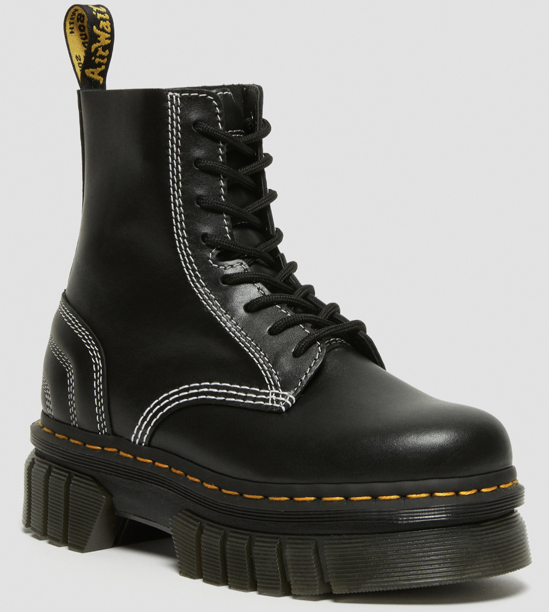
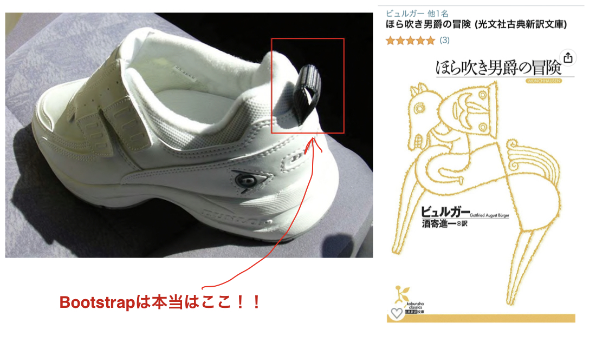
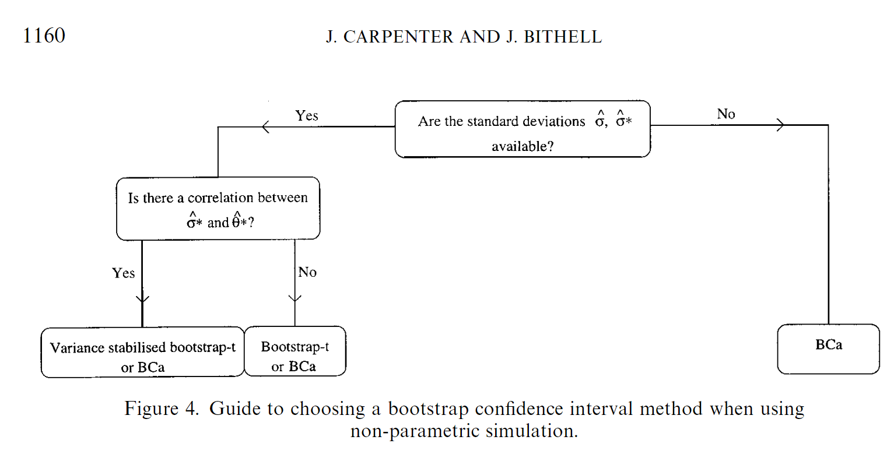
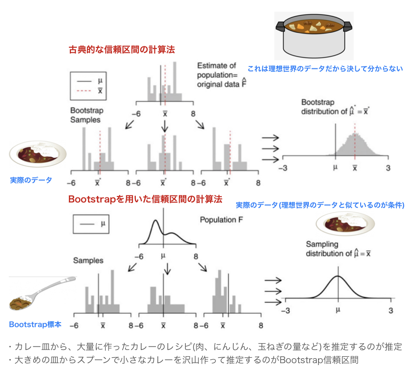
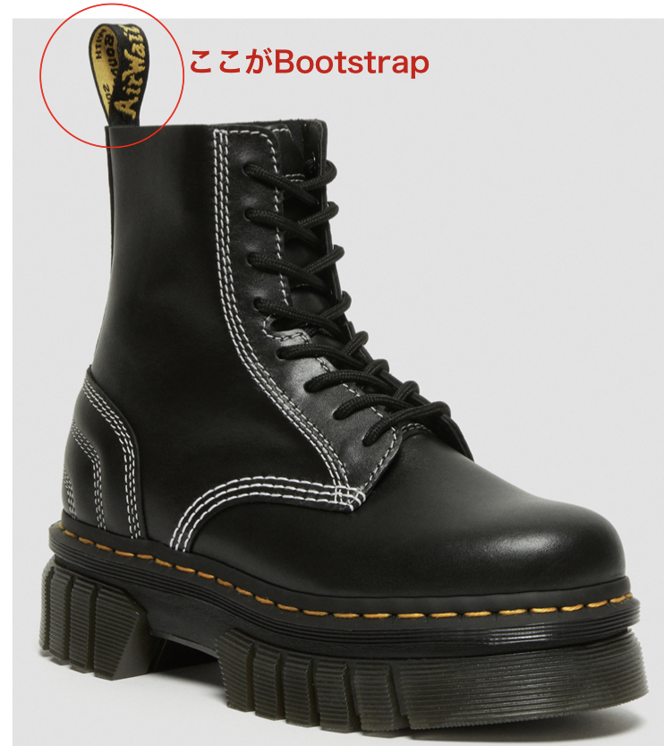

```{r, setup, include=FALSE}
library(knitr)
knitr::opts_chunk$set(
  comment = '', fig.width = 6, fig.height = 6, echo = FALSE, warning = FALSE
)
library(tibble)
library(dplyr)
library(gt)
library(gtExtras)
library(kableExtra)
library(boot)
library(bootstrap)
```

## クイズ

{height="300px" fig-align="center"}

1.  Bootstrapは靴の中のどの部分でしょうか？
2.  Bootstrap信頼区間を出すときには何回繰り返しが必要でしょうか？
3.  Bootstrap信頼区間を出す前に必ずやらないといけない方法はなんでしょうか？
4.  Bootstrap信頼区間の時に良い方法はなんでしょうか？

## Introduction

-   最近研究でbootstrapを使う事が複数回あった
-   正直雰囲気でやっていたので、しっかり勉強してみたい

## 95％信頼区間の出し方

::: columns
::: {.column width="45%"}
```{r bmi}
dat <- tibble(
    id = 1:300, 
    bmi = rnorm(n = 300, mean = 21, sd = 2.0)
)
kable(head(dat, 10)) |> 
  kable_styling(font_size = 20)
```
:::

::: {.column width="10%"}
:::

::: {.column width="45%"}
```{r mi-hist}

hist(dat$bmi)
```
:::
:::

-   例えば、患者のBMIを出すときはどう考えるか？

## 信頼区間の出し方

{fig-align="center"}

-   この分布が**正規分布に従うとして**、t分布の平均と分散を最尤法で推定
-   t分布の数表を確認して、1.96×標準偏差で計算する

## でも・・・・・・

-   心不全患者のBNPの分布は？
-   新しいDeep learningモデルのtest cohortでのAUROCの分散は？
-   死亡、心不全再入院という風に階層をおいた時のWin ratioの95%信頼区間は？

医学では[**正規分布**]{style="color: red"}でないものの方が多い！

## Bootstrapとは

{fig-align="center"}

-   Jackknife法などと同じresampling法の一種
-   Efronが1979年に開発した手法
-   元のデータからランダムに取り出して新しいデータセットを作成する[@Efron2003-pq]
-   この際に[**重複を許可する**]{style="color: red"}のが特徴 = 使われないのもある

## おまけ〜Bootstrapの名前

-   ホラ吹き男爵の冒険のエピソード
-   「余は、底なし沼にハマった時に自分のBootstrapを引っぱって抜け出したことがある
-   読んでみたが、この本にはそのエピソードなし(そのエピソードは存在しないという説もあり)

{height="300px" fig-align="center"}


## Bootstrap法〜Jackknifeとの比較

-   Bootstrapの前に、Jackknifeという手法が1949年に開発された
-   これは、1つずつ標本から抜いていくという手法
-   どんな時にも使えるから、便利な十徳ナイフという名前が付けられた
-   こっちの方が自然なイメージだが**問題点**があった

{height="300px" fig-align="center"}

## Jacknife法の問題点1

-   　MIを起こした患者の年齢とLDLを見たデータがあるとする

```{r}
nums = 29
mi_dat <- data.frame(
    id = 1:nums, 
    age = rnorm(n = nums, mean = 75, sd = 3), 
    ldl = runif(n = nums, min = 170, max = 210), 
    comment = rep("  ", nums)
) |> 
tibble::add_row(id = nums + 1, age = 25, ldl = 300, comment = "FHの患者") |> 
tibble::add_row(id = nums + 2, age = 35, ldl = 75, comment = "特発性冠動脈解離")

dplyr::slice(mi_dat, 1:3, 30, 31) |> 
  knitr::kable() |> 
  kableExtra::kable_styling(font_size = 20) |>
  kableExtra::row_spec(4:5, background = "lightgrey", bold = TRUE)
```

## Jacknife法の問題点2

::: columns
::: {.column width="50%"}
```{r}
hist(mi_dat$age, breaks = 40)
```
:::

::: {.column width="50%"}
```{r warning=FALSE,message=FALSE}
hist(mi_dat$ldl, breaks = 30)
```
:::
:::

## その場合

-   このようなデータ(連続じゃない時)の時に分散を広く推定してしまう
-   イメージだが、外れ値を何度も数えてしまう (FHを29回数えている)
-   平均値とSDは出来るが、中央値とPercentileは苦手

## Bootstrapの前提条件

-   Plug in principles
-   簡単にいうと「標本の分布は母集団の分布とほぼ同じ」というもの

{height="350px" fig-align="center"}

## bootstrapの簡単な例

::: columns
::: {.column width="45%"}
```{r, starwars}
dat_star <- dplyr::select(starwars, name, height, mass, species)

knitr::kable(head(dat_star, 8), format = "html") |> 
  kableExtra::kable_styling(font_size = 20)
```
:::

::: {.column width="10%"}
:::

::: {.column width="45%"}
```{r}
hist(dat_star$height)
```
:::
:::

-   簡単なものとして、身長の平均値の95%信頼区間を導出してみる

## How to bootstrap 1

::: columns
::: {.column width="50%"}
```{r, bootstrap-method1}
set.seed(4)
sw_ids <- sample(nrow(starwars), replace = TRUE) |> 
  sort()

sw_ids
```
:::

::: {.column width="50%"}
```{r}

sw_boot1 <- dat_star |> 
  dplyr::slice(sw_ids) 

kable(head(sw_boot1, 15)) |> 
  kableExtra::kable_styling(font_size = 16)

```
:::
:::

-   行数の数字をランダムに抽出する<br>
-   この時、重複を許す！

## How to bootstrap 2

-   同じものが複数ある(C3PO)
-   この状態で身長の平均値を出す。
-   身長の平均値 = `r mean(sw_boot1$height, na.rm = T)`

## How to bootstrap 3

-   上記の1と2を繰り返す。

```{r}
#| fig-align: "center"

boot_mean <- \(dat, i){
  datas <- dat[i, ]
  mean(datas$height, na.rm = TRUE)
}

boot_height <- boot(dat_star, statistic = boot_mean, R = 500)

plot(boot_height)

```

## How to bootstrap 4

-   ここからやり方は複数ある[@Bland2015-gy]
-   代表的なものは以下の3つ
    1.  標本から計算した統計量にBootstrap標本から計算した分散を用いた正規分布を足し算して計算する(Normal法) <br> → sd = `r sd(boot_height$t)`
    2.  2.5% \~ 97.5%の範囲をそのまま提示する(Percentile法) <br> → \[`r quantile(boot_height$t, probs = c(0.025, 0.0975))`\]
    3.  標本から計算した統計量にBootstrap標本の2.5%tile, 97.5%tileの値を引き算する(Basic法)

::: callout-note
どの方法を用いるにせよ必ず1回は**Histogram**にして分布を確認する！！
:::

## Bootstrapの種類

-   最も基本は上記の**Percentile法** → ただし、**以下の弱点**がある
-   Percentile法の弱点
    1.  収束が遅い
    2.  元データを使っていない → Biasが生まれる[@Wicklin_undated-xu]

## Bootstrap法の改善

-   BCa法やBootstrap-t法が考えられている
    -   Biasを修正する為に複数のパラメーターを使う手法が考えられている: [**BCa法**]{style="color: red"}、Bootstrap-t法
-   Bootstrap-t法: 分散値を使い、t分布に近似する
    -   分散は理論値やjackknife法で計算する必要がある[@Kaneyoshi2011]
-   BCa法: Bootstrapだけでなんとかなるのが利点


## どれを選べばいいの？

{height="300px"}

-   過去の論文[@Carpenter2000-fo]では、Flowchartが示されている
-   全く分からなければ`r kableExtra::text_spec("BCa法", bold = TRUE, color = "red", font_size = 32)`が無難だと思う
-   Bootstrap-tも良いが、現実的にはやや手間が増えるのと、良い分散の推定が得られないと信頼区間を広く推定してしまう[@DiCiccio1996-wt]
-   BCa法はBootstrapの繰り返しが多いがRだと簡単に出来る[@boot1997]

## 古典的な信頼区間とBootstrap信頼区間の違い

{fig-align="center"}


## Bootstrapの素朴な疑問

-   nは幾つにすればいいの？
-   元データは少なくてもいいの？

## Bootstrapの素朴な疑問 1

-   nは幾つにすればいいの？<br> →　Efron曰く、分散だけなら200程度、信頼区間なら`r kableExtra::text_spec("1000-2000回程度", bold = TRUE, color = "red", font_size = 32)`必要
-   コンピュータの性能の向上に合わせて分散推定で1000、信頼区間は10,000という人もいる[@Chernick2008-zx]

## Bootstrapの素朴な疑問 2

-   元データは少なくてもいいの？ →　少なすぎるとBiasは補正しきれない。大元のデータがちゃんと(母集団を)近似するくらいじゃないとだめ
-   経験則だと最低30～50は必要と考えられる[@Chernick2008-zx]が求めたいものと状況による
-   ロジスティック回帰やCox回帰などで、Bootstrapでエラーが出る(偶然、Bootstrap標本でイベントが一回も起きない時)があるが、その際はおそらく大元のデータが足りない

## クイズの答え

{height="300px" fig-align="center"}

1.  Bootstrapは靴の中のどの部分でしょうか？
2.  Bootstrap信頼区間を出すときには[**1000-2000回**]{style="color: red"}繰り返しをする
3.  Bootstrap信頼区間を出す前に必ず[**統計量のHistogram**]{style="color: red"}を確認する！
4.  Bootstrap信頼区間の時には[**BCa法**]{style="color: red"}を行う！

## Thank you for your listening!!

{fig-align="center"}

-    これが本当にあった話らしい

## References

::: {#refs}
:::