```{=html}
<style>
.reveal .reference {
  color: #666;
  font-size: 0.55em;
  margin-top: 0.6em;
  text-align: right;
}
.reveal .small {
  font-size: 0.78em;
}
.reveal .columns {
  gap: 1rem;
}
.reveal img {
  max-height: 66vh;
  object-fit: contain;
}
</style>
```

## GLMM

Nozomi Niimi

## 本日のagenda

- GLMM（Generalized Linear Mixed Model）について
- GLMMの直感的理解
- GLMMとGEE（Generalized Estimating Equation）の違い
- GLMMの注意点
- こんな時！GLMM！

## 本日のagenda

- GLMM（Generalized Linear Mixed Model）について
- GLMMの直感的理解
- GLMMとGEE（Generalized Estimating Equation）の違い
- GLMMの注意点
- こんな時！GLMM！
- おまけ

## 実際の論文

<!-- TODO: 元スライドでは論文スクリーンショット2枚のレイアウト。画像サイズはレンダリング後に調整する。 -->

:::: columns
::: {.column width="50%"}
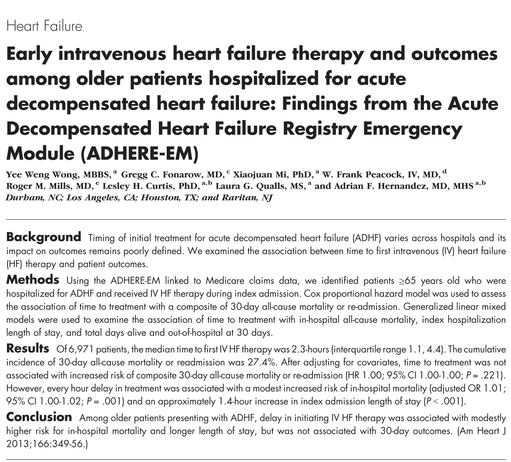{fig-alt="論文スクリーンショット1" width="100%"}
:::

::: {.column width="50%"}
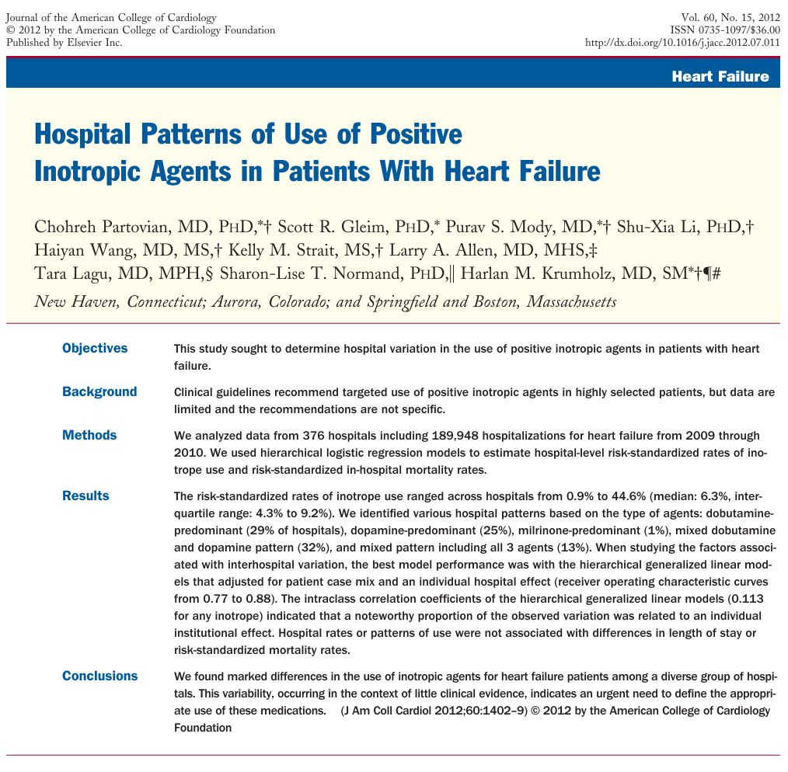{fig-alt="論文スクリーンショット2" width="100%"}
:::
::::

## GLMMを使った論文は増えている

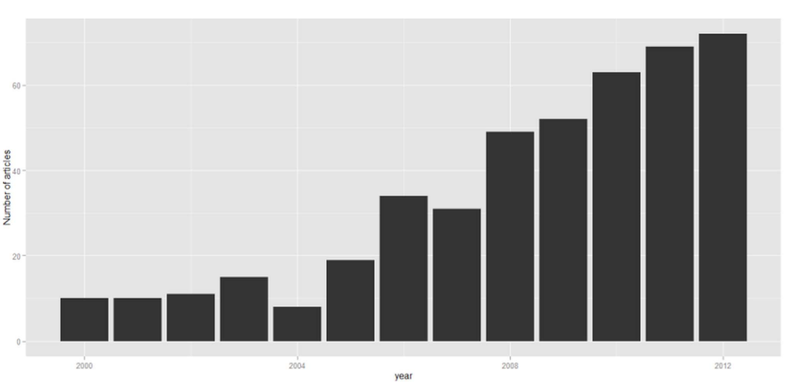{fig-alt="GLMMを使った論文数の推移" width="78%"}

::: {.reference}
PLoS One. 2014;9(11):1-10.
:::

## GLMMについて

:::: columns
::: {.column width="58%"}
- 線形モデルを拡張したもの
- 連続変数を扱う最小二乗法が基本
- ただし、目的変数が連続変数だけだったり、分散が正規分布でないと不可能だった
- link関数を用いることで更に拡張したのがGLM
- 独立変数の効果を固定効果とランダム効果に分けて更に自由度を上げたのがgeneralized linear mixed model（GLMM）
:::

::: {.column width="42%"}
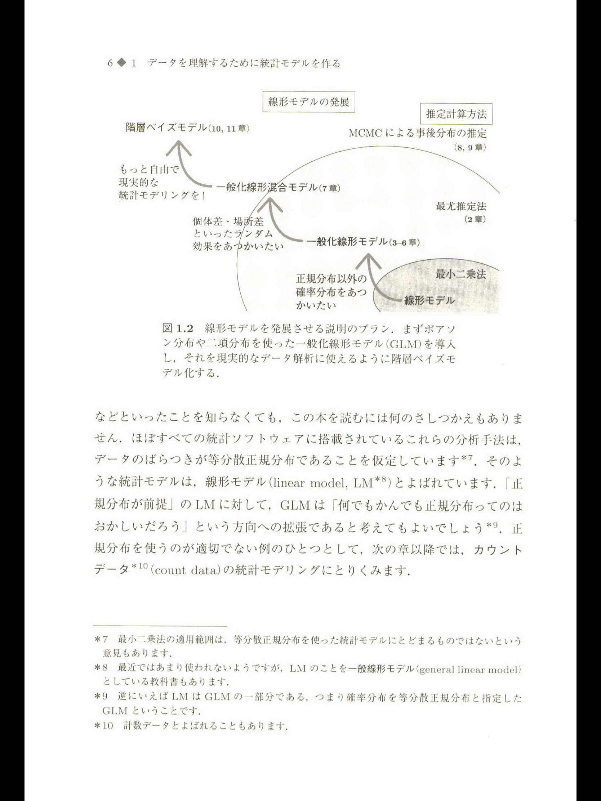{fig-alt="GLMMの概念図" width="78%"}
:::
::::

## 復習：一般化線形モデルについて

- 線形モデル：差の二乗を最も小さくする
- 一般化線形モデル：リンク関数を挟んで、尤度を最大にする

<!-- TODO: 元スライドの3画像配置は簡略化。 -->

:::: columns
::: {.column width="34%"}
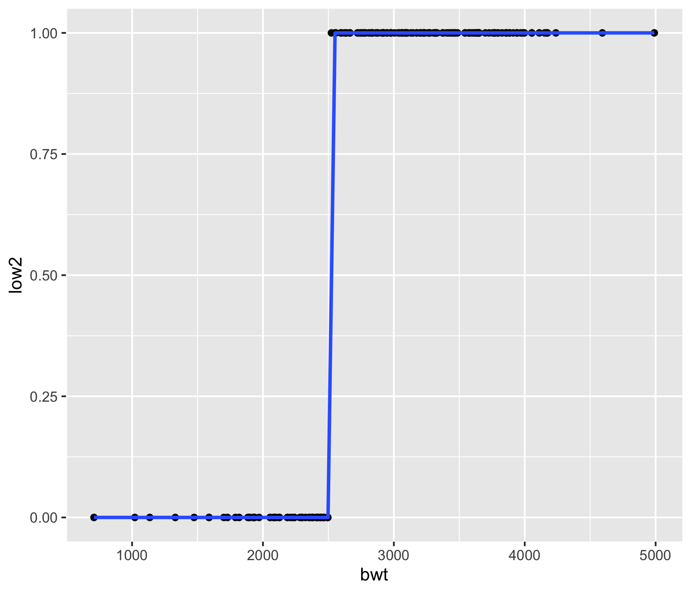{fig-alt="一般化線形モデルの図1" width="100%"}
:::

::: {.column width="33%"}
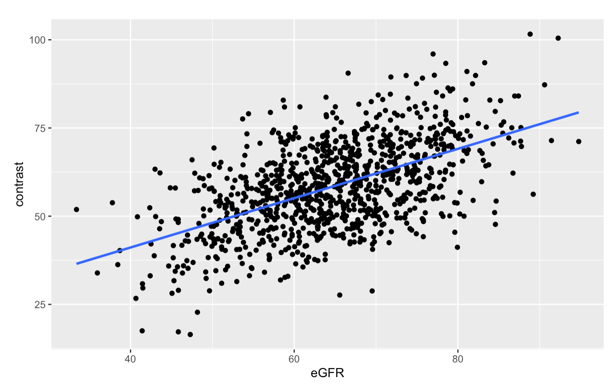{fig-alt="一般化線形モデルの図2" width="100%"}
:::

::: {.column width="33%"}
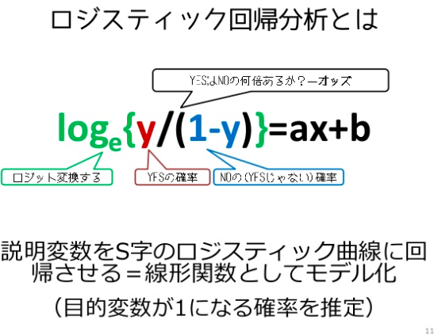{fig-alt="一般化線形モデルの図3" width="100%"}
:::
::::

## GLMの仮定

- 仮定1：従属変数の分布を勝手に決めている（指数分布族）
- 仮定2：従属変数がそれぞれ独立である

<!-- TODO: 元スライドの書籍画像3枚は簡易配置。 -->

:::: columns
::: {.column width="33%"}
{fig-alt="GLMの仮定に関する図1" width="72%"}
:::

::: {.column width="33%"}
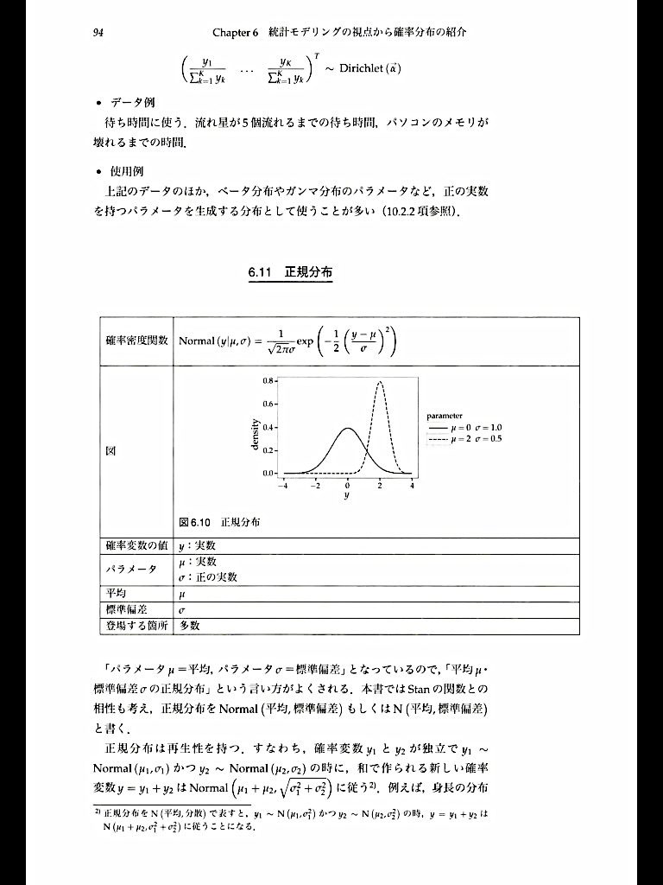{fig-alt="GLMの仮定に関する図2" width="72%"}
:::

::: {.column width="33%"}
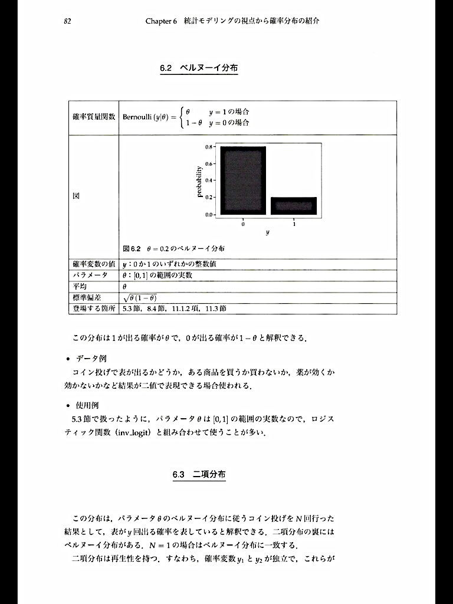{fig-alt="GLMの仮定に関する図3" width="72%"}
:::
::::

::: {.reference}
『StanとRでベイズ統計モデリング』
:::

## GLMMとは？

- 同じ個体からの繰り返し測定の場合
- ヒエラルキー構造になっている解析（multilevel）、クラスターデザイン
- 例：慢性心不全患者に新しい薬を処方して、BNPの推移を2ヶ月おきに計測する
- 例：急性心不全の患者へのICU/HCUへの入室の効果
- 上記の時には、GLMでは結果が偏るのでGLMMやGEEを用いる
- GLMMでは効果を固定効果とランダム効果に分けて推定する

## 固定効果とランダム効果？？

{fig-alt="固定効果とランダム効果のイメージ" width="52%"}

## 本日のagenda

- GLMM（Generalized Linear Mixed Model）について
- GLMMの直感的理解
- GLMMとGEE（Generalized Estimating Equation）の違い
- GLMMの注意点
- こんな時！GLMM！
- おまけ

## GLMMについて：図での表現

<!-- TODO: 元スライドはPowerPoint図形で階層構造を表現。抽出テキストのみを箇条書き化しているため、必要ならQuarto/mermaid/画像で再作図する。 -->

- 全体
- 病院A / 病院B / 病院C
- 階層1：病院
- 階層2：患者
- 例
  - 「腎機能がこんなに悪いんだから、RAASiは禁忌に近い！！」
  - 「腎機能がこんなに悪いんだから、よりRAASi使わなきゃ！！」

## GLMMについて：グラフ的理解

<!-- TODO: 元スライドの2グラフ配置は簡略化。 -->

:::: columns
::: {.column width="50%"}
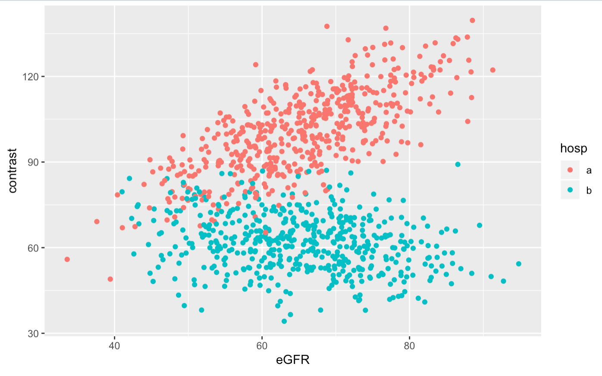{fig-alt="GLMMのグラフ的理解1" width="100%"}
:::

::: {.column width="50%"}
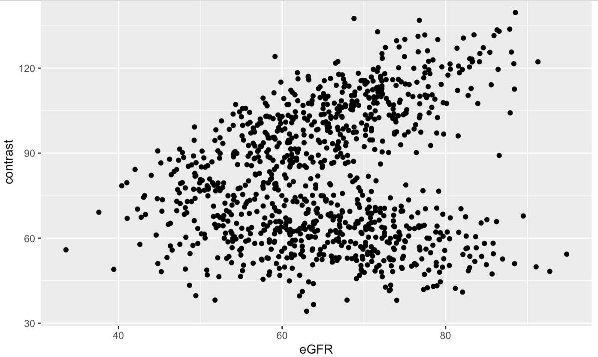{fig-alt="GLMMのグラフ的理解2" width="100%"}
:::
::::

## GLMMについて：式での表現

<!-- TODO: 元スライドの式と分布図の配置は簡略化。 -->

- 式の構造はGLMと同じ
- この、係数の部分が同じではないのがGLMM
- 通常のGLM
  - `造影剤量 = a + b * eGFR + c * age`
- GLMMの考え
  - `y = a + b1 * eGFR + c * age`
  - `y = a + b2 * eGFR + c * age`
  - `y = a + b3 * eGFR + c * age`
- 固定効果：`b: 0.25 ± 1.2`
- ランダム効果
  - `b1: 1.8`
  - `b2: 0.6`
  - `b3: 3.5`

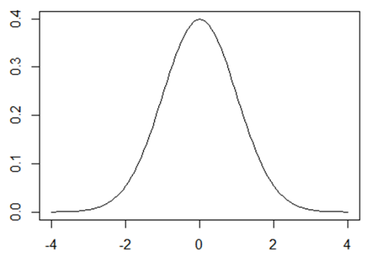{fig-alt="係数分布のイメージ" width="46%"}

## 本日のagenda

- GLMM（Generalized Linear Mixed Model）について
- GLMMの直感的理解
- GLMMとGEE（Generalized Estimating Equation）の違い
- GLMMの注意点
- こんな時！GLMM！
- おまけ

## GEEとは

- Working correlation matrixという特殊な行列を用いたモデリングの手法
- GLMの仮定（再掲）
  - 仮定1：従属変数の分布を勝手に決めている（指数分布族）
  - 仮定2：従属変数がそれぞれ独立である
- この仮定1を満たさなくても使える！！

## 従属変数の分布？

:::: columns
::: {.column width="58%"}
- outcomeの分布の事
- 連続値？離散値？
- カテゴリー変数？
- 0/1？
:::

::: {.column width="42%"}
{fig-alt="従属変数の分布のイメージ" width="70%"}
:::
::::

## 問題になるのは離散値！

:::: columns
::: {.column width="58%"}
- ほとんどの場合、問題になるのは離散値（0, 1, 2, 3...）
- Poisson分布を用いると、かなりばらつきが多くなる（=過分散）
- outcomeが離散値だとGLMMとGEEで違いが出てくる
  - 連続値だと差は出ない
- 例：てんかん患者が1年以内に発作を起こした回数
- 例：心不全患者のICU在室日数
:::

::: {.column width="42%"}
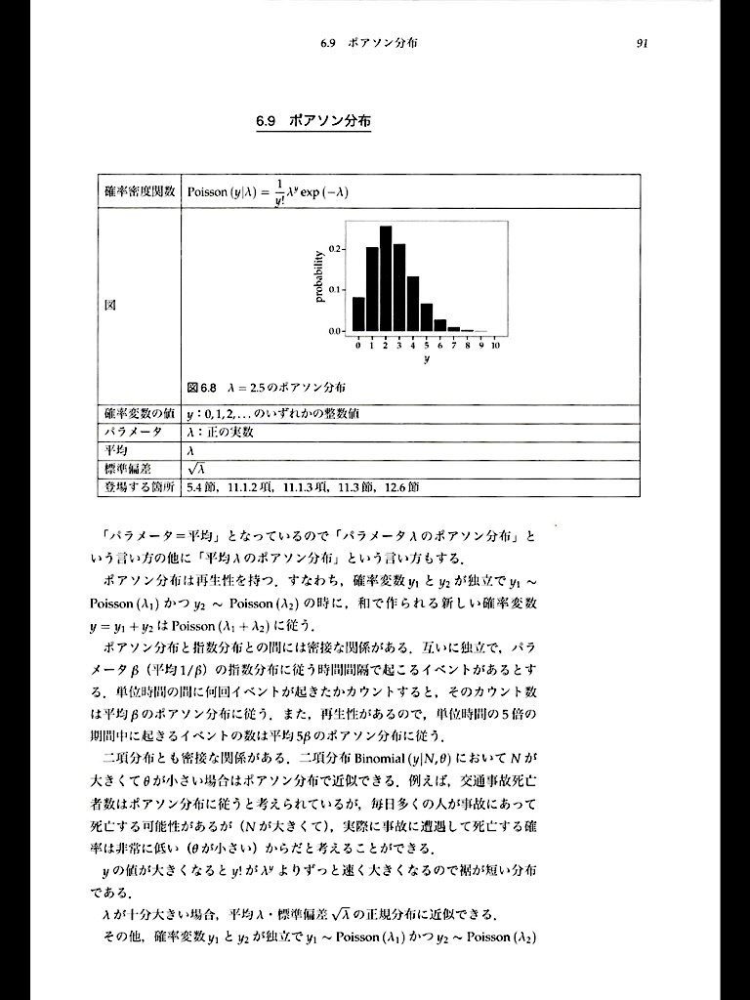{fig-alt="離散値outcomeの例" width="72%"}
:::
::::

::: {.reference}
Ann Intern Med. 2003;139(8).
:::

## GLMMとGEEの違いについて

- 同じ点
  - GLMMもGEEもクラスターや層別の解析が可能
- 違う点
  - GEEの方が従属変数の分布が異なっていても結果がrobust
  - GLMMと違いGEEは尤度が出せない
  - 擬似尤度を使うため、計算方法によって結果が変わりやすい
- GEEは1つの層までしか解析出来ない
- GEEは集団全体への効果（marginal）しか推定できない
- GLMMは各々の細かいclusterでの効果量（conditional）の推定が可能

::: {.reference}
Comput Stat Data Anal. 2014;77:70-83.  
Stat Sci. 2004;19(2):219-238.
:::

## GLMMとGEEの使い分け

- 2層以上の解析 → GLMM
- 患者個々人の影響も見たい（conditionalな影響が見たい） → GLMM
- 離散値のoutcomeを見たい → GEE
- 循環器領域ではGLMMの方が使い勝手良さそう
- GEEは使うソフトによって結果が異なる事がある

::: {.reference}
Comput Stat Data Anal. 2014;77:70-83.
:::

## こんな時！GLMM！

- 病院毎や個人差を考慮した解析をしたい時
- ただし、差はあってもある程度常識的な範囲に入ると推定される時
- Logisticの場合
- Poisson分布の時はGEEやBayes統計が良いかもしれない
- 患者一人一人の状態に合わせた効果が欲しい時（Frailty model）

## GLMMの注意点

- 例えば個人差を階層にする時
  - 年齢、性別、BMIのようなデータは階層別にしない！
- 例えば施設間の差を階層にする時
  - hospital volumeのような測定できる因子は階層にしない！
- どのような図式で、何を個体差（施設差）にするか事前に設定する

## 絵を描こう！

<!-- TODO: 元スライドはPowerPoint図形による因果・階層の整理。必要ならMermaidやDAG風の図に再作図する。 -->

- 階層
  - 測定されない施設の影響
- 共変量・因子
  - 年齢
  - 夜間・休日
  - D2B time
  - high volumeか否か
  - PADの有無
  - 糖尿病

## おまけ

- おそらく最もこのmixed modelが使われるのはmeta analysis
- Fixed effects vs Random effects
- Fixed effects
  - 真の治療効果は研究毎ではheterogeneityがないという仮定
  - `n` が等しく、モデルが正しければ全てのforest plotが一致する
  - common treatment effectがわかる
- Random effects
  - 真の治療効果はsampling variabilityによって変化がある
  - average treatment effectがわかる
- Random effectsでは、分散を偶然誤差と系統誤差に振り分ける必要がある
- Heterogeneityの検定が必要だが、あまり行われない
- Random effectsの方が有意差が出にくい傾向がある

## ご静聴ありがとうございました

## 補足画像

<!-- TODO: 元スライド26はタイトルなしの画像2枚。用途に応じて削除またはAppendix化する。 -->

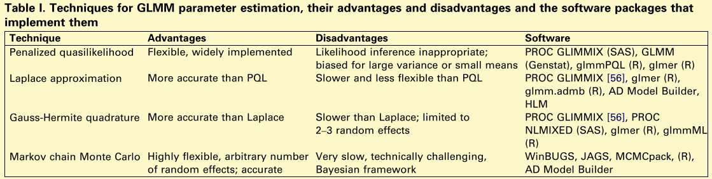{fig-alt="補足画像1" width="80%"}

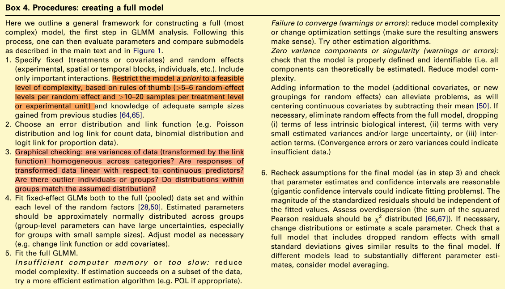{fig-alt="補足画像2" width="80%"}
