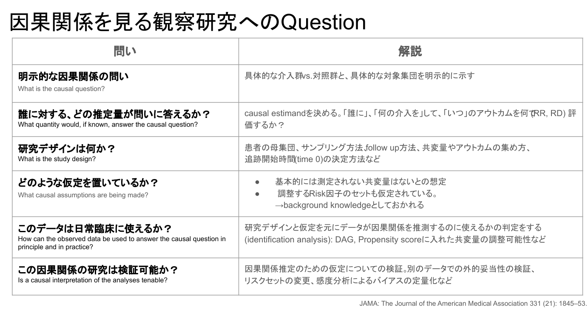
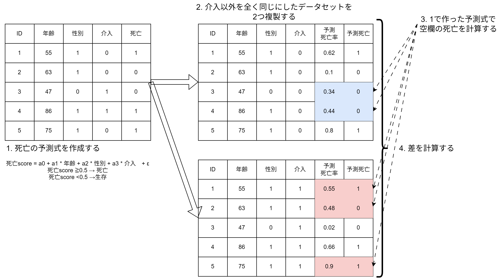
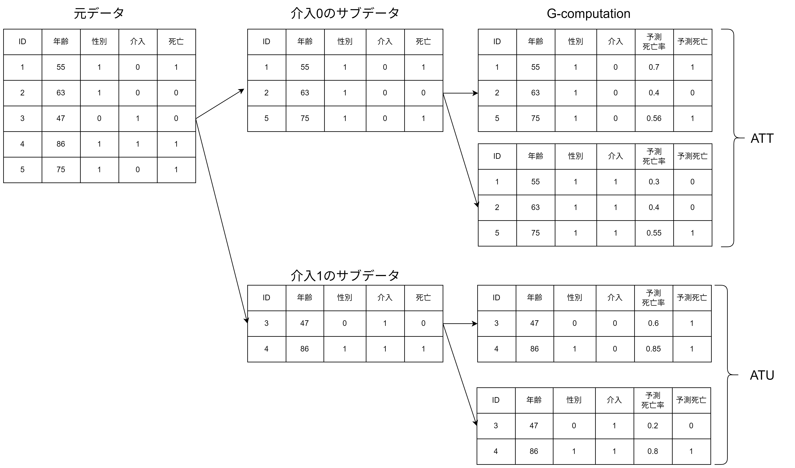
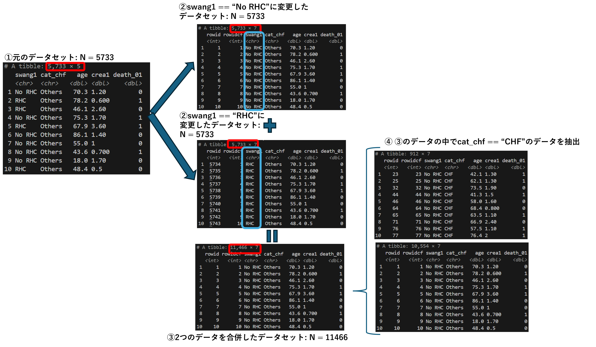
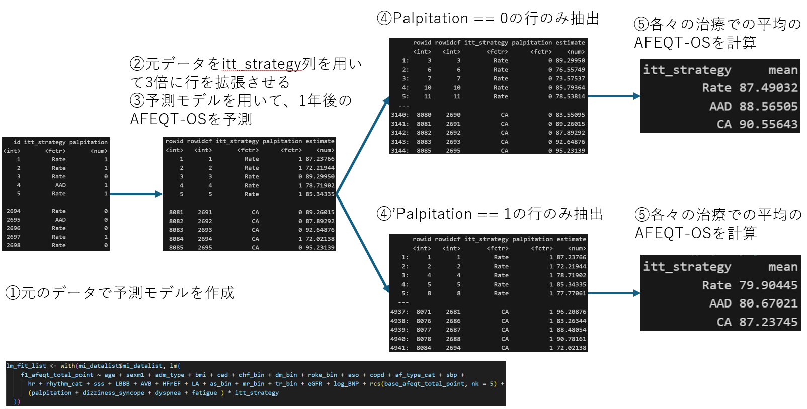
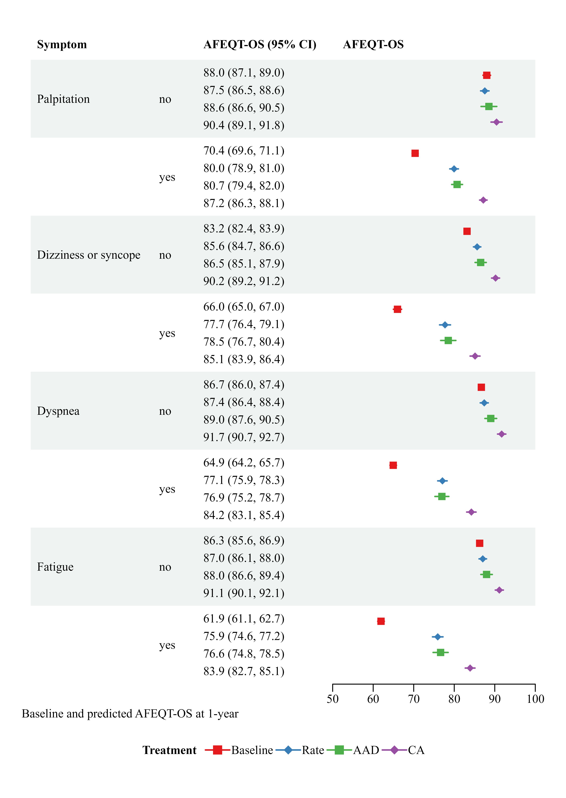

```{r}
library(data.table)
library(easystats)
library(gt)
library(ggplot2)
library(ggsurvfit)
library(plotly)
library(modelsummary)
library(tinytable)
library(marginaleffects)
library(Hmisc)
library(rms)
library(survival)
library(cowplot)
library(MatchIt)
library(WeightIt)
library(tidymodels)
library(xgboost)
```

# 回帰分析について

## 皆さん多変量回帰は好きですか？

-   古くから研究されつくされており、信頼感がある
-   多くの統計ソフトに入っており、行うのが簡単
-   <span style="color:red;">*解釈性が高く、分かりやすい*</span>
-   本当？

## 多変量回帰は簡単？ 

```{r}
#| warning: false
#| fig-cap: "Many regression species"
#| fig-width: 16

theme_set(cowplot::theme_cowplot())

N <- 1000

set.seed(42)
x <- runif(n = N, min = 0, max = 100)

y <- (-20) +x * 1.5 + rnorm(n = N, sd = 5)

dat <- data.table::data.table(x = x, 
                       y = y)[, `:=`(new_y = fcase(y <= 0, 0, 
                                               y >= 100, 100, 
                                               default = y), 
                                     col = fifelse((y <= 0 | y >= 100), 1, 2), 
                                     y_50 = fifelse(y > 50, 1, 0))]                                     

logistic_dat <- glm(y_50~ x, data = dat, family = binomial) |> 
  marginaleffects::predictions() |> 
  as.data.frame() 

bar_data <- data.frame(
  trt =  c(rep("Medication" , 4) , rep("Ablation" , 4) ),
  NYHA = rep(c("I" , "II" , "III", "IV") , 2),
  value = c(10, 20, 30, 40, 40, 30, 20, 10)
  )
 
# bar_data <- matrix(c(10, 20, 30, 40, 40, 30, 20, 10) , ncol=2)
# colnames(bar_data) <- c("Medication","Ablation")
# rownames(bar_data) <- c("NYHA I","NYHA II","NYHA III", "NYHA IV")

# # Get the stacked barplot
# barplot(bar_data, 
#         border="white",
#         width = 0.3,
#         legend.text = rownames(data),
#         args.legend = list(x = "topright"),
#         font.axis=2, 
#         xlab="treatment")


# tinyplot::plt(y ~ x | col, data = dat, fill = 0.3, palette = "ggplot2")
# tinyplot::plt(new_y ~ x | col, data = dat, add = T)
# tinyplot::plt(I(y > 30) ~ x, data = dat, type = type_glm(family = "binomial"))

p1 <- ggplot(dat) + 
  geom_point(aes(x = x, y = y), alpha = 0.5, color = "grey") + 
  geom_point(aes(x = x, y = new_y), color = "steelblue") + 
  labs(title = "Censored regression")


p2 <- ggplot(logistic_dat) + 
    geom_point(aes(x = x, y = y_50)) + 
    geom_line(aes(x = x, y = estimate)) + 
    geom_ribbon(aes(x = x, ymin = conf.low, ymax = conf.high), alpha = 0.3, color = "pink", fill = "pink") + 
    labs(x = "Age", y = "Survival", title = "Logistic regression")

p3 <- ggplot(bar_data, aes(fill=NYHA, y=value, x=trt)) + 
    geom_bar(position="fill", stat="identity", color = "black") + 
    scale_y_continuous(expand = c(0, 0)) + 
    labs(title = "Ordered regression")

p4 <- ggsurvfit::survfit2(Surv(time, status) ~ adhere, data = survival::colon) |> 
  ggsurvfit::ggsurvfit() + 
  labs(title = "Cox proportional hazard model") + 
  cowplot::theme_cowplot()

cowplot::plot_grid(plotlist = list(p1, p2, p3, p4), nrow = 2)

```


-   多変量回帰は多くの種類がある
    -   0/1でLogistic回帰
    -   整数値だとPoisson回帰
    -   順序ロジット
    -   Censored regression(Cox回帰もこのうち)
-   選択肢が多く、その分どうすればよいのか分からない！

## 例えば・・・・・・

-   ICU入室患者に対してRHCが予後を改善するかをみた観察研究[@Connors1996-gz]
    -   Propensity scoreを広めた研究としても有名
-   例えば、RHCが半年以内の死亡と関連するかをロジスティック回帰で解析をする


```{r}

rhc <- data.table::fread("rhc.csv")

used_cols <- c("death_yn", "death_01", "death_days","swang1", "swang_yn", "cat_chf", "cat1", "age", "crea1", "sex", "race", "edu", "income", "wtkilo1", 
  "temp1", "meanbp1", "resp1", "hrt1", "pafi1", "paco21", "ph1", "wblc1", "hema1", 
  "sod1", "pot1", "bili1", "alb1", "cardiohx", "chfhx", "immunhx", "transhx", "amihx")

rhc_prep <- data.table::setDT(rhc)  |> 
  datawizard::data_modify(
      death_01 = fifelse(death == "Yes", 1, 0),
      death_days_pre = fcase(
          death == "Yes", dthdte - sadmdte, 
          death == "No", max(dschdte, lstctdte, na.rm = TRUE) - sadmdte
        ), 
  death_yn = fifelse(
    death == "Yes" & death_days_pre <= 180, 1, 0
  ), 
  death_days = fifelse(death_days_pre <= 180, death_days_pre, 180), 
  alb1 = fifelse(alb1 > 8, NA_real_, alb1), 
  alb1 = fifelse(is.na(alb1), median(alb1), alb1),
  cat_chf = fifelse(cat1 == "CHF", "CHF", "Others"), 
  swang_yn = fifelse(swang1 == "RHC", 1, 0)
) |> 
  tidyr::drop_na(
    death_01, swang1, cat_chf, age, sex, race, edu, income, wtkilo1, temp1, meanbp1, resp1, hrt1, pafi1, paco21, ph1, wblc1, hema1, sod1, pot1, crea1, bili1, alb1, cardiohx, chfhx, immunhx, transhx, amihx
  ) |> 
  dplyr::select(all_of(used_cols))


dd <- rms::datadist(rhc_prep)
options("datadist" = dd)

full_fit <- glm(formula =  death_01 ~ swang1 + cat_chf + age + sex + race + edu + income + wtkilo1 + temp1 + meanbp1 + resp1 + hrt1 + pafi1 + paco21 + ph1 + wblc1 + hema1 + sod1 + pot1 + crea1 + bili1 + alb1 + cardiohx + chfhx + immunhx + transhx + amihx,
               family = binomial,
               data    = rhc_prep)

interact_fit <- glm(formula =  death_01 ~ swang1 + cat_chf + swang1:cat_chf + age + sex + race + edu + income + wtkilo1 + temp1 + meanbp1 + resp1 + hrt1 + pafi1 + paco21 + ph1 + wblc1 + hema1 + sod1 + pot1 + crea1 + bili1 + alb1 + cardiohx + chfhx + immunhx + transhx + amihx,
               family = binomial,
               data    = rhc_prep)

monospline_fit <- glm(formula =  death_01 ~ swang1 + cat_chf + swang1:cat_chf + rcs(age, 4) + crea1 + sex + race + edu + income + wtkilo1 + temp1 + meanbp1 + resp1 + hrt1 + pafi1 + paco21 + ph1 + wblc1 + hema1 + sod1 + pot1 + bili1 + alb1 + cardiohx + chfhx + immunhx + transhx + amihx,
               family = binomial,
               data    = rhc_prep)

```

```{r}

# modelsummary::modelsummary(
#   list("Base" = full_fit),
#   exponentiate = TRUE,
#   coef_rename = c("swang1RHC" = "RHC", "cat_chfOthers" = "Not CHF", "age" = "Age"),
#   fmt = 2,
#   estimate  = "{estimate} [{conf.low}, {conf.high}]",
#   statistic = NULL,
#   coef_omit = "^(?!(swang|cat|age))") |> 
#   tinytable::style_tt(i = 1, j = 1:2, background = "white", color = "red", bold = TRUE)

parameters::compare_models("Base model" = full_fit, 
                           exponentiate = TRUE, 
                           select = "{estimate} [{ci}]") |> 
  dplyr::filter(stringr::str_detect(Parameter, "age|swang1|cat")) |> 
  insight::display(format = "html") |>
  gt::tab_style(
    style = cell_text(color = "red", weight = "bold"),
    locations = cells_body(rows = 1)
  ) 

```

-   結果として、RHCは半年以内の死亡と関連する！
-   しかし、ここで上司からのつっこみ

## 上司からのつっこみ①


## 結果①

```{r}

# modelsummary::modelsummary(
#   list("Base" = full_fit, "Interact" = interact_fit),
#   exponentiate = TRUE,
#   coef_rename = c("swang1RHC" = "RHC", "cat_chfOthers" = "Not CHF", "age" = "Age"),
#   fmt = 2,
#   estimate  = "{estimate} [{conf.low}, {conf.high}]",
#   statistic = NULL,
#   coef_omit = "^(?!(swang|cat|age))") |>
#   tinytable::style_tt(i = 1, j = 1:3, background = "white", color = "red", bold = TRUE)

parameters::compare_models(list("Base model" = full_fit, "Interact model" = interact_fit), 
                           exponentiate = TRUE, select = "{estimate} [{ci}]") |> 
  dplyr::filter(stringr::str_detect(Parameter, "age|swang1|cat")) |> 
  insight::display(format = "html") |>
  gt::tab_style(
    style = cell_text(color = "red", weight = "bold"),
    locations = cells_body(rows = 1)
  ) 


```


## 上司からのつっこみ②


## 結果②

```{r}

# modelsummary::modelsummary(
#   list("Base" = full_fit, "Interact" = interact_fit, "Spline" = monospline_fit),
#   exponentiate = TRUE,
#   coef_rename = c("swang1RHC" = "RHC", "cat_chfOthers" = "Not CHF", "age" = "Age"),
#   fmt = 2,
#   estimate  = "{estimate} [{conf.low}, {conf.high}]",
#   statistic = NULL,
#   coef_omit = "^(?!(swang|cat|age|rcs))") |> 
#   tinytable::style_tt(i = 1, j = 1:4, background = "white", color = "red", bold = TRUE)

parameters::compare_models(list("Base model" = full_fit, "Interact model" = interact_fit, "Spline model" = monospline_fit), 
                           exponentiate = TRUE, select = "{estimate} [{ci}]") |> 
  dplyr::filter(stringr::str_detect(Parameter, "age|swang1|cat")) |> 
  insight::display(format = "html")  |>
  gt::tab_style(
    style = cell_text(color = "red", weight = "bold"),
    locations = cells_body(rows = 1)
  ) 


```

## 最終的に・・・・・・


## 例えば、2つの連続値をSplineで表したの場合

:::: {.columns}

::: {.column width="40%"}
```{r}

monospline_fit_lrm <- rms::lrm(formula =  death_01 ~ swang1*cat_chf + rcs(age, 4) + crea1 + sex + race + edu + income + wtkilo1 + temp1 + meanbp1 + resp1 + hrt1 + pafi1 + paco21 + ph1 + wblc1 + hema1 + sod1 + pot1 + bili1 + alb1 + cardiohx + chfhx + immunhx + transhx + amihx,
               data    = rhc_prep)


spline_fig1 <- rms::Predict(monospline_fit_lrm, age, fun = exp, ref.zero = TRUE) |> 
  ggplot() + 
    labs(y = "aOR for Death") + 
  theme_bw()


spline_fig1

```

:::

::: {.column width="60%"}

```{r}

bispline_fit <- rms::lrm(formula =  death_01 ~ swang1 + cat_chf + rcs(age, 3) * rcs(crea1, 3) + sex + race + edu + income + wtkilo1 + temp1 + meanbp1 + resp1 + hrt1 + pafi1 + paco21 + ph1 + wblc1 + hema1 + sod1 + pot1 + bili1 + alb1 + cardiohx + chfhx + immunhx + transhx + amihx,
               data    = rhc_prep)

spline_dat2 <- rms::Predict(bispline_fit, age, crea1, fun = exp) 


spline_fig2 <- plot_ly(spline_dat2, x = ~age, y = ~crea1, z = ~yhat, opacity = 0.5) |>
      add_trace(type="mesh3d") |>
      layout(
    title = list(
      text = "3D association with two continuous variables with splines",
      font = list(size = 18),
      x = 0.5  # タイトルを中央に（0が左、1が右）
    )
  )

spline_fig2

```

:::

-   解釈・・・・・・

::::

## 我々はどこにいる？


## こんな時にJAMA！



- "誰に"、"どの統計量で"計測するのか？
- <span style="color:red;">**Causal Estimand**</span>を決める [@Dahabreh2024-ea]


## 我々(臨床医)のしたい事

- 根本的な問いかけ
    - 「誰への治療効果ですか？」
    - 「どうやった時の治療効果ですか？」


<!-- ## どうしてこんな事に？

- 基本的に多変量回帰は線形回帰を前提としている
- 線形回帰の条件
  - Linearity: 目的変数と説明変数の間が線形の関係であること．
  - Independence: どの説明変数の残差間にも相関がない．
  - Normality: 残差が正規分布していること
  - Error variance: 残差の等分散性
- これらが満たされない時にInteractionやSplineが必要 -->

## 線形回帰の係数だと駄目な理由は？

- 線形回帰の係数の解釈 = 条件付き期待値
  - 他の値を固定した時に、その因子を1単位変化した時の平均的なアウトカムの変化量
- その結果、係数(OR, HRなど)という1つの値にまるめてしまう
- 複雑な関係性をこの係数のみを報告する事で逆にわかりにくくなる事もある
- Ex. HFmrEFとHFrEFでARNIの効果が変わる
 
## じゃあ、どうやって報告する？

- 「誰に？」「何が？」「どのくらい？」変化したら、アウトカムが変化するか？
- 難しい言葉でいうと**"Estimand"**を報告する必要がある
- 例えば
  1. 群全体: **ATE**
  2. 治療を受けた群全体: **ATT**
  3. 治療を受けなかった群全体: **ATU**


## ここまでの纏め

-   多変量解析は解釈がわかりにくい！
    -   特に、InteractionやSplineが入るとよりわかりにくい
    -   通常の解析だと、結果は集団全体の平均で丸め込まれてしまう
        -   <span style="color:red;">**Estimandをどうやって出せばいい？**</span>

# Standardizationあるいは\n prametric g-formulaの基礎

## Marginal effectsという選択肢

-   G-computationを用いて**限界効果**を出す手法
-   本来は、結果のStandardizationの手法
-   Estimandを決定する方法でもある[@Hernan2024-HERCIW]

## G-computationの考え方




## 実践①

:::: {.columns}

::: {.column width="50%"}

- 生データ

```{r}

rawdata <- marginaleffects::predictions(monospline_fit) |> 
  tibble::as_tibble() |> 
  dplyr::select(rowid, swang1, estimate, conf.low, conf.high, death_01) 

print(rawdata)  

```

:::

::: {.column width="50%"}

- 元データ+swang1列のみ変更して複製したデータセット
```{r}

swang_margin <- marginaleffects::predictions(monospline_fit, variables = "swang1")


doubleddata <- swang_margin |> 
  tibble::as_tibble() |> 
  dplyr::select(rowid, swang1, estimate, conf.low, conf.high, death_01) 
  

print(doubleddata)

```

:::
::::

- 行数が2倍(5733→11466)になっている事に注意！

## 実践②

```{r}

marginaleffects::avg_predictions(monospline_fit, variables = "swang1")

```

- swang1毎でのestimateを纏める
- 差をとったらRisk differenceを出せる
- この結果を変形する事で色々な数値を出せる。

## 実践③

:::: {.columns}

::: {.column width="50%"}

**Risk ratio**

```{r}

marginaleffects::avg_comparisons(
  monospline_fit, 
  variables = "swang1", 
  comparison = "lnratioavg", 
  transform = "exp"
  )

```

:::

::: {.column width="50%"}

**Odds ratio**

```{r}

marginaleffects::avg_comparisons(
  monospline_fit, 
  variables = "swang1", 
  comparison = "lnoravg", 
  transform = "exp"
  )

```

:::

::::

- 疫学的にはリスク差(あるいはリスク比)が最も知りたい数値
- Odds ratioは発生率が低いイベントでないと、Risk ratioと近似出来ない[@Cummings2009-tr]

# G-computtionの応用

## G-computationの応用～ATE/ATT/ATU



-   元データのうち、元々Interventionが0/1の群だけで同様の事をするとATT/ATUも推定可能
-   Interventionだけでなくても、興味がある変数を動かす事で周辺効果(marginal effect)を出すことが可能

## 実践④-1

- 例えば、患者背景がCHFでRHCの効果がどうなるかをみたい時
- まずは交互作用項を含んだ式を作成する

```{r}
summary(monospline_fit)$call

parameters::model_parameters(
  monospline_fit, 
  exponentiate = T
) |> 
print_html()


```

## 実践④-2

- 次に、データセットを介入に併せて(RHCの有無)拡張した上でSubgroupを作成する



## 実践④-3

- このsubgroupにモデルをfitさせて個々人の死亡率を計算する

```{r}

marginaleffects::predictions(
  monospline_fit, 
  variables = "swang1", 
  newdata = subset(cat_chf == "CHF")
  ) |> 
  tibble::as_tibble() |> 
  dplyr::select(rowid, rowidcf, swang1, cat_chf, age, crea1, estimate, conf.low, conf.high)

cat("\n - 例えば、平均するとこんな感じ \n")

marginaleffects::avg_predictions(
  monospline_fit, 
  variables = "swang1", 
  newdata = subset(cat_chf == "CHF")
  )

```

## 実践④-4

- このEstimateを使っていろんな指標を算出する

  - Risk differenceの場合
```{r}

marginaleffects::avg_comparisons(
  monospline_fit, 
  variables = "swang1", 
  newdata = subset(cat_chf == "CHF")
  )

```

  - Odds ratioの場合
```{r}

marginaleffects::avg_comparisons(
  monospline_fit, 
  variables = "swang1", 
  newdata = subset(cat_chf == "CHF"),
  comparison = "lnratioavg", 
  transform = "exp"
  ) 


```


## G-computationの応用～Propensity score match

1.   Propensity score matchを計算
1.   Matched cohortを作成
1.   その上で、共変量を入れたアウトカムモデルで回帰を行う
1. RCTの多変量と同じでバランスをちゃんと取れる
1.   どの群を選ぶかでATT/ATE/ATUも簡単に計算可能！[@Greifer2025-me]

## 実践⑤-1

- まずはPropensity score match行い、Matched dataを出す

:::: {.columns}

::: {.column width="50%"}
```{r}


set.seed(42)

mout <- MatchIt::matchit(formula = swang_yn ~ cat_chf + age + sex + race + edu + income + wtkilo1 + temp1 + meanbp1 + resp1 + hrt1 + pafi1 + paco21 + ph1 + wblc1 + hema1 + sod1 + pot1 + crea1 + bili1 + alb1 + cardiohx + chfhx + immunhx + transhx + amihx, data = rhc_prep, 
method = "nearest", 
distance = "glm"
)

print(mout)

```

:::

::: {.column width="50%"}

```{r}

dat_m <- MatchIt::match_data(mout)

cat("matched data \n")

tibble::as_tibble(dplyr::select(dat_m, death_yn, swang1, cat_chf, age, distance, weights))

```

:::

::::

## 実践⑤-2

- Propensity scoreに用いた共変量を**含めて**アウトカムの回帰モデルを作成する
- この重みも用いることに注意！

```{r}

cat("アウトカムモデル \n")

matched_spline_fit <- glm(formula =  death_01 ~ swang1*cat_chf + rcs(age, 4) + crea1 + sex + race + edu + income + wtkilo1 + temp1 + meanbp1 + resp1 + hrt1 + pafi1 + paco21 + ph1 + wblc1 + hema1 + sod1 + pot1 + bili1 + alb1 + cardiohx + chfhx + immunhx + transhx + amihx,
               data    = dat_m, 
               family = binomial,
               weights = weights)

summary(matched_spline_fit)$call

```


## 実践⑤～結果

<!-- これも見にくいので複数スライドに分ける -->

- G-computationを各々の群で行う

::: {.panel-tabset}

### ATEの場合

```{r}

marginaleffects::comparisons(
  matched_spline_fit, 
  variables = "swang1", 
  vcov = ~subclass) |> 
  tibble::as_tibble() |> 
  dplyr::select(rowid, contrast, estimate, conf.low, conf.high, death_01, swang1, weights)

cat("\n\nここから計算する\n\n")

matched_ate <- avg_comparisons(matched_spline_fit,
                variables = "swang1",
                vcov = ~subclass, 
                comparison = "lnratioavg", 
                transform = "exp"
                )

matched_ate

```

### ATTの場合

```{r}

marginaleffects::comparisons(
  matched_spline_fit, 
  newdata = subset(swang1 == "RHC"),
  variables = "swang1", 
  vcov = ~subclass) |> 
  tibble::as_tibble() |> 
  dplyr::select(rowid, contrast, estimate, conf.low, conf.high, death_01, swang1, weights)

cat("\n\nここから計算する\n\n")

matched_att <- avg_comparisons(matched_spline_fit,
                variables = "swang1",
                vcov = ~subclass,
                newdata = subset(swang1 == "RHC"), 
                comparison = "lnratioavg", 
                transform = "exp"
                )

matched_att 

```

### ATCの場合

```{r}

marginaleffects::comparisons(
  matched_spline_fit, 
  newdata = subset(swang1 == "No RHC"),
  variables = "swang1", 
  vcov = ~subclass) |> 
  tibble::as_tibble() |> 
  dplyr::select(rowid, contrast, estimate, conf.low, conf.high, death_01, swang1, weights)

cat("ここから計算する")


matched_atc <- avg_comparisons(matched_spline_fit,
                variables = "swang1",
                vcov = ~subclass,
                newdata = subset(swang1 == "No RHC"), 
                comparison = "lnratioavg", 
                transform = "exp"
                )

matched_atc

```

:::


## G-computationの応用～Doubly robust

1.   Propensity score weightingを計算
1.   Outcomeを目標とする多変量回帰を作成
1.   上記を組み合わせてDoubly robustを計算可能
1.   どの群を選ぶかでATT/ATE/ATUも簡単に計算可能！

## 実践⑤～結果

1. treatmentを目的としたLogistic regressionを作成して、予測式を作成
1. 予測式とATE/ATT/ATCでそれぞれ重み付けの計算方法を変える(ATOなどもあり)
1. この重みを考慮したアウトカムモデルを作成する
1. このアウトカムモデルで、各データでのG-computationを行う
1. ATEは全体、ATTはRHC使用者、ATCはRHC不使用者

::: {.panel-tabset}

### ATEの場合

```{r}

set.seed(42)

wout_ate <- WeightIt::weightit(formula = swang_yn ~ cat_chf + age + sex + race + edu + income + wtkilo1 + temp1 + meanbp1 + resp1 + hrt1 + pafi1 + paco21 + ph1 + wblc1 + hema1 + sod1 + pot1 + crea1 + bili1 + alb1 + cardiohx + chfhx + immunhx + transhx + amihx, data = rhc_prep, 
method = "glm", 
estimand = "ATE"
)

cat(" \n 1. 重み付けの式 \n")

print(wout_ate$call)

cat("\n 2. 重みを元のデータセットに追加 \n")

dplyr::mutate(rhc_prep, weights = wout_ate$weights) |> 
  tibble::as_tibble() |> 
  dplyr::select(death_01, swang_yn, age, sex, race, cat_chf, crea1, weights)
  
  
cat("\n 3. 重みを考慮したアウトカムモデル \n")

weighted_spline_ate_fit <- WeightIt::glm_weightit(formula =  death_01 ~ swang1*cat_chf + rcs(age, 4) + crea1 + sex + race + edu + income + wtkilo1 + temp1 + meanbp1 + resp1 + hrt1 + pafi1 + paco21 + ph1 + wblc1 + hema1 + sod1 + pot1 + bili1 + alb1 + cardiohx + chfhx + immunhx + transhx + amihx,
               data    = rhc_prep, 
               family = binomial,
               weightit = wout_ate)

print(weighted_spline_ate_fit$call)

cat("\n 4. G-computation \n")

marginaleffects::predictions(
  weighted_spline_ate_fit, 
  variables = "swang1"
) |> 
  tibble::as_tibble() |> 
  dplyr::select(rowid, age, swang1, estimate, conf.low, conf.high) |> 
  print()


cat("\n 5. Risk ratio and 95% confidence interval \n")

marginaleffects::avg_comparisons(weighted_spline_ate_fit,
                variables = "swang1",
                comparison = "lnratioavg",
                transform = "exp")

```

### ATTの場合

```{r}


set.seed(42)

wout_att <- WeightIt::weightit(formula = swang_yn ~ cat_chf + age + sex + race + edu + income + wtkilo1 + temp1 + meanbp1 + resp1 + hrt1 + pafi1 + paco21 + ph1 + wblc1 + hema1 + sod1 + pot1 + crea1 + bili1 + alb1 + cardiohx + chfhx + immunhx + transhx + amihx, data = rhc_prep, 
method = "glm", 
estimand = "ATT"
)

cat(" \n 1. 重み付けの式 \n")

print(wout_att$call)

cat("\n 2. 重みを元のデータセットに追加 \n")

dplyr::mutate(rhc_prep, weights = wout_att$weights) |> 
  tibble::as_tibble() |> 
  dplyr::select(death_01, swang_yn, age, sex, race, cat_chf, crea1, weights)
  
  
cat("\n 3. 重みを考慮したアウトカムモデル \n")

weighted_spline_att_fit <- WeightIt::glm_weightit(formula =  death_01 ~ swang1*cat_chf + rcs(age, 4) + crea1 + sex + race + edu + income + wtkilo1 + temp1 + meanbp1 + resp1 + hrt1 + pafi1 + paco21 + ph1 + wblc1 + hema1 + sod1 + pot1 + bili1 + alb1 + cardiohx + chfhx + immunhx + transhx + amihx,
               data    = rhc_prep, 
               family = binomial,
               weightit = wout_att)

print(weighted_spline_att_fit$call)

cat("\n 4. G-computation \n")

marginaleffects::predictions(
  weighted_spline_att_fit, 
  variables = "swang1", 
  newdata = subset(swang1 == "RHC")
) |> 
  tibble::as_tibble() |> 
  dplyr::select(rowid, age, swang1, estimate, conf.low, conf.high) |> 
  print()


cat("\n 5. Risk ratio and 95% confidence interval \n")

marginaleffects::avg_comparisons(weighted_spline_att_fit,
                variables = "swang1",
                newdata = subset(swang1 == "RHC"),
                comparison = "lnratioavg",
                transform = "exp")

```

### ATC(U)の場合

```{r}

set.seed(42)

wout_atc <- WeightIt::weightit(formula = swang_yn ~ cat_chf + age + sex + race + edu + income + wtkilo1 + temp1 + meanbp1 + resp1 + hrt1 + pafi1 + paco21 + ph1 + wblc1 + hema1 + sod1 + pot1 + crea1 + bili1 + alb1 + cardiohx + chfhx + immunhx + transhx + amihx, data = rhc_prep, 
method = "glm", 
estimand = "ATC"
)

cat(" \n 1. 重み付けの式 \n")

print(wout_atc$call)

cat("\n 2. 重みを元のデータセットに追加 \n")

dplyr::mutate(rhc_prep, weights = wout_atc$weights) |> 
  tibble::as_tibble() |> 
  dplyr::select(death_01, swang_yn, age, sex, race, cat_chf, crea1, weights)
  
  
cat("\n 3. 重みを考慮したアウトカムモデル \n")

weighted_spline_atc_fit <- WeightIt::glm_weightit(formula =  death_01 ~ swang1*cat_chf + rcs(age, 4) + crea1 + sex + race + edu + income + wtkilo1 + temp1 + meanbp1 + resp1 + hrt1 + pafi1 + paco21 + ph1 + wblc1 + hema1 + sod1 + pot1 + bili1 + alb1 + cardiohx + chfhx + immunhx + transhx + amihx,
               data    = rhc_prep, 
               family = binomial,
               weightit = wout_atc)

print(weighted_spline_atc_fit$call)

cat("\n 4. G-computation \n")

marginaleffects::predictions(
  weighted_spline_atc_fit, 
  variables = "swang1", 
  newdata = subset(swang1 == "No RHC")
) |> 
  tibble::as_tibble() |> 
  dplyr::select(rowid, age, swang1, estimate, conf.low, conf.high) |> 
  print()


cat("\n 5. Risk ratio and 95% confidence interval \n")

marginaleffects::avg_comparisons(weighted_spline_atc_fit,
                variables = "swang1",
                newdata = subset(swang1 == "No RHC"),
                comparison = "lnratioavg",
                transform = "exp")

                
```
:::

## G-computationの応用～機械学習を用いた手法

- 厳密にはStandardizationとは違うが・・・・・・
- Datasetを倍にして機械学習で推定する方法をS-learnerという
- 因果推定を行う場合は、重み付けも行うD-learnerやX-learnerもある
- 信頼区間やP値が出せないのが難点
 
## 実践⑤ S-learnerの場合

## 実践⑤～モデル作成

- Machine learning modelとしてXGBoostとする
- ハイパーパラメーターはデフォルト
- 何も考えずに、全体で学習させる

```{r}

set.seed(42)

rhc_ml <- dplyr::mutate(rhc_prep, death_01 = factor(death_01))

xgb_spec <- boost_tree(mode = "classification", engine = "xgboost")

lhs <- "death_01"

rhs <- c("swang1", "cat_chf", "cat1", "age", "crea1", "sex", "race", "edu", "income", 
"wtkilo1", "temp1", "meanbp1", "resp1", "hrt1", "pafi1", "paco21", 
"ph1", "wblc1", "hema1", "sod1", "pot1", "bili1", "alb1", "cardiohx", 
"chfhx", "immunhx", "transhx", "amihx")

rec <- recipe(rhc_ml, death_01 ~ swang1 + cat_chf + cat1 + age + crea1 + sex + race + 
    edu + income + wtkilo1 + temp1 + meanbp1 + resp1 + hrt1 + 
    pafi1 + paco21 + ph1 + wblc1 + hema1 + sod1 + pot1 + bili1 + 
    alb1 + cardiohx + chfhx + immunhx + transhx + amihx) |>
  step_dummy(all_nominal_predictors()) 

rhc_ml2 <- rec |> 
  recipes::prep() |> 
  recipes::bake(new_data = NULL)

wf <- workflows::workflow() |> 
  workflows::add_model(xgb_spec) |> 
  workflows::add_variables(
    outcomes = death_01, 
    predictors = c("age", "crea1", "edu", "wtkilo1", "temp1", "meanbp1", "resp1", 
"hrt1", "pafi1", "paco21", "ph1", "wblc1", "hema1", "sod1", "pot1", 
"bili1", "alb1", "cardiohx", "chfhx", "immunhx", "transhx", "amihx", 
"swang1_RHC", "cat_chf_Others", "cat1_CHF", "cat1_Cirrhosis", 
"cat1_Colon.Cancer", "cat1_Coma", "cat1_COPD", "cat1_Lung.Cancer", 
"cat1_MOSF.w.Malignancy", "cat1_MOSF.w.Sepsis", "sex_Male", "race_other", 
"race_white", "income_X.11..25k", "income_X.25..50k", "income_Under..11k"
)
  ) |> 
  fit(rhc_ml2)

cat("モデルの中身")
workflows::extract_spec_parsnip(wf)
cat("\n")
workflows::extract_fit_engine(wf)

```


## 実践⑤ 仮想データ作成


```{r}

doubleddata <- marginaleffects::datagrid(newdata = rhc_ml, swang1 = unique, grid_type = "counterfactual")

tibble::as_tibble(doubleddata) |> 
  dplyr::select(-death_01)

newdata2 <- rec |> 
  recipes::prep() |> 
  recipes::bake(new_data = doubleddata)


```

## 実践⑤ 結果を纏める

```{r}

res_raw <- dplyr::bind_cols(
  newdata2, 
  predict(wf, new_data = newdata2, type = "class"), 
  predict(wf, new_data = newdata2, type = "prob")
) |> 
  dplyr::mutate(
    swang1 = if_else(swang1_RHC == 0, "No RHC", "RHC")
  ) |> 
  dplyr::rename(
    predicted_class = .pred_class, 
    probability_1 = .pred_1
  ) |> 
  dplyr::select(
    swang1, death_01, probability_1, predicted_class) 

print(res_raw)

marginal_res <- res_raw |>
  dplyr::summarise(
    mean_death_prob = mean(probability_1, na.rm = T), 
    .by = swang1
  )

print(marginal_res)

```

## G-computationの利点

-   「この集団の介入を変えたら、どの程度良くなるか？」をダイレクトに伝えられる[@King2000-ce]
    -   InteractionやSplineなど複雑な式でもシンプルに結果を伝えられる
-   予測と因果を両方行う事が可能！

## 予測～Average marginal prediction

- 通常のアウトカム式のみで一発勝負
- 一応Bias補正方法も存在する[@grf-lab2024-jt]

## 因果～Average comparison

- AIPWやTLMEを使った方が安心かもしれない
  - ただし、効率が悪い可能性もあり

## G-computationでのAdvancedな統計結果の伝え方

- 伝えるEstimandを正確に伝える
- 「誰に」、「もし＊＊したら」、「平均的にどのような効果？」が「どれくらいの確実性」あるかを言う
  - 出来るだけ、臨床的に意味がある差かどうかを考える

# G-computationの限界

- 基本的には通常の回帰と一緒
  - Unobserved confoundingやMisspecificationに弱い
- 予測の為ではなく因果よりと考えたほうが良い
  - モデル作成でStep wiseや機械学習のようなやり方はしないほうが良い
  
# 自分の研究においては・・・・・・

- AF患者において動悸およびそれ以外の症状(息切れ、めまい/失神、倦怠感)のHR-QOLへの影響をみた研究
- 特に、<span style="color:red;">**非動悸の患者においてもCAは有効なのか？**</span>を疑問として提案
- 動悸、息切れ、めまい/失神、倦怠感の有無でCAの有効性をみたかった

## How to use marginal effects



- これを、動悸/めまい/息切れ/倦怠感で各々行った
  - さらに、感度分析で機械学習モデル(grf)を使ってみたりしてみた

## Result

::: {#fig-afsymp-res layout-ncol=3}

{width=90%}


Main figure
:::

- 誰に(症状がある患者)、どの介入(Rate/AAD/CA)を行うとQOLがどうなるか？を臨床的に使いやすく見せることを目的
- そのため、Responder analysisも行った
- 機械学習の結果もRobustnessを示すために行った
 
# 最後に

## Box先生の名言


> すべてのモデルは誤っている。しかし、そのうちのいくつかは役に立つ。

## RでのMarginal effectsの使い方

- `emmeans`, `marginaleffects`, `easystats`の`modelbased`など
- AIMの論文にも記載があり使いやすいのは`marginaleffects`

## Thank you for your listening!!

## References

::: {#refs}
:::