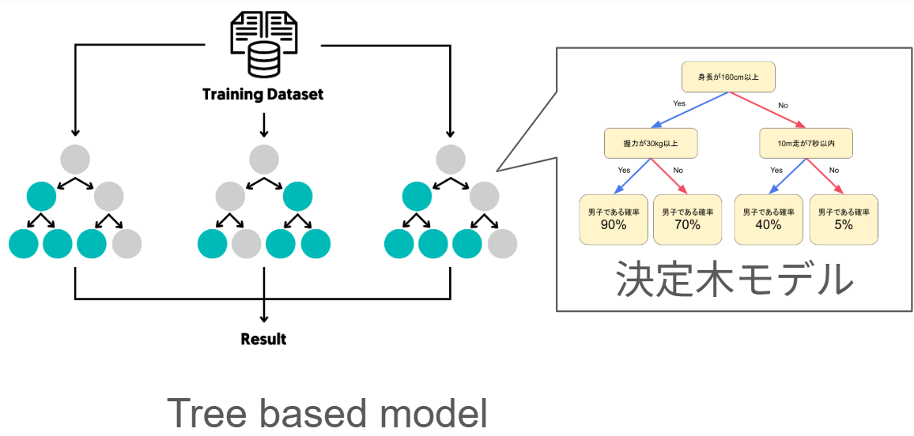
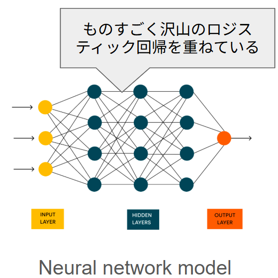
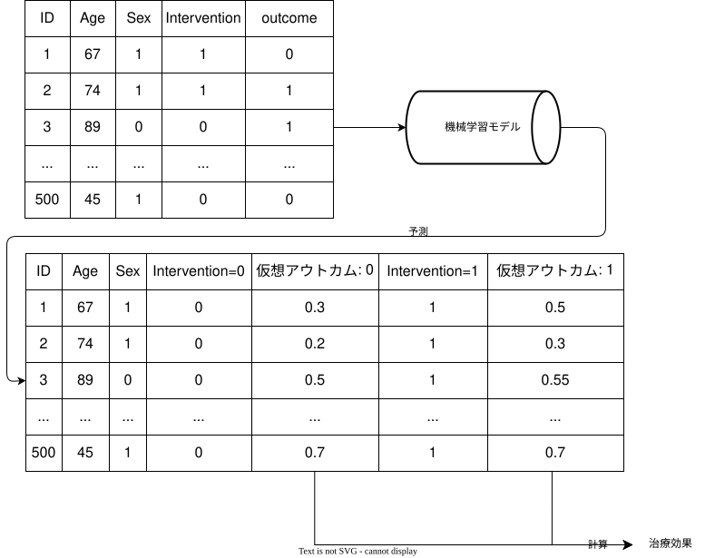
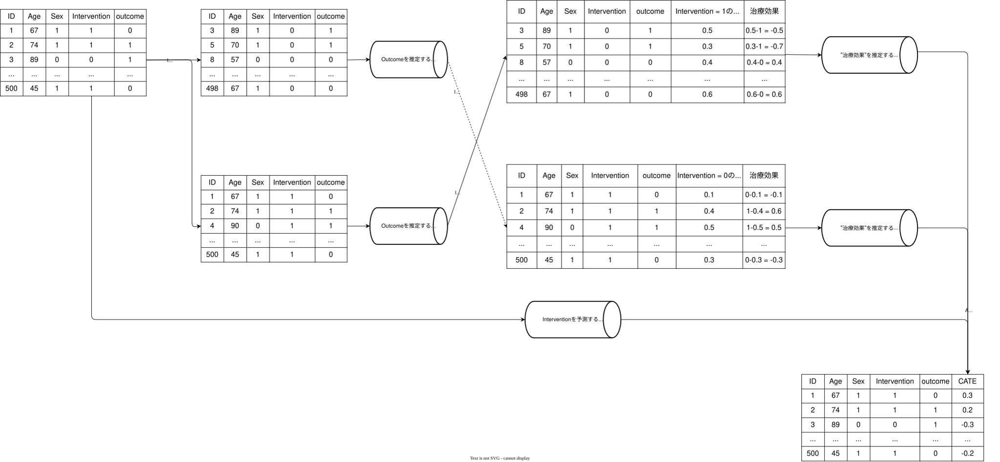
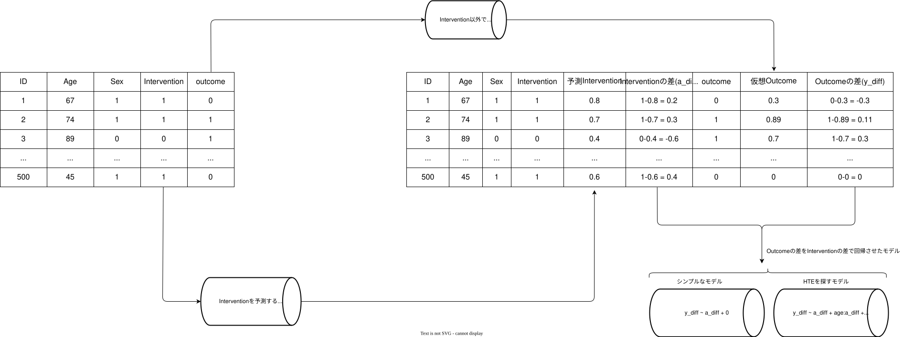
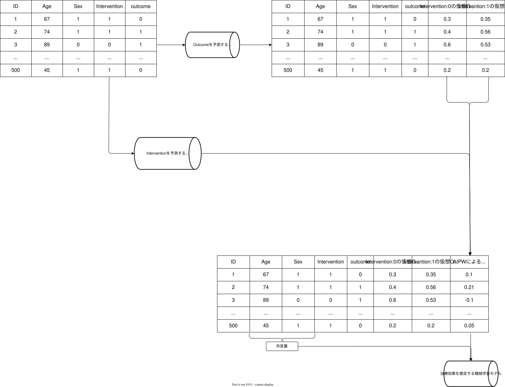

# 因果推論 at glance

```{r}
#| label: setup
#| include: false

library(sessioninfo)
library(reticulate)
library(here)

# reticulate::use_python(
#   here::here(".pixi", "envs", "default", "bin", "python"),
#   required = TRUE
# )

reticulate::py_config()

source(
  here::here(
    "statistics",
    "mlcausal",
    "R",
    "make_toy_data.R"
  ),
  local = knitr::knit_global()
)

toy_objects <- make_toy_data(
  n = 3000L,
  seed = 123L
)

toy_data <- toy_objects$toy_data
full_toy_data <- toy_objects$full_toy_data

rm(toy_objects)

```

## 因果関係

- 医学研究の第一の目標と言っても過言ではない
- "Aの薬を使うと患者の予後は良くなるか？"
- 実際は口で言うほど簡単ではない

## どうして難しいか？

- 因果関係の根本的問題
  - ある個人に「介入をしなかった時」と「介入をした時」の結果を同時に観測できない
- これを解決するために種々の方法が存在する
- 最も有名なのはRCTであるが、RCTは万能ではない
- ConfounderはRandom化でコントロールは出来るが外的妥当性の問題がある
- 観察研究はConfounderがコントロール出来ない

## 因果関係の考え方

- 大きく分けて2つの考え方がある
  - 潜在的アウトカムを考えるRubin流
  - DAGを作り、do operatorを使うPearl流
- 詳細は省くが、今回はPearl流のDAGを中心に考える

## DAGの基本

```{r}
#| label: DAG
#| fig-width: 10
#| fig-height: 4

library(dagitty)
library(ggdag)
library(dplyr)
library(ggplot2)
library(grid)

dag <- dagitty("dag {
  D -> A
  A -> B
  B -> C
  D -> C
  A -> E
  C -> E
}")

# Graphviz版の見た目に合わせて座標を固定
coordinates(dag) <- list(
  x = c(A = 1, B = 4, C = 7, D = 4, E = 4),
  y = c(A = 0, B = 0, C = 0, D = -1, E = 1)
)

labels_ja <- c(
  A = "曝露",
  B = "中間因子",
  C = "アウトカム",
  D = "交絡因子",
  E = "Collider"
)

tidy_dagitty(dag) |>
  mutate(
    label = labels_ja[name],
    label_x = if_else(name == "C", x + 0.05, x),
    label_y = y
  ) |>
  ggplot(aes(x = x, y = y, xend = xend, yend = yend)) +
  geom_dag_edges(
    arrow_directed = grid::arrow(length = grid::unit(8, "pt"), type = "closed")
  ) +
  geom_dag_point(size = 32, alpha = 0.2, color = "#2C7FB8") +
  geom_dag_text(aes(x = label_x, y = label_y, label = label), size = 4, color = "black") +
  theme_dag() +
  coord_equal(xlim = c(0, 8), ylim = c(-1.5, 1.5), clip = "off")


```


- 交絡因子は介入とOutcome両方に関連する上流の因子(介入 <- 交絡 -> アウトカム)
- 中間因子は介入とOutcomeの間にある因子(介入 -> 中間 -> アウトカム)
- Coliderは介入とOutcomeの両方に関連するOutcomeより下流の因子(介入 -> Colider <- アウトカム)
- 基本は交絡因子のみ補正が必要
  - 中間因子を補正すると治療効果が薄まる
  - Coliderを補正してしまうと逆にバイアスが出てくる
- 分かりやすいのは「その因子に絵の具を落としたら、介入とアウトカムの両方に色がつくなら補正する」というルール[@IwanamiDataScience2016Vol3]

## 世界は結構複雑にできている

- 交絡因子の制御は実際はかなり難しい
- 何を、どう補正するか？
- Stratification、Matching、Weighting・・・・・・
- 最もシンプルなのは回帰モデル

## 交絡因子の制御の方法

::: {.panel-tabset}

## Stratification

```{r}
library(MatchIt)
library(marginaleffects)


data("lalonde")

# PS subclassification for the ATT with 5 subclasses
s.out <- matchit(treat ~ age + educ + nodegree +
                    married + re74 + re75,
                  data = lalonde,
                  method = "subclass",
                  subclass = 5, 
                  estimand = "ATT")

summary(s.out, subclass = TRUE)


#Extract matched data
md <- match_data(s.out)

fitS <- lm(re78 ~ treat * (age + educ + nodegree +
                    married + re74 + re75),
           data = md)

avg_comparisons(fitS,
                variables = "treat",
                vcov = "HC3",
                newdata = subset(treat == 1))

```

## Matching

```{r}
library(MatchIt)

m.out1 <- matchit(treat ~ age + educ + race + nodegree +
                    married + re74 + re75,
                  data = lalonde,
                  method = "nearest", 
                  estimand = "ATT")
summary(m.out1)

#Extract matched data
md <- match_data(s.out)

fitM <- lm(re78 ~ treat * (age + educ + nodegree +
                    married + re74 + re75),
           data = md, 
           weights = weights
           )

avg_comparisons(fitM,
                variables = "treat",
                vcov = ~subclass,
                newdata = subset(treat == 1)                
                )


```

## Weighting

```{r}
library(WeightIt)
library(marginaleffects)

W.out <- WeightIt::weightit(treat ~ age + educ + race + nodegree +
                    married + re74 + re75,
                  data = lalonde,
                  method = "glm")

# Fit outcome model
fitW <- lm_weightit(re78 ~ treat * (age + educ + race + married +
                                     nodegree + re74 + re75),
                   data = lalonde, weightit = W.out)
# G-computation for the treatment effect

marginaleffects::avg_comparisons(fitW, variables = "treat",
                newdata = subset(treat == 1))
```

:::

## 通常の回帰モデル

- ただし、これらは基本は「値を基準で固定した上で、treatを0 → 1にした時の平均的な変化」
- その上で、交絡因子が補正しきれるかは不明

## 次の手

- 自由度を上げるために、連続値をrestricted cubic splineに入れる
- 交互作用項を入れる　などなど
- いずれにせよ、**"人の手で"**モデルを作る必要がある

## さらなる補正

- AIPW, TMLE, orthogonalizationなどでDoubly robustな手法
- Outcome modelとPropensity modelを用いてDoubly robustにする

## 特殊な手法

::: {.panel-tabset}

## Augmented Inverse Probability Weighting (AIPW)

```{r}
#| label: scratch-for-AIPW

dat_aipw <- MatchIt::lalonde

ps_fit <- glm(
  treat ~ age + educ + race + married + nodegree + re74 + re75,
  data = dat_aipw,
  family = binomial()
)

ps_trimmed <- predict(ps_fit, type = "response") |>
  (\(x) pmin(pmax(x, 0.01), 0.99))()

outcome_model <- lm(
  re78 ~ treat * (
    age + educ + race + married + nodegree + re74 + re75
  ),
  data = dat_aipw
)

# 全員治療された場合
dat_aipw1 <- transform(dat_aipw, treat = 1L)

# 全員非治療だった場合
dat_aipw0 <- transform(dat_aipw, treat = 0L)

dat_aipw <- dat_aipw |>
  dplyr::mutate(
    ps = ps_trimmed,
    mu1 = predict(outcome_model, newdata = dat_aipw1),
    mu0 = predict(outcome_model, newdata = dat_aipw0),
    phi1 = mu1 + treat / ps * (re78 - mu1),
    phi0 = mu0 + (1 - treat) / (1 - ps) * (re78 - mu0)
  )

# ATEとinfluence functionに基づく標準誤差
psi <- dat_aipw$phi1 - dat_aipw$phi0
ate_aipw <- mean(psi)
aipw_se <- sd(psi) / sqrt(nrow(dat_aipw))

aipw_result <- tibble::tibble(
  estimand = "ATE",
  estimate = ate_aipw,
  conf_low = ate_aipw - 1.96 * aipw_se,
  conf_high = ate_aipw + 1.96 * aipw_se
)

aipw_result

```

$$
\begin{aligned}
\hat{\mu}_1^{\mathrm{AIPW}}
&=
\frac{1}{n}\sum_{i=1}^{n}
\left[
\underbrace{\hat{\mu}_1(X_i)}_{\text{Outcome prediction}}
+
\underbrace{
\frac{A_i}{\hat{e}(X_i)}
\{Y_i-\hat{\mu}_1(X_i)\}
}_{\text{IPW correction}}
\right]
\\[10pt]
\hat{\mu}_0^{\mathrm{AIPW}}
&=
\frac{1}{n}\sum_{i=1}^{n}
\left[
\underbrace{\hat{\mu}_0(X_i)}_{\text{Outcome prediction}}
+
\underbrace{
\frac{1-A_i}{1-\hat{e}(X_i)}
\{Y_i-\hat{\mu}_0(X_i)\}
}_{\text{IPW correction}}
\right]
\end{aligned}
$$

- イメージだと、G-computationによるアウトカムモデルでの仮想データに以下の補正を加えている
  - 治療を受ける/受けないのPropensity scoreの補正
- Doubly robustになっていて、どちらかが一致すれば結果にバイアスは生まれない

## TMLE 

```{r}
#| label: scratch-for-TMLE

# --- 0) 準備 ---------------------------------------------------------------
dat_tmle <- MatchIt::lalonde
A <- dat_tmle$treat
Y <- dat_tmle$re78
n <- nrow(dat_tmle)

# --- 1) まずは素朴な推定（比較用） ----------------------------------------
naive_diff <- mean(Y[A==1]) - mean(Y[A==0])

# --- 2) gモデル（傾向スコア）: P(A=1|W) -----------------------------------
g_fit <- glm(
  treat ~ age + educ + race + married + nodegree + re74 + re75,
  data = dat_tmle,
  family = binomial()
)
g_hat <- predict(g_fit, type = "response")

# 実務では positivity の極端さ対策で truncation をよく入れる
g_hat <- pmin(pmax(g_hat, 0.01), 0.99)

# --- 3) Qモデル（アウトカム回帰）: E(Y|A,W) ---------------------------------
Q_fit <- lm(
  re78 ~ treat * (
    age + educ + race + married + nodegree + re74 + re75
  ),
  data = dat_tmle
)

# 観測された A の下での予測 Q(A,W)
Q_aw <- predict(Q_fit, type = "response")

# 介入した世界（A=1, A=0）の下での予測 Q(1,W), Q(0,W)
Q1_w <- predict(Q_fit, newdata = transform(dat_tmle, treat = 1L))
Q0_w <- predict(Q_fit, newdata = transform(dat_tmle, treat = 0L))

# ここまでが「G-computation（回帰による反実仮想平均）」の素材
gcomp_ate <- marginaleffects::avg_comparisons(Q_fit, variables = "treat")

# --- 4) clever covariate（IPWっぽい重み） -----------------------------------
# 連続アウトカムの基本形では、H1, H0 を使って Q を "必要な方向に" だけ更新する
H1 <- as.numeric(A==1) / g_hat
H0 <- as.numeric(A==0) / (1 - g_hat)

# --- 5) targeting step：epsilon を推定して Q を更新 --------------------------
# 連続(Y)の簡単な形： (Y - Q_aw) を H1, H0 で回帰（切片なし）して epsilon を得る
eps_fit <- lm(I(Y - Q_aw) ~ -1 + H1 + H0)
eps <- coef(eps_fit)
eps1 <- unname(eps["H1"])
eps0 <- unname(eps["H0"])

# 更新後の Q*（observed と intervention の両方）
Qstar_aw <- Q_aw + eps1 * H1 + eps0 * H0
Qstar_1w <- Q1_w + eps1 * (1 / g_hat)
Qstar_0w <- Q0_w + eps0 * (1 / (1 - g_hat))

tmle_ate <- mean(Qstar_1w - Qstar_0w)

# --- 6) 標準誤差（influence function の分散で） ----------------------------
# IC = H1*(Y - Q*) - H0*(Y - Q*) + (Q*(1,W)-Q*(0,W)) - psi
IC <- (H1 - H0) * (Y - Qstar_aw) + (Qstar_1w - Qstar_0w) - tmle_ate
se <- sd(IC) / sqrt(n)
ci <- tmle_ate + c(-1, 1) * 1.96 * se

# --- 7) 結果表示 -----------------------------------------------------------
tmle_result <- tibble::tibble(
  method = c("Naive", "G-computation", "TMLE"),
  estimate = c(naive_diff, gcomp_ate$estimate, tmle_ate),
  conf_low = c(NA_real_, gcomp_ate$conf.low, ci[1]),
  conf_high = c(NA_real_, gcomp_ate$conf.high, ci[2])
)

tmle_result

```

$$
\widehat Q^{\,0}(a,W_i)
=
\widehat{\mathrm E}
\left(
Y_i\mid A_i=a,W_i
\right)
\\[6pt]
\widehat g(W_i)
=
\widehat{\Pr}
\left(
A_i=1\mid W_i
\right)
\\[6pt]
\begin{aligned}
\widehat Q^{\,0}_1(W_i)
&=
\widehat Q^{\,0}(1,W_i)
\\[6pt]
\widehat Q^{\,0}_0(W_i)
&=
\widehat Q^{\,0}(0,W_i)
\end{aligned}
\\[6pt]
\widehat{\mathrm{ATE}}_{\mathrm{TMLE}}
=
\frac{1}{n}
\sum_{i=1}^{n}
\left[
\widehat Q^{\,0}_1(W_i)
-
\widehat Q^{\,0}_0(W_i)
+
\widehat\varepsilon
\left\{
\frac{1}{\widehat g(W_i)}
+
\frac{1}{1-\widehat g(W_i)}
\right\}
\right]
$$

- アウトカムモデルによる予測と実測値の残差を、傾向スコアの逆数から作ったclever covariateで回帰して修正量を求め、その修正量で治療あり・なしの予測値を更新した後、平均差としてATEを計算する。

## Orthogonalization


```{r}
#| label: scratch-for-orthogonalization

dat_ortho <- MatchIt::lalonde

fit_full <- lm(
  re78 ~ treat + age + educ + race + married + nodegree + re74 + re75,
  data = dat_ortho
)

# 共変量からアウトカムを予測して残差化
fit_y <- lm(
  re78 ~ age + educ + race + married + nodegree + re74 + re75,
  data = dat_ortho
)

dat_ortho <- dat_ortho |> 
  dplyr::mutate(
    y_hat = predict(fit_y),
    y_resid = re78 - y_hat
  )

# 共変量から処置確率を予測して残差化
fit_a <- glm(
  treat ~ age + educ + race + married + nodegree + re74 + re75,
  family = binomial(),
  data = dat_ortho
)

dat_ortho <- dat_ortho |> 
  dplyr::mutate(
    a_hat = predict(fit_a, type = "response"),
    a_resid = treat - a_hat
  ) 

fit_orth <- lm(
  y_resid ~ 0 + a_resid,
  data = dat_ortho
)

orth_ci <- confint(fit_orth, "a_resid")

orthogonalization_result <- tibble::tibble(
  method = c("Outcome regression", "Orthogonalization"),
  estimate = c(coef(fit_full)["treat"], coef(fit_orth)["a_resid"]),
  conf_low = c(
    confint(fit_full, "treat")[1],
    orth_ci[1]
  ),
  conf_high = c(
    confint(fit_full, "treat")[2],
    orth_ci[2]
  )
)

orthogonalization_result

```

$$
\begin{aligned}
Y_i &= \theta_0 D_i + g_0(X_i) + \varepsilon_i,
\qquad
\mathbb{E}[\varepsilon_i \mid X_i, D_i] = 0, \\[6pt]
D_i &= m_0(X_i) + V_i,
\qquad
\mathbb{E}[V_i \mid X_i] = 0.
\end{aligned}
$$

- 「アウトカムの実測値と、共変量から予測したアウトカムとの差（残差）」を、「実際の介入と、共変量から予測した介入確率との差（残差）」で回帰する
- シンプルなGLMの場合は通常のGLMの結果と同じになる

:::

## しかしながら・・・・・・

- 結局のところ、モデルは人が作らないといけない
- 非線形な関係も、Interaction termもいずれにせよ人が作る必要がある
- 上記以外にも、「誰に」「どの程度」の治療効果があるか分からない
  - 治療効果の異質性
- RCTでは群レベルでの平均的な治療効果しか分からない
  - この治療は眼の前の患者さんに有益ですか？

## 目の前の患者への利益は通常の回帰だとどうすればいい？

- 簡単にいうとSubgroup解析
  - 恣意的にInteraction項を作らないといけない
- あるいは複雑なモデルにした上でG-computation
- いずれにせよ、線形が前提となる
- 柔軟なモデルで治療の異質性を捉えたい？

# 機械学習 at glance


## 機械学習とは

- 機械学習の定義「学習はデータから学習し、初めてのデータに対して一般化し、明示的な指示なしにタスクを実行できる統計アルゴリズム」
  - 簡単にいうとパターン認識
1. 正解がある: 教師つき学習→予測に用いる
2. 正解がない: 教師なし学習→記述の一種


## 代表的な機械学習

:::: {.columns}


::: {.column width="50%"}




- これはRandom forest
- 小さい木のモデルを並列ではなく直列にするとXGBoostなど

:::

::: {.column width="50%"}



- 沢山のLogistic regression modelを重ねたようなもの

:::

::::

## 機械学習の強みと弱み

- Pros
  - データから関係性を柔軟に読み取る
  - 例えばTree based modelは相互作用を自然に扱うことが出来る
- Cons
  - 複雑なモデルはBlack boxになる
  - Overfittingの問題

# 機械学習と因果推論の出会い

## 因果推論における機械学習の役割

- アウトカムモデル、PS modelを柔軟に扱う
- Interaction termを自然に扱える
  - HTEを自然に扱えないか？

## 機械学習を用いた因果推論について

- 大別してMeta learner系とCausal forest系に分けられる
- 柔軟なモデル作成としてMeta learnerがあり、HTEに強いのがCausal forest
- とはいえ、Causal forestだけで良い気もする

## 注意点

- 基本的にUnobserved confoundingには対応できない
- Collider biasには対応できない
- 過学習の問題
  - cross-fitting
  - Honest
- 解釈が難しい

# meta-learner系

## S-learner



<!-- Todo: 解説を書く -->

## T-learner


<!-- Todo: 解説を書く -->


## X-learner



<!-- Todo: 解説を書く -->

## R-learner



<!-- Todo: 解説を書く -->

## DR-learner



<!-- Todo: 解説を書く -->


## どれがいいの？

- S-learnerが最も直感的ではあるが・・・・・・
- 過去のReviewだとDR-learnerが良さそう
- https://www.pywhy.org/EconML/spec/flowchart.html
- 上記図をmermaidで作る

以下のTableをまとめる

    Inoue K, Adomi M, Efthimiou O, et al. Machine learning approaches to evaluate heterogeneous treatment effects in randomized controlled trials: a scoping review. J Clin Epidemiol. 2024;176(111538):111538. doi:10.1016/j.jclinepi.2024.111538
  


# Causal forestについて

## Random forestについて

## Causal forestの原理

- HTE専用の機械学習
- 基本はRandom forest
- 治療効果の差が最も出やすいように木をTrainingする

## Causal forestの強み

## どれがいいの？


## 機械学習の解釈の問題

- Modelを深堀る: SHAP
- Modelの妥当性を確認: RATE
- Modelを分かりやすく変更: Surrogate tree、Policy tree

## Advanced 

- 95%信頼区間が出せるかどうか？
- Missingnessについて
- Sensitivity analysisはどうすればいい？

# 実践！


## Test-dataset①

```{r}
#| label: DAG-for-ToyData

library(dagitty)
library(ggdag)
library(ggplot2)
library(grid)
library(dplyr)

dag_text <- "
dag {

  Age
  Sex
  BMI

  HF
  SES
  BNP
  LVEF
  Palpitation

  CA
  Outcome

  Age -> HF
  Age -> BNP
  Age -> Palpitation
  Age -> CA
  Age -> Outcome

  Sex -> HF
  Sex -> BNP
  Sex -> Palpitation
  Sex -> CA
  Sex -> Outcome

  BMI -> HF
  BMI -> BNP
  BMI -> CA
  BMI -> Outcome

  LVEF -> HF
  LVEF -> BNP
  LVEF -> CA
  LVEF -> Outcome

  SES -> HF
  SES -> Palpitation
  SES -> CA
  SES -> Outcome

  BNP -> CA
  BNP -> Outcome

  HF -> CA
  HF -> Outcome

  Palpitation -> CA

  CA -> Outcome
}
"

dag <- dagitty(dag_text)

coordinates(dag) <- list(
  x = c(
    # background / baseline
    Age = 0,
    Sex = 0,
    BMI = 0,
    LVEF = 0,

    # intermediate layer 1
    SES = 0,

    # intermediate layer 2
    HF = 1,
    BNP = 1,
    Palpitation = 1,

    # treatment
    CA = 2,

    # outcome
    Outcome = 4
  ),
  y = c(
    # background / baseline
    Age = 5,
    Sex = 4,
    BMI = 3,
    LVEF = 2,
    SES = 1,

    # intermediate layer 2
    HF = 5,
    BNP = 3,
    Palpitation = 1,

    # treatment and outcome
    CA = 3,
    Outcome = 3
  )
)

dag_df <- tidy_dagitty(dag) %>%
  mutate(
    node_type = case_when(
      name == "Frail"   ~ "Unobserved confounder",
      name == "CA"      ~ "Intervention",
      name == "Outcome" ~ "Outcome",
      TRUE              ~ "Confounder"
    )
  )

node_df <- dag_df$data %>%
  distinct(name, x, y, node_type)

edge_df <- dag_df$data %>%
    filter(!is.na(xend), !is.na(yend)) %>%
    distinct(name, x, y, xend, yend) %>%
    mutate(
        edge_type = case_when(
            name == "CA" & xend == node_df$x[node_df$name == "Outcome"] &
                yend == node_df$y[node_df$name == "Outcome"] ~ "CA_to_Outcome",
            yend > y ~ "up",
            yend < y ~ "down",
            TRUE ~ "flat"
        )
    ) %>%
    mutate(
        dx = xend - x,
        dy = yend - y,
        dist = sqrt(dx^2 + dy^2),

        # arrow head が node に隠れないように終点を少し手前にする
        shorten = 0.18,
        xend2 = xend - shorten * dx / dist,
        yend2 = yend - shorten * dy / dist
    )

ggplot() +
    # upward curved arrows
    geom_curve(
        data = filter(edge_df, edge_type == "up"),
        aes(x = x, y = y, xend = xend2, yend = yend2),
        curvature = 0.18,
        angle = 90,
        ncp = 10,
        linewidth = 0.7,
        color = "grey35",
        arrow = grid::arrow(
            length = unit(0.14, "inches"),
            type = "closed"
        )
    ) +

    # downward curved arrows
    geom_curve(
        data = filter(edge_df, edge_type == "down"),
        aes(x = x, y = y, xend = xend2, yend = yend2),
        curvature = -0.18,
        angle = 90,
        ncp = 10,
        linewidth = 0.7,
        color = "grey35",
        arrow = grid::arrow(
            length = unit(0.14, "inches"),
            type = "closed"
        )
    ) +

    # flat curved arrows except CA -> Outcome
    geom_curve(
        data = filter(edge_df, edge_type == "flat"),
        aes(x = x, y = y, xend = xend2, yend = yend2),
        curvature = 0.08,
        angle = 90,
        ncp = 10,
        linewidth = 0.7,
        color = "grey35",
        arrow = grid::arrow(
            length = unit(0.14, "inches"),
            type = "closed"
        )
    ) +

    # CA -> Outcome only: straight arrow
    geom_segment(
        data = filter(edge_df, edge_type == "CA_to_Outcome"),
        aes(x = x, y = y, xend = xend2, yend = yend2),
        linewidth = 0.9,
        color = "grey20",
        arrow = grid::arrow(
            length = unit(0.16, "inches"),
            type = "closed"
        )
    ) +

    # nodes
    geom_point(
        data = node_df,
        aes(x = x, y = y, fill = node_type),
        shape = 21,
        color = "black",
        size = 18
    ) +

    geom_text(
        data = node_df,
        aes(x = x, y = y, label = name),
        size = 3.8
    ) +

    scale_fill_manual(
        values = c(
            "Confounder" = "#4C78A8",
            "Unobserved confounder" = "#F58518",
            "Intervention" = "#E45756",
            "Outcome" = "#54A24B"
        )
    ) +

    theme_dag() +
    labs(
        title = "DAG for Toy Causal Data",
        subtitle = "Hierarchical layout ending with CA → Outcome",
        fill = "Node type"
    )

```

- 治療効果は各々別個にいれてある
- DAGは上記の通り
- CAがメインのInterventionで解析をするアウトカムは3種類
    - 連続値のAFEQT-OS
    - 二値値のbin_outcome(短期の入院の有無など)
    - 生存分析のeventtime, status(長期の心不全あるいは死亡)
- ほとんどの因子は交絡因子だが、palpiationはinstrumental variable (CAには影響するが、outcomeには影響しない)
- SESは観測されない交絡因子

## Test-dataset②

```{r}
#| label: Make-Toydata

print(head(toy_data))

```

## Toy dataの可視化

```{r}
#| label: Visualize-ToyData2

library(tidyverse)
library(tinyplot)


tidyr::pivot_longer(toy_data, cols = everything()) |>
  tinyplot::plt(
  ~ value, facet = ~ name, facet.args = list(free = TRUE),
  data = _,
  type = type_histogram(free = TRUE))

```


## Modification因子と治療効果

::: {.panel-tabset}

## 共変量とRiskの1:1の関係性

```{r}
#| label: Visualize-ToyData1

library(tidyverse)

dplyr::select(full_toy_data, age, age_risk, bnp, bnp_risk, bmi, bmi_risk, lvef, lvef_risk) |>
  dplyr::rename(
    age_rawdata = age,
    bnp_rawdata = bnp,
    bmi_rawdata = bmi,
    lvef_rawdata = lvef
  ) |>
  tidyr::pivot_longer(
    cols = everything(),
    names_to = c("variable", ".value"),
    names_pattern = "^(age|bnp|bmi|lvef)_(rawdata|risk)$"
  ) |>
  tinyplot::plt(
    risk ~ rawdata, facet = ~ variable,
    facet.args = list(free = TRUE),
    data = _
  )

```

## InteractionとRiskの関係性

```{r}
#| label: Visualize-ToyData3

library(tidyverse)

full_toy_data |> 
  dplyr::select(sexm1, age, lvef, treatment_effect) |> 
  dplyr::mutate(
    age_cat = base::cut(age, breaks = seq(30, 100, 10)), 
    lvef_cat = base::cut(lvef, breaks = seq(20, 80, 10))
    ) |> 
  dplyr::summarise(
    mean_trt_eff = mean(treatment_effect), 
    .by = c(age_cat, lvef_cat, sexm1)
  ) |> 
  ggplot(aes(x = age_cat, y = lvef_cat, fill = mean_trt_eff)) +
  geom_tile(color = "white") +
  geom_text(aes(label = round(mean_trt_eff, 2)), size = 3) +
  scale_fill_gradient2(midpoint = 0) +
  labs(
    x = "Age category",
    y = "LVEF category",
    fill = "Mean treatment effect"
  ) +
  facet_grid(~sexm1) + 
  theme_bw()


```

:::

## Thank you for your listening


## Simple regression

```{r}
#| label: simple-regression


library(rms)
library(easystats)
library(modelsummary)

dd <- rms::datadist(toy_data)
options(datadist = "dd")

simple_fit <- lm(afeqt_os ~ age + sexm1 + bmi + hf + bnp + lvef + ca, data = toy_data)

rcs_fit <- lm(afeqt_os ~ rcs(age, 4) + sexm1 + rcs(bmi, 4) + hf + rcs(bnp, 4) + rcs(lvef, 4) + ca, data = toy_data)

modelsummary::modelsummary(list(
  simple = simple_fit,
  rcs = rcs_fit
))

```


## シンプルな回帰モデルの解釈と問題点

- 複数のパラメータを固定した上での目標としたパラメータを1単位変化した時の効果
- 線形である事が条件
- 複雑な関係性を捉えることが出来ない
    - Model misspecificationの問題
    - 治療の異質性を捉えられない

## 例えば

```{r}

marginaleffects::plot_predictions(
  simple_fit, 
  condition = "bmi")

marginaleffects::plot_predictions(
  rcs_fit,
  condition = "bmi")

```

## どうすればRobustになる？

- Propensity score (PS) analysis
  - PS match, PS weight
    - ATT, ATC, ATE, ATOなど
- アウトカムモデル + PS model
  - Doubly robust model
    - 最も有名なものはAIPW
- PS modelを進化させる
  - PSをUpdateさせるTMLE

## Matchingだと

- 一番有名なのはPropensity score matching

```{r}
#| label: propensity-score-analysis

library(MatchIt)
library(WeightIt)
library(marginaleffects)
library(modelsummary)

mout <- MatchIt::matchit(ca ~ age + sexm1 + bmi + hf + bnp + lvef, data = toy_data)

m_dat <- MatchIt::match.data(mout)

fit_match <- glm(afeqt_os ~ ca * (age + sexm1 + bmi + hf + bnp + lvef), data = m_dat)

match_res <- marginaleffects::avg_comparisons(
  fit_match,
  variable = "ca",
  vcoc = ~subclass,
  newdata = subset(ca == 1)
)

wout <- WeightIt::weightit(ca ~ age + sexm1 + bmi + hf + bnp + lvef, data = toy_data, method = "ipt")

weight_res <- WeightIt::lm_weightit(
  afeqt_os ~ ca,
  data = toy_data,
  weightit = wout,
  vcov = "HC0"
)

options("modelsummary_factory_default" = "tinytable")

modelsummary::modelsummary(
  models = list(
    `PS match` = match_res,
    `PS weight` = weight_res
    ),
  estimate = "{estimate} [{conf.low}, {conf.high}]"

)

```


## それでもなお、問題が残る

- アウトカムモデル、PS modelの両者がMisspecificationがあるとバイアスが残る
<!-- Todo: Citationを入れる -->
- Estimandの問題 = 治療効果の異質性
  - Subgroup解析と一緒
  - 自覚的にInteraction termを入れないとちゃんと推定出来ない
- ここに機械学習を持ち込めないか？


```{python}
#| label: S-learner

from econml.metalearners import SLearner
import numpy as np
from sklearn.linear_model import LogisticRegression
from sklearn.ensemble import RandomForestRegressor
import pandas as pd
from sklearn.ensemble import GradientBoostingRegressor
from sklearn.model_selection import train_test_split

toy_data = r.toy_data

X = toy_data.loc[:,["age", "sexm1", "bmi", "hf", "bnp", "lvef"]]
y = toy_data['afeqt_os']
T = toy_data['ca']
n = toy_data.shape[0]

X_train, X_test, y_train, y_test = train_test_split(
    X,
    y,
    test_size=0.2,
    random_state=42,
    stratify=T
    )

T_train = T.loc[y_train.index]
T_test = T.loc[y_test.index]

# Instantiate S learner
overall_model = GradientBoostingRegressor(n_estimators=100, max_depth=6, min_samples_leaf=int(491/100))
S_learner = SLearner(overall_model=overall_model)
# Train S_learner
S_learner.fit(y_train, T_train, X=X_train)
# Estimate treatment effects on test data
S_te = S_learner.effect(X_test)

print(S_te)

```

## Scratch for S-learner

```{r}
#| label: scratch-for-S-learner

library(tidymodels)
library(bonsai)

set.seed(42)

# toy_data_split <- rsample::initial_split(toy_data)
# train_data <- rsample::training(toy_data_split)
# test_data <- rsample::testing(toy_data_split)

# 3. モデルの初期化 (scikit-learn API)
# 引数を指定しない場合、デフォルトのハイパーパラメータが適用されます
# numeric outcome用
# re78やpseudo outcome Dを回帰する
lightgbm_spec <- boost_tree() |>
  set_engine("lightgbm") |> 
  set_mode("regression")

# mu1_hat(x): treated群でfit
lightgbm_fit <- workflow() |>
  add_formula(afeqt_os ~ age + sexm1 + bmi + hf + bnp + lvef + ca) |>
  add_model(lightgbm_spec) |>
  fit(data = toy_data)

fitted_data <- broom::augment(lightgbm_fit, new_data = toy_data)

yardstick::rmse(fitted_data, afeqt_os, .pred)

data_ca0 <- dplyr::mutate(toy_data, ca = 0)

fitted_data_ca0 <- predict(lightgbm_fit, new_data = data_ca0) |> 
  dplyr::rename(ca0_pred = .pred)

data_ca1 <- dplyr::mutate(toy_data, ca = 1)

fitted_data_ca1 <- predict(lightgbm_fit, new_data = data_ca1) |> 
  dplyr::rename(ca1_pred = .pred)

whole_data <- dplyr::bind_cols(
  fitted_data, 
  fitted_data_ca0, 
  fitted_data_ca1
) |> 
  dplyr::mutate(
    ca_diff = ca1_pred - ca0_pred
  )

datawizard::describe_distribution(whole_data, ca_diff)

tinyplot::plt(~ca_diff, data = whole_data, type = type_histogram())

```

## T learner


## Scratch for T-learner


```{python}
#| label: T-learner

from econml.metalearners import TLearner
import numpy as np
import pandas as pd
from sklearn.ensemble import GradientBoostingRegressor
from sklearn.model_selection import train_test_split

X = toy_data.loc[:,["age", "sexm1", "bmi", "hf", "bnp", "lvef"]]
y = toy_data['afeqt_os']
T = toy_data['ca']
n = toy_data.shape[0]

X_train, X_test, y_train, y_test = train_test_split(
    X,
    y,
    test_size=0.2,
    random_state=42,
    stratify=T
    )

T_train = T.loc[y_train.index]
T_test = T.loc[y_test.index]

# Instantiate T learner
models = GradientBoostingRegressor(n_estimators=100, max_depth=6, min_samples_leaf=int(n/100))
T_learner = TLearner(models=models)
# Train T_learner
T_learner.fit(y_train, T_train, X=X_train)
# Estimate treatment effects on test data
T_te = T_learner.effect(X_test)

print("T learnerでの局所治療効果")
print(T_te)

```


```{python}
#| label: X-learner

# Main imports
# Helper imports
import numpy as np
import pandas as pd
import seaborn as sns
from econml.metalearners import XLearner
from numpy.random import binomial, multivariate_normal, normal, uniform
from sklearn.ensemble import GradientBoostingRegressor, RandomForestClassifier
from sklearn.model_selection import train_test_split


X = toy_data.loc[:, ["age", "sexm1", "bmi", "hf", "bnp", "lvef"]]
y = toy_data["afeqt_os"]
T = toy_data["ca"]
n = toy_data.shape[0]

X_train, X_test, y_train, y_test = train_test_split(
    X, y, test_size=0.2, random_state=42, stratify=T
)

T_train = T.loc[y_train.index]
T_test = T.loc[y_test.index]

# モデルの構築
models = GradientBoostingRegressor(max_depth=3, random_state=0)
propensity_model = RandomForestClassifier()
X_learner = XLearner(models=models, propensity_model=propensity_model)
X_learner.fit(y_train, T_train, X=X_train)

# Estimate treatment effects on test data
X_te = X_learner.effect(X_test)

sns.scatterplot(x=X_test['age'], y=X_te)

```

## DR-learner
```{python}
#| label: DR-learner


# Main imports
from econml.dr import DRLearner

# Helper imports
import numpy as np
import pandas as pd
from numpy.random import binomial, multivariate_normal, normal, uniform
from sklearn.ensemble import RandomForestClassifier, GradientBoostingRegressor
from sklearn.model_selection import train_test_split

X = toy_data.loc[:,["age", "sexm1", "bmi", "hf", "bnp", "lvef"]]
y = toy_data['afeqt_os']
T = toy_data['ca']
n = toy_data.shape[0]

X_train, X_test, y_train, y_test = train_test_split(
    X,
    y,
    test_size=0.2,
    random_state=42,
    stratify=T
    )

T_train = T.loc[y_train.index]
T_test = T.loc[y_test.index]

# Instantiate Doubly Robust Learner

outcome_model = GradientBoostingRegressor(n_estimators=100, max_depth=6, min_samples_leaf=int(n/100))
pseudo_treatment_model = GradientBoostingRegressor(n_estimators=100, max_depth=6, min_samples_leaf=int(n/100))
propensity_model = RandomForestClassifier(n_estimators=100, max_depth=6,
                                                  min_samples_leaf=int(n/100))

DR_learner = DRLearner(model_regression=outcome_model, model_propensity=propensity_model,
                       model_final=pseudo_treatment_model, cv=5)
# Train DR_learner
DR_learner.fit(y, T, X=X)
# Estimate treatment effects on test data
DR_te = DR_learner.effect(X_test)

```


```{r}
#| label: scratch-DR-learner

library(tidymodels)
library(dplyr)

set.seed(123)

# ============================================================
# 0. 勉強用のシミュレーションデータを作る
# ============================================================
# 想定:
#   X: 共変量
#   A: 処置 0/1
#   Y: アウトカム
#   tau_true: 本当のCATE = E[Y(1) - Y(0) | X]
#
# 実データでは tau_true は観測できません。
# ここでは答え合わせ用に持たせています。

n <- 2000

x1 <- rnorm(n)
x2 <- rnorm(n)
x3 <- rbinom(n, size = 1, prob = 0.5)
x4 <- runif(n, min = -1, max = 1)

# 真の傾向スコア P(A = 1 | X)
e_true <- plogis( -0.2 + 0.5 * x1 - 0.4 * x2 + 0.4 * x3 + 0.2 * x4)

# 処置割付
A <- rbinom(n, size = 1, prob = e_true)

# Y(0) の条件付き平均
mu0_true <- 1 +
  1.0 * x1 +
  0.5 * x2 -
  0.7 * x3 +
  0.3 * x4

# 真のCATE
tau_true <- 1 +
  0.7 * x1 -
  0.4 * x2 +
  0.5 * x3

# 観測アウトカム
Y <- mu0_true + A * tau_true + rnorm(n, sd = 1)

dat <- tibble(
  id = 1:n,
  Y = Y,
  A = A,
  # parsnipのlogistic_reg用に処置をfactorにもしておく
  A_fac = factor(if_else(A == 1, "treated", "control"), levels = c("control", "treated")),
  x1 = x1,
  x2 = x2,
  x3 = x3,
  x4 = x4,
  e_true = e_true,
  mu0_true = mu0_true,
  tau_true = tau_true
)

# ============================================================
# 1. 2-fold cross-fitting 用のfoldを作る
# ============================================================
# DR-learnerでは、同じデータで nuisance model を学習して
# 同じデータに予測を返すと過学習の影響が入りやすいので、
# ここでは一番簡単な2-fold cross-fittingを手で書きます。
#
# fold 1 の予測には fold 2 で学習したモデルを使う。
# fold 2 の予測には fold 1 で学習したモデルを使う。

dat <- dat %>%
  mutate(fold = sample(rep(1:2, length.out = n)))

# ============================================================
# 2. tidymodelsで使うglmモデルを定義
# ============================================================
# glmだけ使うため、engine = "glm" を明示します。

propensity_spec <- logistic_reg() %>%
  set_engine("glm") %>%
  set_mode("classification")

outcome_spec <- linear_reg() %>%
  set_engine("glm") %>%
  set_mode("regression")

cate_spec <- linear_reg() %>%
  set_engine("glm") %>%
  set_mode("regression")

# ============================================================
# 3. fold 1 に対する nuisance 予測を作る
# ============================================================
# fold 1 の各観測について、
#   e_hat(X)   = P(A = 1 | X)
#   mu1_hat(X) = E[Y | A = 1, X]
#   mu0_hat(X) = E[Y | A = 0, X]
# を作ります。
#
# ただし、モデルの学習には fold 1 を使わず、fold 2 だけを使います。

train_for_fold1 <- dat %>%
  filter(fold != 1)

test_fold1 <- dat %>%
  filter(fold == 1)

# 傾向スコアモデル: A ~ X
e_model_fold1 <- propensity_spec %>%
  fit(
    A_fac ~ x1 + x2 + x3 + x4,
    data = train_for_fold1
  )

# アウトカムモデル: Y ~ A, X, A:X
# Aとの交互作用を入れて、処置効果の異質性を表現できるようにしています。
m_model_fold1 <- outcome_spec %>%
  fit(
    Y ~ A * (x1 + x2 + x3 + x4),
    data = train_for_fold1
  )

# 同じXに対して、仮にA=1だったら、仮にA=0だったら、を予測する
test_fold1_A1 <- test_fold1 %>%
  mutate(A = 1)

test_fold1_A0 <- test_fold1 %>%
  mutate(A = 0)

fold1_dr_parts <- test_fold1 %>%
  mutate(
    e_hat = predict(
      e_model_fold1,
      new_data = test_fold1,
      type = "prob"
    )$.pred_treated,

    mu1_hat = predict(
      m_model_fold1,
      new_data = test_fold1_A1
    )$.pred,

    mu0_hat = predict(
      m_model_fold1,
      new_data = test_fold1_A0
    )$.pred
  )

# ============================================================
# 4. fold 2 に対する nuisance 予測を作る
# ============================================================
# 今度は逆に、fold 2 の予測のために fold 1 だけで学習します。

train_for_fold2 <- dat %>%
  filter(fold != 2)

test_fold2 <- dat %>%
  filter(fold == 2)

e_model_fold2 <- propensity_spec %>%
  fit(
    A_fac ~ x1 + x2 + x3 + x4,
    data = train_for_fold2
  )

m_model_fold2 <- outcome_spec %>%
  fit(
    Y ~ A * (x1 + x2 + x3 + x4),
    data = train_for_fold2
  )

test_fold2_A1 <- test_fold2 %>%
  mutate(A = 1)

test_fold2_A0 <- test_fold2 %>%
  mutate(A = 0)

fold2_dr_parts <- test_fold2 %>%
  mutate(
    e_hat = predict(
      e_model_fold2,
      new_data = test_fold2,
      type = "prob"
    )$.pred_treated,

    mu1_hat = predict(
      m_model_fold2,
      new_data = test_fold2_A1
    )$.pred,

    mu0_hat = predict(
      m_model_fold2,
      new_data = test_fold2_A0
    )$.pred
  )

# ============================================================
# 5. fold 1 と fold 2 の予測を結合する
# ============================================================

dr_data <- bind_rows(fold1_dr_parts, fold2_dr_parts) %>%
  arrange(id)

# 傾向スコアが0や1に近すぎると割り算が暴れるので、
# 勉強用に軽くクリップしておきます。
dr_data <- dr_data %>%
  mutate(
    e_hat_raw = e_hat,
    e_hat = pmin(pmax(e_hat, 0.01), 0.99)
  )

# ============================================================
# 6. DR疑似アウトカムを作る
# ============================================================
# Aが0/1のとき、DR-learnerの疑似アウトカムは
#
# phi =
#   mu1_hat(X) - mu0_hat(X)
#   + A       * {Y - mu1_hat(X)} / e_hat(X)
#   - (1 - A) * {Y - mu0_hat(X)} / {1 - e_hat(X)}
#
# です。
#
# 直感:
#   mu1_hat - mu0_hat
#     -> アウトカムモデルによる処置効果の予測
#
#   A * (Y - mu1_hat) / e_hat
#     -> 処置群で、実際のYとmu1_hatのズレを補正
#
#   -(1 - A) * (Y - mu0_hat) / (1 - e_hat)
#     -> 対照群で、実際のYとmu0_hatのズレを補正
#
# この「アウトカムモデル + IPW的な残差補正」が doubly robust な部分です。

dr_data <- dr_data %>%
  mutate(
    phi_dr =
      (mu1_hat - mu0_hat) +
      A * (Y - mu1_hat) / e_hat -
      (1 - A) * (Y - mu0_hat) / (1 - e_hat)
  )

# 疑似アウトカムを少し見る
dr_data %>%
  select(id, Y, A, e_hat, mu1_hat, mu0_hat, phi_dr, tau_true) %>%
  head()

# ============================================================
# 7. 疑似アウトカムをXに回帰してCATEモデルを作る
# ============================================================
# ここがDR-learnerの最終段階です。
#
#   E[phi_dr | X = x]
#
# を推定します。
#
# 今回はglmだけ使うので、ここも linear_reg(engine = "glm") です。

cate_model <- cate_spec %>%
  fit(
    phi_dr ~ x1 + x2 + x3 + x4,
    data = dr_data
  )

# 各個体の CATE 推定値 tau_hat(X) を得る
dr_data <- dr_data %>%
  mutate(
    tau_hat = predict(
      cate_model,
      new_data = dr_data
    )$.pred
  )

# ============================================================
# 8. ATEも確認する
# ============================================================
# DR疑似アウトカムの平均はATE推定量としても見られます。
# シミュレーションなので真のATEとも比較できます。

ate_check <- tibble(
  estimand = c(
    "true ATE: mean(tau_true)",
    "DR ATE: mean(phi_dr)",
    "plug-in ATE: mean(mu1_hat - mu0_hat)",
    "naive difference in means"
  ),
  value = c(
    mean(dr_data$tau_true),
    mean(dr_data$phi_dr),
    mean(dr_data$mu1_hat - dr_data$mu0_hat),
    mean(dr_data$Y[dr_data$A == 1]) -
      mean(dr_data$Y[dr_data$A == 0])
  )
)

ate_check

# ============================================================
# 9. CATEの答え合わせ
# ============================================================
# 実データでは tau_true は分かりません。
# ここではシミュレーションなので、推定CATEと真のCATEを比べます。

cate_check <- dr_data %>%
  summarise(
    true_ate = mean(tau_true),
    estimated_ate_from_tau_hat = mean(tau_hat),
    cate_rmse = sqrt(mean((tau_hat - tau_true)^2)),
    cate_correlation = cor(tau_hat, tau_true)
  )

cate_check

# ============================================================
# 10. 可視化
# ============================================================
# tau_hat が tau_true に近ければ、点が45度線の近くに並びます。

ggplot(dr_data, aes(x = tau_true, y = tau_hat)) +
  geom_point(alpha = 0.25) +
  geom_abline(slope = 1, intercept = 0, linetype = 2) +
  labs(
    x = "True CATE",
    y = "Estimated CATE by DR-learner",
    title = "DR-learner with tidymodels glm only"
  )

```


```{python}

from econml.cate_interpreter import SingleTreeCateInterpreter

intrp = SingleTreeCateInterpreter(
    include_model_uncertainty=False, max_depth=2, min_samples_leaf=10
)
# We interpret the CATE model's behavior based on the features used for heterogeneity
intrp.interpret(DR_learner, X)
# Plot the tree
intrp.plot(feature_names=["age", "sexm1", "bmi", "hf", "bnp", "lvef"], fontsize=12)

```

## 因果forest

- HTEを計測するのに有名
- Ashey et al 2019


## Survival model

```{r}
library(rms)
library(Hmisc)

dd <- datadist(toy_data)

options(datadist = "dd")

simple_surv_fit <- npsurv(Surv(eventtime, status) ~ ca, data = toy_data)

survplot(simple_surv_fit)

```

```{r}
#| label: survival-model

library(tidyverse)
library(survival)
library(grf)
library(policytree)


survfit_grf <- grf::causal_survival_forest(
  X = toy_data[, c("age", "sexm1", "bmi", "hf", "bnp", "lvef")],
  Y = toy_data$eventtime,
  W = toy_data$ca,
  D = toy_data$status,
  target = "RMST",
  horizon = 365*5,
  num.trees = 500
  )

Gamma.matrix <- double_robust_scores(survfit_grf)

head(Gamma.matrix)

surv_tree <- policytree::policy_tree(
  toy_data[, c("age", "sexm1", "bmi", "hf", "bnp", "lvef")],
  Gamma.matrix,
  depth = 2
)

# plot(surv_tree, leaf.labels = c("Observation", "Chemotherapy"))

# base plot は knitr が各出力形式向けに自動処理する


plot(surv_tree, leaf.labels = c("Observation", "Catheter ablation"))
# cat(DiagrammeRsvg::export_svg(surv_tree_plot), file = here::here("images", 'treeplot.svg'))

```
<!--  -->

```{r}
library(sessioninfo)
sessioninfo::session_info(info = "all")
```
