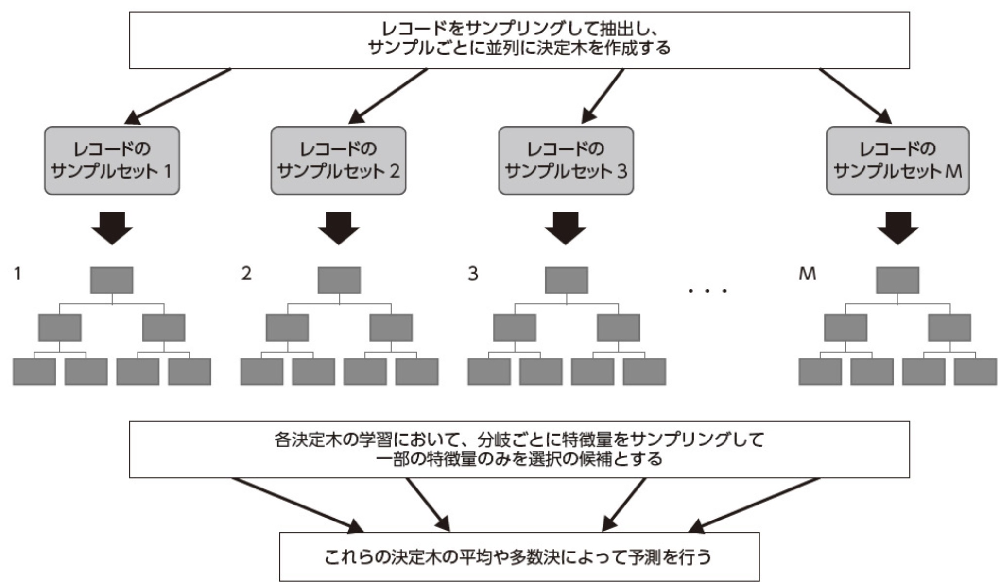
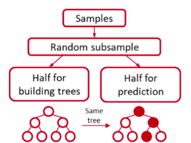
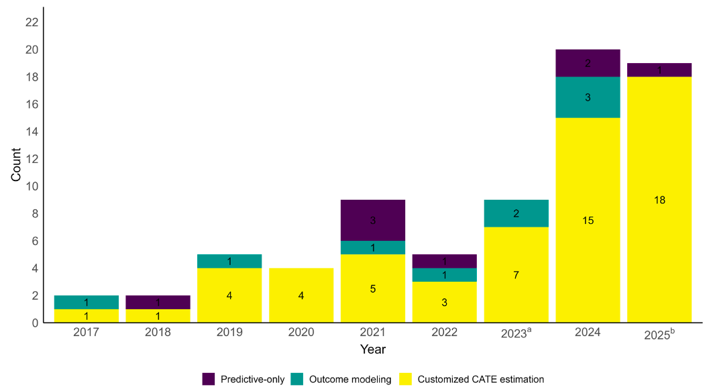

# 因果推論 at glance

```{r}
#| label: setup
#| include: false

library(sessioninfo)
library(here)
library(targets)

mlcausal_store <- here::here(
  "statistics",
  "mlcausal",
  "_targets"
)

targets::tar_load(
  c(
    toy_data,
    full_toy_data,
    test_toy_data,
    full_test_toy_data,
    meta_learner_effects_file,
    meta_learner_evaluation_files,
    external_meta_learner_effects_file,
    external_meta_learner_evaluation_files,
    meta_pdp_data_file,
    meta_shap_data_file,
    policy_features,
    causal_forest_bin,
    causal_forest_policy,
    causal_forest_shap,
    external_evaluation_forest,
    grf_pdp_data,
    grf_cate_shap,
    s_learner_tree_figure,
    t_learner_tree_figure,
    x_learner_tree_figure,
    r_learner_tree_figure,
    dr_learner_tree_figure
  ),
  store = mlcausal_store,
  envir = knitr::knit_global()
)

target_artifact <- function(paths, filename) {
  matched <- paths[basename(paths) == filename]
  stopifnot(length(matched) == 1L)
  unname(matched)
}

target_artifacts_ending_with <- function(paths, suffix) {
  paths[endsWith(basename(paths), suffix)] |> unname()
}

read_validation_tables <- function(paths, suffix) {
  paths |>
    target_artifacts_ending_with(suffix) |>
    lapply(utils::read.csv) |>
    dplyr::bind_rows()
}

# Python owns the numerical work. R reads the cached CSV/SVG artifacts only
# for presentation in the slides; no Python object crosses the session boundary.
meta_learner_effects <- utils::read.csv(meta_learner_effects_file)
learner_summary <- utils::read.csv(
  target_artifact(meta_learner_evaluation_files, "meta-validation.csv")
)
s_learner_effect <- subset(
  meta_learner_effects,
  learner == "S-learner",
  select = c(id, cate_rd)
)
t_learner_effect <- subset(
  meta_learner_effects,
  learner == "T-learner",
  select = c(id, cate_rd)
)
x_learner_effect <- subset(
  meta_learner_effects,
  learner == "X-learner",
  select = c(id, cate_rd)
)
r_learner_effect <- subset(
  meta_learner_effects,
  learner == "R-learner",
  select = c(id, cate_rd)
)
dr_learner_effect <- subset(
  meta_learner_effects,
  learner == "DR-learner",
  select = c(id, cate_rd)
)

external_learner_summary <- read_validation_tables(
  external_meta_learner_evaluation_files,
  "-summary.csv"
)
meta_pdp_data <- utils::read.csv(
  meta_pdp_data_file
)
meta_shap_data <- utils::read.csv(
  meta_shap_data_file
)

```

## 因果関係

- 医学研究の第一の目標と言っても過言ではない
- "Aの薬を使うと患者の予後は良くなるか？"
- 実際は口で言うほど簡単ではない

## どうして難しいか？

- 因果関係の根本的問題
  - ある個人に「介入をしなかった時」と「介入をした時」の結果を同時に観測できない
- これを解決するために種々の方法が存在する
- 最も有名なのはRCTであるが、RCTは万能ではない
- ConfounderはRandom化でコントロールは出来るが外的妥当性の問題がある
- 観察研究はConfounderがコントロール出来ない

## 因果関係の考え方

- 大きく分けて2つの考え方がある
  - 潜在的アウトカムを考えるRubin流
  - DAGを作り、do operatorを使うPearl流
- 詳細は省くが、今回はPearl流のDAGを中心に考える

## DAGの基本

```{r}
#| label: DAG
#| fig-width: 10
#| fig-height: 4

library(dagitty)
library(ggdag)
library(dplyr)
library(ggplot2)
library(grid)

dag <- dagitty("dag {
  D -> A
  A -> B
  B -> C
  D -> C
  A -> E
  C -> E
}")

# Graphviz版の見た目に合わせて座標を固定
coordinates(dag) <- list(
  x = c(A = 1, B = 4, C = 7, D = 4, E = 4),
  y = c(A = 0, B = 0, C = 0, D = -1, E = 1)
)

labels_ja <- c(
  A = "曝露",
  B = "中間因子",
  C = "アウトカム",
  D = "交絡因子",
  E = "Collider"
)

tidy_dagitty(dag) |>
  mutate(
    label = labels_ja[name],
    label_x = if_else(name == "C", x + 0.05, x),
    label_y = y
  ) |>
  ggplot(aes(x = x, y = y, xend = xend, yend = yend)) +
  geom_dag_edges(
    arrow_directed = grid::arrow(length = grid::unit(8, "pt"), type = "closed")
  ) +
  geom_dag_point(size = 32, alpha = 0.2, color = "#2C7FB8") +
  geom_dag_text(aes(x = label_x, y = label_y, label = label), size = 4, color = "black") +
  theme_dag() +
  coord_equal(xlim = c(0, 8), ylim = c(-1.5, 1.5), clip = "off")


```

- 交絡因子は介入とOutcome両方に関連する上流の因子(介入 \<- 交絡 -\> アウトカム)
- 中間因子は介入とOutcomeの間にある因子(介入 -\> 中間 -\> アウトカム)
- Coliderは介入とOutcomeの両方に関連するOutcomeより下流の因子(介入 -\> Colider \<- アウトカム)
- 基本は交絡因子のみ補正が必要
  - 中間因子を補正すると治療効果が薄まる
  - Coliderを補正してしまうと逆にバイアスが出てくる
- 分かりやすいのは「その因子に絵の具を落としたら、介入とアウトカムの両方に色がつくなら補正する」というルール[@Iwanami-2016-sy]

## 世界は結構複雑にできている

- 交絡因子の制御は実際はかなり難しい
- 何を、どう補正するか？
- Stratification、Matching、Weighting・・・・・・
- 最もシンプルなのは回帰モデル

## 交絡因子の制御の方法

::: panel-tabset
## Stratification

```{r}
lalonde <- MatchIt::lalonde
subclassification_fit <- MatchIt::matchit(
  treat ~ age + educ + nodegree + married + re74 + re75,
  data = lalonde,
  method = "subclass",
  subclass = 5,
  estimand = "ATT"
)
subclassification_data <- MatchIt::match_data(subclassification_fit)
subclassification_model <- stats::lm(
  re78 ~ treat * (age + educ + nodegree + married + re74 + re75),
  data = subclassification_data
)

marginaleffects::avg_comparisons(
  subclassification_model,
  variables = "treat",
  vcov = "HC3",
  newdata = dplyr::filter(subclassification_data, treat == 1)
)
```

- Propensity scoreの値を5分位に分けて、各々の層同士で比較して最後に統合する

## Matching

```{r}
matching_fit <- MatchIt::matchit(
  treat ~ age + educ + race + nodegree + married + re74 + re75,
  data = lalonde,
  method = "nearest",
  estimand = "ATT"
)
matching_data <- MatchIt::match_data(matching_fit)
matching_model <- stats::lm(
  re78 ~ treat * (age + educ + nodegree + married + re74 + re75),
  data = matching_data,
  weights = weights
)

marginaleffects::avg_comparisons(
  matching_model,
  variables = "treat",
  vcov = ~subclass,
  newdata = dplyr::filter(matching_data, treat == 1)
)
```

- Propensity scoreが似たものを1:1でMatchingさせる
- 治療側、コントロール側のどちらに合わせるかでATT, ATUが分かる


## Weighting

```{r}
weighting_fit <- WeightIt::weightit(
  treat ~ age + educ + race + nodegree + married + re74 + re75,
  data = lalonde,
  method = "glm"
)
weighting_model <- WeightIt::lm_weightit(
  re78 ~ treat * (age + educ + race + married + nodegree + re74 + re75),
  data = lalonde,
  weightit = weighting_fit
)

marginaleffects::avg_comparisons(
  weighting_model,
  variables = "treat",
  newdata = dplyr::filter(lalonde, treat == 1)
)
```

- Propensity scoreをベースに色々な重みづけをしてバランスをとる
- 疑似RCTとするAverate Treatment Overlappingなども可能[@Thomas2020-qe]

:::

## 通常の回帰モデル

- 因果推論の時の王道中の王道
- ただし、これらは基本は「他の交絡因子の値を固定した上で、treatを0 → 1にした時の平均的な変化」という解釈
  - 細かいEstimandは指定できない
- その上で、交絡因子が補正しきれるかは不明

## 次の手

- 自由度を上げるために、連続値をrestricted cubic splineに入れる
- 交互作用項を入れる　などなど
- AIPW, TMLE, orthogonalizationなどでDoubly robustな手法
  - Outcome modelとPropensity modelを用いてDoubly robustにする
- これらのモデルで機械学習を入れることも可能

## 特殊な手法

::: panel-tabset
## Augmented Inverse Probability Weighting (AIPW)

```{r}
#| label: scratch-for-AIPW
#| echo: true

library(AIPW)
library(SuperLearner) # AIPWからSL.glmを使うために必要

lalonde <- MatchIt::lalonde
W <- lalonde[c("age", "educ", "race", "married", "nodegree", "re74", "re75")]

set.seed(123)
fit <- AIPW$new(
  Y = lalonde$re78, A = lalonde$treat, W = W,
  Q.SL.library = "SL.glm", g.SL.library = "SL.glm",
  k_split = 5, verbose = FALSE
)
fit$fit()
fit$summary()
fit$result["Mean Difference", ]
```

$$\begin{aligned}
\hat{\mu}_1^{\mathrm{AIPW}}
&=
\frac{1}{n}\sum_{i=1}^{n}
\left[
\underbrace{\hat{\mu}_1(X_i)}_{\text{Outcome prediction}}
+
\underbrace{
\frac{A_i}{\hat{e}(X_i)}
\{Y_i-\hat{\mu}_1(X_i)\}
}_{\text{IPW correction}}
\right]
\\[10pt]
\hat{\mu}_0^{\mathrm{AIPW}}
&=
\frac{1}{n}\sum_{i=1}^{n}
\left[
\underbrace{\hat{\mu}_0(X_i)}_{\text{Outcome prediction}}
+
\underbrace{
\frac{1-A_i}{1-\hat{e}(X_i)}
\{Y_i-\hat{\mu}_0(X_i)\}
}_{\text{IPW correction}}
\right]
\end{aligned}
$$

- イメージだと、G-computationによるアウトカムモデルでの仮想データに以下の補正を加えている
  - 治療を受ける/受けないのPropensity scoreの補正
- Doubly robustになっていて、どちらかが一致すれば結果にバイアスは生まれない

### TMLE

```{r}
#| label: scratch-for-TMLE
#| echo: true

lalonde <- MatchIt::lalonde
W <- lalonde[c("age", "educ", "race", "married", "nodegree", "re74", "re75")]

set.seed(123)
fit <- tmle::tmle(
  Y = lalonde$re78, A = lalonde$treat, W = W,
  Q.SL.library = "SL.glm", g.SL.library = "SL.glm",
  family = "gaussian"
)
fit$estimates$ATE[c("psi", "CI")]
```

$$
\widehat Q^{\,0}(a,W_i)
=
\widehat{\mathrm E}
\left(
Y_i\mid A_i=a,W_i
\right)
\\[6pt]
\widehat g(W_i)
=
\widehat{\Pr}
\left(
A_i=1\mid W_i
\right)
\\[6pt]
\begin{aligned}
\widehat Q^{\,0}_1(W_i)
&=
\widehat Q^{\,0}(1,W_i)
\\[6pt]
\widehat Q^{\,0}_0(W_i)
&=
\widehat Q^{\,0}(0,W_i)
\end{aligned}
\\[6pt]
\widehat{\mathrm{ATE}}_{\mathrm{TMLE}}
=
\frac{1}{n}
\sum_{i=1}^{n}
\left[
\widehat Q^{\,0}_1(W_i)
-
\widehat Q^{\,0}_0(W_i)
+
\widehat\varepsilon
\left\{
\frac{1}{\widehat g(W_i)}
+
\frac{1}{1-\widehat g(W_i)}
\right\}
\right]
$$

1. アウトカムモデルによる予測と実測値の残差を出す
2. 傾向スコアの逆数から作ったclever covariateで回帰して修正量を求める
3. アウトカムモデルと修正量でAIPWをしているイメージ

- 簡単に言うと強くなったAIPW

## Orthogonalization

```{r}
#| label: scratch-for-orthogonalization
#| echo: true

library(MatchIt)
library(dplyr)
library(parameters)

lalonde <- MatchIt::lalonde

y_fit <- glm(re78 ~ age + educ + race + married + nodegree + re74 + re75, gaussian(), data = lalonde)
treat_fit <- glm("treat ~ age + educ + race + married + nodegree + re74 + re75", binomial(), data = lalonde)

dat <- dplyr::mutate(
  lalonde,
  y_residual = residuals(y_fit, type = "response"),
  a_residual = treat - fitted(treat_fit)
)

orthogonalization_fit <- glm(y_residual ~ 0 + a_residual, gaussian(), data = dat)

parameters::model_parameters(orthogonalization_fit)
```

$$
\begin{aligned}
\underbrace{Y_i - \widehat{Y}_i}_{\text{アウトカムの残差}}
&=
\theta
\underbrace{\left(A_i - \widehat{A}_i\right)}_{\text{介入の残差}}
+ \varepsilon_i, \\[8pt]
\widehat{Y}_i
&= \widehat{\mathrm{E}}\left(Y_i \mid X_i\right),
\qquad
\widehat{A}_i
= \widehat{\Pr}\left(A_i=1 \mid X_i\right).
\end{aligned}
$$

- 「アウトカムの実測値と、共変量から予測したアウトカムとの差（残差）」を、「実際の介入と、共変量から予測した介入確率との差（残差）」で回帰する
- $\theta$ は交絡因子の影響を取り除いた後の治療効果、$\varepsilon_i$ はこの回帰で説明されない誤差を表す
- outcome側はGaussian GLM、treatment側はbinomial GLMで残差化している
- treatment側も線形確率モデルで残差化した場合は、Frisch--Waugh--Lovell定理により通常の線形回帰と一致する

:::

## しかしながら・・・・・・

- 結局のところ、モデルは人が作らないといけない
- 非線形な関係も、Interaction termもいずれにせよ人が作る必要がある
- 治療効果の異質性はSubgroup analysisを行えばわかるが多重検定の問題となる
  - この治療は眼の前の患者さんに有益ですか？

## Estimandの重要性

- 医学論文において、[**患者の背景**]{style="color: red;font-size: 1.2em;"}というのはRCTの解釈で非常に重要
  - Mitra valveのTEERにおけるCOAPT vs. MITRA-FR trial
  - Cryptogenic strokeに対するPFO closureのRCTの結果の変遷
  - AFのrhythm controlの優位性を示せたEAST-AFNET4 trial
- 患者の性質によって異なる介入の治療効果(Estimand)がある[@Little2021-hz]

## 目の前の患者への有効性

- 因果推論の根源的問題により、ある個人への治療効果(Individual treatment effect)は原理的に推測不可能
- 一方で、患者背景の組み合わせ(46歳、HTN、DMあり、脳梗塞既往なしなど)における治療効果は推定可能
- これをIndividualized treatment effect(ITE)といったりConditional average treatment effect(CATE)と言ったりする[@Segal2023-gi]
- 特にCATEの治療効果のばらつきをHeterogeneity treatment effect(HTE)という

## HTEを見つける意義

**表1. 異質的治療効果（HTE）解析の意義**

| 意義 | 代表的な問い |
|---|---|
| **標的を絞った介入による効率的な医療資源の配分** | ・治療によって特に大きな利益または害を受けるのは誰か？<br>・最も効果的な治療選択肢は何か？<br>・あるサブグループには治療が有効だが、他のサブグループには有害である場合、誰を治療し、誰を治療すべきでないか？ |
| **介入がアウトカムに影響を及ぼすメカニズムの理解** | ・治療効果を規定する特性は何か？<br>・治療はどのようにアウトカムに影響を及ぼすのか？ |
| **仮説生成** | ・さらに検討する価値のある治療効果の異質性には、どのようなパターンがあるか？ |
| **健康格差・公平性（Health equity）** | ・治療は、社会経済的状況が異なる人々に不均衡な影響を及ぼすか？<br>・治療は健康格差を拡大するか、それとも縮小するか？ |
| **一般化可能性とトランスポータビリティ** | ・特定のサンプルで推定された治療効果を、より広い集団に外挿できるか？<br>・対象集団に属する人々が十分に含まれていない（あるいは完全に除外されている）サンプルから推定された治療効果を、その対象集団にも適用できるか？ |

[@Komura2026-se]

# 機械学習 at glance

## 機械学習とは

- 機械学習の定義「学習はデータから学習し、初めてのデータに対して一般化し、明示的な指示なしにタスクを実行できる統計アルゴリズム」
  - 簡単にいうとパターン認識

1.  正解がある: 教師つき学習→予測に用いる
2.  正解がない: 教師なし学習→記述の一種

## 代表的な機械学習

::::: columns
::: {.column width="50%"}


- これはRandom forest
- 小さい木のモデルを並列ではなく直列にするとXGBoostなど
:::

::: {.column width="50%"}


- 沢山のLogistic regression modelを重ねたようなもの
:::
:::::

## 機械学習の強みと弱み

- Pros
  - データから関係性を柔軟に読み取る
  - 例えばTree based modelは相互作用を自然に扱うことが出来る
- Cons
  - 複雑なモデルはBlack boxになる
    - [**現実世界への有用性と妥当性**]{style="color: red;font-size: 1.2em;"}の評価が必要
  - Overfittingの問題
    - [**モデルの評価**]{style="color: red;font-size: 1.2em;"}が必須

# 機械学習と因果推論の出会い

## 因果推論における機械学習の役割

- アウトカムモデル、PS modelを柔軟に扱う
- Interaction termを自然に扱える
- 柔軟なモデルであれば、HTEを自然に扱えないか？[@Khera2024-ho]

## 機械学習を用いた因果推論について

- 大別してMeta learner系とmodified machine-learning系(代表としてCausal forest)に分けられる[@Segal2023-gi]
- 柔軟なモデル作成としてMeta learnerがあり、HTEに強いのがCausal forest
- とはいえ、Causal forestだけで良い気もする

## 注意点

- 基本的にUnobserved confoundingには対応できない
- Collider biasには対応できない
[**魔法の杖ではなく、Designは常に重要**]{style="color: red;font-size: 1.2em;"}
- RCTなどでATEが0だったものについてHTEを探すのは基本的に無意味な事が多い[@Segal2023-gi]

# meta-learner系

## S-learner


- 最も基本的なmeta-learner
- ML modelを用いたG-computationと考えればいい
- Simpleなゆえに了解しやすい
- ただし、介入よりも影響が大きい因子(年齢や腎機能など)の影響が大きいと介入効果が消えることもある(特にLASSOなど)

## T-learner


- 介入の因子を重要視したmeta-learner
- 介入ありの群でのML modelと介入なし群でML modelを別個に作りG-computation
- 介入の効果が消えることはない
- ただし、Doubly robustさはない

## X-learner, DR-learner


- Propensity score weightingを導入したmeta-learner
- T-learnerで推定した治療効果を推測する機械学習モデルにIPWを組み合わせている
- 結構複雑、メインでないモデルのパラメーターを「局外パラメーター」という
- DR-learnerは最後のPropensity scoreの使い方がAIPWになっている

## R-learner


- OrthogonalizationをML modelで行っているという理解
- 交絡因子の影響を除外するというところで強みがある
- HTEをやる場合は最後の回帰が少し特殊


## meta-learnerの比較

| Algorithm | 強み（Strengths） | 限界（Limitations） |
|:---|:---|:---|
| S-learner | - シンプル<br>- 治療効果が単純、またはゼロの場合、T-learnerより優れた性能を示す | - 治療効果の推定に直接最適化されていない<br>- 変数選択を行う手法をベース学習器に用いると、治療変数がモデルから除外される可能性がある<br>- 治療群と対照群の人数が不均衡な場合、不安定になる |
| T-learner | - シンプル<br>- 治療群と対照群を分けて明示的にモデル化する<br>- 治療効果の異質性が強い場合、S-learnerより優れた性能を示す | - 治療効果の推定に直接最適化されていない<br>- 治療群と対照群の人数が不均衡な場合、不安定になる |
| X-learner / DR-learner | - 異質な治療効果を直接推定する<br>- 観察研究でよくみられる不均衡な研究デザインにおいて、特に有効である | - 複雑である<br>- 極端な傾向スコアが存在する場合、不安定になる<br>- 傾向スコアモデルの誤設定に影響されやすい |
| R-learner | - 異なるサブサンプルを用いて、補助的パラメータを推定し、CATEを予測する<br>- 治療効果に対する直接的な損失関数を構成できる | - 複雑である<br>- 極端な傾向スコアが存在する場合、不安定になる<br>- 傾向スコアモデルの誤設定に影響されやすい |


    Komura T, Bargagli-Stoffi FJ, Arah OA, Inoue K. Estimating and discovering heterogeneous treatment effects using machine learning in epidemiological studies: a practical guide. Int J Epidemiol. 2026;55(3). doi:10.1093/ije/dyag092
  
も追記する

: メタラーナーの特徴と限界 {#tbl-metalearner-comparison}
[@Inoue2024-sb]

- S-learnerが最も直感的ではあるが・・・・・・
  - 一番の問題は95%信頼区間などは出せない
- 過去のReviewだとDR-learnerが良さそう
- あまり医学論文だと使われていない印象

# Causal forestについて

## Random forestについて



- Tree-based modelの大御所
- Bootstrapをした行にランダムで少数の変数で簡単な決定木をたくさん作る
  - 当然ながら、この時は「Outcome」を予測するようにTreeを分割させる
- 自然に交互作用や非線形の関係を推測可能
- そのTreeの多数決で予測を行う

## Causal forestの原理



- HTE専用の機械学習
- 基本はRandom forestだが、「治療効果の差が最も出やすいよう」に決定木を分割(して局所で重みづけした回帰)
- Overfittingを防ぐために"Honest"を用いる
  - 分割する部位はサンプルで決定、選択されていない残りのSampleで治療効果を決める

## 結局どれがいいの？

- いずれのモデルもATE, HTEを推定可能
- Meta-learnerの一番の問題は95%信頼区間が出せないこと(あるいは信頼がおけない)
- Robustさを出したり最初に比較をいしても良いが、HTEの研究なら[**Causal forest**]{style="color: red;font-size: 1.2em;"}が現実的に最も良い

# Modelを作った後

## モデルの評価の仕方の概論

- Modelの性能の評価
  - Discrimination, Calibrationなど
- ModelをBlackboxから出す: PDP, SHAPなど
  - Tree Interpreter
- モデルの実施方法
  - Policy tree

## モデルの評価の仕方

- 実際の研究では、HTEのモデルもTRIPOD-AIに従う事が推奨されている[@Segal2023-gi; @Collins2024-mg]
- 通常のモデルと一緒で独立したtest datasetを用意しておく
- 診る項目は2種類
  - Discrimination
    - RATE(AUTOC), Qini, C-for-benefit
  - Calibration
    - best linear predictor
    - GATE
- Meta-learnerの場合は通常の予測モデルの評価も行う

## CATEを図るモデル評価の難しさ

- 通常のモデルの評価方法は"正解"に対して、どの程度予測値が迫っているかを比べる
- 一方で、因果推論モデルの場合は個人レベルの"正解(Individual treatment effects)"は決して分からない
- その為、【ある程度の一貫性】を診たり、【ある群でのATE】を"正解ラベル"として比較している

## Discrimination ~ RATES

:::: columns

::: {.column width="30%"}

```{r}
#| label: make-rate-table
#| results: asis

library(tidyverse)

set.seed(3)

rate_dat <- tibble::tibble(
  id = 1:100,
  predicted_ite = rnorm(100, mean = 2, sd = 3.5),
  ate = 2
) |>
  dplyr::arrange(desc(predicted_ite)) |>
  dplyr::mutate(
    rank = dplyr::row_number(),
    target_fraction = rank / dplyr::n(),
    targeted_ate = dplyr::cummean(predicted_ite),
    toc = targeted_ate - dplyr::first(ate)
  )

rate_table <- rate_dat |>
  dplyr::slice_head(n = 4) |>
  dplyr::mutate(
    predicted_ite_show = round(predicted_ite, 1),
    gain_show = predicted_ite_show - ate,
    toc_show = dplyr::cummean(gain_show),
    `予測された<br>治療効果` = sprintf("%.1f", predicted_ite_show),
    `ATEとの差` = sprintf(
      "%.1f − %.1f<br>= %.1f",
      predicted_ite_show,
      ate,
      gain_show
    ),
    TOC = purrr::map2_chr(
      rank,
      toc_show,
      \(k, toc_k) {
        terms <- sprintf("%.1f", gain_show[seq_len(k)]) |>
          paste(collapse = " + ")

        sprintf("(%s) / %d<br>= %.2f", terms, k, toc_k)
      }
    )
  ) |>
  dplyr::transmute(
    `予測された<br>治療効果`,
    Ranking = rank,
    `ATEとの差`,
    TOC
  )

knitr::kable(
  rate_table,
  format = "html",
  escape = FALSE,
  align = c("r", "r", "l", "l"),
  caption = "1行 = 1%、ATE = 2"
)
```

:::

::: {.column width="70%"}

```{r}
#| label: make-rate-fig

autoc <- mean(rate_dat$toc)

ggplot2::ggplot(
  rate_dat,
  ggplot2::aes(target_fraction, toc)
) +
  ggplot2::geom_hline(
    yintercept = 0,
    linetype = "dashed",
    color = "grey50"
  ) +
  ggplot2::geom_ribbon(
    ggplot2::aes(ymin = 0, ymax = toc),
    fill = "#4E79A7",
    alpha = 0.2
  ) +
  ggplot2::geom_line(
    color = "#4E79A7",
    linewidth = 1.2
  ) +
  ggplot2::scale_x_continuous(
    labels = scales::label_percent(),
    limits = c(0, 1)
  ) +
  ggplot2::labs(
    x = "治療対象とする上位割合 q",
    y = "TOC(q): 上位qの平均治療効果 − 全体ATE"
  ) +
  ggplot2::theme_bw()
```

:::

::: {.column width="10%"}

<div class="flow-operation">
  <div class="flow-arrow">&rarr;</div>
  <div class="flow-caption">上位q%の平均治療効果から<br>全体ATEを引く</div>
</div>

:::

::: {.column width="30%"}


```{r}
#| echo: false

ggplot2::ggplot(
  rate_dat,
  ggplot2::aes(x = target_fraction, y = toc)
) +
  ggplot2::geom_hline(yintercept = 0, linetype = "dashed", color = "grey50") +
  ggplot2::geom_ribbon(
    ggplot2::aes(ymin = 0, ymax = toc),
    fill = "#4E79A7",
    alpha = 0.2
  ) +
  ggplot2::geom_line(color = "#4E79A7", linewidth = 1.2) +
  ggplot2::annotate(
    "label",
    x = 0.98,
    y = max(rate_dat$toc),
    hjust = 1,
    vjust = 1,
    label = sprintf("AUTOC ≈ %.2f", autoc),
    size = 3.5
  ) +
  ggplot2::scale_x_continuous(
    breaks = seq(0, 1, by = 0.25),
    labels = scales::label_percent(),
    limits = c(0, 1)
  ) +
  ggplot2::labs(
    x = "治療対象とする上位割合 q",
    y = "TOC(q): 上位qの平均治療効果 − 全体ATE"
  ) +
  ggplot2::theme_bw(base_size = 11)
```

:::
::::

::: {.small}
この図では説明のため `predicted_ite` を各人の真の治療効果とみなしている。実解析では、独立した評価データから得たdoubly robust scoreで上位群の治療効果を評価する。
:::


- Rankingを連続的に見ていく閾値
- 上位n%でのITEの平均と全体のATEの差をとる(Benefit)

## RATE: AUTOCとQini係数

```{r}
#| label: plot-qini
#| echo: false

qini_dat <- rate_dat |>
  dplyr::mutate(
    weighted_toc = target_fraction * toc
  )

qini <- mean(qini_dat$weighted_toc)

ggplot2::ggplot(
  qini_dat,
  ggplot2::aes(x = target_fraction)
) +
  ggplot2::geom_hline(yintercept = 0, linetype = "dashed", color = "grey50") +
  ggplot2::geom_ribbon(
    ggplot2::aes(ymin = 0, ymax = weighted_toc),
    fill = "#E15759",
    alpha = 0.2
  ) +
  ggplot2::geom_line(
    ggplot2::aes(y = toc, color = "TOC(q)"),
    linewidth = 0.9,
    linetype = "dashed"
  ) +
  ggplot2::geom_line(
    ggplot2::aes(y = weighted_toc, color = "q × TOC(q)"),
    linewidth = 1.2
  ) +
  ggplot2::annotate(
    "label",
    x = 0.98,
    y = max(qini_dat$weighted_toc),
    hjust = 1,
    vjust = 1,
    label = sprintf("QINI ≈ %.2f", qini),
    size = 3.5
  ) +
  ggplot2::scale_x_continuous(
    breaks = seq(0, 1, by = 0.25),
    labels = scales::label_percent(),
    limits = c(0, 1)
  ) +
  ggplot2::scale_color_manual(
    values = c("TOC(q)" = "#4E79A7", "q × TOC(q)" = "#E15759"),
    name = NULL
  ) +
  ggplot2::labs(
    x = "治療対象とする上位割合 q",
    y = "Treatment-effect gain"
  ) +
  ggplot2::theme_bw(base_size = 11) +
  ggplot2::theme(legend.position = "top")
```

- Rankingを連続的に見ていく閾値
- 上位n%でのITEの平均と全体のATEの差をとる(Benefit)
- 横軸にn%、縦軸にこのBenefitの値を並べて面積をとる
- どちらかというと妥当性を診ているイメージ
- Qini係数は、TOCにpercentageで重みづけをしている
  - Cost performanceも見ることができる

## Discrimination ~ C-for-benefit


- 治療群の患者と対照群の患者を、予測CATEまたは背景因子で1対1マッチングする
- 観察されたOutcomeを治療群のOutcome - Ctrl群のOutcomeで計算
- ITEを(治療群のITE + Ctrl群のITE)/2とする
- 全てのペアで確認して、観察されたOutcomeとITEの大小関係が一致する割合をみる
- 観察されたOutcomeを真の治療効果に近似している

## Calibration ~ GATES


```{r}

library(tidyverse)
library(MatchIt)
library(grf)


test_dat <- MatchIt::lalonde

lalonde_cf <- causal_forest(
  X = dplyr::select(test_dat, age, educ, married, nodegree, re74, re75), 
  Y = test_dat$re78, 
  W = test_dat$treat
)

test_dat_prep <- test_dat |> 
  dplyr::mutate(
    predicted_ite = predict(lalonde_cf)$predictions
  ) |> 
  dplyr::mutate(
    rank = dplyr::ntile(
      predicted_ite, 
      n = 4
    )
  ) 

tmp <- dplyr::group_nest(
  test_dat_prep, 
  rank) |> 
  dplyr::mutate(
    model = purrr::map(
      data, \(dat){
        lalonde_cf <- causal_forest(
  X = dplyr::select(dat, age, educ, married, nodegree, re74), 
  Y = dat$re78, 
  W = dat$treat
)
      return(lalonde_cf)
      }
    ), 
    ate = purrr::map(
      model, \(cf){
        grf::average_treatment_effect(
          cf
        )
      }
    )
  )

dplyr::select(
  tmp, -model
) |> 
tidyr::unnest_wider(ate) |> 
tidyr::unnest(data) |> 
dplyr::summarise(
  mean_ite = mean(predicted_ite), 
  grouped_ate = mean(estimate), 
  .by = rank
) |> 
ggplot2::ggplot() + 
  geom_line(aes(x = mean_ite, y = grouped_ate))


```

:::: columns

::: {.column width="30%"}

```{r}
#| echo: false
```

:::

::: {.column width="10%"}

<div class="flow-operation">
  <div class="flow-arrow">&rarr;</div>
  <div class="flow-caption">閾値を動かしながら<br>予測値を作る</div>
</div>

:::

::: {.column width="30%"}


```{r}
#| echo: false
```

:::

::: {.column width="10%"}

<div class="flow-operation">
  <div class="flow-arrow">&rarr;</div>
  <div class="flow-caption">各々の閾値での予測のClassから<br>感度・特異度を計算</div>
</div>

:::

::: {.column width="30%"}


```{r}
#| echo: false
```

:::
::::


- 各人で予想した治療効果を順番に並べる
- 5分位くらいにRankを作って、その中でのITEの平均を出す(予測値)
- 各々の群を一つのデータセットとして別個にATEを出す(真値)
- 実際にランキング通りかどうかを比べる

## Calibration ~ best linear predictor法


$$
Y_i - \hat{m}(X_i), \qquad W_i - \hat{e}(X_i)
$$

$$
Y_i - \hat{m}(X_i)
=
\alpha
\left\{
W_i - \hat{e}(X_i)
\right\}
\bar{\hat{\tau}}
+
\beta
\left\{
W_i - \hat{e}(X_i)
\right\}
\left(
\hat{\tau}_i - \bar{\hat{\tau}}
\right)
+
\varepsilon_i
$$

- causal forestのOOB CATE予測を「平均治療効果成分」と「heterogeneity成分」に分け、outcome/treatmentをorthogonalizeした回帰でcalibrationを評価する。
- grf::test_calibration()では、
  - mean.forest.prediction(上式の $\alpha$ ): 平均CATE予測のcalibration係数。1に近いほど平均効果のscaleが正しい。
  - differential.forest.prediction(上式の $\beta$ ): CATE heterogeneityのcalibration slope。1に近いほどheterogeneityのscaleが正しく、0より有意に大きければHTEの存在を支持する。
- 実際の論文でも`grf::test_calibration()`を評価しているものが多い

## ModelをBlackboxから出す

- 通常の予測モデルと大きな変化はない
  - モデルが何をみているか？: SHAP
  - ある連続値の共変量との関係性: PDP
- 人に解釈できる方法として、HTEを浅い決定木で回帰させる"Surrogate tree"というのもある

## Modelの解釈～Best linear preojection

- 予測されるITE ~ Covariatesで回帰させたもの
- 各Covariatesがどのような影響にITEに影響しているかを見ている
- ドメイン知識との整合性を診ることができる


## モデルの実用法について

- 誰に対して行うとIndividualized treatment effectが1より高くなるかを見る決定木をPolicy treeという
- Surrogate treeと異なり、ITEが0を超えるかどうかで推奨を変える
  - Rだと`policytree` package, pythonだと`econml`で可能
- 実際の論文だと、High/Low riskとHigh/Low benefitの患者のScatter plotをまず記述している事が多い

## 実務において

- Pythonだと`econml`のDRTester
- Rだと`grf`で可能

## Causal forestの場合は


- 論文ではCATE estimation → Calibration → HTE insightsの評価を推奨 [@Komura2026-se]
  - Calibration: Best linear prediction, Calibration plot
  - HTE insights: VIP, SHAP, 各群での患者背景の比較
- grfの作者たちのお勧めは以下の順番
  1. Propensity scoreのoverlap / positivity の確認
  2. IPW後のcovariate balanceの確認
  3. test_calibration() によるfitの評価
  4. GATE/RATE による HTE 評価


# 実際の論文

## HTEの論文は増えている



- 2023年からRWDを用いたHTE関連の研究が急激に増えている
- 循環器領域は全体の23%で悪性腫瘍についで2番目に多い
  - Tree-basedが34%, meta-learnerが26%
- External validation不足(4%のみ)が指摘されている

[@Moller2026-xi]

## meta-learners

- Causal forestに比べると少ない
- 通常のRobustな解析のSensitivity analysisくらいで良いかも

::: {.panel-tabset}

## RCTのSub解析-1

- SepsisにCorticosteroidを用いたRCT複数の二次解析
- SuperLearnerを用いたS-learnerの手法でITEを検出
- ある治療閾値を設定してSurrogate treeを用いて、臨床判断への有用性を記載
[@Pirracchio2020-ta]

## RCTのSub解析-2

- 個々人への適切なDAPT期間を決めるためのiDAPT scoreを作成
- DAPTの期間をみた3 RCTを統合してX-learnerでITEを計算
- 別のRCT dataでExternal validation
- ModelはSHAPで評価
- いわゆる通常のRisk model研究
[@Lee2024-mp]

## RCTのSub解析-3

- 誰が高SpO2目標の管理が有益か？を見つけるための研究
- PILOT trialでModelを作ってICU-ROX trialでExternal validation
- R-learnerを用いてITEを評価
- C-for-benefitとQini curveでDiscrimination、calibration plotでCalibration、PDP plotにSHAPの亜種のSpaghetti plotを記載
- 3群に分けて、どのような群で酸素療法をちゃんとすべきか？を見ている

[@Buell2024-iv]

## 観察研究

- STICH trialをEmulateしたイギリスの大規模データセット
- PCI vs. CABGの治療効果を研究
- 通常の解析以外の感度分析としてS/T/X-learnerを使っている
- 細かい評価などはしていない
[@Pathak2023-mo]

:::


## Causal forest ~ RCTのSub解析

- 全体的にシンプルな構成が多い
- RCTの結果→観察研究への落とし込みで別個の統計的手法が必要ではある

::: {.panel-tabset}

### RCTのSub解析-1

- SPRINTのSub解析
- Causal forestを用いて解析
- SBP ≧144 mmHg, Current smokerはIntensiveな降圧は有害かもしれない
[@Scarpa2019-od]

### RCTのSub解析-2

- 高血圧患者への降圧療法をHigh risk approachではなくHigh benefit approachを提唱した論文
- SPRINT + ACCORD-BP(RCT)のデータとNHANCEのデータを組み合わせている
- SupplementaryにGATESやRATESもありかなりしっかりした解析
[@Inoue2023-ek]

### RCTのSub解析-3

- The Oregon health insurance experiments(Medicaid)のSub解析
- HbA1cの値とSBPの値をアウトカムにしてInstrumental causal foerstで解析
- 全体では差がなくても、便益があるGroupを探すことができる
- Clinical implicationはないが、Policy makerには重要な研究
[@Inoue2024-cl]

### RCTのSub解析-4

- TOPCAT trialのSub解析
- Survival causal forestを用いている
- C for benefitとRATEで評価している

[@Desai2024-pr]

:::

## Causal forest ~ 観察研究

- Propensity score matchで疑似RCT → Causal forestが多い
- target trial emulationを謳うものが多く、Time 0やアウトカムの選定などは今後厳しくなりそう


::: {.panel-tabset}

### 観察研究-1

- MESAを用いたCACの予後に対する影響のHeterogeneityをみた解析(厳密にはHTEではない)
    - 男性のHispanicでASCVD riskが高い患者でCACを計測する意義が高い
- PS matchをした後のデータでCausal forestを使って解析
- C-for-benefitでDiscriminationを評価
- Best linear fitとCalibration plotでCalibrationを評価
- 観察研究での見本となる研究
[@Inoue2023-wl]

### 観察研究-2

- OptumLabs  Data  WarehouseでLAAO vs. DOACを比較 → MayoのデータセットでExternal validation
- PS matchしたデータでCausal forest
- `test_calibration()`でHeterogeneityを検索
- LAAO Benefitial/neutral/harmfulで患者背景を分けて高齢者のComorbiditiesが多いと良いかもという仮説形成
- 各個人のITEのWaterfall plotは結構良い印象
[@Ngufor2025-sd]

:::


# Advanced

## Topic

- 95%信頼区間が出せるかどうか？
- Missingnessについて
- Sensitivity analysisはどうすればいい？
- 生存分析について

## 95%信頼区間が出せるか？

- Causal forestは出せるがmeta-learnerは信頼区間は出せない
  - Bootstrapは可能だが、理論的な妥当性が乏しい
- `econml`の中だとLinearDML, LinearDRLearnerなどは信頼区間を出せるが少し仮定を置いている
- いわゆる、AIPWやTMLEの局外パラメーターだけMLにして最終モデルを通常のglmやSuperlearnerにする方法もある

## Missingnessについて

- 通常の機械学習では多重代入は使えない
- 一方でtree-based approachはnaturalに欠損値を扱える
  - 欠損値だったら……という条件を決定木に読ませる
- 実際の論文だと、Random forestなどのTree-basedのSingle imputationをしている事が多い

## Sensitivity analysisはどうすればいい？

- `EconML`ではRefutation methodで可能[@Feuerriegel2024-ya]
  - 治療やアウトカムをランダムに数値に置き換える, ランダムな数値の交絡因子を入れても問題ないか, 未測定交絡因子を入れても大丈夫かどうか など
- grfでは特に推奨などはなし

## 生存分析について

- econmlではまだ実装されていない
- meta learnerで無理やりやるなら、pseudopopulation(Jackknife法を使って、打ち切りデータを最後まで観察できたものとする)で予測させるなど
- causal forestではnaturalに実装されている
- 論文にはBalanced Individual Treatment Effect in Survival Data (BITES)なども紹介されている[@Moller2026-xi]


# 実践！

## Test-dataset①

```{r}
#| label: DAG-for-ToyData

library(dagitty)
library(ggdag)
library(ggplot2)
library(grid)
library(dplyr)

dag_text <- "
dag {

  Age
  Sex
  BMI

  HF
  SES
  BNP
  LVEF

  CA
  Outcome

  Age -> HF
  Age -> BNP
  Age -> CA
  Age -> Outcome

  Sex -> HF
  Sex -> BNP
  Sex -> CA
  Sex -> Outcome

  BMI -> HF
  BMI -> BNP
  BMI -> CA
  BMI -> Outcome

  LVEF -> HF
  LVEF -> BNP
  LVEF -> CA
  LVEF -> Outcome

  SES -> HF
  SES -> CA
  SES -> Outcome

  BNP -> CA
  BNP -> Outcome

  HF -> CA
  HF -> Outcome

  CA -> Outcome
}
"

dag <- dagitty(dag_text)

coordinates(dag) <- list(
  x = c(
    # background / baseline
    Age = 0,
    Sex = 0,
    BMI = 0,
    LVEF = 0,

    # intermediate layer 1
    SES = 0,

    # intermediate layer 2
    HF = 1,
    BNP = 1,

    # treatment
    CA = 2,

    # outcome
    Outcome = 4
  ),
  y = c(
    # background / baseline
    Age = 5,
    Sex = 4,
    BMI = 3,
    LVEF = 2,
    SES = 1,

    # intermediate layer 2
    HF = 5,
    BNP = 3,

    # treatment and outcome
    CA = 3,
    Outcome = 3
  )
)

dag_df <- tidy_dagitty(dag) %>%
  mutate(
    node_type = case_when(
      name == "SES"     ~ "Unobserved confounder",
      name == "CA"      ~ "Intervention",
      name == "Outcome" ~ "Outcome",
      TRUE              ~ "Confounder"
    )
  )

node_df <- dag_df$data %>%
  distinct(name, x, y, node_type)

edge_df <- dag_df$data %>%
    filter(!is.na(xend), !is.na(yend)) %>%
    distinct(name, x, y, xend, yend) %>%
    mutate(
        edge_type = case_when(
            name == "CA" & xend == node_df$x[node_df$name == "Outcome"] &
                yend == node_df$y[node_df$name == "Outcome"] ~ "CA_to_Outcome",
            yend > y ~ "up",
            yend < y ~ "down",
            TRUE ~ "flat"
        ),
        edge_observation = dplyr::if_else(
            name == "SES",
            "From unobserved SES",
            "Observed path"
        )
    ) %>%
    mutate(
        dx = xend - x,
        dy = yend - y,
        dist = sqrt(dx^2 + dy^2),

        # arrow head が node に隠れないように終点を少し手前にする
        shorten = 0.18,
        xend2 = xend - shorten * dx / dist,
        yend2 = yend - shorten * dy / dist
    )

ggplot() +
    # upward curved arrows
    geom_curve(
        data = filter(edge_df, edge_type == "up"),
        aes(
            x = x, y = y, xend = xend2, yend = yend2,
            linetype = edge_observation
        ),
        curvature = 0.18,
        angle = 90,
        ncp = 10,
        linewidth = 0.7,
        color = "grey35",
        arrow = grid::arrow(
            length = unit(0.14, "inches"),
            type = "closed"
        )
    ) +

    # downward curved arrows
    geom_curve(
        data = filter(edge_df, edge_type == "down"),
        aes(
            x = x, y = y, xend = xend2, yend = yend2,
            linetype = edge_observation
        ),
        curvature = -0.18,
        angle = 90,
        ncp = 10,
        linewidth = 0.7,
        color = "grey35",
        arrow = grid::arrow(
            length = unit(0.14, "inches"),
            type = "closed"
        )
    ) +

    # flat curved arrows except CA -> Outcome
    geom_curve(
        data = filter(edge_df, edge_type == "flat"),
        aes(
            x = x, y = y, xend = xend2, yend = yend2,
            linetype = edge_observation
        ),
        curvature = 0.08,
        angle = 90,
        ncp = 10,
        linewidth = 0.7,
        color = "grey35",
        arrow = grid::arrow(
            length = unit(0.14, "inches"),
            type = "closed"
        )
    ) +

    # CA -> Outcome only: straight arrow
    geom_segment(
        data = filter(edge_df, edge_type == "CA_to_Outcome"),
        aes(x = x, y = y, xend = xend2, yend = yend2),
        linewidth = 0.9,
        color = "grey20",
        arrow = grid::arrow(
            length = unit(0.16, "inches"),
            type = "closed"
        )
    ) +

    # nodes
    geom_point(
        data = node_df,
        aes(x = x, y = y, fill = node_type),
        shape = 21,
        color = "black",
        size = 18
    ) +

    geom_text(
        data = node_df,
        aes(x = x, y = y, label = name),
        size = 3.8
    ) +

    scale_fill_manual(
        values = c(
            "Confounder" = "#4C78A8",
            "Unobserved confounder" = "#F58518",
            "Intervention" = "#E45756",
            "Outcome" = "#54A24B"
        )
    ) +

    scale_linetype_manual(
        values = c(
            "Observed path" = "solid",
            "From unobserved SES" = "dashed"
        )
    ) +

    coord_cartesian(
        xlim = c(-0.5, 4.5),
        ylim = c(0.35, 5.65),
        clip = "off"
    ) +

    theme_dag() +
    theme(
        plot.margin = margin(18, 24, 18, 24),
        legend.position = "bottom"
    ) +
    labs(
        title = "DAG for Toy Causal Data",
        subtitle = "Hierarchical layout ending with CA → Outcome",
        fill = "Node type",
        linetype = "Path type"
    )

```

- 治療効果は各々別個にいれてある
- DAGは上記の通り
- CAがメインのInterventionで解析をするアウトカムは二値値のbin_outcome(死亡または心不全入院の有無など)
- SESは観測されない交絡因子

## Test-dataset②

```{r}
#| label: Make-Toydata

print(head(toy_data))

```

- 治療のPropensity scoreは
  - 男性/若いと受けやすい
  - LVEFが低い/心不全既往があると受けやすい
  - BMIが高いと受けやすく
  - Social economic statusが良いと受けやすい
- 非治療時のイベントリスクの線形予測子は（SESは標準化値）
$$
\begin{aligned}
\eta_i
={}& -7.55
+ 0.70\,\mathrm{AgeRisk}_i
+ 0.90\,\mathrm{HF}_i \\
&- 0.85\,\mathrm{SES}_{z,i}
+ 0.55\,\mathrm{BNPRisk}_i \\
&+ 0.04\,\mathrm{BMIRisk}_i
+ 0.10\,\mathrm{LVEFRisk}_i
\end{aligned}
$$


## Toy dataの可視化

::: panel-tabset

## 連続値の単変量

```{r}
#| label: Visualize-ToyData2

require(Hmisc)
options(prType='html')   # have certain Hmisc functions render in html
require(qreport)
hookaddcap()  
library(tidyverse)
library(tinyplot)

toy_data_label <- tribble(
  ~from, ~to,
  "age", "Age", 
  "sexm1","Male", 
  "bmi", "BMI", 
  "hf" , "HF", 
  "bnp" , "BNP", 
  "lvef" , "LVEF", 
  "palpitation" , "Palpitation", 
  "ca" , "Ablation", 
  "bin_outcome" , "Outcome"
)

rename_vec <- setNames(
  toy_data_label$from,
  toy_data_label$to
)


toy_data |> 
  dplyr::rename(any_of(rename_vec)) |> 
  dplyr::select(-id, -bin_event_free) |> 
  dplyr::mutate(
    dplyr::across(.cols = c(Male, HF, Palpitation, Ablation, Outcome), .fns = \(x)as.factor(x))
  ) |> 
  Hmisc::describe(x = _)

# tidyr::pivot_longer(dplyr::select(toy_data, -id), cols = everything()) |> 
#   dplyr::mutate(
#     name = dplyr::recode_values(
#       name, 
#       from = toy_data_label$from, 
#       to = toy_data_label$to
#     ) |> 
#       forcats::fct_relevel(
#         c("Age", "Male", "BMI", "LVEF", "BNP", "HF", "Palpitation", "Ablation", "Outcome")
#       )
#   ) |> 
#   tinyplot::plt(
#   ~ value, facet = ~ name, facet.args = list(free = TRUE),
#   data = _,
#   type = type_histogram(free = TRUE))

```


## Pair plot

```{r}
#| label: Visualize-ToyData-pairs

library(tidyverse)
library(GGally)


dplyr::select(toy_data, age, sexm1, bmi, hf, bnp, lvef, palpitation, ca) |> 
  rename(any_of(rename_vec)) |>
  dplyr::slice_sample(n = 500) |>
  dplyr::mutate(
    across(c(Male, HF, Palpitation, Ablation), \(x)factor(x))) |>
  GGally::ggpairs() + theme_bw()


```
:::


## Modification因子と治療効果

::: {.panel-tabset}

## ATE

```{r}
full_toy_data |>
  dplyr::summarise(
    n = sum(!is.na(ite_rd_bin)),
    ate_rd = mean(ite_rd_bin, na.rm = TRUE),
    ite_rd_sd = stats::sd(ite_rd_bin, na.rm = TRUE)
  ) |>
  dplyr::mutate(
    ate_rd_se = ite_rd_sd / sqrt(n),
    critical_value = stats::qt(0.975, df = n - 1),
    ci_lower = ate_rd - critical_value * ate_rd_se,
    ci_upper = ate_rd + critical_value * ate_rd_se, 
    `RD 95%CI` = paste0(round(ate_rd, 3), "[", round(ci_lower, 3), " - ", round(ci_upper, 3), "]")
  ) |>
  dplyr::select(
    n,
    `RD 95%CI`
  )　
```

- 集団全体では、`ca = 1` によりイベントリスクが平均5 percent points低下する
- HTEの形は保たれており、患者背景によってbenefitとharmの両方が存在する

## 共変量とOutcomeのRiskの1:1の関係性

```{r}
#| label: Visualize-ToyData1

library(tidyverse)

dplyr::select(full_toy_data, age, age_risk, bnp, bnp_risk, bmi, bmi_risk, lvef, lvef_risk) |>
  dplyr::rename(
    age_rawdata = age,
    bnp_rawdata = bnp,
    bmi_rawdata = bmi,
    lvef_rawdata = lvef
  ) |>
  tidyr::pivot_longer(
    cols = everything(),
    names_to = c("variable", ".value"),
    names_pattern = "^(age|bnp|bmi|lvef)_(rawdata|risk)$"
  ) |>
  tinyplot::plt(
    risk ~ rawdata, facet = ~ variable,
    facet.args = list(free = TRUE),
    data = _
  )

```

<!-- Todo: Hmiscとqreportで作る -->

## 主要な連続値の因子とTreatment effects

```{r}
#| label: Toydata-HTE-vis

library(tidyverse)
library(tinyplot)

dplyr::select(full_toy_data, age, bnp, bmi, lvef, ite_rd_bin) |>
  tidyr::pivot_longer(
    cols = -ite_rd_bin,
    names_to = "name",
    values_to = "value"
  ) |>
  dplyr::mutate(ite_rd_bin = -ite_rd_bin) |>
  tinyplot::plt(
    ite_rd_bin ~ value, facet = ~ name,
    type = type_loess(),
    draw = abline(h = 0, lty = 2, col = "black"),
    facet.args = list(free = TRUE),
    ylim = c(-0.2, 0.3),
    data = _
  )

```

## Treatment effectのHeterogeneity

```{r}
#| label: Visualize-ToyData3

library(tidyverse)

full_toy_data |>
  dplyr::select(sexm1, age, lvef, ite_rd_bin) |>
  dplyr::mutate(
    sexm1 = if_else(sexm1 == 1, "Male", "Female"),
    age_cat = base::cut(age, breaks = seq(30, 100, 10), labels = c("30s", "40s", "50s", "60s", "70s", "80s", "90s")),
    lvef_cat = base::cut(lvef, breaks = seq(20, 80, 10), labels = c("20s%", "30s%", "40s%", "50s%", "60s%", "70s%"))
    ) |>
  dplyr::summarise(
    mean_trt_eff = mean(-ite_rd_bin),
    .by = c(age_cat, lvef_cat, sexm1)
  ) |>
  ggplot(aes(x = age_cat, y = lvef_cat, fill = mean_trt_eff)) +
  geom_tile(color = "white") +
  geom_text(aes(label = round(mean_trt_eff, 2)), size = 3) +
  scale_fill_gradient2(midpoint = 0) +
  labs(
    x = "Age category",
    y = "LVEF category",
    fill = "Mean treatment effect"
  ) +
  facet_grid(~sexm1) +
  theme_bw()


```
:::

## Meta-learners

::: {.panel-tabset}

## S-learner

```{python}
#| label: s-learner-binary
#| echo: true
#| eval: false

import numpy as np
import pandas as pd
from econml.metalearners import SLearner
from sklearn.ensemble import HistGradientBoostingClassifier
from sklearn.model_selection import train_test_split
from xgboost import XGBRegressor


toy_data = r.toy_data.copy()
feature_names = ["age", "sexm1", "bmi", "hf", "bnp", "lvef"]

X = toy_data.loc[:, feature_names].astype(float)
Y = toy_data["bin_outcome"].astype(int)
T = toy_data["ca"].astype(int)

# treatment と outcome の4群がおおむね保たれるように分割する
strata = T.astype(str) + "_" + Y.astype(str)
X_train, X_test, Y_train, Y_test, T_train, T_test = train_test_split(
    X, Y, T,
    test_size=0.2,
    random_state=123,
    stratify=strata,
)

xgb_binary_params = {
    "objective": "binary:logistic",
    "eval_metric": "logloss",
    "n_estimators": 300,
    "learning_rate": 0.05,
    "max_depth": 3,
    "min_child_weight": 10,
    "subsample": 0.8,
    "colsample_bytree": 0.8,
    "reg_lambda": 1.0,
    "random_state": 123,
    "n_jobs": -1,
}

# objective="binary:logistic" では predict() が P(Y=1 | X, T) を返す
outcome_model = XGBRegressor(
    **xgb_binary_params,
)

s_learner = SLearner(overall_model=outcome_model)
s_learner.fit(Y_train, T_train, X=X_train)

# 各人の CATE = P(Y=1|do(T=1), X) - P(Y=1|do(T=0), X)
s_cate_rd = np.asarray(
    s_learner.effect(X_test, T0=0, T1=1)
).reshape(-1)

s_effect_df = pd.DataFrame({
    "id": toy_data.loc[X_test.index, "id"].to_numpy(),
    "cate_rd": s_cate_rd,
})

print(s_effect_df.head())
print(f"ATE in test set (risk difference): {s_cate_rd.mean():.3f}")

```

```{r}
#| label: show-s-learner-result

print(utils::head(s_learner_effect))
cat(sprintf(
  "ATE in test set (risk difference): %.3f\n",
  mean(s_learner_effect$cate_rd)
))
```

- `s_cate_rd` は確率スケールの治療効果（risk difference）であり、負の値は `ca = 1` によるイベントリスク低下を表す
- S-learnerは1つのモデルで $E(Y \mid X, T)$ を学習し、各対象者について `T = 1` と `T = 0` の予測確率の差を取る
- 因果効果として解釈するには、未測定交絡がないこと、positivity、consistencyなどの仮定が必要

## T-learner

```{python}
#| label: t-learner-binary
#| echo: true
#| eval: false

from econml.metalearners import TLearner

t_outcome_model = XGBRegressor(
    **xgb_binary_params,
)

# T=0 と T=1 で別々の outcome model を学習する
t_learner = TLearner(models=t_outcome_model)
t_learner.fit(Y_train, T_train, X=X_train)

t_cate_rd = np.asarray(
    t_learner.effect(X_test, T0=0, T1=1)
).reshape(-1)

t_effect_df = pd.DataFrame({
    "id": toy_data.loc[X_test.index, "id"].to_numpy(),
    "cate_rd": t_cate_rd,
})

print(t_effect_df.head())
print(f"ATE in test set (risk difference): {t_cate_rd.mean():.3f}")
```

```{r}
#| label: show-t-learner-result

print(utils::head(t_learner_effect))
cat(sprintf(
  "ATE in test set (risk difference): %.3f\n",
  mean(t_learner_effect$cate_rd)
))
```

- T-learnerは `T = 0` と `T = 1` で2つの予測確率モデルを作り、その差をCATEとする
- 各治療群のサンプル数が少ない場合、それぞれのoutcome modelが不安定になりやすい

## X-learner

```{python}
#| label: x-learner-binary
#| echo: true
#| eval: false

from econml.metalearners import XLearner
from sklearn.ensemble import HistGradientBoostingRegressor

x_outcome_model = XGBRegressor(
    **xgb_binary_params,
)

# imputed treatment effect（連続値）を学習するための回帰モデル
x_cate_model = HistGradientBoostingRegressor(
    learning_rate=0.05,
    max_iter=200,
    max_leaf_nodes=15,
    min_samples_leaf=30,
    l2_regularization=1.0,
    random_state=123,
)

# P(T=1 | X) を学習するモデル
x_propensity_model = HistGradientBoostingClassifier(
    learning_rate=0.05,
    max_iter=150,
    max_leaf_nodes=15,
    min_samples_leaf=30,
    l2_regularization=1.0,
    random_state=123,
)

x_learner = XLearner(
    models=x_outcome_model,
    cate_models=x_cate_model,
    propensity_model=x_propensity_model,
)
x_learner.fit(Y_train, T_train, X=X_train)

x_cate_rd = np.asarray(
    x_learner.effect(X_test, T0=0, T1=1)
).reshape(-1)

x_effect_df = pd.DataFrame({
    "id": toy_data.loc[X_test.index, "id"].to_numpy(),
    "cate_rd": x_cate_rd,
})

print(x_effect_df.head())
print(f"ATE in test set (risk difference): {x_cate_rd.mean():.3f}")

```

```{r}
#| label: show-x-learner-result

print(utils::head(x_learner_effect))
cat(sprintf(
  "ATE in test set (risk difference): %.3f\n",
  mean(x_learner_effect$cate_rd)
))
```

- X-learnerは2つのoutcome modelから治療効果を補完し、その疑似効果をさらに回帰モデルで学習する
- 最後にpropensity scoreを使って、対照群由来と治療群由来のCATEを統合する

## R-learner

```{python}
#| label: r-learner-binary
#| echo: true
#| eval: false

from econml.dml import NonParamDML

r_learner = NonParamDML(
    model_y=HistGradientBoostingClassifier(
        learning_rate=0.05,
        max_iter=200,
        max_leaf_nodes=15,
        min_samples_leaf=30,
        l2_regularization=1.0,
        random_state=123,
    ),
    model_t=HistGradientBoostingClassifier(
        learning_rate=0.05,
        max_iter=150,
        max_leaf_nodes=15,
        min_samples_leaf=30,
        l2_regularization=1.0,
        random_state=123,
    ),
    model_final=HistGradientBoostingRegressor(
        learning_rate=0.05,
        max_iter=200,
        max_leaf_nodes=15,
        min_samples_leaf=30,
        l2_regularization=1.0,
        random_state=123,
    ),
    discrete_outcome=True,
    discrete_treatment=True,
    cv=5,
    random_state=123,
)

# NonParamDML implements the R-learner residual-on-residual objective.
r_learner.fit(Y_train, T_train, X=X_train)

r_cate_rd = np.asarray(
    r_learner.effect(X_test, T0=0, T1=1)
).reshape(-1)

r_effect_df = pd.DataFrame({
    "id": toy_data.loc[X_test.index, "id"].to_numpy(),
    "cate_rd": r_cate_rd,
})

print(r_effect_df.head())
print(f"ATE in test set (risk difference): {r_cate_rd.mean():.3f}")
```

```{r}
#| label: show-r-learner-result

print(utils::head(r_learner_effect))
cat(sprintf(
  "ATE in test set (risk difference): %.3f\n",
  mean(r_learner_effect$cate_rd)
))
```

- R-learnerはoutcomeとtreatmentをcross-fittingで残差化し、残差同士の関係からCATEを学習する
- `NonParamDML` の非線形final modelにより、HTEを柔軟に表現する

## DR-learner

```{python}
#| label: dr-learner-binary
#| echo: true
#| eval: false

from econml.dr import DRLearner

dr_learner = DRLearner(
    model_propensity=HistGradientBoostingClassifier(
        learning_rate=0.05,
        max_iter=150,
        max_leaf_nodes=15,
        min_samples_leaf=30,
        l2_regularization=1.0,
        random_state=123,
    ),
    model_regression=HistGradientBoostingClassifier(
        learning_rate=0.05,
        max_iter=200,
        max_leaf_nodes=15,
        min_samples_leaf=30,
        l2_regularization=1.0,
        random_state=123,
    ),
    model_final=HistGradientBoostingRegressor(
        learning_rate=0.05,
        max_iter=200,
        max_leaf_nodes=15,
        min_samples_leaf=30,
        l2_regularization=1.0,
        random_state=123,
    ),
    discrete_outcome=True,
    min_propensity=0.01,
    cv=5,
    random_state=123,
)

# nuisance modelはcv=5でcross-fittingされる
dr_learner.fit(Y_train, T_train, X=X_train)

dr_cate_rd = np.asarray(
    dr_learner.effect(X_test, T0=0, T1=1)
).reshape(-1)

dr_effect_df = pd.DataFrame({
    "id": toy_data.loc[X_test.index, "id"].to_numpy(),
    "cate_rd": dr_cate_rd,
})

print(dr_effect_df.head())
print(f"ATE in test set (risk difference): {dr_cate_rd.mean():.3f}")

# 5つのlearnerを同じtest setで比較する
learner_summary = pd.DataFrame({
    "learner": [
        "S-learner",
        "T-learner",
        "X-learner",
        "R-learner",
        "DR-learner",
    ],
    "ate_rd": [
        s_cate_rd.mean(),
        t_cate_rd.mean(),
        x_cate_rd.mean(),
        r_cate_rd.mean(),
        dr_cate_rd.mean(),
    ],
    "cate_sd": [
        s_cate_rd.std(ddof=1),
        t_cate_rd.std(ddof=1),
        x_cate_rd.std(ddof=1),
        r_cate_rd.std(ddof=1),
        dr_cate_rd.std(ddof=1),
    ],
})

print(learner_summary.round(3))
```

```{r}
#| label: show-dr-learner-result

print(utils::head(dr_learner_effect))
cat(sprintf(
  "ATE in test set (risk difference): %.3f\n",
  mean(dr_learner_effect$cate_rd)
))
learner_summary |>
  dplyr::select(learner, ate_rd, cate_sd) |>
  dplyr::mutate(
    dplyr::across(where(is.numeric), \(value) round(value, 3))
  ) |>
  print()
```

- `discrete_outcome=True` により、EconMLがoutcome classifierの陽性確率を使用する
- propensity modelまたはoutcome modelのどちらか一方が正しく推定されればATE/CATE推定のバイアスを抑えられる、というdoubly robust性を利用する
- `min_propensity=0.01` は、推定propensity scoreが0または1に近い場合の極端な補正を制限する
:::

## External validation cohort

```{r}
#| label: show-external-case-mix

summarise_cohort <- function(data, cohort) {
  tibble::tibble(
    cohort = cohort,
    n = nrow(data),
    mean_age = mean(data$age),
    mean_bmi = mean(data$bmi),
    female_fraction = mean(data$sexm1 == 0)
  )
}

cohort_summary <- dplyr::bind_rows(
  summarise_cohort(toy_data, "Development"),
  summarise_cohort(test_toy_data, "External validation")
)
development_summary <- dplyr::filter(
  cohort_summary,
  cohort == "Development"
)
external_summary <- dplyr::filter(
  cohort_summary,
  cohort == "External validation"
)
shift_differences <- tibble::tibble(
  contrast = "External validation - Development",
  age_difference = external_summary$mean_age - development_summary$mean_age,
  bmi_difference = external_summary$mean_bmi - development_summary$mean_bmi,
  female_fraction_difference =
    external_summary$female_fraction - development_summary$female_fraction
)

cohort_summary |>
  dplyr::mutate(
    dplyr::across(where(is.numeric), \(value) round(value, 3))
  ) |>
  print()
shift_differences |>
  dplyr::mutate(
    dplyr::across(where(is.numeric), \(value) round(value, 3))
  ) |>
  print()
```

開発コホートとは独立に $n=1000$ を生成し、平均年齢を約2歳高く、平均BMIを約2低く、女性割合を約5 percentage points高くしたcase-mix shiftを与える。

## Meta-learnerの評価：test dataset

5つのモデルを開発コホート全例で学習して固定し、独立な`test_toy_data`で比較する。

- 学習・評価用nuisance model・bootstrapはtargetsで計算する
- 各モデルの評価済み`DRTester` objectもjoblibで保存する
- 各objectの`EvaluationResults`からGATE・TOC・Qini・AUTOCのraw tableをモデル別CSVに保存する
- **利益 = イベントリスクの減少量**に統一：評価outcomeは`1 - bin_outcome`、予測利益は`-model.effect(X)`
- 以下の図は保存した評価値からQmd内で描画する

```{python}
#| label: econml-evaluation-api
#| eval: false
#| echo: true

# targetsが保存した評価済みDRTesterを再利用できる。
import joblib

tester = joblib.load("cache/validation/external/dr_learner-drtester.joblib")
result = tester.res
result.summary()          # BLP / calibration / AUTOC / QINI
result.cal.plot_data_dict[1]  # GATEのraw DataFrame
result.toc.curves[1]          # TOCのraw DataFrame
result.qini.curves[1]         # Qiniのraw DataFrame
```

## Meta-learnerのGATE（test dataset）

```{r}
#| label: show-meta-gates
#| fig-width: 12
#| fig-height: 4

library(ggplot2)

meta_model_order <- c("S-learner", "T-learner", "X-learner", "R-learner", "DR-learner")
meta_model_colors <- c(
  "S-learner" = "#59A14F", "T-learner" = "#EDC948",
  "X-learner" = "#F28E2B", "R-learner" = "#B07AA1", "DR-learner" = "#E15759"
)
meta_gates <- read_validation_tables(
  external_meta_learner_evaluation_files,
  "-gate.csv"
)
meta_gates |>
  dplyr::mutate(learner = factor(learner, levels = meta_model_order)) |>
  ggplot(aes(g_cate, gate, color = learner)) +
  geom_abline(slope = 1, intercept = 0, linetype = 2, color = "grey55") +
  geom_errorbar(aes(ymin = gate - 1.96 * se_gate, ymax = gate + 1.96 * se_gate), width = 0) +
  geom_line() + geom_point() +
  facet_wrap(~ learner, nrow = 1) +
  scale_color_manual(values = meta_model_colors) +
  labs(x = "Mean predicted benefit", y = "DR GATE: risk reduction") +
  theme_bw() + theme(legend.position = "none")
```

開発コホートの予測利益の五分位で群を定め、testデータの予測平均とDR GATEを比較する。誤差棒は点ごとの95% CI。

## Meta-learnerのTOC・Qini（test dataset）

```{r}
#| label: show-meta-uplift-curves
#| fig-width: 10
#| fig-height: 4.8

meta_curves <- dplyr::bind_rows(
  read_validation_tables(
    external_meta_learner_evaluation_files,
    "-toc.csv"
  ),
  read_validation_tables(
    external_meta_learner_evaluation_files,
    "-qini.csv"
  )
) |>
  dplyr::mutate(
    learner = factor(learner, levels = meta_model_order),
    curve = factor(curve, levels = c("TOC", "Qini")),
    q = Percentage.treated / 100
  )

ggplot(meta_curves, aes(q, value, color = learner, fill = learner)) +
  geom_hline(yintercept = 0, linetype = 2, color = "grey55") +
  geom_ribbon(aes(ymin = value - 1.96 * err, ymax = value + 1.96 * err),
              alpha = 0.07, color = NA) +
  geom_line(linewidth = 0.9) +
  facet_wrap(~ curve, scales = "free_y") +
  scale_color_manual(values = meta_model_colors) +
  scale_fill_manual(values = meta_model_colors) +
  labs(x = "Targeted fraction (development-score thresholds)",
       y = "Gain over random targeting", color = NULL, fill = NULL) +
  theme_bw() + theme(legend.position = "bottom")
```

予測利益が大きい側から選択する。EconMLの横軸は開発コホートの分位点に基づく名目割合で、testデータでの実際の選択割合とは異なる場合がある。帯は点ごとの95% CI。

## Meta-learnerのAUTOC比較（test dataset）

```{r}
#| label: show-meta-validation
#| fig-width: 9
#| fig-height: 4

meta_rate_summary <- external_learner_summary |>
  dplyr::transmute(
    learner,
    autoc = autoc_est,
    autoc_se,
    qini = qini_est,
    qini_se
  )
meta_rate_summary |> knitr::kable(digits = 3)

dplyr::bind_rows(
  dplyr::transmute(meta_rate_summary, learner, metric = "AUTOC", estimate = autoc, se = autoc_se),
  dplyr::transmute(meta_rate_summary, learner, metric = "QINI", estimate = qini, se = qini_se)
) |>
  ggplot(aes(estimate, factor(learner, levels = rev(meta_model_order)), color = learner)) +
  geom_vline(xintercept = 0, linetype = 2, color = "grey55") +
  geom_errorbar(aes(xmin = estimate - 1.96 * se, xmax = estimate + 1.96 * se),
                orientation = "y", width = 0.15) +
  geom_point(size = 2) +
  facet_wrap(~ metric, scales = "free_x") +
  scale_color_manual(values = meta_model_colors) +
  labs(x = "RATE estimate (95% CI)", y = NULL) +
  theme_bw() + theme(legend.position = "none")
```

AUTOCはTOC、QINI係数はQini曲線の面積に対応する。ここではEconML既定の5〜95%の分位点グリッドによる推定値を示す。GRFとは既定の積分グリッドが異なるため、数値をそのまま同一視しない。

## EconMLモデルを説明する（Python）

::: {.panel-tabset}

### PDP

```{r}
#| label: plot-meta-pdp
#| echo: false
#| fig-width: 10
#| fig-height: 4.8
#| out-width: 100%

meta_feature_labels <- c(
  age = "Age",
  sexm1 = "Sex (male)",
  bmi = "BMI",
  hf = "Heart failure",
  bnp = "BNP",
  lvef = "LVEF (%)"
)

meta_pdp_data |>
  dplyr::mutate(
    learner = factor(learner, levels = meta_model_order),
    feature = factor(
      unname(meta_feature_labels[feature]),
      levels = c("Age", "BMI", "BNP", "LVEF (%)")
    )
  ) |>
  ggplot2::ggplot(
    ggplot2::aes(x = value, y = hte, color = learner, group = learner)
  ) +
  ggplot2::geom_hline(yintercept = 0, linetype = 2, color = "grey55") +
  ggplot2::geom_line(linewidth = 1.1) +
  ggplot2::facet_wrap(~feature, scales = "free_x", nrow = 1) +
  ggplot2::scale_color_manual(values = meta_model_colors, drop = FALSE) +
  ggplot2::labs(
    x = NULL,
    y = "Estimated HTE: risk reduction",
    color = NULL
  ) +
  ggplot2::theme_bw(base_size = 11) +
  ggplot2::theme(legend.position = "bottom")
```

### Global SHAP

```{r}
#| label: plot-meta-shap
#| echo: false
#| fig-width: 10
#| fig-height: 7
#| out-width: 100%

shap_feature_order <- meta_shap_data |>
  dplyr::group_by(feature) |>
  dplyr::summarise(
    mean_abs_shap = mean(abs(shap_value)),
    .groups = "drop"
  ) |>
  dplyr::arrange(mean_abs_shap) |>
  dplyr::pull(feature)

meta_shap_data |>
  dplyr::mutate(
    learner = factor(learner, levels = meta_model_order),
    feature = factor(
      unname(meta_feature_labels[feature]),
      levels = unname(meta_feature_labels[shap_feature_order])
    )
  ) |>
  ggplot2::ggplot(
    ggplot2::aes(
      x = shap_value,
      y = feature,
      color = feature_value_scaled
    )
  ) +
  ggplot2::geom_vline(xintercept = 0, color = "grey65", linewidth = 0.4) +
  ggplot2::geom_point(
    position = ggplot2::position_jitter(width = 0, height = 0.12, seed = 123),
    alpha = 0.75,
    size = 1
  ) +
  ggplot2::facet_wrap(~learner, ncol = 3) +
  ggplot2::scale_color_gradient2(
    low = "#3B4CC0",
    mid = "#F7F7F7",
    high = "#B40426",
    midpoint = 0.5,
    breaks = c(0, 1),
    labels = c("Low", "High")
  ) +
  ggplot2::labs(
    x = "SHAP value for risk reduction",
    y = NULL,
    color = "Feature value"
  ) +
  ggplot2::theme_bw(base_size = 10) +
  ggplot2::theme(legend.position = "bottom")
```

:::

::: {.small}
開発コホート全例で学習した5モデルを固定し、testデータを参照集団として説明する。PDP（Age・BMI・BNP・LVEF）とKernel SHAPは別々のPython関数・targetsでCSVを追跡する。図の組み立てはQuarto内で行うため、モデルやSHAP値を再計算せずに表示を調整できる。ここでもGRFは比較対象に含めない。
:::

## EconMLモデルをSingle Treeで説明

```{r}
#| label: prepare-single-tree-interpreters
#| include: false

single_tree_figures <- list(
  "S-learner" = s_learner_tree_figure,
  "T-learner" = t_learner_tree_figure,
  "X-learner" = x_learner_tree_figure,
  "R-learner" = r_learner_tree_figure,
  "DR-learner" = dr_learner_tree_figure
)
```

::: {.small}
このSingle Treeは前半で学習したinternal splitのモデルを説明する。各ノードの `value` は予測イベントリスクの低下量（正ほどCAが有益）。全モデルを同じinternal test setで近似し、葉の最小人数をtest setの5%（最低10人）に設定した。
:::

::: {.panel-tabset}

### S-learner

```{r}
#| label: plot-single-tree-s
#| echo: false
#| out-width: 100%

knitr::include_graphics(single_tree_figures[["S-learner"]])
```

### T-learner

```{r}
#| label: plot-single-tree-t
#| echo: false
#| out-width: 100%

knitr::include_graphics(single_tree_figures[["T-learner"]])
```

### X-learner

```{r}
#| label: plot-single-tree-x
#| echo: false
#| out-width: 100%

knitr::include_graphics(single_tree_figures[["X-learner"]])
```

### R-learner

```{r}
#| label: plot-single-tree-r
#| echo: false
#| out-width: 100%

knitr::include_graphics(single_tree_figures[["R-learner"]])
```

### DR-learner

```{r}
#| label: plot-single-tree-dr
#| echo: false
#| out-width: 100%

knitr::include_graphics(single_tree_figures[["DR-learner"]])
```

:::

## Causal forest：学習データでの診断


    Sverdrup E, Petukhova M, Wager S. Estimating treatment effect heterogeneity in psychiatry: A review and tutorial with causal forests. Int J Methods Psychiatr Res. 2025;34(2):e70015. doi:10.1002/mpr.70015
  
このやり方をまねる

```{r}
#| label: causal-forest

library(grf)
library(tinyplot)
library(dplyr)
library(partykit)
library(policytree)
library(shapviz)
library(cobalt)

grf_data <- toy_data |>
  dplyr::mutate(
    tau_hat = stats::predict(causal_forest_bin)$predictions, 
    tau_hat_rev = -tau_hat, 
    pscore = causal_forest_bin$W.hat, 
    ipw = dplyr::if_else(ca == 1, 1 / pscore, 1 / (1 - pscore))
  ) |>
  tibble::as_tibble()

tinyplot::plt(~ pscore, data = grf_data, type = type_histogram())

balance <- cobalt::bal.tab(
  ca ~ age + sexm1 + bmi + hf + bnp + lvef,
  data = grf_data,
  weights = "ipw",
  method = "weighting",
  un = TRUE,
  continuous = "std",
  binary = "std",
  s.d.denom = "pooled",
  thresholds = c(m = 0.2)
)

cobalt::love.plot(
  balance,
  stats = "mean.diffs",
  abs = TRUE,
  var.order = "unadjusted",
  thresholds = c(m = 0.2),
  sample.names = c("Before weighting", "After weighting"),
  colors = c("#E15759", "#4E79A7"),
  shapes = c(16, 17),
  size = 3,
  line = TRUE
)

```

```{r}
#| label: calibration-test-grf

library(grf)

grf::test_calibration(causal_forest_bin)

```


```{r}
#| label: shap

shapviz::sv_importance(causal_forest_shap, kind = "bee")
causal_forest_dr_scores <- policytree::double_robust_scores(causal_forest_bin)
utils::head(causal_forest_dr_scores)
causal_forest_surrogate_tree <- partykit::ctree(
  tau_hat_rev ~ age + sexm1 + bmi + hf + bnp + lvef,
  data = grf_data,
  control = partykit::ctree_control(maxdepth = 3)
)
plot(causal_forest_surrogate_tree)

policy_scores <- policytree::double_robust_scores(causal_forest_policy)
policy_tree <- policytree::policy_tree(
  policy_features,
  policy_scores,
  depth = 2
)
print(policy_tree)
plot(policy_tree, leaf.labels = c("Control", "CA"))

```

## GRF：test datasetへの予測

```{r}
#| label: grf-test-predictions
#| echo: true

library(grf)

# 学習済みモデルを固定し、学習時と同じ列順でtestデータを渡す。
X_test_grf <- test_toy_data |>
  dplyr::select(dplyr::all_of(colnames(causal_forest_bin$X.orig))) |>
  as.data.frame()
tau_test_grf <- as.numeric(predict(
  causal_forest_bin, newdata = as.matrix(X_test_grf)
)$predictions)
benefit_test_grf <- -tau_test_grf

# 評価用forestの学習だけをtargetsに保存している。
# Y = 1 - bin_outcomeなので、DR scoreは利益の尺度。
# このforest自身のCATEで順位付けはしない。
dr_benefit_test <- as.numeric(grf::get_scores(external_evaluation_forest))
stopifnot(length(benefit_test_grf) == length(dr_benefit_test))
```

評価用forestはtestデータ内のOOB予測からnuisanceを推定する。評価対象は開発データで学習した`causal_forest_bin`の固定予測であり、testデータで再学習した効果予測ではない。

## GRFのGATE（test dataset）

```{r}
#| label: grf-GATE
#| echo: true
#| fig-width: 8
#| fig-height: 4.5

# testのoutcomeを使わず、開発データのOOB予測で五分位境界を定める。
benefit_train_grf <- -as.numeric(predict(causal_forest_bin)$predictions)
gate_breaks <- c(-Inf, unique(as.numeric(quantile(
  benefit_train_grf, probs = seq(0.2, 0.8, 0.2)
))), Inf)
grf_gates <- tibble::tibble(
  group = cut(benefit_test_grf, breaks = gate_breaks, labels = FALSE),
  predicted_benefit = benefit_test_grf,
  dr_benefit = dr_benefit_test
) |>
  dplyr::group_by(group) |>
  dplyr::summarise(
    n = dplyr::n(), predicted_gate = mean(predicted_benefit),
    gate = mean(dr_benefit), gate_se = sd(dr_benefit) / sqrt(n),
    .groups = "drop"
  )

ggplot(grf_gates, aes(predicted_gate, gate)) +
  geom_abline(slope = 1, intercept = 0, linetype = 2, color = "grey55") +
  geom_errorbar(aes(ymin = gate - 1.96 * gate_se, ymax = gate + 1.96 * gate_se), width = 0) +
  geom_line(color = "#4E79A7") + geom_point(color = "#4E79A7", size = 2.5) +
  geom_text(aes(label = paste0("G", group)), nudge_x = 0.002) +
  labs(x = "Mean predicted benefit", y = "DR GATE: risk reduction") + theme_bw()
```

## GRFのRATE：AUTOC / QINI（test dataset）

```{r}
#| label: grf-rate-estimates
#| echo: true

# RATEは順位付けの評価指標の総称。重みを変えるとAUTOC / QINIになる。
set.seed(123)
grf_autoc <- grf::rank_average_treatment_effect(
  external_evaluation_forest, priorities = benefit_test_grf,
  target = "AUTOC", q = seq(0.1, 1, by = 0.1), R = 500
)
set.seed(123)
grf_qini <- grf::rank_average_treatment_effect(
  external_evaluation_forest, priorities = benefit_test_grf,
  target = "QINI", q = seq(0.1, 1, by = 0.1), R = 500
)

tibble::tibble(
  metric = c("AUTOC", "QINI"),
  estimate = c(grf_autoc$estimate, grf_qini$estimate),
  se = c(grf_autoc$std.err, grf_qini$std.err)
) |>
  dplyr::mutate(lower = estimate - 1.96 * se, upper = estimate + 1.96 * se) |>
  knitr::kable(digits = 3)
```

## GRFのTOC / Qini plot（test dataset）

```{r}
#| label: show-grf-rate
#| echo: true
#| fig-width: 10
#| fig-height: 4.5

# plot(grf_qini)もTOCを描くため、Qini曲線はq × TOCとして明示する。
# 最初のpriorityが入力した予測順位（残りは比較用の系列）。
grf_toc <- grf_autoc$TOC |>
  dplyr::filter(priority == dplyr::first(priority))
grf_curves <- dplyr::bind_rows(
  dplyr::transmute(grf_toc, q, curve = "TOC", value = estimate, se = std.err),
  dplyr::transmute(grf_toc, q, curve = "Qini", value = q * estimate, se = q * std.err)
)
ggplot(grf_curves, aes(q, value)) +
  geom_hline(yintercept = 0, linetype = 2, color = "grey55") +
  geom_ribbon(aes(ymin = value - 1.96 * se, ymax = value + 1.96 * se),
              fill = "#4E79A7", alpha = 0.15) +
  geom_line(color = "#4E79A7", linewidth = 1) +
  facet_wrap(~ curve, scales = "free_y") +
  labs(x = "Top fraction ranked by predicted benefit", y = "Gain over random targeting") +
  theme_bw()
```

## GRFのC-for-benefit（test dataset）

```{r}
#| label: show-external-c-for-benefit
#| echo: true

# 1. testデータ内で、予測benefitが近い治療例と対照例を1:1 matching。
# 予測benefitは正ほど有益。outcomeはmatchingに使わない。
cfb_data <- test_toy_data |>
  dplyr::mutate(predicted_benefit = benefit_test_grf)
matching_estimand <- if (sum(cfb_data$ca == 1) <= sum(cfb_data$ca == 0)) {
  "ATT"
} else {
  "ATC"
}

set.seed(42)
cfb_matching <- MatchIt::matchit(
  ca ~ predicted_benefit,
  data = cfb_data,
  method = "nearest",
  distance = "mahalanobis",
  estimand = matching_estimand,
  ratio = 1,
  replace = FALSE,
  m.order = "closest"
)

# 2. 患者2人を1行にまとめる。ここからの比較単位はmatched pair。
cfb_pairs <- MatchIt::match_data(cfb_matching) |>
  dplyr::group_by(subclass) |>
  dplyr::summarise(
    treated_id = id[ca == 1],
    control_id = id[ca == 0],
    observed_benefit = bin_outcome[ca == 0] - bin_outcome[ca == 1],
    predicted_benefit = mean(predicted_benefit),
    .groups = "drop"
  )
head(cfb_pairs) |> knitr::kable(digits = 3)
```

少ない側の群を基準に、予測benefitのMahalanobis距離で非復元matchingする。観測benefitは「対照のイベント − 治療のイベント」、予測benefitはペアの2人の予測利益の平均。

## GRFのC-for-benefit：一致率と信頼区間

```{r}
#| label: calculate-external-c-for-benefit
#| echo: true

c_for_benefit <- function(data) {

  tidyr::crossing(
    i = seq_len(nrow(data)),
    j = seq_len(nrow(data))
  ) |>
    filter(
      i < j,
      data$observed_benefit[i] !=
        data$observed_benefit[j]
    ) |>
    transmute(
      obs_diff =
        data$observed_benefit[i] -
        data$observed_benefit[j],

      pred_diff =
        data$predicted_benefit[i] -
        data$predicted_benefit[j],

      score = case_when(
        obs_diff * pred_diff > 0 ~ 1,
        pred_diff == 0 ~ 0.5,
        TRUE ~ 0
      )
    ) |>
    summarise(
      cfb = mean(score)
    ) |>
    pull(cfb)
}

# Point estimate
# c_for_benefit(cfb_pairs)

#--------------------------------------------------
# pair bootstrap
#--------------------------------------------------

cfb_stat <- function(data, indices) {
  c_for_benefit(data[indices, ])
}

set.seed(123)

boot_cfb <- boot::boot(
  data = cfb_pairs,
  statistic = cfb_stat,
  R = 199
)

#--------------------------------------------------
# result
#--------------------------------------------------

cfb_study <- tibble(
  C_for_benefit = boot_cfb$t0,
  lower_95 = quantile(
    boot_cfb$t,
    0.025,
    na.rm = TRUE
  ),
  upper_95 = quantile(
    boot_cfb$t,
    0.975,
    na.rm = TRUE
  )
)

cfb_study |> knitr::kable(digits = 3)

# # 3. 二つのmatched pairを選び、観測benefitと予測benefitの順序を比べる。
# c_for_benefit_fast <- function(observed_benefit, predicted_benefit) {
#   stopifnot(
#     length(observed_benefit) == length(predicted_benefit),
#     length(observed_benefit) >= 2L,
#     all(is.finite(observed_benefit)),
#     all(is.finite(predicted_benefit))
#   )

#   observed_levels <- sort(unique(observed_benefit))
#   if (length(observed_levels) < 2L) {
#     return(NA_real_)
#   }

#   total_score <- 0
#   number_of_comparisons <- 0

#   # 観測benefitが高い群を、それより低い全ての群と比較する。
#   for (higher_level in observed_levels[-1]) {
#     predictions_in_higher_group <- predicted_benefit[
#       observed_benefit == higher_level
#     ]
#     predictions_in_lower_groups <- predicted_benefit[
#       observed_benefit < higher_level
#     ]

#     # 高い群の各予測について、一致は1点、予測同値は0.5点、不一致は0点。
#     score_for_each_pair <- vapply(
#       predictions_in_higher_group,
#       function(higher_prediction) {
#         sum(higher_prediction > predictions_in_lower_groups) +
#           0.5 * sum(higher_prediction == predictions_in_lower_groups)
#       },
#       numeric(1)
#     )

#     total_score <- total_score + sum(score_for_each_pair)
#     number_of_comparisons <- number_of_comparisons +
#       length(predictions_in_higher_group) *
#       length(predictions_in_lower_groups)
#   }

#   total_score / number_of_comparisons
# }

# # boot()は、この関数のindicesに復元抽出した行番号を渡す。
# bootstrap_c_for_benefit_fast <- function(data, indices) {
#   sampled_pairs <- data[indices, , drop = FALSE]

#   c_for_benefit_fast(
#     observed_benefit = sampled_pairs$observed_benefit,
#     predicted_benefit = sampled_pairs$predicted_benefit
#   )
# }

# # 4. matched pairを単位に500回bootstrapする。
# set.seed(123)
# cfb_bootstrap_fast <- boot::boot(
#   data = cfb_pairs,
#   statistic = bootstrap_c_for_benefit_fast,
#   R = 500
# )

# # t0が元データの点推定、tが各bootstrap標本の推定値。
# cfb_estimate <- as.numeric(cfb_bootstrap_fast$t0)
# cfb_ci_result <- boot::boot.ci(
#   cfb_bootstrap_fast,
#   conf = 0.95,
#   type = "perc"
# )
# cfb_ci <- cfb_ci_result$percent[4:5]

# cfb_summary <- tibble::tibble(
#   n_pairs = nrow(cfb_pairs),
#   c_for_benefit = cfb_estimate,
#   lower_95 = unname(cfb_ci[1]),
#   upper_95 = unname(cfb_ci[2]),
#   valid_bootstraps = sum(is.finite(cfb_bootstrap_fast$t))
# )

```

予測順位の一致を1、不一致を0、予測が同値なら0.5として平均する。CIは固定したモデル・matchingに条件づけた500回のpair bootstrapであり、再学習・再matchingの不確実性を含まない。

## GRFモデルを説明する（R）

```{r}
#| label: prepare-grf-explanations
#| include: false

library(dplyr)
library(ggplot2)
library(shapviz)

feature_order <- c("Age", "BMI", "BNP", "LVEF (%)")
grf_pdp_data <- grf_pdp_data |>
  dplyr::mutate(feature = factor(feature, levels = feature_order))

grf_pdp_plot <- ggplot(grf_pdp_data, aes(x = value, y = hte)) +
  geom_hline(yintercept = 0, linetype = 2, color = "grey55") +
  geom_line(color = "#4E79A7", linewidth = 1.1) +
  facet_wrap(~feature, scales = "free_x", nrow = 1) +
  labs(x = NULL, y = "Estimated HTE: risk reduction") +
  theme_bw(base_size = 11)
```

::: {.panel-tabset}

### PDP

```{r}
#| label: plot-grf-pdp
#| fig-width: 10
#| fig-height: 4.8
#| out-width: 100%

grf_pdp_plot
```

### Global SHAP

```{r}
#| label: plot-grf-shap
#| fig-width: 10
#| fig-height: 5.2
#| out-width: 100%

shapviz::sv_importance(
  grf_cate_shap,
  kind = "beeswarm",
  max_display = 6,
  alpha = 0.65,
  size = 1
) +
  labs(
    title = "GRF causal forest",
    x = "SHAP value for risk reduction"
  ) +
  theme_bw(base_size = 10)
```

:::

## 実務において

- Rの`grf` packageが最も医学論文によい
- C-for-benefitは`MatchIt`でペアを作り、観測benefitと予測benefitの順位一致率として計算できる
- RCTのGATESは`evalITR` packageで可能だが、正直LLMに手書きで書かせて良いと思う
- pythonなら`econML`が良いがSurvival analysisはなし

```{r}
library(sessioninfo)
sessioninfo::session_info()
```

## Thank you for your listening !!

## References

::: {#refs}
:::

<!-- memo: 

PDP, heatmapを推奨している論文もあり

    Shiba K, Inoue K. Harnessing causal forests for epidemiologic research: key considerations. Am J Epidemiol. 2024;193(6):813-818. doi:10.1093/aje/kwae003
  
 -->
