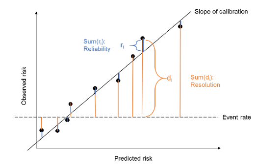
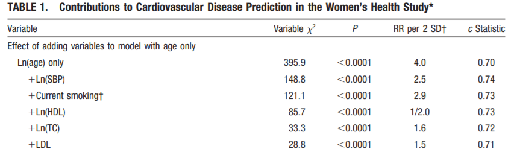
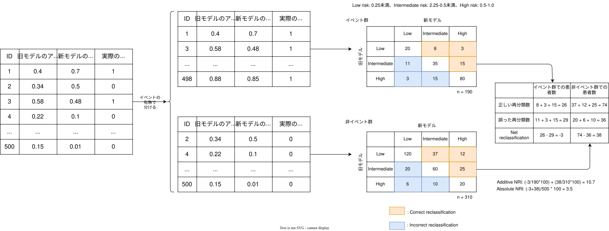
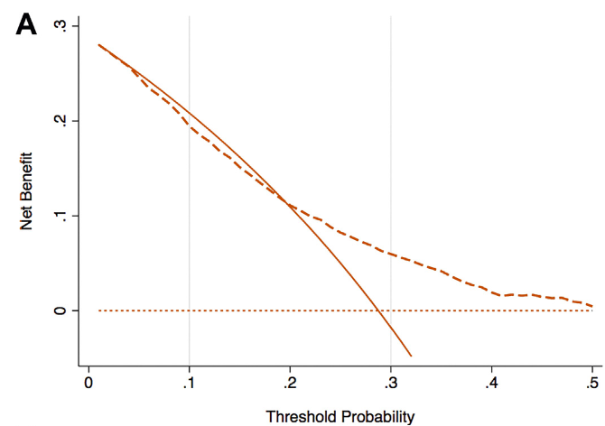
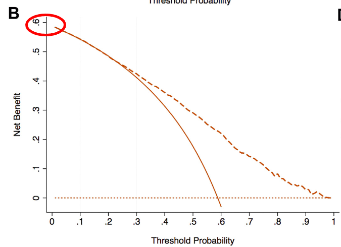
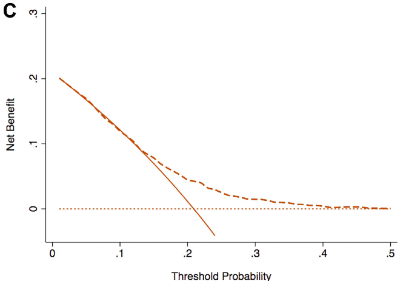
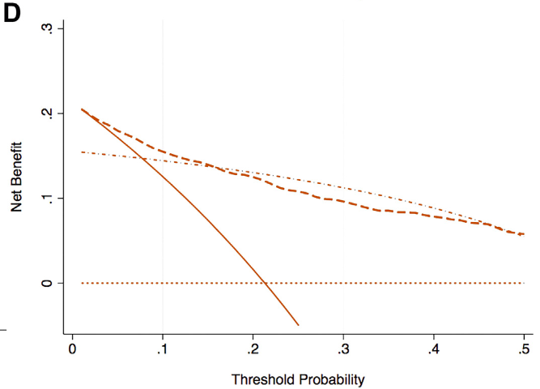
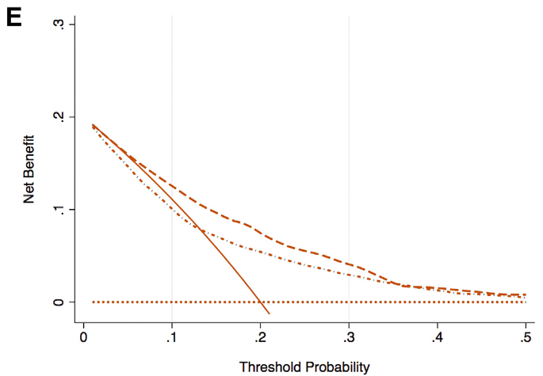

```{=html}
<style>
.reveal .reference {
  color: #666;
  font-size: 0.55em;
  margin-top: 0.6em;
  text-align: right;
}
.reveal .small {
  font-size: 0.76em;
}
.reveal .columns {
  gap: 1rem;
}
.reveal img {
  max-height: 64vh;
  object-fit: contain;
}
blockquote {
  font-size: 0.82em;
}

.reveal .tibble-flow {
  align-items: center;
  gap: 0.5rem;
}

.reveal .tibble-flow h3 {
  font-size: 0.72em;
  text-align: center;
  margin-bottom: 0.3em;
}

.reveal .tibble-flow table {
  font-size: 0.58em;
  margin: auto;
  border-collapse: collapse;
}

.reveal .tibble-flow table th {
  background: #0b284e;
  color: white;
  font-weight: 700;
}

.reveal .tibble-flow table th,
.reveal .tibble-flow table td {
  padding: 0.22em 0.45em;
}

/* ROC flow: reserve more room for the table with predictions at each cutoff. */
.reveal .roc-flow {
  display: grid !important;
  grid-template-columns:
    minmax(0, 1fr)
    minmax(2.5rem, 0.35fr)
    minmax(0, 1.7fr)
    minmax(2.5rem, 0.35fr)
    minmax(0, 1.5fr);
  align-items: center;
  gap: 0.35rem;
  width: 100%;
}

.reveal .roc-flow > .column {
  width: auto !important;
  min-width: 0;
}

.reveal .roc-flow h3 {
  font-size: 0.52em;
  white-space: nowrap;
}

.reveal .roc-flow table {
  width: 100%;
  font-size: 0.50em;
}

.reveal .roc-flow table th,
.reveal .roc-flow table td {
  padding: 0.18em 0.28em;
  white-space: nowrap;
}

.reveal .roc-flow .flow-arrow {
  font-size: 2.8rem;
}

.reveal .flow-operation {
  text-align: center;
}

.reveal .flow-operation pre {
  font-size: 0.42em;
  box-shadow: none;
}

.reveal .flow-operation code {
  display: inline-block;
  padding: 0.35em 0.55em;
  color: #0b284e;
  background: #eef4fb;
  border: 1px solid #b8cbe0;
  border-radius: 0.25em;
  font-size: 0.72em;
  white-space: nowrap;
}

.reveal .flow-arrow {
  color: #3973b9;
  font-size: 4rem;
  font-weight: 700;
  line-height: 1;
}

.reveal .flow-caption {
  margin-top: 0.35em;
  color: #555;
  font-size: 0.52em;
  line-height: 1.35;
}

.reveal .auc-result {
  width: fit-content;
  margin: 0.7em auto 0;
  padding-top: 0.35em;
  border-top: 3px solid #3973b9;
  font-size: 0.78em;
  text-align: center;
}

/* Calibration: keep the two tables above a full-width plot row. */
.reveal .calibration-slide h2 {
  margin-bottom: 0.35em;
}

.reveal .calibration-flow {
  display: grid !important;
  grid-template-columns: minmax(0, 1fr) 0.3fr minmax(0, 1.25fr);
  align-items: center;
  gap: 0.6rem;
}

.reveal .slides .calibration-flow > .column {
  min-width: 0;
  width: 100% !important;
}

.reveal .slides section.calibration-slide h3 {
  font-size: 18px;
  line-height: 1.3;
  margin: 0 0 0.3em;
  text-align: center;
  font-style: normal;
}

.reveal .calibration-flow table {
  width: 100%;
  font-size: 14px;
  line-height: 1.15;
  margin: 0.3em auto;
}

.reveal .calibration-flow table th,
.reveal .calibration-flow table td {
  padding: 0.15em 0.3em;
}

.reveal .calibration-flow .flow-arrow {
  font-size: 2.5rem;
}

.reveal .calibration-flow .flow-caption {
  font-size: 0.44em;
}

.reveal .calibration-plot {
  margin-top: 0.35em;
  text-align: center;
}

.reveal .slides section.calibration-slide .calibration-plot p,
.reveal .slides section.calibration-slide .calibration-plot figure {
  margin: 0;
}

.reveal .calibration-plot img {
  max-height: 220px;
  width: auto;
  display: block;
  margin: 0 auto;
}

.reveal .calibration-slide .cell,
.reveal .calibration-slide .cell-output-display {
  margin: 0;
}

.reveal .cnri-flow {
  display: grid !important;
  grid-template-columns: minmax(0, 1fr) 0.45fr minmax(0, 1.15fr);
  align-items: center;
  gap: 0.6rem;
}

.reveal .slides .cnri-flow > .column {
  min-width: 0;
  width: 100% !important;
}

.reveal .slides .cnri-flow h3 {
  font-size: 17px;
  font-style: normal;
  text-align: center;
  margin: 0 0 0.4em;
}

.reveal .cnri-flow table {
  width: 100%;
  font-size: 13px;
}

.reveal .cnri-flow table th,
.reveal .cnri-flow table td {
  padding: 0.2em 0.3em;
}

.reveal .cnri-flow .flow-arrow {
  font-size: 2.5rem;
}

.reveal .cnri-flow .flow-caption {
  font-size: 14px;
}
</style>
```


## ダニエル書第五章

> そのしるされた文字はこうです。メネ、メネ、テケル、ウパルシン。その事の解き明かしはこうです、メネは神があなたの治世を数えて、これをその終りに至らせたことをいうのです。[**テケルは、あなたがはかりで量られて、その量の足りないことがあらわれたことをいうのです。**]{style="color: red;"}ウパルシンは、あなたの国が分かたれて、メデアとペルシャの人々に与えられることをいうのです。

## Take Home Message

- 分類モデルの場合は[**弁別能**]{style="color: red;"}と[**較正能**]{style="color: red;"}を別個に評価しよう！
  - 弁別能：AUROC
  - 較正能：Calibration plotを用いる
  - 分類モデルの場合はクラスの偏りに要注意！
- モデルの比較にNRI, [**Decision-curve analysis**]{style="color: red;"}も使おう！

# 分類モデルとは？

## 分類モデルとは？
```{r}
#| label: set-up

library(modeldata)
library(yardstick)
library(dplyr)
library(ggplot2)
library(gt)

```


```{r}
#|label: prediction-model-image

modeldata::two_class_example |> 
  dplyr::select(Class1, predicted, truth) |> 
  head() |> 
  knitr::kable(
    align = 'c',
    col.names = c("Probability of Class 1", "Predicted by model", "Truth")
  )

```


- いわゆるモデルは大きく分けて回帰モデルと分類モデルに分けられる
  - 回帰モデル：連続値（BNP値、e'、PCWPなど）を直接予測する
  - 分類モデル：0/1（生死、出血の有無など）を予測する
- 実際の分類モデルは 0.4, 0.357 などイベントが起きる確率を計算する
- 任意のカットオフ（通常0.5）で0か1に丸め込んでいる(上ではClass)

# 分類の評価：DiscriminationとCalibrationって何？

## 分類の評価：DiscriminationとCalibration

- 分類モデルの評価では、[**Discrimination(弁別能)**]{style="color: red;"}と[**Calibration(較正能)**]{style="color: red;"}を別個に評価する
- Discrimination
  - 0/1の正確性: 実際にこの患者がHigh riskかどうかの評価
  - 言い換えると、患者をRiskの順番に並び替える能力
- Calibration
  - その患者のリスクの絶対値の評価
- まずはDiscrimination > Calibrationだが、特に実臨床ではCalibrationも重要な評価項目<br> -> Calibrationはしばしば忘れ去られている
[@Alba2017-gh]


## 例

- Discrimination
  - 「ERで胸痛を訴えているこの患者がMIかどうか？」
  - そもそも、これが当たらないとどうしようもない
- Calibration
  - 「このNSTEACSの患者にPCIをしたときに透析になってしまう確率は？」
  - 20%を超えるようなら今日はカテなしで、明日以降前負荷をかけた上でCAGをするか再検討しよう
  - 0/1だけでなく、実際の数字が重要

## DiscriminationとCalibration

```{r}
#| label: perfect-calibration-discrimination
 
# ============================================================
# Cook 2007 Figure 2 reproduction
# Perfect calibration under different true-risk distributions
# ============================================================

library(tidyverse)
library(pROC)
library(ggrepel)
library(patchwork)

set.seed(42)

# ------------------------------------------------------------
# 1. Simulation settings
# ------------------------------------------------------------

n <- 1000

beta_params <- tribble(
  ~panel,      ~distribution,     ~shape1, ~shape2, ~label_x, ~label_nudge_x, ~label_nudge_y,
  "Mean 10%",  "Beta(5, 45)",       5,       45,       0.085,       0.020,          1.0,
  "Mean 10%",  "Beta(1, 9)",        1,        9,        0.150,       0.025,          0.5,
  "Mean 10%",  "Beta(0.1, 0.9)",    0.1,      0.9,      0.025,       0.035,          0.5,

  "Mean 50%",  "Beta(10, 10)",     10,       10,        0.500,      -0.060,          0.6,
  "Mean 50%",  "Beta(3, 3)",        3,        3,         0.650,       0.025,          0.3,
  "Mean 50%",  "Beta(1, 1)",        1,        1,         0.780,      -0.020,          0.5,
  "Mean 50%",  "Beta(0.1, 0.1)",    0.1,      0.1,       0.080,       0.040,          0.5
)

# ------------------------------------------------------------
# 2. Generate individual true risks and outcomes
#
# risk_i ~ Beta(a, b)
# outcome_i ~ Bernoulli(risk_i)
#
# The model prediction is the continuous true risk itself.
# ------------------------------------------------------------

sim_dat <- beta_params |>
  mutate(
    simulated_data = pmap(
      list(shape1, shape2),
      function(shape1, shape2) {

        risk <- rbeta(
          n = n,
          shape1 = shape1,
          shape2 = shape2
        )

        tibble(
          id = seq_len(n),
          risk = risk,
          outcome = rbinom(
            n = n,
            size = 1,
            prob = risk
          ),
          predicted_class_05 = as.integer(risk >= 0.5)
        )
      }
    )
  ) |>
  select(
    panel,
    distribution,
    shape1,
    shape2,
    simulated_data
  ) |>
  unnest(simulated_data)

# ------------------------------------------------------------
# 3. Calculate C-statistic for each distribution
#
# C-statistic is calculated using:
#   outcome: observed binary outcome
#   risk: continuous predicted probability
# ------------------------------------------------------------

auc_results <- sim_dat |>
  group_by(
    panel,
    distribution,
    shape1,
    shape2
  ) |>
  summarise(
    n = n(),
    event_n = sum(outcome),
    event_rate = mean(outcome),
    mean_predicted_risk = mean(risk),
    sd_predicted_risk = sd(risk),

    c_statistic = {
      if (n_distinct(outcome) < 2) {
        NA_real_
      } else {
        as.numeric(
          pROC::roc(
            response = outcome,
            predictor = risk,
            levels = c(0, 1),
            direction = "<",
            quiet = TRUE
          )$auc
        )
      }
    },

    .groups = "drop"
  )

# ------------------------------------------------------------
# 4. Optional: classification performance using cutoff 0.5
#
# This is not the C-statistic calculation.
# It is shown only as an additional classification summary.
# ------------------------------------------------------------

classification_results <- sim_dat |>
  group_by(
    panel,
    distribution
  ) |>
  summarise(
    prevalence = mean(outcome),
    predicted_positive_rate = mean(predicted_class_05),
    accuracy = mean(predicted_class_05 == outcome),

    sensitivity = if_else(
      sum(outcome == 1) > 0,
      mean(predicted_class_05[outcome == 1] == 1),
      NA_real_
    ),

    specificity = if_else(
      sum(outcome == 0) > 0,
      mean(predicted_class_05[outcome == 0] == 0),
      NA_real_
    ),

    .groups = "drop"
  )

# ------------------------------------------------------------
# 5. Create theoretical beta-density curves
#
# The exact endpoints 0 and 1 are avoided because beta
# densities can diverge there when shape parameters are < 1.
# ------------------------------------------------------------

density_grid <- seq(
  from = 0.001,
  to = 0.999,
  length.out = 3000
)

density_dat <- beta_params |>
  mutate(
    density_data = pmap(
      list(shape1, shape2),
      function(shape1, shape2) {
        tibble(
          risk = density_grid,
          density = dbeta(
            density_grid,
            shape1 = shape1,
            shape2 = shape2
          )
        )
      }
    )
  ) |>
  select(
    panel,
    distribution,
    shape1,
    shape2,
    density_data
  ) |>
  unnest(density_data) |>
  left_join(
    auc_results |>
      select(
        panel,
        distribution,
        c_statistic
      ),
    by = c(
      "panel",
      "distribution"
    )
  )

# ------------------------------------------------------------
# 6. Create label positions
#
# label_x is manually specified above.
# label_y is calculated from the theoretical beta density.
# ------------------------------------------------------------

label_dat <- beta_params |>
  left_join(
    auc_results |>
      select(
        panel,
        distribution,
        c_statistic
      ),
    by = c(
      "panel",
      "distribution"
    )
  ) |>
  mutate(
    label_y = dbeta(
      label_x,
      shape1 = shape1,
      shape2 = shape2
    ),

    label_x_plot = label_x + label_nudge_x,
    label_y_plot = label_y + label_nudge_y,

    label = sprintf(
      "C = %.2f",
      c_statistic
    )
  )


# ------------------------------------------------------------
# 8. Left panel: average true risk 10%
#
# x-axis: 0 to 50%
# y-axis: 0 to 55
# ------------------------------------------------------------

plot_left <- density_dat |>
  filter(panel == "Mean 10%") |>
  ggplot(
    aes(
      x = risk,
      y = density,
      linetype = distribution,
      group = distribution
    )
  ) +
  geom_line(
    linewidth = 0.9
  ) +
  geom_text_repel(
    data = label_dat |>
      filter(panel == "Mean 10%"),
    aes(
      x = label_x_plot,
      y = label_y_plot,
      label = label
    ),
    inherit.aes = FALSE,
    size = 3.8,
    box.padding = 0.25,
    point.padding = 0.15,
    min.segment.length = 0,
    segment.size = 0.3,
    seed = 123,
    max.overlaps = Inf
  ) +
  coord_cartesian(
    xlim = c(0, 0.50),
    ylim = c(0, 20),
    clip = "on"
  ) +
  scale_x_continuous(
    breaks = seq(0, 0.50, by = 0.10),
    labels = scales::label_percent(
      accuracy = 1
    ),
    expand = expansion(
      mult = c(0, 0.02)
    )
  ) +
  scale_y_continuous(
    breaks = seq(0, 50, by = 10),
    expand = expansion(
      mult = c(0, 0.02)
    )
  ) +
  labs(
    x = "True 10-year risk",
    y = "Probability density",
    title = NULL
  ) +
  theme_bw()

# ------------------------------------------------------------
# 9. Right panel: average true risk 50%
#
# x-axis: 0 to 100%
# y-axis: 0 to 10
#
# Beta(0.1, 0.1) exceeds this y range near 0 and 1,
# so the endpoint peaks are visually truncated.
# ------------------------------------------------------------

plot_right <- density_dat |>
  filter(panel == "Mean 50%") |>
  ggplot(
    aes(
      x = risk,
      y = density,
      linetype = distribution,
      group = distribution
    )
  ) +
  geom_line(
    linewidth = 0.9
  ) +
  geom_text_repel(
    data = label_dat |>
      filter(panel == "Mean 50%"),
    aes(
      x = label_x_plot,
      y = label_y_plot,
      label = label
    ),
    inherit.aes = FALSE,
    size = 3.8,
    box.padding = 0.25,
    point.padding = 0.15,
    min.segment.length = 0,
    segment.size = 0.3,
    seed = 456,
    max.overlaps = Inf
  ) +
  coord_cartesian(
    xlim = c(0, 1),
    ylim = c(0, 6),
    clip = "on"
  ) +
  scale_x_continuous(
    breaks = seq(0, 1, by = 0.25),
    labels = scales::label_percent(
      accuracy = 1
    ),
    expand = expansion(
      mult = c(0, 0)
    )
  ) +
  scale_y_continuous(
    breaks = seq(0, 10, by = 2),
    expand = expansion(
      mult = c(0, 0.02)
    )
  ) +
  labs(
    x = "True 10-year risk",
    y = NULL,
    title = NULL
  ) +
  theme_bw()

# ------------------------------------------------------------
# 10. Combine panels
# ------------------------------------------------------------

final_plot <-
  plot_left +
  plot_right +
  plot_layout(
    widths = c(1, 1),
    guides = "collect"
  ) +
  plot_annotation(
    title = "Risk distribution and discrimination",
    subtitle = paste0(
      "Outcome ~ Bernoulli(true risk), n = ",
      scales::comma(n)
    )
  ) &
  theme(
    legend.position = "bottom"
  )

final_plot

```


- DiscriminationとCalibrationはトレードオフ
- さらに、アウトカムの発症率やリスクの分布にも影響を受ける
  - 完璧なDiscrimination & poor calibration
- 完ぺきなCalibrationで完ぺきなDiscriminationをするためにはかなり無理がある分布でないと達成できない

[@Cook2007-fs]


## Discriminationの評価について

:::: columns
::: {.column width="45%"}
```{r}
library(modeldata)
knitr::kable(head(modeldata::two_class_example))
```
:::

::: {.column width="10%"}

<div class="flow-operation">
  <div class="flow-arrow">&rarr;</div>
  <div class="flow-caption">予測と現実の0/1の組み合わせを<br>2×2にまとめる</div>
</div>
:::

::: {.column width="45%"}

```{r}
#| label: confusion-matrix

library(modeldata)
library(yardstick)
library(tidyverse)

yardstick::conf_mat(
  modeldata::two_class_example, 
  truth = truth, 
  estimate = predicted
) |> pluck("table") |>
  as.data.frame.matrix() |>
  tibble::rownames_to_column("Truth") |>
  gt(rowname_col = "Truth") |>
  tab_stubhead(label = "Truth") |>
  tab_spanner(
    label = "Predicted",
    columns = c("Class1", "Class2")
  ) |>
  cols_align(
    align = "center",
    columns = c("Class1", "Class2")
  ) |>
  tab_options(
    table.font.size = px(30),
    data_row.padding = px(10)
  )

```
:::

::::

- 0/1の評価（混同行列からの計算）
  - Accuracy、感度、特異度、Fβ scoreなど
- リスク毎の感度・特異度などを評価したもの
  - ROC、PR curve


## 混同行列関連

:::: columns
::: {.column width="50%"}

```{r}
#| label: confusion-matrix-detail
#| fig-width: 6
#| fig-height: 5.4
#| out-width: 65%
#| fig-align: center

library(ggplot2)

confusion_cells <- tibble::tribble(
  ~actual, ~predicted, ~cell_label,
  "P",     "P",        "真陽性\n(TP)",
  "P",     "N",        "偽陰性\n(FN)",
  "N",     "P",        "偽陽性\n(FP)",
  "N",     "N",        "真陰性\n(TN)"
) |>
  dplyr::mutate(
    # x軸は左から P, N
    predicted = factor(predicted, levels = c("P", "N")),

    # y軸は下から描画されるので N, P の順
    actual = factor(actual, levels = c("N", "P"))
  )

ggplot(
  confusion_cells,
  aes(x = predicted, y = actual)
) +
  geom_tile(
    width = 0.92,
    height = 0.92,
    fill = "white",
    colour = "grey55",
    linewidth = 0.8
  ) +
  geom_text(
    aes(label = cell_label),
    size = 6,
    fontface = "bold",
    lineheight = 1.25
  ) +
  scale_x_discrete(
    position = "top",
    expand = expansion(add = 0.08)
  ) +
  scale_y_discrete(
    expand = expansion(add = 0.08)
  ) +
  coord_fixed(clip = "off") +
  labs(
    x = "予測されたクラス",
    y = "実際の\nクラス"
  ) +
  theme_void(base_family = "sans") +
  theme(
    axis.text = element_text(
      size = 17,
      face = "italic",
      family = "serif",
      colour = "black"
    ),
    axis.title.x.top = element_text(
      size = 17,
      face = "bold",
      margin = margin(b = 7)
    ),
    axis.title.y = element_text(
      size = 17,
      face = "bold",
      angle = 0,
      lineheight = 1.15,
      margin = margin(r = 12)
    ),
    plot.margin = margin(18, 18, 18, 28)
  )
```

:::

::: {.column width="50%"}

$$
\begin{aligned}
\text{Accuracy} &= \frac{TP + TN}{TP + TN + FP + FN} \\[6pt]
\text{Recall / Sensitivity} &= \frac{TP}{TP + FN} \\[6pt]
\text{Specificity} &= \frac{TN}{TN + FP} \\[6pt]
\text{Precision} &= \frac{TP}{TP + FP} \\[6pt]
F_1\text{-Score} &= 2 \times
\frac{\text{Precision} \times \text{Recall}}
{\text{Precision} + \text{Recall}} \\[6pt]
F_{\beta} &= 
\frac{(1 + \beta^2)\cdot TP}
{(1 + \beta^2)\cdot TP + \beta^2\cdot FN + FP}
\end{aligned}
$$

:::

::::

## 混同行列関連の指標について

:::: columns
::: {.column width="52%"}
- 国試でやった感度・特異度・尤度比等
- 一番使われるのはAccuracy
- Fβ score（F1, F0.5, F2など）で、偽陰性・偽陽性の何を重視するかで選択が変わる
  - βに大きな数字を入れるとRule outを重視(感度が高くなる)
  - βに小さな数字を入れるとRule inを重視(特異度が高くなる)
- 偽陰性を極力避けたいとき
  - 一般人口への癌やHIVのscreeningなど
  - F2などが良い
- 偽陽性を極力避けたいとき
  - HFrEFで心筋生検をすべきかどうか、など
  - F0.5などが良い
:::

::::

## ROC指標ができるまで

```{r}
#| label: roc-setup
#| include: false

library(dplyr)
library(yardstick)
library(modeldata)

input_tbl <- modeldata::two_class_example |>
  transmute(
    prob_Class1 = Class1,
    truth
  ) 

roc_tbl <- yardstick::roc_curve(
  modeldata::two_class_example,
  truth = truth,
  Class1
  )

pr_tbl <- yardstick::pr_curve(
  modeldata::two_class_example, 
  truth, 
  Class1
) 

auc_value <- input_tbl |>
  yardstick::roc_auc(
    truth = truth,
    prob_Class1
  ) |>
  dplyr::pull(.estimate)

```

:::: {.columns .tibble-flow .roc-flow}
::: {.column}

### 1. 予測結果を<br>昇順で並べる

```{r}
#| label: input-tbl-arrnged
#| echo: false

dplyr::arrange(input_tbl, prob_Class1) |> 
  dplyr::slice_head(n = 6) |>
  knitr::kable(
    format = "html",
    align = "cc",
    col.names = c("予測確率", "実測値")
  )
```

:::

::: {.column .fragment fragment-index="1"}

<div class="flow-operation">
  <div class="flow-arrow">&rarr;</div>
  <div class="flow-caption">閾値を動かしながら<br>予測値を作る</div>
</div>

:::

::: {.column .fragment fragment-index="2"}

### 2. 閾値ごとでの予測

```{r}
#| label: input-tbl-arrnged2
#| echo: false

input_tbl |>
  dplyr::arrange(prob_Class1) |> 
  dplyr::mutate(
    predict_1 = dplyr::if_else(
      prob_Class1 > 1.794262e-07,
      "Class1",
      "Class2"
    ),
    predict_2 = dplyr::if_else(
      prob_Class1 > 4.503066e-06,
      "Class1",
      "Class2"
    )
  ) |>
  dplyr::slice_head(n = 6) |>
  dplyr::mutate(
    prob_Class1 = formatC(prob_Class1, format = "e", digits = 2)
  ) |>
  knitr::kable(
    format = "html",
    align = "cccc",
    col.names = c("予測確率", "実際のアウトカム", "閾値:2.0e-07での予測", "閾値2:4.50e-06での予測")
  )

```

:::

::: {.column .fragment fragment-index="3"}

<div class="flow-operation">
  <div class="flow-arrow">&rarr;</div>
  <div class="flow-caption">各々の閾値での予測のClassから<br>感度・特異度を計算</div>
</div>

:::

::: {.column .fragment fragment-index="4"}

### 3. 閾値毎の感度・特異度

```{r}
#| label: roc-tbl
#| echo: false

roc_tbl |>
  dplyr::slice_head(n = 7) |>
  knitr::kable(
    format = "html",
    align = "ccc",
    col.names = c("閾値", "特異度", "感度")
  )
```

:::
::::


## リスク毎の評価

```{r}
#| label: roc-pr-tbl

library(dplyr)

dplyr::left_join(
  roc_tbl, pr_tbl, by = ".threshold"
) |> 
  head() |> 
  knitr::kable()

```

:::: columns
::: {.column width="50%"}

- 感度と1-特異度で点を結ぶとROC曲線

```{r}
#| label: roc-curve
 
library(modeldata)
library(yardstick)
library(ggplot2)

yardstick::roc_curve(
  modeldata::two_class_example, 
  truth, 
  Class1
) |> 
  ggplot2::autoplot()

yardstick::roc_auc(
  modeldata::two_class_example, 
  truth, 
  Class1
) 

```

:::

::: {.column width="50%"}

- PrecisionとRecallで点を結ぶとPR曲線

```{r}
#| label: pr-curve
library(modeldata)
library(yardstick)
library(ggplot2)

yardstick::pr_curve(
  modeldata::two_class_example, 
  truth, 
  Class1
) |> 
  ggplot2::autoplot()

yardstick::pr_auc(
  modeldata::two_class_example, 
  truth, 
  Class1
) 

```

:::
::::

## Confusion matrix baseの評価の注意点

| AUROCの値 | 意味 |
|---|---|
| 0.5-0.6 | poor |
| 0.6-0.75 | possible helpful |
| 0.75- | clearly useful |

[@Alba2017-gh]

- Truthが偏ったデータでは混同行列関連は役に立たない
- 特にAccuracyは一番ダメ
  - 全部0の予測でも90%超えてしまう
- PRAUC等が役に立つが、数字だけでの評価は困難
  - PR curveは、より不均衡なデータでモデルの差をちゃんと見つけやすい(AUROCだと差が出にくい)
- 不均衡データではAUROCは差を見つけにくいが、[**AUROCは数字で大体の印象が分かる**]{style="color: red; font-size: 1.1em;"}のが強みだと思う


## 結局どうすればいいの？

- 均衡がとれているデータの場合
  - 根拠がある場合
    - 例えばPEの許容される見逃し率は2%[@Creager2026-or]
    - 胸痛の評価ToolでのMACEの許容率は1%未満[@Than2013-zz]
  - 妥当な感度、特異度の値が分かっている
    - カットオフをこちらで決めてAccuracy、感度/特異度やF1 valueを記載
    - AUROCはあった方が良い
  - 根拠がない場合
    - Youden indexやFβ scoreをカットオフとしてAccuracy等を評価
    - AUROCは必須
- 不均衡データの場合
  - あまり決まっていない
  - AUPRCはどこかに記載した方が無難、個人的には不均衡でもAUROCをメイン解析にしても良いと思う
  - Youden indexやFβ scoreなどを用いて、意味があるカットオフを作ってからNNT等を評価する

## Calibrationの評価について

- 全体像を示すもの
  - Calibration plot
- 一つの数字で表すもの
  - Recalibration parameters: Calibration plotの傾きと切片を記述
  - Hosmer-Lemeshow: 予測確率からn個の群分けを行い、その中での期待される発生件数と実際の発生件数をχ2検定で評価する
  - Brier score: 実際のイベントと予測確率の差を二乗和にして平均を取った値
- [**Calibration plot**]{style="color: red; font-size: 1.1em;"}が、どこの予測能が悪いかもわかるため最も良い評価[@Alba2017-gh]
- 分類数には要注意


## Calibration Plotの作り方 {.calibration-slide}


```{r}
#| label: calibration-prep
#| include: false

library(dplyr)
library(yardstick)
library(modeldata)
library(tidyr)
library(ggplot2)

calib_input_tbl <- modeldata::two_class_example |>
  transmute(
    prob_Class1 = Class1,
    truth
  ) |> 
  dplyr::arrange(prob_Class1) |> 
  dplyr::mutate(
    class = ggplot2::cut_number(prob_Class1, n  = 10, labels = FALSE)
    )

calib_summarised_tbl <- calib_input_tbl |>
  dplyr::summarise(
    event_proportion = mean(truth == "Class1"),
    mean_probability = mean(prob_Class1), 
    .by = class
  )


calib_dat <- tidyr::pivot_longer(
  calib_summarised_tbl,
  cols = c("event_proportion", "mean_probability")
) 
  

barplot <- ggplot2::ggplot(
  data = calib_dat, 
  mapping = aes(x = class, y = value, colour = name, fill = name)) + 
  geom_col(position = position_dodge2()) + 
  theme_bw()

barplot

```


:::: {.columns .tibble-flow .calibration-flow}
::: {.column}

### 1. 予測確率で昇順に並べ、10群に分ける

```{r}
#| label: arranged-calib-tbl
#| echo: false

calib_input_tbl |>  
  dplyr::slice_head(n = 6) |>
  knitr::kable(
    format = "html",
    align = "cc",
    col.names = c("予測確率", "実測値", "群")
  )

calib_input_tbl |> 
  dplyr::slice_tail(n = 6) |>
  knitr::kable(
    format = "html",
    align = "cc",
    col.names = c("予測確率", "実測値", "群")
  )
```

:::

::: {.column .fragment fragment-index="1"}

<div class="flow-operation">
  <div class="flow-arrow">&rarr;</div>
  <div class="flow-caption">群ごとに<br>平均を計算</div>
</div>

:::

::: {.column .fragment fragment-index="2"}

### 2. 群ごとの平均予測確率と実際の発症率

```{r}
#| label: summarised-calib-tbl
#| echo: false

calib_summarised_tbl |>
  knitr::kable(
    format = "html",
    align = "ccc",
    digits = 3,
    col.names = c("群", "平均予測確率", "実際の発症率")
  )

```

:::
::::

::: {.calibration-plot .fragment fragment-index="2"}

### 3. 平均予測確率（X軸）と実際の発症率（Y軸）をプロット

```{r}
#| label: calibration-plot
#| echo: false
#| fig-width: 4.8
#| fig-height: 2.55
#| fig-align: center
library(ggplot2)

ggplot(calib_summarised_tbl, aes(x = mean_probability, y = event_proportion)) + 
  geom_line() + 
  geom_point() + 
  geom_abline(intercept = 0, slope = 1, lty = 2) + 
  theme_bw()

```

:::


## Calibration～Hsomerr-Lemeshow検定


```{r}
#| label: hl-test
library(modeldata)
library(dplyr)
library(ggplot2)

modeldata::two_class_example |>
  mutate(
    group = ntile(Class1, 10),
    y = as.integer(truth == "Class1")
  ) |>
  dplyr::group_by(group) |>
  dplyr::summarise(
    n = n(),
    # Expected
    mean_prob_Class1 = mean(Class1),
    # Observed
    truth_Class1 = sum(y),
    truth_Class2 = sum(1 - y)
  )  |>
  dplyr::mutate(
    chisq = purrr::pmap_dbl(
      list(truth_Class1, truth_Class2, mean_prob_Class1), 
      \(x1, x0, p){
        stats::chisq.test(
      x = c(x1, x0),
      p = c(p, 1 - p)
    )$statistic
      }
  )) |>
  knitr::kable()

```

- 10群に分けて、各々で平均確率と実際のOutcomeを並べる
- 各グループ毎にX^2検定を行って、すべての統計量を足し算
- P > 0.05でモデルの当てはまりが良いとされる
- 一つの数値としては良いが、Low risk/High risk群でどうBiasがあるかは分からない

## Brier Score

$$
\text{Brier Score}
=
\frac{1}{N}
\sum_{i=1}^{N}
\left(\hat{p}_i - y_i\right)^2
$$

:::: columns
::: {.column width="50%"}

```{r}
#| label: brier-score
library(modeldata)
library(dplyr)
library(ggplot2)

modeldata::two_class_example |> 
  dplyr::select(
    Class1, predicted, truth
      ) |> 
  dplyr::mutate(
    Class1 = round(Class1, 3), 
    truth_num = dplyr::if_else(
      truth == "Class1", 1, 0
    ), 
    diff_squared = purrr::map2_chr(truth_num,Class1, \(x, y){
      paste0("(", x, "-", y, ")<sup>2</sup> = ", round((x-y)^2, 3))
    })
  ) |> 
  dplyr::rename(
    `Probability of Class1` = Class1, 
    `True label` = truth_num
  ) |> 
  dplyr::select(
    - truth
  ) |> 
  head() |> 
  knitr::kable(
    format = "html",
    escape = FALSE,
    align = "ccccc"
  )

```

- 実際のアウトカムがClass 1なら1, Class2だったら0とする
- 各々の予測確率(連続値)と上記のアウトカムの差の二乗を足し算する
- 連続値のモデルのMSEのイメージ


:::

::: {.column width="50%"}
{fig-alt="Brier scoreの図" width="82%"}
:::
::::

# Advanced model performance：モデルの比較

## モデルの比較

{fig-alt="AUROCの限界" width="100%"}
[@Cook2007-fs]

- AUROCでは、有用なマーカーを追加しても元のモデルの性能によっては追加による性能の改善を捉えられない事が知られている
- よくあるシチュエーションとしてベースのモデルに何かの変数を追加したときにモデルが良くなるか？
  - NRI / IDI

## NRI（Net Reclassification Index）

- 古いモデルから新しいモデルでの分類によってどのように変化したかを示す[@Alba2017-gh]
- Shift tableと似ているがちょっと違う
- 実は複数の種類がある
- 大きく分けて以下に分けられる
  - Category-based NRI
  - Continuous NRI


## Category-based NRI



- イベントがあった患者とイベントがなかった患者で分けて、各々の群を新旧のモデルで分類する
  - 分け方は何群でも良いが3群が多い
- イベントあり群では旧モデルよりもRiskを高く分類したらPositive、Riskを低く分類したらNegative
- イベントなし群では逆
- 差し引きして、最終的なモデルの良さを数値で表す
- 実臨床に沿っているのが利点だが、一方で分類の仕方が恣意的になる

## continuous NRI

```{r}
#| label: nri-prep
#| include: false
library(PredictABEL)
library(survival)
library(dplyr)

cnri_dat <- dplyr::mutate(
  pbc, 
  bin_status = dplyr::if_else(status == 0, 0, 1)
) |> 
  tidyr::drop_na()

model_simple <- glm(bin_status ~ trt + age + sex + ascites + hepato + spiders + edema, data = cnri_dat, family = binomial())

model_complex <- glm(bin_status ~ trt + age + sex + ascites + hepato + spiders + edema + bili + chol + albumin + copper + alk.phos + ast + trig + platelet + protime, data = cnri_dat, family = binomial())

cnri_dat2 <- cnri_dat |> 
  dplyr::mutate(
    simple_pred = predict(model_simple, type = "response"), 
    complex_pred = predict(model_complex, type = "response")
  ) |> 
  dplyr::select(bin_status, simple_pred, complex_pred)


# PredictABEL::reclassification(data = cnri_dat2, cOutcome = 1, predrisk1 = cnri_dat2$simple_pred, predrisk2 = cnri_dat2$complex_pred, cutoff = c(0, 0.3, 0.6, 1))

```

:::: {.columns .tibble-flow .cnri-flow}
::: {.column}
### 1. 新旧モデルの予測確率

```{r}
knitr::kable(head(cnri_dat2))
```

:::
::: {.column .flow-operation}
<div class="flow-arrow">&rarr;</div>
<div class="flow-caption">新旧の確率を比較し、<br>イベントの有無ごとに<br>上昇・非上昇の割合を計算</div>
:::
::: {.column}
### 2. イベントの有無ごとに集計

```{r}
#| label: cont-nri-prep

cnri_dat2 |> 
  dplyr::summarise(
    n = n(),
    # `new > old` = sum(complex_pred > simple_pred), 
    `Prob(new > old)` = mean(complex_pred > simple_pred),
    # `old >= new` = sum(complex_pred <= simple_pred),
    `Prob(old >= new)` = mean(complex_pred <= simple_pred), 
    .by = bin_status
  ) |> 
  knitr::kable()

```

:::
::::

```{r}
0.6589 - 0.3411 + 0.7823 - 0.2177

```

- Continuous NRI：全てのカットオフでのNRIの平均
- 次の形の方が分かりやすい

$$
\mathrm{NRI}_{\mathrm{continuous}}
=
\Pr(\text{higher} \mid \text{event})
-
\Pr(\text{lower} \mid \text{event})
+
\Pr(\text{lower} \mid \text{nonevent})
-
\Pr(\text{higher} \mid \text{nonevent})
$$

- メリット
  - 恣意的ではなくなる
  - 元のAUROCに関連なく改善度合いが分かる
  - 新規に加えたマーカーの影響を評価可能
- 注意点
  - 弱いマーカーでもポジティブになりやすい
  - Miscalibrationの影響を強く受ける
  - イベントの大小関係しか見ないため、意味がない差も拾ってしまう
  - 例：Old modelの予測確率が0.98、New modelが0.99でも改善とみなす

## NRIの使い方、注意点

- Event NRI、Non-event NRIを各々提示する
  - 可能であれば、臨床的に意味があるカットオフでのCategory-based NRIが望ましい
- NRI単独で評価はせず、補助的に用いる
  - AUROC等と一緒に
  - Calibrationがもともと悪いデータだと、意味がなくても有意に改善する可能性がある
- 最も良い使い方
  - 全く関係のないモデル同士ではなく、古いモデルに新たなマーカーを追加した後のモデル評価[@Leening2014-bl]


## IDI（Integrated Discrimination Improvement）

```{r}
#| label: idi
cnri_dat2 |> 
  dplyr::summarise(
    # `new > old` = sum(complex_pred > simple_pred), 
    mean_simple_pred = mean(simple_pred),
    # `old >= new` = sum(complex_pred <= simple_pred),
    mean_complex_pred = mean(complex_pred),
    .by = bin_status
  ) |> 
  knitr::kable(
    col.names = c("Outcome", "simple modelでのeventの平均予測確率", "complex modelでのeventの平均予測確率")
  )

0.676 - 0.580 - (0.284 - 0.369)

```


$$
\boxed{
\mathrm{IDI}
=
\text{event群における予測確率の平均上昇}
-
\text{non-event群における予測確率の平均上昇}
}
$$

- Event群におけるモデル予測の平均の差と非イベント群の負のモデル予測の平均の差をとったもの
- Calibration的な意味合いもある
- NRI, IDIを2値分類で使うならRだと`PredictABEL` packageが使いやすい

## Decision Curve Analysis

```{r}
#| label: dca-prep

library(dcurves)
library(dplyr)
library(tidyr)

dca_dat <- tibble::tibble(threshold = seq(0, 0.95, by = 0.05)) |> 
  tidyr::crossing(
  dplyr::select(cnri_dat2, -complex_pred)
) |> 
  dplyr::mutate(
    test_positive = simple_pred >= threshold, 
    test_negative = simple_pred < threshold
  ) |> 
  dplyr::summarise(
    n = n(), 
    test_pos = sum(test_positive == 1),
    test_neg = sum(test_negative == 1),
    TP = sum(test_positive == 1 & bin_status == 1), 
    TP_rate = TP / n,
    FP = sum(test_positive == 1 & bin_status == 0), 
    FP_rate = FP /n,
    .by = threshold
  ) |>
  dplyr::arrange(threshold) |>
  dplyr::mutate(
    True_positive = paste0(TP, " / ", n, " = ", round(TP_rate, 3)),
    False_positive = paste0(FP, " / ", n, " = ", round(FP_rate, 3)),
    net_benefit = paste0(
      round(TP_rate, 3), " - ", round(FP_rate, 3), " * ", threshold, " / ", "(1 - ", threshold, ") = ", round(
      TP_rate - FP_rate * threshold / (1 - threshold), 3))
  ) |> 
  dplyr::select(threshold, n, True_positive, False_positive, net_benefit)


dca_fig <- dcurves::dca(bin_status ~ simple_pred + complex_pred, data = cnri_dat2, 
  thresholds = seq(0, 0.35, by = 0.05),
  label = list(simple_pred = "Simple model", complex_pred = "Complex model")
  ) |> 
  plot(smooth = FALSE)

```


- NRI/IDIは偽陽性と偽陰性を同じ重みづけで扱っている
  - 現実には偽陽性が望ましくない時と偽陰性が望ましくない時がある
  - 例：失神患者の心電図モニター vs. HFrEFの心臓生検
- 重みづけをした上でのNet benefitを確率毎に記述したグラフをDecision curveという[@Vickers2016-vz]

## Decision curve analysis ~ Net benefitの概念

- 真陽性のメリットと偽陽性によるデメリットの引き算を以下のように定義する

$$
\operatorname{NB}(p_t)
=
\frac{\operatorname{TP}(p_t)}{N}
-
\frac{\operatorname{FP}(p_t)}{N}
\left(
\frac{p_t}{1-p_t}
\right)
$$

  - $N$：患者全体の数
  - $\operatorname{TP}(p_t)$：閾値確率 $p_t$ で検査陽性とされた中での真陽性者数
  - $\operatorname{FP}(p_t)$：閾値確率 $p_t$ で検査陽性とされた中での偽陽性者数
  - $\dfrac{p_t}{1-p_t}$：偽陽性による不利益を真陽性による利益に換算する重み

- Modelの予測においてX軸に陽性とする閾値(Threshold)、このNet benefitをY軸に描くのがDecision curve analysisである


## Net beneiftとThresholdの関係

- Net benefitはThreshold毎に真陽性に対する許容される偽陽性の割合を示す
- 例えば、SIHDを予測するmodelでThresholdを15%として、その15%を超えたときにCAGをするとする
- Threshold = 15%の時、Oddsは0.85/0.15 = 5.67[@Vertosick2022DCA]
  - 一人の見逃し(False negative)は無駄なカテーテル検査(False positive)6人分と同じ重みという判断
- 元疾患の重篤さや、検査後の動き、患者の年齢などによってThresholdは変わる
  - 脳梗塞患者のAF疑い → HolterならThresholdはかなり、下がる(閾値1%で99人分など)
  - DCM疑い患者 → 心筋生検ならThresholdは上がる(閾値50%で1人分など)

## Decision curve analysisのCurve①
```{r}
#| label: dca-tbl

knitr::kable(head(dca_dat, 8), 
  col.names = c("Threshold", "n", "True positive", "False positive", "Net benefit"))

```

1. Thresholdを0.01や0.05刻みで並べる
2. 各々のThresholdで何人がTrue positive/False positiveになるか計算
3. Net benefitの式にあてて計算する
  - 式の定義からたとえ、閾値の変化の結果、真陽性や偽陽性の人数が変わらなくてもNet benefitは変化する

## Decision curve analysisのCurve②

- 比較するモデルのほかに、Default strategyとして以下の曲線も描く
  - 誰も治療しない戦略（treat none）
  - 全員治療する戦略(treat all)
- Treat noneのNet benefitは、TPもFPも0のため常に0
- Treat allのNet benefitは

$$
\operatorname{NB}_{\mathrm{all}}(p_t)
=
有病率
-
(1-有病率)
\left(
\frac{p_t}{1-p_t}
\right)
$$

となる。

## Decision curveの見方

```{r}
#| label: dca-curve

library(ggforce)

dca_fig + 
  geom_circle(aes(x0 = 0, y0 = mean(cnri_dat2$bin_status), r = 0.02), color = "red", linetype = "dashed", inherit.aes = TRUE) 

```

- Default strategy
- 患者を陽性（生検適応）と判断する確率：`P(t)`
- Net benefitの値のところで最も上のstrategyがより良いモデル
- Treat allとTreat noneよりは常に高くないといけない
- 左端のベースラインのリスクの高低も必ず評価する

## DCA、NBの解釈

- 高価な検査、侵襲的な検査、面倒な検査の場合
  - ΔNBの逆数がNNTと同じような役割を果たす（test tradeoff）
- 例
  - 心Sarcoidosisの診断にPETを加えたモデルがある
  - `P(t)` が10%の時の `ΔNB` が0.001
  - 10%以上で陽性とする基準でNNS 1000
  - 言い換えると、111回やると1回の偽陽性を避けられる

## NBの解釈例

- 以下にDCAの解釈の例を示す。
  - 実線（<span style="display:inline-block;width:3em;border-top:2px solid;vertical-align:middle;"></span>）：treat all
  - 点線（<span style="display:inline-block;width:3em;border-top:2px dotted;vertical-align:middle;"></span>）：treat none
  - 破線（<span style="display:inline-block;width:3em;border-top:2px dashed;vertical-align:middle;"></span>）：モデル
  - 一点鎖線（<svg width="48" height="12" style="vertical-align:middle;"><line x1="0" y1="6" x2="48" y2="6" stroke="currentColor" stroke-width="2" stroke-dasharray="8 3 2 3"/></svg>）：比較モデル
- 臨床的に意味がある閾値が20%(妥当な範囲が10-30%)と考えている

::: {.panel-tabset}

## Case 1

{fig-alt="NBの解釈例1のグラフ" width="100%"}

- モデルの線は20%を超えないとTreat allより高くない
- 患者によっては、10-15%でも治療を選択する
- 実質的にモデルは価値がない(Treat allで良い)
- モデルのCalibrationが悪く、Riskを過小評価している

## Case 2

{fig-alt="NBの解釈例2のグラフ" width="100%"}

- このモデルはAUROCは高い
- しかし、有病率が高すぎる(60%)
- そのため、Treat allよりもモデルが良いレンジはReasonableな10-30%よりも高い
- 結果的には、このモデルも価値がない

## Case 3

{fig-alt="NBの解釈例3のグラフ" width="100%"}

- 13%を超えた後はTreat allよりも良いNet benefitを示している
  - 13%以下の時はTreat allと同じ性能
- もしも、このモデルが13%以下を出す事が多くなければ悪くないモデル

## Case 4

{fig-alt="NBの解釈例4のグラフ" width="100%"}

- 2つのModelは両者とも、Treat all/noneよりも良いNBを示している
- 一方で、このModelは13%くらいのところで交差しており、どちらがより良いかは示せない

## Case 5

{fig-alt="NBの解釈例5のグラフ" width="100%"}

- モデルは非常によく、AUROCは0.75。また、比較モデルはさらに良くAUROC 0.8だった
- しかしながら、比較モデルはCalibrationが悪くRiskをUnderestimateしている
  - Threshold rangeの中ではAUROC 0.75のModelの方が常に良いNBを示している
  - AUROC 0.8の比較モデルはTreat allよりも悪く有害な可能性すらある

:::


## Decision Curve analysisのFigureの作り方

1. 重要な事は、`P(t)` のレンジを臨床的に意味のある範囲で決める
  1. モデルから逆に `P(t)` を決めてはいけない
2. 有病率（`P(t) = 0` の時のNB）の値も確認
3. 興味があるレンジでどのような動態かを確認する
  3. Calibrationが悪いとTreat allやTreat noneよりも悪くなりうる
  3. その場合はそれ以上の比較はしない
4. 新しいモデルの費用や侵襲性、疾患の重要性などを勘案してNBの差を評価する
  4. 必要時、NBの逆数やoddsとの差を取ってtest tradeoffを評価

## 結局どうすればいいの？

- モデルを単に評価するだけなら不要
- ベースのモデルに対してどの程度変化したかを記述したい
- 元のモデルに対して何かのマーカー（BNP等）を追加したときに、その改善を言いたい
  - cNRI
- 臨床的な有用性を強く主張したい
  - 適切なカットオフを自分で決める
  - Category-based NRIをevent/non-eventで記述する
  - Decision curve analysisを用いる

## Take Home Message

- 分類モデルの場合は弁別能と較正能を別個に評価しよう！
  - 弁別能：AUROC
  - 較正能：Calibration plotを用いる
  - 分類モデルの場合はクラスの偏りに要注意！
- モデルの比較にNRI, Decision-curve analysisも使おう！

## References

::: {.reference}

:::
