```{=html}
<style>
.reveal .reference {
  color: #666;
  font-size: 0.55em;
  margin-top: 0.6em;
  text-align: right;
}
.reveal .small {
  font-size: 0.76em;
}
.reveal .columns {
  gap: 1rem;
}
.reveal img {
  max-height: 64vh;
  object-fit: contain;
}
blockquote {
  font-size: 0.82em;
}
</style>
```

## 分類モデルの評価について

2021/7/30  
Nozomi Niimi

## ダニエル書第五章

> そのしるされた文字はこうです。メネ、メネ、テケル、ウパルシン。その事の解き明かしはこうです、メネは神があなたの治世を数えて、これをその終りに至らせたことをいうのです。[**テケルは、あなたがはかりで量られて、その量の足りないことがあらわれたことをいうのです。**]{style="color: red;"}ウパルシンは、あなたの国が分かたれて、メデアとペルシャの人々に与えられることをいうのです。

## Take Home Message

- 分類モデルの場合は[**弁別能**]{style="color: red;"}と[**較正能**]{style="color: red;"}を別個に評価しよう！
  - 弁別能：AUROC
  - 較正能：Calibration plotを用いる
  - 分類モデルの場合はクラスの偏りに要注意！
- モデルの比較にNRI, [**Decision-curve analysis**]{style="color: red;"}も使おう！

## Agenda

- 分類モデルとは？
- 分類の評価：DiscriminationとCalibrationって何？
  - Discriminationの評価方法
  - Calibrationの評価方法
- Advanced model performance：モデルの比較
  - NRI、IDI、Decision curve analysis

# 分類モデルとは？

## 分類モデルとは？

:::: columns
::: {.column width="60%"}
- いわゆるモデルは大きく分けて回帰モデルと分類モデルに分けられる
  - 回帰モデル：連続値（BNP値、e'、PCWPなど）を直接予測する
  - 分類モデル：0/1（生死、出血の有無など）を予測する
- 実際の分類モデルは `0.4`, `0.357` などイベントが起きる確率を計算する
- 任意のカットオフ（通常0.5）で0か1に丸め込んでいる
:::

::: {.column width="40%"}
{fig-alt="分類モデルのイメージ" width="70%"}

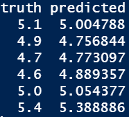{fig-alt="連続値モデルのイメージ" width="55%"}
:::
::::

## Agenda

- 分類モデルとは？
- 分類の評価：DiscriminationとCalibrationって何？
  - Discriminationの評価方法
  - Calibrationの評価方法
- Advanced model performance：モデルの比較
  - NRI、IDI、Decision curve analysis

## 分類の評価：DiscriminationとCalibration

- 分類モデルの評価では、Discrimination（弁別能）とCalibration（較正能）を別個に評価する
- Discrimination
  - 0/1の正確性
  - 実際にこの患者の予測が当たるかどうかの評価
- Calibration
  - その患者のリスクの絶対値の評価
- まずはDiscrimination > Calibrationだが、特に実臨床ではCalibrationも重要な評価項目
- Calibrationはしばしば忘れ去られている

::: {.reference}
JAMA. 2017 Oct 10;318(14):1377-84.
:::

## 例

- Discrimination
  - 「ERで胸痛を訴えているこの患者がMIかどうか？」
  - そもそも、これが当たらないとどうしようもない
- Calibration
  - 「この患者にPCIをしたときに透析になってしまう確率は？」
  - 20%を超えるようならカテなしで様子をみよう
  - 0/1だけでなく、実際の数字が重要

## DiscriminationとCalibration

<!-- TODO: 元スライドの図注・2図配置は簡略化。 -->

:::: columns
::: {.column width="52%"}
- 平均リスク50%
- 平均リスク10%
- DiscriminationとCalibrationはトレードオフ
- さらに、事前確率やその分布にも影響を受ける
- 完璧なDiscrimination & poor calibration
- 完璧なCalibrationでの理論上の最大のDiscrimination
:::

::: {.column width="48%"}
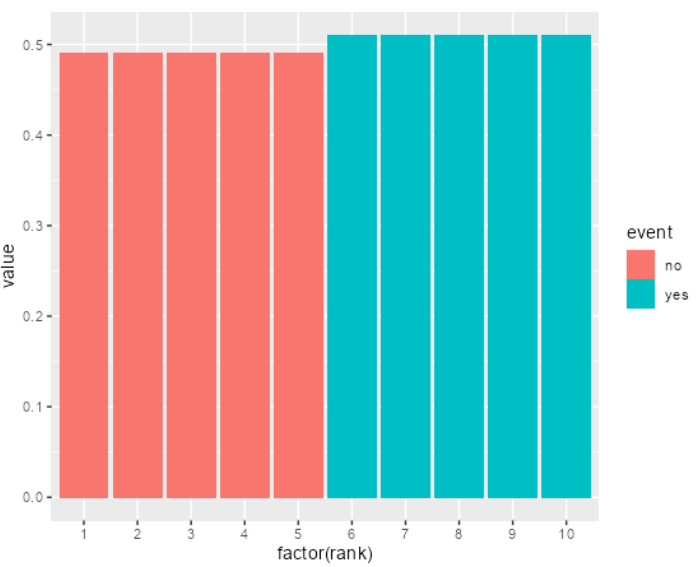{fig-alt="DiscriminationとCalibrationの模式図1" width="86%"}

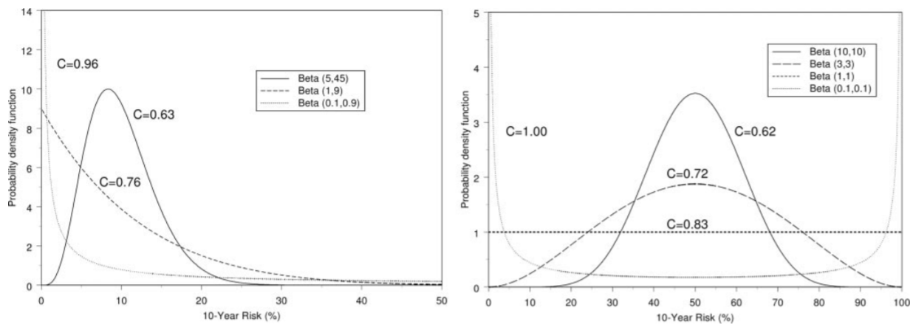{fig-alt="DiscriminationとCalibrationの模式図2" width="100%"}
:::
::::

::: {.reference}
Circulation. 2007;115:928-935.
:::

## Discriminationの評価について

- 0/1の評価（混同行列からの計算）
  - Accuracy、感度、特異度、Fβ scoreなど
- リスク毎の感度・特異度などを評価したもの
  - ROC、PR curve

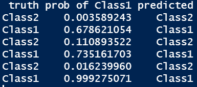{fig-alt="混同行列の例" width="38%"}

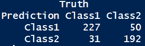{fig-alt="ROC/PR curveの例" width="32%"}

## 混同行列関連

<!-- TODO: 元スライドの数式・矢印レイアウトは画像を並べる形に簡略化。 -->

:::: columns
::: {.column width="50%"}
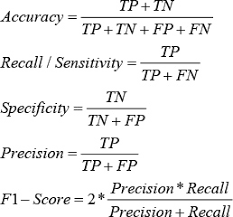{fig-alt="混同行列関連図1" width="45%"}

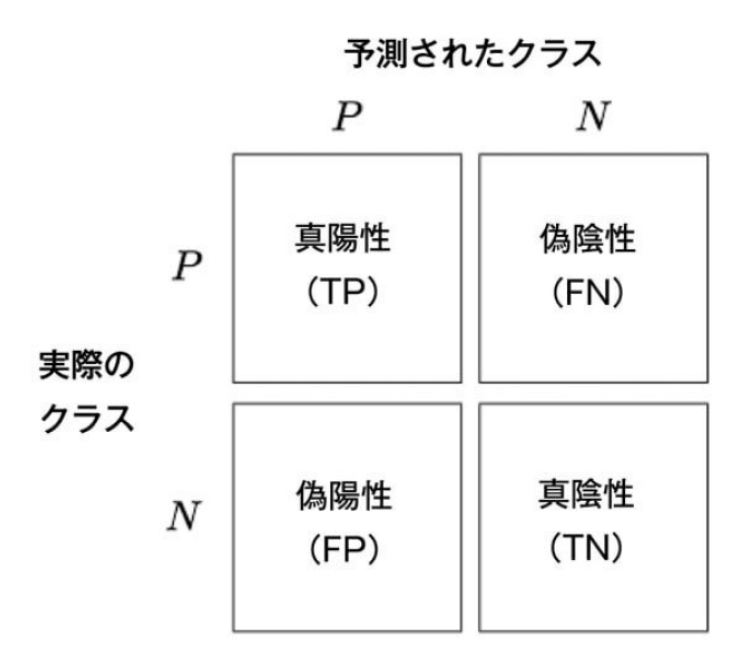{fig-alt="混同行列関連図2" width="90%"}
:::

::: {.column width="50%"}
- PPV
- カットオフを作るのにも使う

{fig-alt="混同行列関連図3" width="90%"}
:::
::::

## Discrimination：混同行列関連

:::: columns
::: {.column width="52%"}
- 国試でやった感度・特異度・尤度比等
- 一番使われるのはAccuracy
- Fβ score（F1, F0.5, F2など）で、偽陰性・偽陽性の何を重視するかで選択が変わる
  - βに大きな数字を入れると感度を重視
  - βに小さな数字を入れるとPPVを重視
- 偽陰性を極力避けたいとき
  - 一般人口への癌やHIVのscreeningなど
  - F2などが良い
- 偽陽性を極力避けたいとき
  - HFrEFで心筋生検をすべきかどうか、など
  - F0.5などが良い
:::

::: {.column width="48%"}
{fig-alt="混同行列関連図1" width="82%"}

{fig-alt="混同行列関連図2" width="42%"}

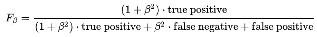{fig-alt="混同行列関連図3" width="82%"}
:::
::::

## リスク毎の評価

<!-- TODO: 元スライドのROC/PR図の位置関係は簡略化。 -->

:::: columns
::: {.column width="50%"}
- sensitivity
- 1-specificity
- PPV

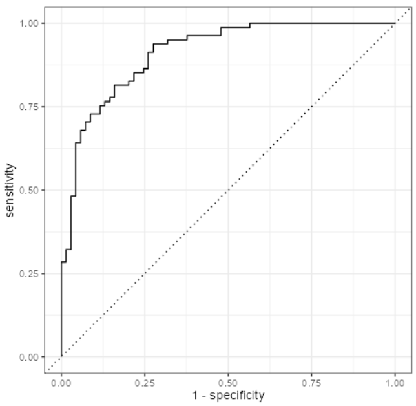{fig-alt="リスク毎評価の図1" width="82%"}
:::

::: {.column width="50%"}
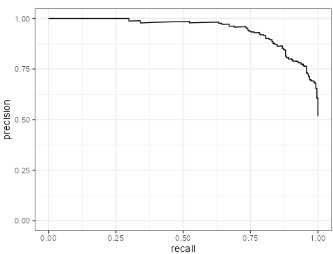{fig-alt="リスク毎評価の図2" width="70%"}

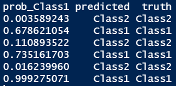{fig-alt="リスク毎評価の補助図1" width="45%"}
{fig-alt="リスク毎評価の補助図2" width="45%"}

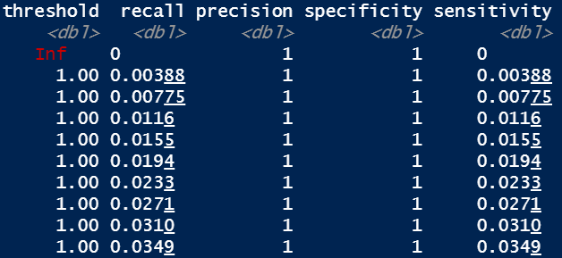{fig-alt="リスク毎評価の図5" width="86%"}
:::
::::

## 注意点

- 極端に偏ったデータでは混同行列関連は役に立たない
- 特にAccuracyは一番ダメ
  - 全部0の予測でも90%超えてしまう
- PRAUC等が役に立つが、数字だけでの評価は困難
  - ROCは事前確率に関係のない感度・特異度だけでできている
  - PR curveは事前確率が影響する
  - PR curveは、より不均衡なデータでモデルの差をちゃんと見つけやすい
  - ROCだと差が出にくい
- AUROCは数字で大体の印象が分かるのが強み

| AUROCの値 | 意味 |
|---|---|
| 0.5-0.6 | poor |
| 0.6-0.75 | possible helpful |
| 0.75- | clearly useful |

::: {.reference}
JAMA. 2017 Oct 10;318(14):1377-84.
:::

## 結局どうすればいいの？

- 均衡がとれているデータの場合
  - 根拠がある場合
    - 妥当な感度、特異度の値が分かっている
    - カットオフをこちらで決めてAccuracy、感度/特異度やF1 valueを記載
    - AUROCはあった方が良い
  - 根拠がない場合
    - Youden indexやFβ scoreをカットオフとしてAccuracy等を評価
    - AUROCは必須
- 不均衡データの場合
  - あまり決まっていない
  - AUPRCはどこかに記載した方が無難
  - 個人的には不均衡でもAUROCをメイン解析にしても良いと思う
  - Youden indexやFβ scoreなどを用いて、意味があるカットオフを作ってからNNT等を評価する

## Calibrationの評価について

- 全体像を示すもの
  - Calibration plot
- 一つの数字で表すもの
  - Recalibration parameters
  - Calibration plotの傾きと切片を記述
  - Hosmer-Lemeshow
  - 予測確率からn個の群分けを行い、その中での期待される発生件数と実際の発生件数をχ2検定で評価する
  - Brier score
  - 実際のイベントと予測確率の差を二乗和にして平均を取った値
- Calibration plotが、どこの予測能が悪いかもわかるため最も良い評価
- 分類数には要注意

::: {.reference}
JAMA. 2017 Oct 10;318(14):1377-84.
:::

## Calibration Plotの作り方

<!-- TODO: 元スライドは番号付きの処理フロー。画像を残し、手順は箇条書きで整理。 -->

:::: columns
::: {.column width="50%"}
- 1. 予測確率を並べる
- 2. 予測確率で群分けする
- 3. 各群の予測確率をまとめる
- 4. 各群の実測イベント率をまとめる
:::

::: {.column width="50%"}
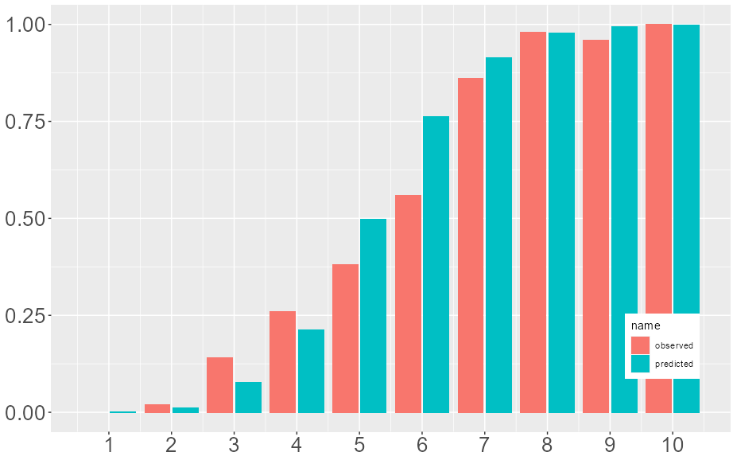{fig-alt="Calibration plot作成手順1" width="100%"}

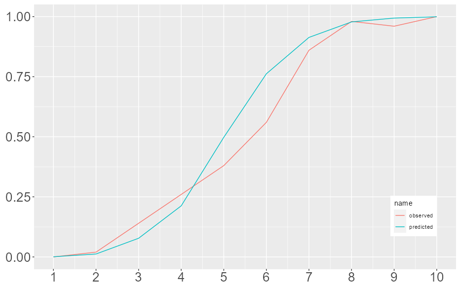{fig-alt="Calibration plot作成手順2" width="100%"}

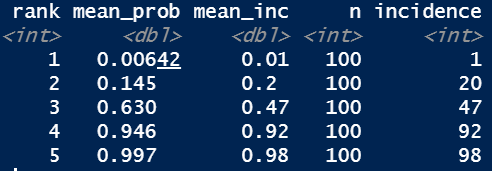{fig-alt="Calibration plot作成手順3" width="48%"}
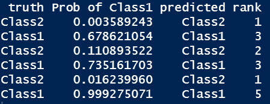{fig-alt="Calibration plot作成手順4" width="48%"}
:::
::::

## Calibrationの細かい方法

:::: columns
::: {.column width="58%"}
- 3と4を棒グラフや線グラフでまとめる
  - Calibration plot
- 3'と4'でχ2検定を行う
  - Hosmer-Lemeshow検定
:::

::: {.column width="42%"}
{fig-alt="Calibrationの表1" width="90%"}

{fig-alt="Calibrationの表2" width="90%"}
:::
::::

## Brier Score

<!-- TODO: 元スライドは数式中心。画像を残し、必要なら数式をMarkdown化する。 -->

:::: columns
::: {.column width="50%"}
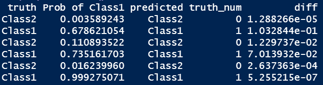{fig-alt="Brier scoreの式" width="100%"}

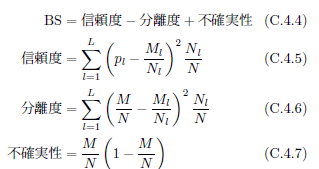{fig-alt="Brier scoreの例" width="70%"}
:::

::: {.column width="50%"}
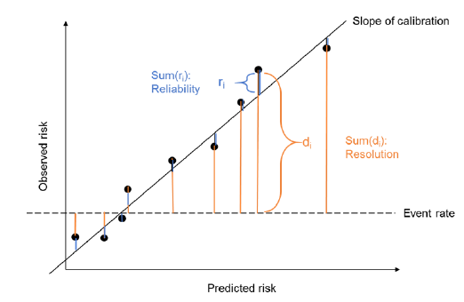{fig-alt="Brier scoreの図" width="82%"}
:::
::::

## Agenda

- 分類モデルとは？
- 分類の評価：DiscriminationとCalibrationって何？
  - Discriminationの評価方法
  - Calibrationの評価方法
- Advanced model performance：モデルの比較
  - NRI、IDI、Decision curve analysis

## モデルの比較

:::: columns
::: {.column width="58%"}
- AU-ROCでは、有用なマーカーを追加しても元のモデルの性能によっては追加による性能の改善を捉えられない事が知られている
- よくあるシチュエーション
  - ベースのモデルに何かの変数を追加したときにモデルが良くなるか？
- NRI / IDI
- AUROCは不完全！
:::

::: {.column width="42%"}
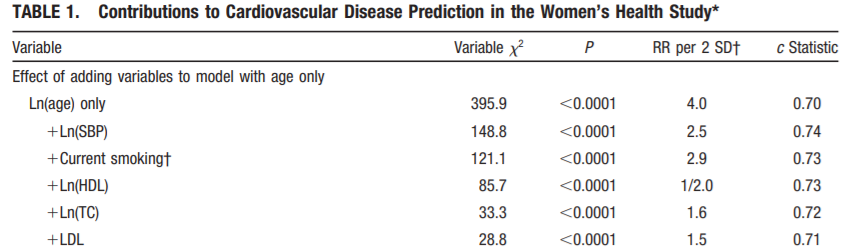{fig-alt="AUROCの限界" width="100%"}
:::
::::

::: {.reference}
Circulation. 2007;115:928-935.
:::

## Epidemiology 2014;25:114-121

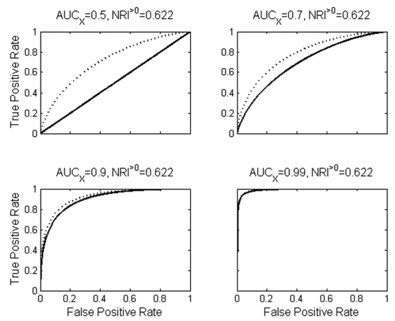{fig-alt="Epidemiology 2014の図" width="74%"}

## NRI（Net Reclassification Index）

<!-- TODO: 元スライドの番号付き図解は画像中心に簡略化。 -->

- 古いモデルから新しいモデルでの分類によってどのように変化したかを示す
- 実は複数の種類がある
- 大きく分けて以下に分けられる
  - Category-based NRI
  - Continuous NRI

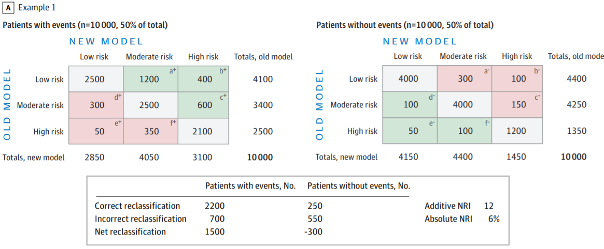{fig-alt="NRIの図解" width="88%"}

::: {.reference}
JAMA. 2017 Oct 10;318(14):1377-84.
:::

## cNRI

:::: columns
::: {.column width="60%"}
- Continuous NRI：全てのカットオフでのNRIの平均
- 次の形の方が分かりやすい
  - `Pr(higher | event) - Pr(lower | event)`
  - `+ Pr(lower | nonevent) - Pr(higher | nonevent)`
- メリット
  - 恣意的ではなくなる
  - 元のAUROCに関連なく改善度合いが分かる
  - 新規に加えたマーカーの影響を評価可能
- 注意点
  - 弱いマーカーでもポジティブになりやすい
  - Miscalibrationの影響を強く受ける
  - イベントの大小関係しか見ないため、意味がない差も拾ってしまう
  - 例：Old modelの予測確率が0.98、New modelが0.99でも改善とみなす
:::

::: {.column width="40%"}
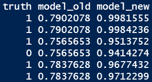{fig-alt="cNRIの表" width="75%"}

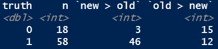{fig-alt="cNRIの式" width="95%"}

`(15 - 3) / 18 + (46 - 12) / 58 = 1.25`
:::
::::

## NRIの使い方、注意点

- Event NRI、Non-event NRIを各々提示する
  - 可能であれば、臨床的に意味があるカットオフでのCategory-based NRIが望ましい
- NRI単独で評価はせず、補助的に用いる
  - AUROC等と一緒に
  - Calibrationがもともと悪いデータだと、意味がなくても有意に改善する可能性がある
- 最も良い使い方
  - 全く関係のないモデル同士ではなく、古いモデルに新たなマーカーを追加した後のモデル評価

::: {.reference}
Ann Intern Med. 2014;160:122-131.
:::

## IDI（Integrated Discrimination Improvement）

:::: columns
::: {.column width="60%"}
- cNRIに各々の予測値の重みづけをしたもの
- 次の差をとったもの
  - Eventあり群の新/旧モデルの平均予測値の差
  - Eventなし群の新/旧モデルの平均予測値の差
- Calibrationの要素が入っているが、やはり臨床的な差は見つけにくい
- `(0.856 - 0.772) - (0.463 - 0.734) = 0.355`
:::

::: {.column width="40%"}
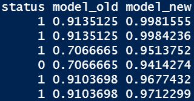{fig-alt="IDIの表" width="76%"}

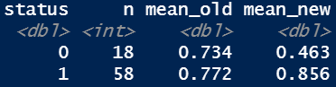{fig-alt="IDIの式" width="90%"}
:::
::::

## Decision Curve Analysis

- NRI/IDIは偽陽性と偽陰性を同じ重みづけで扱っている
  - 現実には偽陽性が望ましくない時と偽陰性が望ましくない時がある
  - 例：ICUの心電図モニター vs. HFrEFの心臓生検
- 重みづけをした上でのNet benefitを確率毎に記述したグラフをDecision curveという

:::: columns
::: {.column width="50%"}
- `P(t) = 0.1`
- `NB = 252 / 500 - 110 / 500 * (0.1 / 0.9) = 0.480`

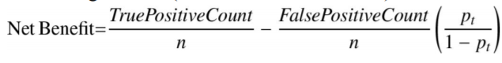{fig-alt="DCA計算例1" width="95%"}

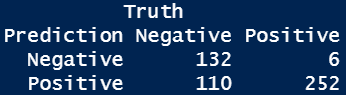{fig-alt="DCA計算例2" width="72%"}
:::

::: {.column width="50%"}
- `P(t) = 0.5`
- `NB = 227 / 500 - 50 / 500 * (0.5 / 0.5) = 0.354`

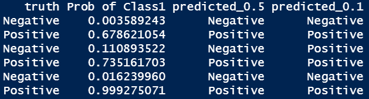{fig-alt="DCA計算例3" width="95%"}

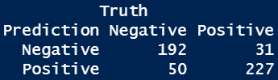{fig-alt="DCA計算例4" width="72%"}
:::
::::

::: {.reference}
BMJ. 2016;352:i6.
:::

## ベースラインのリスク

:::: columns
::: {.column width="52%"}
- Default strategy
- 患者を陽性（生検適応）と判断する確率：`P(t)`
- Net benefitの値のところで最も上のstrategyがより良いモデル
- Treat allとTreat noneよりは常に高くないといけない
- 左端のベースラインのリスクの高低も必ず評価する
:::

::: {.column width="48%"}
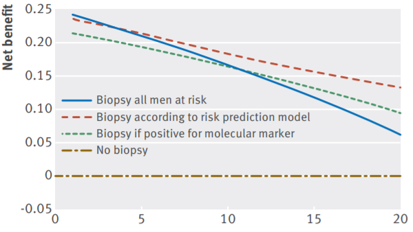{fig-alt="Decision curveとベースラインリスク" width="100%"}
:::
::::

## DCA、NBの解釈

- 高価な検査、侵襲的な検査、面倒な検査の場合
  - ΔNBの逆数がNNTと同じような役割を果たす（test tradeoff）
- 例
  - 心Sarcoidosisの診断にPETを加えたモデルがある
  - `P(t)` が10%の時の `ΔNB` が0.001
  - 10%以上で陽性とする基準でNNS 1000
  - 言い換えると、111回やると1回の偽陽性を避けられる

## Decision Curveの読み方・作り方

- 1. 重要な事は、`P(t)` のレンジを現実的な範囲で決める事
  - 下限と上限
  - モデルから逆に `P(t)` を決めてはいけない
- 2. 有病率（`P(t) = 0` の時のNB）の値も確認
- 3. 興味があるレンジでどのような動態かを確認する
  - Calibrationが悪いとTreat allやTreat noneよりも悪くなりうる
  - その場合はそれ以上の比較はしない
- 4. 新しいモデルの費用や侵襲性、疾患の重要性などを勘案してNBの差を評価する
  - 必要時、NBの逆数やoddsとの差を取ってtest tradeoffを評価

## 結局どうすればいいの？

- モデルを単に評価するだけなら不要
- ベースのモデルに対してどの程度変化したかを記述したい
- 元のモデルに対して何かのマーカー（BNP等）を追加したときに、その改善を言いたい
  - cNRI
- 臨床的な有用性を強く主張したい
  - 適切なカットオフを自分で決める
  - Category-based NRIをevent/non-eventで記述する
  - Decision curve analysisを用いる

## NBの解釈例：1

<!-- TODO: 元スライドの矢印・注釈配置は簡略化。 -->

:::: columns
::: {.column width="55%"}
- 意味がある閾値が10-30%と考えている場合
- 15%くらいでTreat allより良い
  - 患者のリスクを勘案した上で、有用な可能性あり
- 良いモデルだが、ベースのリスクが高すぎる
  - モデルは使いにくい
- 20%を超えないとTreat allよりも良い結果が出ない
  - Miscalibration
:::

::: {.column width="45%"}
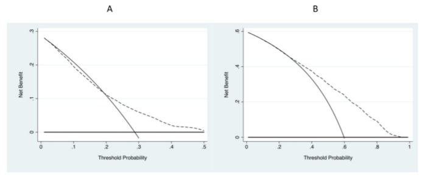{fig-alt="NBの解釈例1のグラフ" width="100%"}

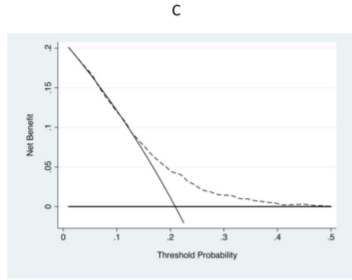{fig-alt="NBの解釈例1の注釈" width="70%"}
:::
::::

## NBの解釈例：2

:::: columns
::: {.column width="55%"}
- 15%でモデル1と2が交差する
- 勝者なく明らかな優位性は不明
:::

::: {.column width="45%"}
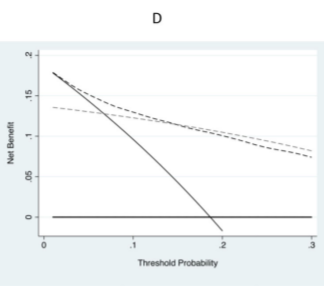{fig-alt="NBの解釈例2" width="74%"}
:::
::::

## Take Home Message

- 分類モデルの場合は弁別能と較正能を別個に評価しよう！
  - 弁別能：AUROC
  - 較正能：Calibration plotを用いる
  - 分類モデルの場合はクラスの偏りに要注意！
- モデルの比較にNRI, Decision-curve analysisも使おう！

## 参考文献

- 『イベント予測モデルの評価指標』
  - <https://www.jstage.jst.go.jp/article/jjb/41/1/41_1/_pdf>
- Net Reclassification Improvement: Computation, Interpretation, and Controversies.
  - Ann Intern Med. 2014;160:122-131.
- Net benefit approaches to the evaluation of prediction models, molecular markers, and diagnostic tests.
  - BMJ. 2016;352:i6.
- Van Calster B, Wynants L, Verbeek JFM, Verbakel JY, Christodoulou E, Vickers AJ, et al.
  - Reporting and interpreting decision curve analysis: A guide for investigators.
  - Eur Urol. 2018;74:796-804.
- Steyerberg EW, Vickers AJ, Cook NR, Gerds T, Gonen M, Obuchowski N, et al.
  - Assessing the performance of prediction models: a framework for traditional and novel measures.
  - Epidemiology. 2010;21:128-138.

## AIC/BIC

- `Ln(L)`：モデルの対数尤度（見た目の似方）
- `P`：モデルの中の変数の数
- AICとBICは基本的には似たものをみており、複数のモデルの比較に用いる
- 小さい方が良い値
- モデルの数が非常に多ければBICの方が良い
- 基本的にはAICを使えばよさそう
  - BICの方が罰則が多く、単純すぎるモデルを選ぶ傾向があるため
- どちらかというと変数選択で使う事が多い
  - Backward elimination

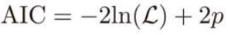{fig-alt="AIC/BICの式" width="36%"}

## 連続値の評価について

:::: columns
::: {.column width="58%"}
- 連続値
  - 決定係数（R2）
  - 平均二乗誤差関連（MAE、MSE、RMSE）
- R2（R squared）
  - データの分散のうち、どの程度が説明可能だったかの指標
  - 線形モデルにおいては相関係数の二乗になる
  - 非線形モデルでは解釈できない
:::

::: {.column width="42%"}
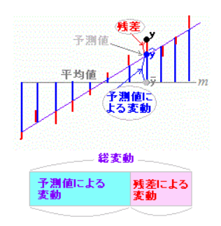{fig-alt="R2の図" width="76%"}

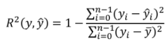{fig-alt="R2の式" width="70%"}
:::
::::

## 平均二乗誤差関連

:::: columns
::: {.column width="50%"}
- 直観的に理解しやすい
- 平均絶対誤差（MAE）
- 平均二乗誤差（MSE）
- 二乗平均平方根誤差（RMSE）
:::

::: {.column width="50%"}
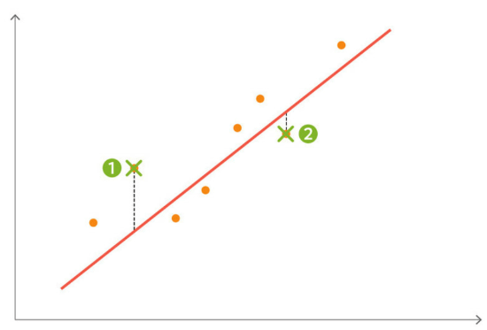{fig-alt="平均二乗誤差関連の図" width="92%"}

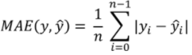{fig-alt="MAEの式" width="58%"}

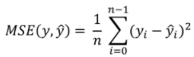{fig-alt="MSEの式" width="58%"}

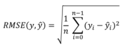{fig-alt="RMSEの式" width="58%"}
:::
::::

## RMSEは正確性を診ており、R2はバラツキの大きさを診ている

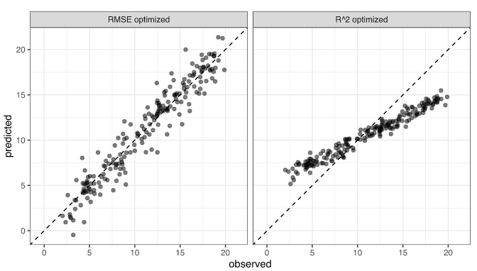{fig-alt="RMSEとR2の違い" width="76%"}

## 何を使えばいいの？

- 常に、RMSEを使えば無難
- RMSEのメリット・デメリット
  - 分かりやすい
  - 臨床的に意味のある誤差かの判断は必要
  - BNPの誤差30は問題ないが、E/e'の誤差8は大問題
  - 極端な外れ値があると使えない
  - 生の散布図やBland-Altman分析を使う
- R2のメリット・デメリット
  - R2は値のスケールやデータセットのnの数に影響されない
  - 異なる指標を比べるのに良い
  - 非線形モデルで使えない
  - 説明変数を多くすればするほど、意味がなくても見た目上よくなってしまう
  - あまりにも合っていないモデルを作ると負にもなりうる
- 使い分け
  - 予測を目的とする機械学習的なものならRMSE
  - 因果を目的とする、何が原因かを評価するならR2

## Bland-Altman分析

:::: columns
::: {.column width="46%"}
- 平均を中心に全てのX軸で均等に分布している事を確認する
:::

::: {.column width="54%"}
{fig-alt="Bland-Altman分析1" width="48%"}
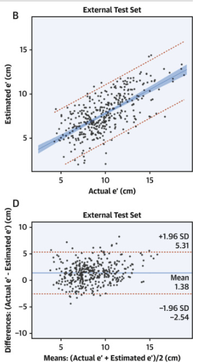{fig-alt="Bland-Altman分析2" width="48%"}
:::
::::

::: {.reference}
J Am Coll Cardiol. 2020 Aug 25;76(8):930-941.
:::
